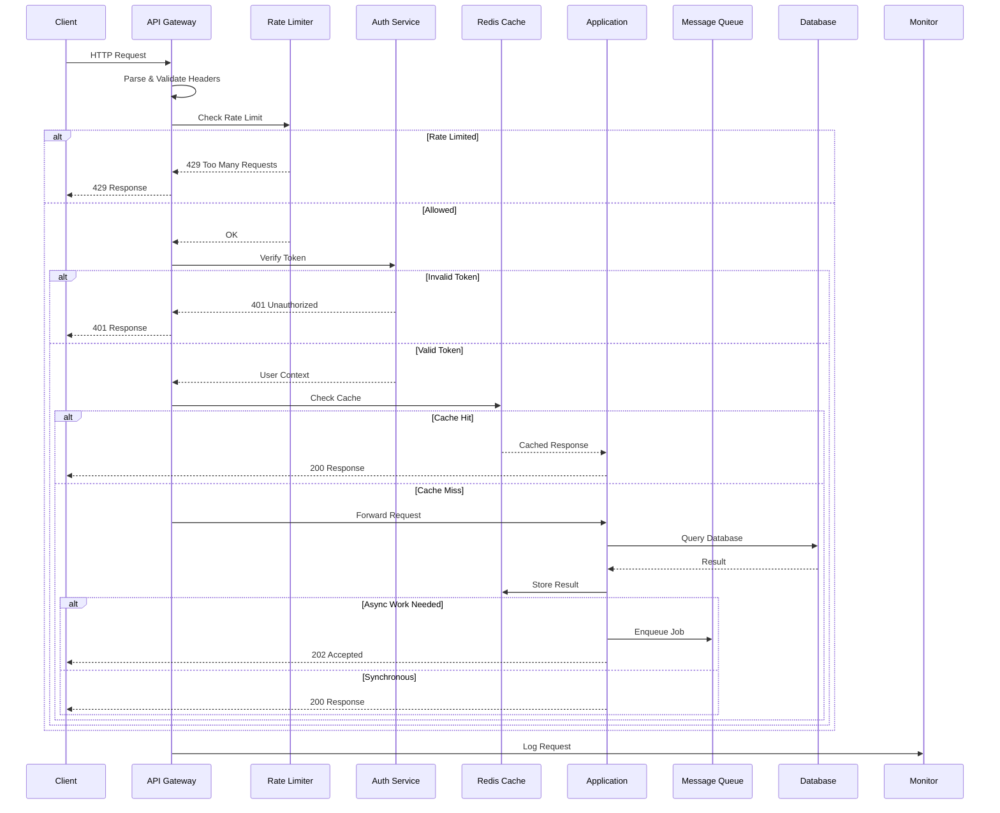
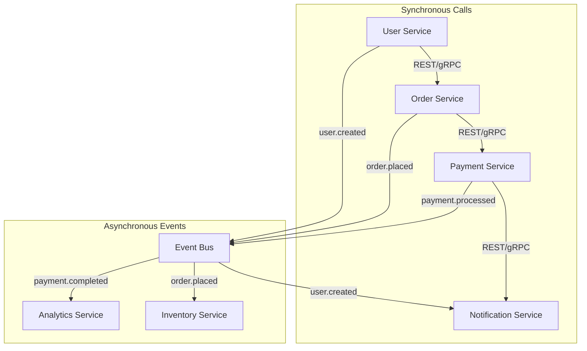
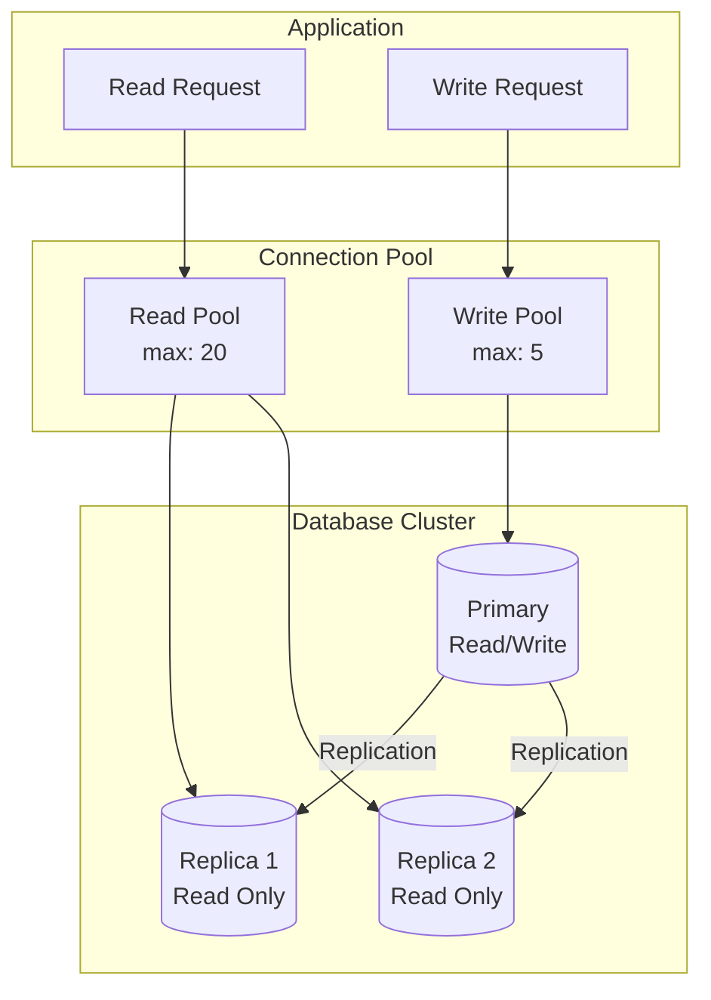
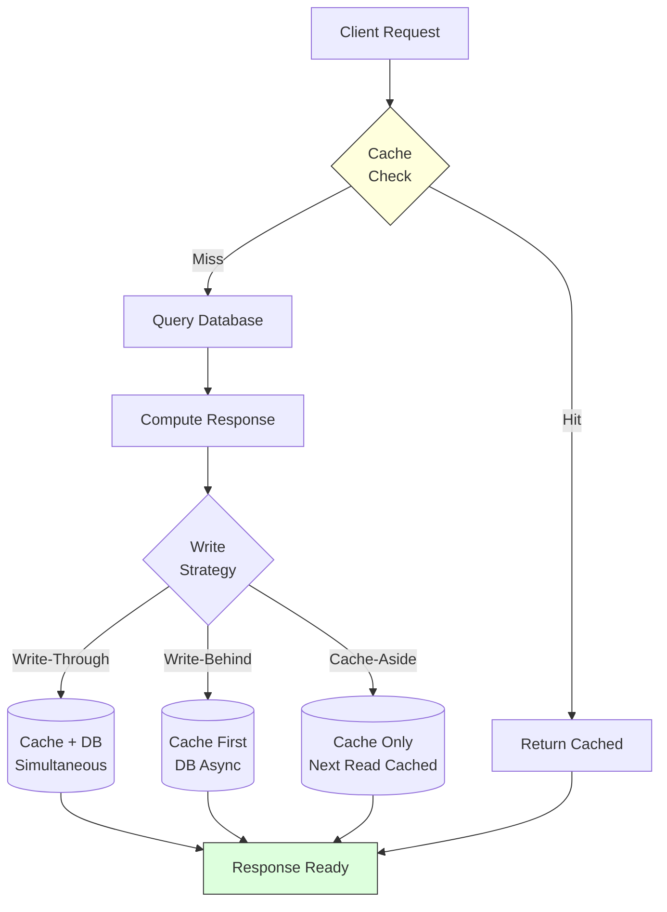
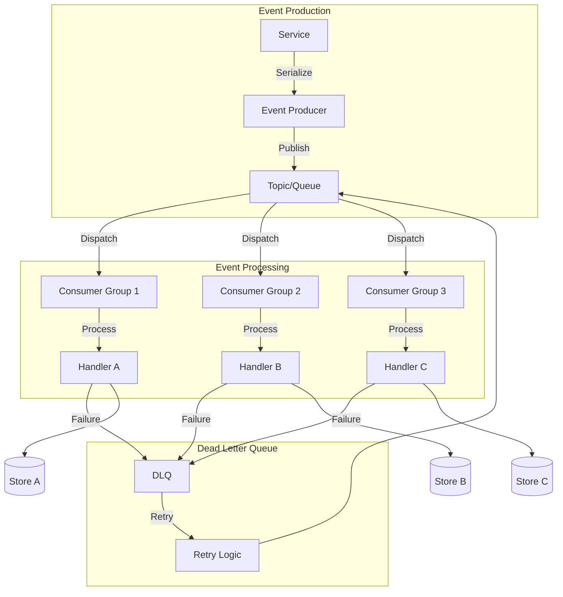
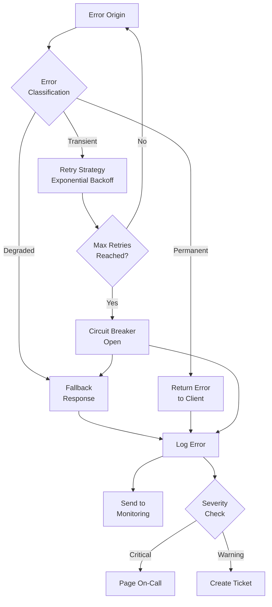
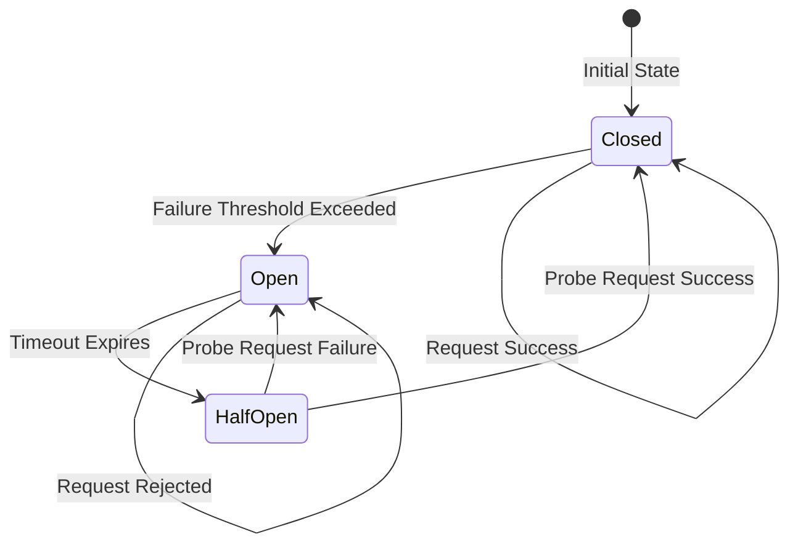
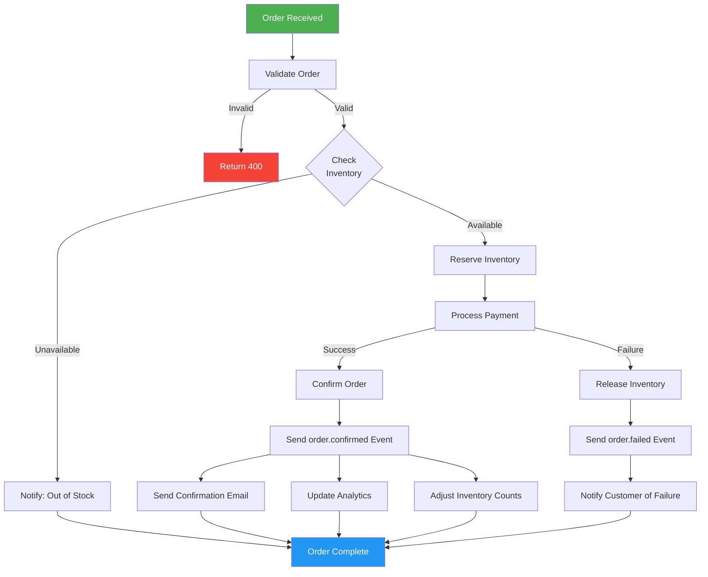
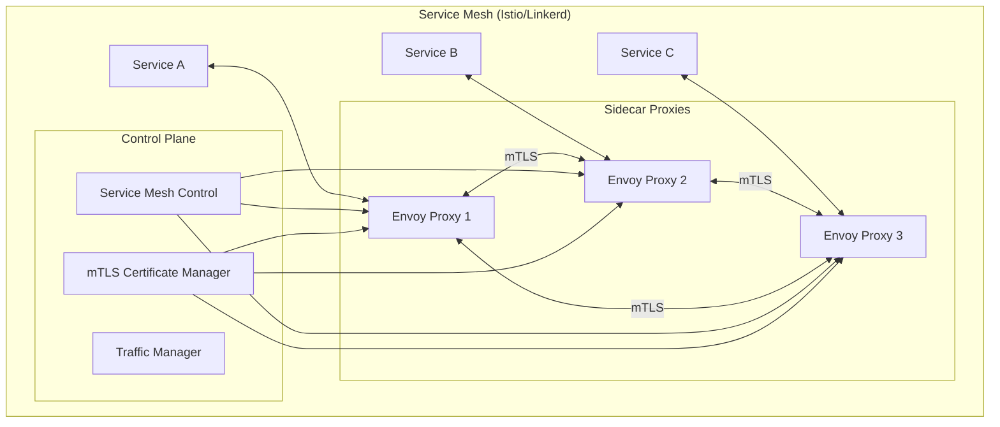
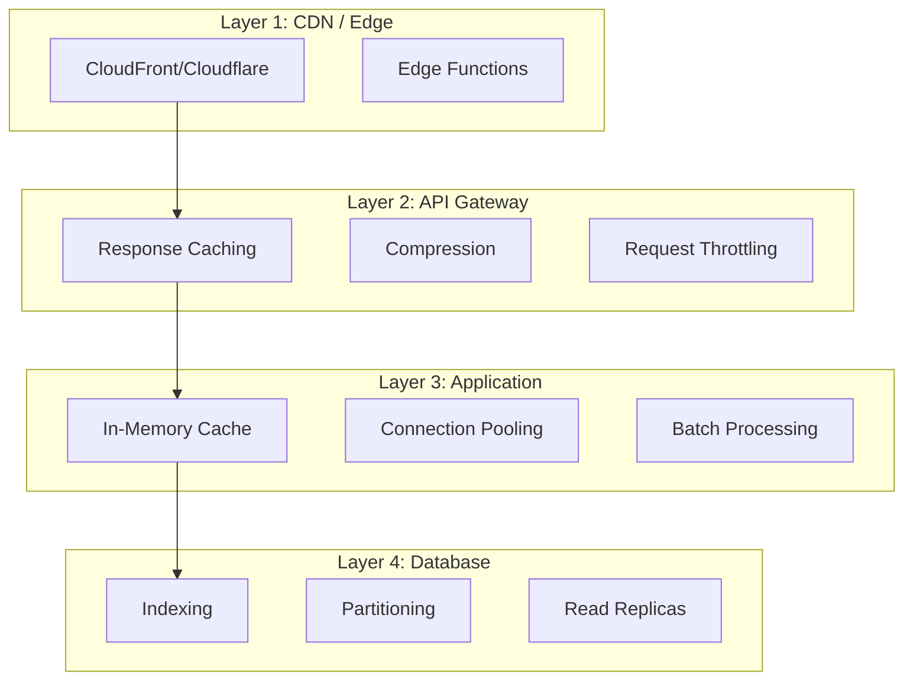

# Detailed Architecture & Data Flows

## Request Lifecycle



## Service Interaction Matrix



## Database Access Patterns

### Read/Write Separation



### Caching Strategy



### Cache Invalidation Patterns

| Pattern | Description | Use Case |
|---------|-------------|----------|
| TTL-based | Expire after N seconds | Non-critical data |
| Event-based | Invalidate on write event | User profiles |
| Version-based | Cache key includes version | API responses |
| Tag-based | Group invalidation by tag | Related entities |

## Event Processing Flow



## Error Propagation Flow



## Circuit Breaker States



### Circuit Breaker Configuration

```yaml
circuit_breaker:
  failure_threshold: 5       # failures before opening
  success_threshold: 3       # successes before closing
  timeout: 30s              # time before half-open
  half_open_max_calls: 10   # probe requests in half-open
  monitoring_window: 60s    # window for failure counting
```

## Data Flow: Order Processing



## Service Mesh Configuration



## Performance Optimization Layers


