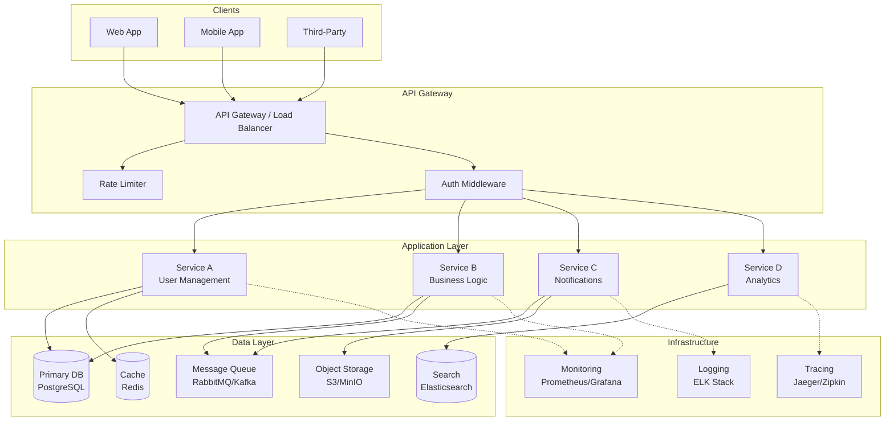
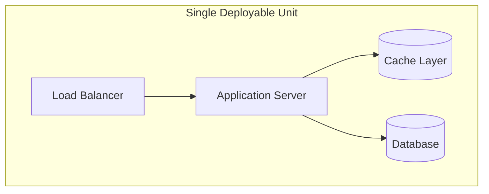
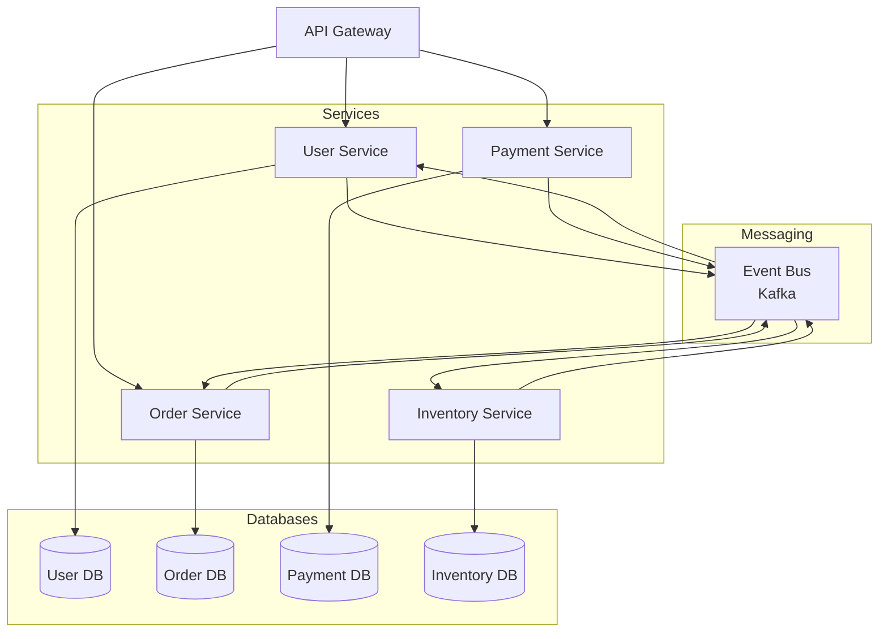
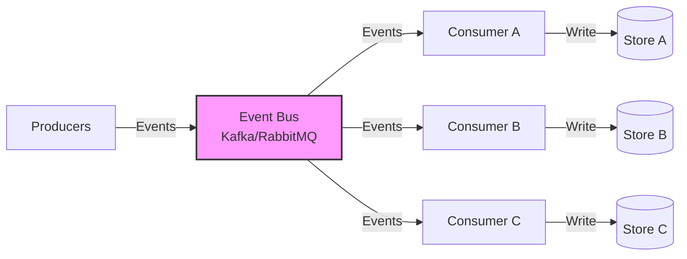
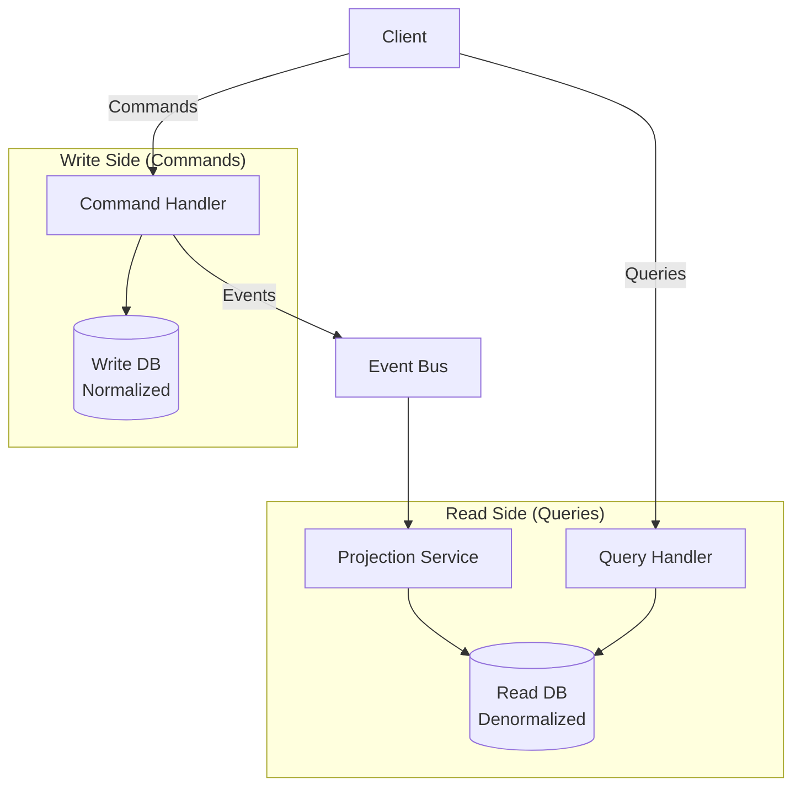
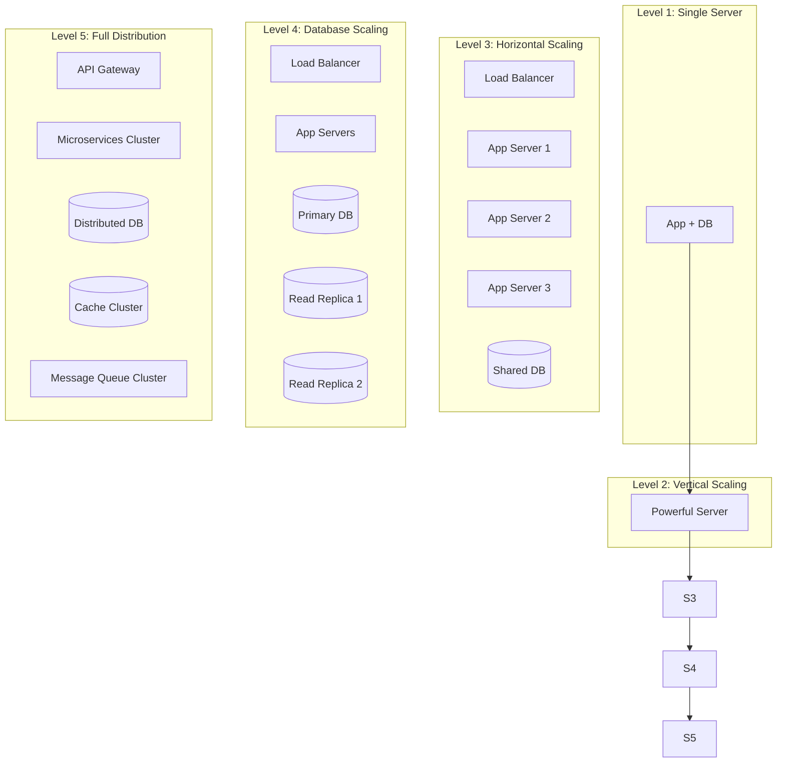

# High-Level Backend Architecture

## System Overview

## Architecture Patterns

### Monolith Architecture

Best for: Small teams, MVPs, domains with tight coupling.

**Characteristics:**
- Single codebase and deployment
- Shared database
- In-process communication
- Simpler DevOps and debugging

### Microservices Architecture

Best for: Large teams, independent scaling, diverse tech stacks.

**Characteristics:**
- Each service owns its data
- Inter-service communication via events
- Independent deployment and scaling
- Bounded contexts per domain

### Event-Driven Architecture

Best for: Async workflows, real-time processing, decoupled systems.

### CQRS Pattern

Best for: Read-heavy systems, complex queries, performance optimization.

## Scaling Patterns

## Technology Stack Matrix

| Layer | Node.js | Python | Go | Java |
|-------|---------|--------|-----|------|
| **Framework** | NestJS / Express | FastAPI / Django | Gin / Echo | Spring Boot |
| **ORM** | Prisma / TypeORM | SQLAlchemy / Tortoise | GORM / sqlx | Hibernate / JPA |
| **Cache** | ioredis | redis-py | go-redis | Spring Data Redis |
| **Queue** | Bull / BullMQ | Celery / arq | Asynq / machinery | Spring AMQP |
| **Testing** | Jest / Supertest | pytest / httpx | testify / gomock | JUnit / Mockito |
| **Validation** | Zod / Joi | Pydantic / Marshmallow | validator | Bean Validation |

## Decision Matrix

| Factor | Monolith | Microservices | Serverless |
|--------|----------|---------------|------------|
| Team size | 1-10 | 10+ | 1-5 |
| Complexity | Low | High | Medium |
| Deployment | Simple | Complex | Simple |
| Scaling | Vertical | Horizontal | Auto |
| Cost (low traffic) | Low | High | Very Low |
| Cost (high traffic) | Medium | Medium | High |
| Latency | Low | Medium | Variable |
| Debugging | Easy | Hard | Hard |

## Next Steps

- Review [detailed.md](detailed.md) for component-level diagrams
- Review [integration.md](integration.md) for API contracts
- Select pattern based on team size and requirements
