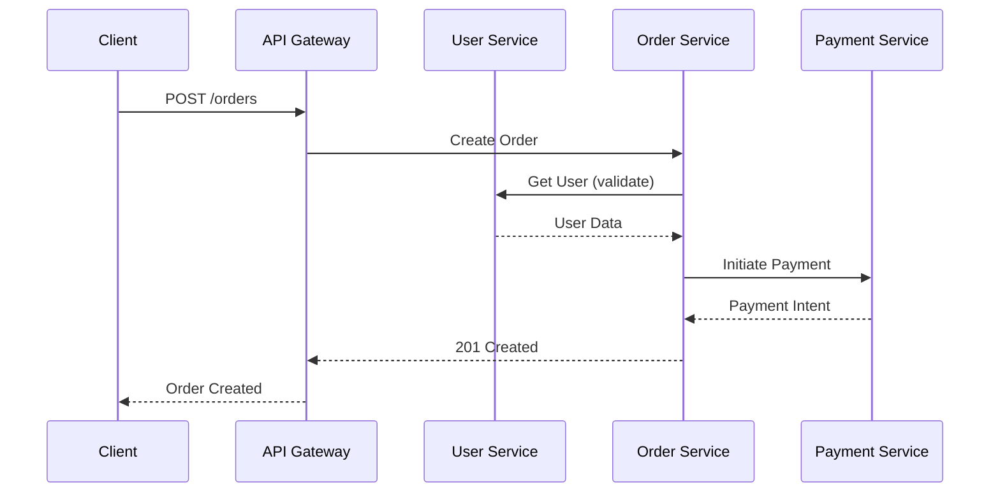
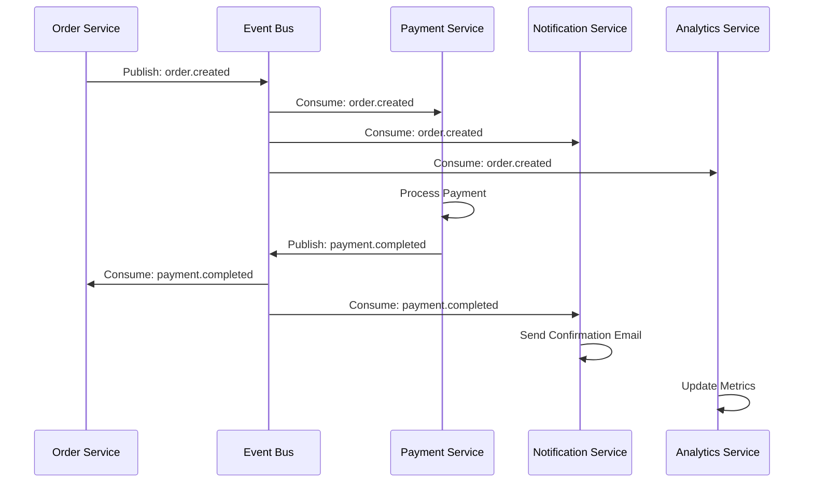
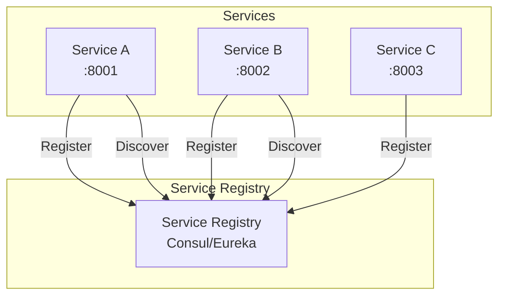
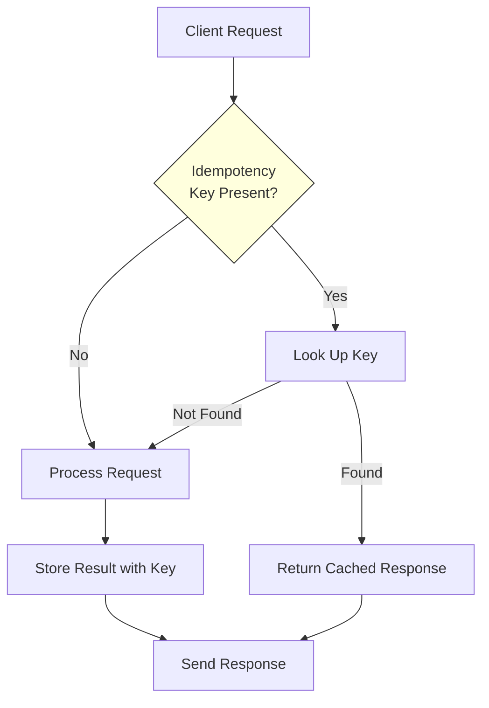

# API Contracts & Integration Patterns

## API Versioning Strategy

```mermaid
graph LR
    subgraph "URL Versioning"
        V1[/api/v1/users]
        V2[/api/v2/users]
    end

    subgraph "Header Versioning"
        H1[Accept: application/vnd.app.v1+json]
        H2[Accept: application/vnd.app.v2+json]
    end

    subgraph "Query Parameter"
        Q1[/api/users?version=1]
        Q2[/api/users?version=2]
    end
```

### Recommended: URL Path Versioning

```
Base URL: https://api.[PROJECT_NAME].com

/api/v1/users          # Current stable version
/api/v1/users/:id
/api/v2/users          # New breaking changes
/api/v2/users/:id

/internal/v1/users     # Internal service APIs
```

## RESTful API Contracts

### User Service Contract

```yaml
openapi: 3.1.0
info:
  title: User Service API
  version: "1.0.0"
  description: User management service

servers:
  - url: https://api.[PROJECT_NAME].com/v1
    description: Production
  - url: https://api-staging.[PROJECT_NAME].com/v1
    description: Staging

paths:
  /users:
    get:
      summary: List users
      operationId: listUsers
      tags: [Users]
      parameters:
        - name: page
          in: query
          schema:
            type: integer
            default: 1
        - name: limit
          in: query
          schema:
            type: integer
            default: 20
            maximum: 100
        - name: sort
          in: query
          schema:
            type: string
            enum: [created_at, name, email]
        - name: order
          in: query
          schema:
            type: string
            enum: [asc, desc]
            default: desc
      responses:
        "200":
          description: Paginated user list
          content:
            application/json:
              schema:
                $ref: "#/components/schemas/UserListResponse"
        "401":
          $ref: "#/components/responses/Unauthorized"
        "429":
          $ref: "#/components/responses/RateLimited"

    post:
      summary: Create user
      operationId: createUser
      tags: [Users]
      requestBody:
        required: true
        content:
          application/json:
            schema:
              $ref: "#/components/schemas/CreateUserRequest"
      responses:
        "201":
          description: User created
          content:
            application/json:
              schema:
                $ref: "#/components/schemas/UserResponse"
        "400":
          $ref: "#/components/responses/ValidationError"
        "409":
          description: User already exists

  /users/{id}:
    get:
      summary: Get user by ID
      operationId: getUser
      tags: [Users]
      parameters:
        - name: id
          in: path
          required: true
          schema:
            type: string
            format: uuid
      responses:
        "200":
          description: User details
          content:
            application/json:
              schema:
                $ref: "#/components/schemas/UserResponse"
        "404":
          $ref: "#/components/responses/NotFound"

components:
  schemas:
    User:
      type: object
      required: [id, email, name, created_at]
      properties:
        id:
          type: string
          format: uuid
        email:
          type: string
          format: email
        name:
          type: string
          minLength: 1
          maxLength: 255
        role:
          type: string
          enum: [admin, user, viewer]
        created_at:
          type: string
          format: date-time
        updated_at:
          type: string
          format: date-time

    CreateUserRequest:
      type: object
      required: [email, name, password]
      properties:
        email:
          type: string
          format: email
        name:
          type: string
          minLength: 1
          maxLength: 255
        password:
          type: string
          minLength: 8
          format: password

    PaginatedResponse:
      type: object
      properties:
        data:
          type: array
          items:
            type: object
        pagination:
          type: object
          properties:
            page:
              type: integer
            limit:
              type: integer
            total:
              type: integer
            total_pages:
              type: integer

    ErrorResponse:
      type: object
      required: [error]
      properties:
        error:
          type: object
          properties:
            code:
              type: string
            message:
              type: string
            details:
              type: array
              items:
                type: object
                properties:
                  field:
                    type: string
                  message:
                    type: string

  responses:
    Unauthorized:
      description: Authentication required
      content:
        application/json:
          schema:
            $ref: "#/components/schemas/ErrorResponse"
    NotFound:
      description: Resource not found
      content:
        application/json:
          schema:
            $ref: "#/components/schemas/ErrorResponse"
    ValidationError:
      description: Validation failed
      content:
        application/json:
          schema:
            $ref: "#/components/schemas/ErrorResponse"
    RateLimited:
      description: Rate limit exceeded
      headers:
        X-RateLimit-Limit:
          schema: { type: integer }
        X-RateLimit-Remaining:
          schema: { type: integer }
        X-RateLimit-Reset:
          schema: { type: integer }
```

## GraphQL Schema Design

```graphql
type Query {
  user(id: ID!): User
  users(
    page: Int = 1
    limit: Int = 20
    filter: UserFilter
    sort: UserSort
  ): UserConnection!

  order(id: ID!): Order
  orders(
    userId: ID
    status: OrderStatus
    dateRange: DateRange
  ): OrderConnection!
}

type Mutation {
  createUser(input: CreateUserInput!): CreateUserPayload!
  updateUser(id: ID!, input: UpdateUserInput!): UpdateUserPayload!
  deleteUser(id: ID!): DeleteUserPayload!

  createOrder(input: CreateOrderInput!): CreateOrderPayload!
  cancelOrder(id: ID!): CancelOrderPayload!
}

type Subscription {
  orderStatusChanged(orderId: ID!): OrderStatusUpdate!
  newUserCreated: User!
}

type User {
  id: ID!
  email: String!
  name: String!
  role: UserRole!
  orders(
    status: OrderStatus
    first: Int
    after: String
  ): OrderConnection!
  createdAt: DateTime!
  updatedAt: DateTime!
}

type Order {
  id: ID!
  user: User!
  items: [OrderItem!]!
  status: OrderStatus!
  total: Money!
  payment: Payment
  createdAt: DateTime!
}

enum UserRole {
  ADMIN
  USER
  VIEWER
}

enum OrderStatus {
  PENDING
  CONFIRMED
  PROCESSING
  SHIPPED
  DELIVERED
  CANCELLED
}

input CreateUserInput {
  email: String!
  name: String!
  password: String!
}

input CreateOrderInput {
  items: [OrderItemInput!]!
  shippingAddress: AddressInput!
}

type CreateUserPayload {
  user: User
  errors: [UserError!]
}

type CreateOrderPayload {
  order: Order
  errors: [OrderError!]
}

scalar DateTime
scalar Money
```

## gRPC Service Definitions

```protobuf
syntax = "proto3";

package userservice;

service UserService {
  rpc GetUser(GetUserRequest) returns (User);
  rpc ListUsers(ListUsersRequest) returns (ListUsersResponse);
  rpc CreateUser(CreateUserRequest) returns (User);
  rpc UpdateUser(UpdateUserRequest) returns (User);
  rpc DeleteUser(DeleteUserRequest) returns (DeleteUserResponse);
  rpc WatchUsers(WatchUsersRequest) returns (stream UserEvent);
}

message User {
  string id = 1;
  string email = 2;
  string name = 3;
  UserRole role = 4;
  google.protobuf.Timestamp created_at = 5;
  google.protobuf.Timestamp updated_at = 6;
}

enum UserRole {
  ROLE_UNSPECIFIED = 0;
  ROLE_ADMIN = 1;
  ROLE_USER = 2;
  ROLE_VIEWER = 3;
}

message GetUserRequest {
  string id = 1;
}

message ListUsersRequest {
  int32 page_size = 1;
  string page_token = 2;
  string filter = 3;
}

message ListUsersResponse {
  repeated User users = 1;
  string next_page_token = 2;
  int32 total_count = 3;
}

message CreateUserRequest {
  string email = 1;
  string name = 2;
  string password = 3;
  UserRole role = 4;
}

message UpdateUserRequest {
  string id = 1;
  optional string name = 2;
  optional string email = 3;
  optional UserRole role = 4;
}

message DeleteUserRequest {
  string id = 1;
}

message DeleteUserResponse {
  bool success = 1;
}

message WatchUsersRequest {}
```

## Inter-Service Communication Patterns

### Synchronous (REST/gRPC)



### Asynchronous (Event-Driven)



## Service Discovery



### Service Registry Configuration

```yaml
# consul.yml
services:
  - name: user-service
    port: 8001
    tags: [v1, production]
    check:
      http: http://localhost:8001/health
      interval: 10s
      timeout: 5s

  - name: order-service
    port: 8002
    tags: [v1, production]
    check:
      http: http://localhost:8002/health
      interval: 10s
      timeout: 5s
```

## API Gateway Configuration

```yaml
# Kong/Nginx/Traefik style
routes:
  - name: users-api
    paths: ["/api/v1/users"]
    service: user-service
    strip_path: false
    plugins:
      - name: rate-limiting
        config:
          minute: 100
          policy: redis
      - name: jwt
        config:
          claims_to_verify: [exp, iss]
      - name: cors
        config:
          origins: ["https://[PROJECT_NAME].com"]
          methods: ["GET", "POST", "PUT", "DELETE"]
          headers: ["Authorization", "Content-Type"]

  - name: orders-api
    paths: ["/api/v1/orders"]
    service: order-service
    plugins:
      - name: rate-limiting
        config:
          minute: 50
      - name: request-transformer
        config:
          add:
            headers: ["X-Request-ID:$(uuid)"]

  - name: graphql
    paths: ["/graphql"]
    service: graphql-service
    plugins:
      - name: rate-limiting
        config:
          minute: 200
      - name: query-limiting
        config:
          max_depth: 10
          max_aliases: 5
```

## Integration Testing Contracts

```yaml
# Contract test configuration
consumer: order-service
provider: user-service

interactions:
  - description: Get user for order validation
    providerState: User 123 exists with email test@example.com
    request:
      method: GET
      path: /v1/users/123
      headers:
        Authorization: Bearer ${USER_SERVICE_TOKEN}
    response:
      status: 200
      body:
        id: "123"
        email: "test@example.com"
        name: "Test User"
        role: "user"

  - description: User not found returns 404
    providerState: User 999 does not exist
    request:
      method: GET
      path: /v1/users/999
    response:
      status: 404
      body:
        error:
          code: "USER_NOT_FOUND"
          message: "User not found"
```

## Rate Limiting Strategy

| Tier | Requests/min | Burst | Scope |
|------|-------------|-------|-------|
| Anonymous | 30 | 5 | IP-based |
| Free | 100 | 20 | API Key |
| Pro | 1000 | 100 | API Key |
| Enterprise | 10000 | 500 | API Key |
| Internal | Unlimited | - | Service mesh |

## Retry and Backoff Strategy

```yaml
retry_policy:
  max_retries: 3
  initial_delay: 100ms
  max_delay: 5s
  backoff_multiplier: 2
  jitter: true
  retryable_status_codes: [408, 429, 500, 502, 503, 504]
  retryable_errors: [timeout, connection_refused, dns_error]
```

## Idempotency



### Idempotency Key Header

```
POST /api/v1/orders
Idempotency-Key: 550e8400-e29b-41d4-a716-446655440000
Content-Type: application/json
```
