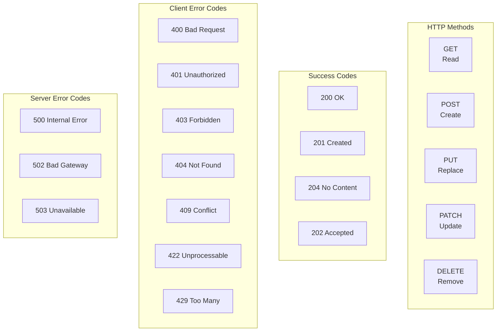

# API Design Guidelines

## RESTful API Design Principles

### URL Structure

```
# Resource naming conventions
GET    /api/v1/users              # List users
POST   /api/v1/users              # Create user
GET    /api/v1/users/:id          # Get user
PUT    /api/v1/users/:id          # Full update
PATCH  /api/v1/users/:id          # Partial update
DELETE /api/v1/users/:id          # Delete user

# Nested resources
GET    /api/v1/users/:id/orders   # User's orders
POST   /api/v1/users/:id/orders   # Create order for user

# Sub-resources
GET    /api/v1/orders/:id/items   # Order items
POST   /api/v1/orders/:id/items   # Add item to order

# Actions (non-CRUD operations)
POST   /api/v1/orders/:id/cancel  # Cancel order
POST   /api/v1/orders/:id/refund  # Refund order
POST   /api/v1/users/:id/verify   # Verify email

# Search and filtering
GET    /api/v1/users?q=john&role=admin&sort=-created_at
GET    /api/v1/orders?status=pending&date_from=2024-01-01

# Avoid:
# GET /api/v1/getUsers
# POST /api/v1/deleteUser
# GET /api/v1/user-list
```

### HTTP Methods & Status Codes



### Status Code Usage

| Code | Usage | Example |
|------|-------|---------|
| 200 | Successful GET, PUT, PATCH | User updated successfully |
| 201 | Successful POST (resource created) | User created |
| 202 | Async operation accepted | Order processing initiated |
| 204 | Successful DELETE | User deleted |
| 400 | Client sent invalid request | Missing required field |
| 401 | Authentication required/failed | Invalid token |
| 403 | Authenticated but not authorized | Insufficient permissions |
| 404 | Resource not found | User doesn't exist |
| 409 | Conflict with current state | Email already exists |
| 422 | Validation failed | Invalid email format |
| 429 | Rate limit exceeded | Too many requests |
| 500 | Unexpected server error | Database connection failed |

### Request/Response Design

```typescript
// Standard request headers
interface RequestHeaders {
  'Authorization': 'Bearer <token>';
  'Content-Type': 'application/json';
  'Accept': 'application/json';
  'X-Request-ID': '<uuid>';       // For tracing
  'X-Idempotency-Key': '<uuid>';  // For idempotent operations
  'Accept-Language': 'en-US';     // Localization
}

// Standard response envelope
interface ApiResponse<T> {
  data: T;
  meta?: {
    pagination?: {
      page: number;
      limit: number;
      total: number;
      total_pages: number;
    };
    request_id: string;
    timestamp: string;
  };
}

// Error response
interface ErrorResponse {
  error: {
    code: string;           // Machine-readable code
    message: string;        // Human-readable message
    details?: Array<{
      field: string;
      message: string;
      code: string;
    }>;
    request_id: string;     // For support/debugging
    documentation_url?: string; // Link to error docs
  };
}
```

### Pagination

```typescript
// Cursor-based pagination (recommended)
interface CursorPagination {
  first?: number;    // Page size
  after?: string;    // Cursor (opaque string)
  last?: number;
  before?: string;
}

// Response with cursor pagination
interface CursorPaginatedResponse<T> {
  data: T[];
  pagination: {
    has_next_page: boolean;
    has_previous_page: boolean;
    start_cursor: string;
    end_cursor: string;
  };
  meta: {
    total_count: number;
  };
}

// Offset-based pagination (simpler but less efficient)
interface OffsetPagination {
  page: number;
  limit: number;
}

// Implementation
async function paginateUsers(query: CursorPagination) {
  const limit = Math.min(query.first || 20, 100);

  const where = query.after
    ? { id: { gt: decodeCursor(query.after) } }
    : {};

  const users = await db.users.findMany({
    where,
    take: limit + 1, // Fetch one extra to check for next page
    orderBy: { id: 'asc' },
  });

  const hasNextPage = users.length > limit;
  const data = hasNextPage ? users.slice(0, limit) : users;

  return {
    data,
    pagination: {
      has_next_page: hasNextPage,
      has_previous_page: !!query.after,
      start_cursor: encodeCursor(data[0]?.id),
      end_cursor: encodeCursor(data[data.length - 1]?.id),
    },
    meta: {
      total_count: await db.users.count(),
    },
  };
}
```

### Filtering & Sorting

```typescript
// Filter syntax
// GET /api/v1/users?status=active&role=admin&created_after=2024-01-01

interface FilterParams {
  // Equality
  status?: string;
  role?: string;

  // Range
  created_after?: string;
  created_before?: string;

  // Text search
  q?: string; // Full-text search

  // Sorting
  sort?: string;      // Field name
  order?: 'asc' | 'desc';

  // Field selection
  fields?: string;    // Comma-separated fields
}

// Implementation
async function filterUsers(filters: FilterParams) {
  const where: Prisma.UserWhereInput = {};

  if (filters.status) where.status = filters.status;
  if (filters.role) where.role = filters.role;
  if (filters.created_after) {
    where.created_at = { gte: new Date(filters.created_after) };
  }
  if (filters.created_before) {
    where.created_at = {
      ...where.created_at,
      lte: new Date(filters.created_before),
    };
  }
  if (filters.q) {
    where.OR = [
      { name: { contains: filters.q, mode: 'insensitive' } },
      { email: { contains: filters.q, mode: 'insensitive' } },
    ];
  }

  const orderBy = filters.sort
    ? { [filters.sort]: filters.order || 'asc' }
    : { created_at: 'desc' };

  return db.users.findMany({ where, orderBy });
}
```

### Field Selection (Sparse Fieldsets)

```typescript
// GET /api/v1/users?fields=id,name,email

async function selectFields(
  resource: string,
  fields: string,
) {
  const allowedFields = getAllowedFields(resource);
  const requestedFields = fields.split(',');

  // Only return allowed fields
  const validFields = requestedFields.filter((f) =>
    allowedFields.includes(f),
  );

  // For SQL databases
  return db.query({
    select: validFields.reduce((acc, field) => {
      acc[field] = true;
      return acc;
    }, {} as Record<string, boolean>),
  });
}
```

## GraphQL API Design

### Schema Design Patterns

```graphql
# 1. Connection pattern for lists (Relay-style)
type UserConnection {
  edges: [UserEdge!]!
  pageInfo: PageInfo!
  totalCount: Int
}

type UserEdge {
  node: User!
  cursor: String!
}

type PageInfo {
  hasNextPage: Boolean!
  hasPreviousPage: Boolean!
  startCursor: String
  endCursor: String
}

# 2. Input types for mutations
input CreateUserInput {
  email: String!
  name: String!
  password: String!
  role: UserRole = USER
}

# 3. Payload types with errors
type CreateUserPayload {
  user: User
  errors: [UserError!]
}

type UserError {
  field: String
  message: String!
  code: ErrorCode!
}

# 4. Enums for enum values
enum UserRole {
  ADMIN
  MANAGER
  USER
  VIEWER
}

enum ErrorCode {
  VALIDATION_ERROR
  NOT_FOUND
  ALREADY_EXISTS
  UNAUTHORIZED
  FORBIDDEN
}

# 5. Scalar types for custom types
scalar DateTime
scalar Email
scalar URL
scalar JSON

# 6. Directive for deprecated fields
type User {
  id: ID!
  name: String!
  email: Email!
  full_name: String! @deprecated(reason: "Use 'name' instead")
  role: UserRole!
}
```

### GraphQL Resolvers

```typescript
// N+1 query prevention with DataLoader
import DataLoader from 'dataloader';

class UserLoader {
  private loader: DataLoader<string, User>;

  constructor(private db: Database) {
    this.loader = new DataLoader(async (ids: string[]) => {
      const users = await this.db.users.findMany({
        where: { id: { in: ids } },
      });

      // Return in same order as requested
      return ids.map((id) =>
        users.find((u) => u.id === id) || new Error(`User ${id} not found`),
      );
    });
  }

  async load(id: string): Promise<User> {
    return this.loader.load(id);
  }

  async loadMany(ids: string[]): Promise<User[]> {
    return this.loader.loadMany(ids) as Promise<User[]>;
  }
}

// Resolver implementation
const resolvers = {
  Query: {
    user: async (_, { id }, context) => {
      return context.loaders.user.load(id);
    },

    users: async (_, { first, after, filter }, context) => {
      return paginateUsers(context.db, { first, after, filter });
    },
  },

  User: {
    orders: async (user, { first, after }, context) => {
      return context.loaders.ordersByUser.load({
        userId: user.id,
        first,
        after,
      });
    },
  },

  Mutation: {
    createUser: async (_, { input }, context) => {
      try {
        const user = await context.services.user.create(input);
        return { user, errors: [] };
      } catch (error) {
        return {
          user: null,
          errors: [{ field: null, message: error.message, code: 'VALIDATION_ERROR' }],
        };
      }
    },
  },
};
```

## API Versioning Strategy

```yaml
versioning:
  strategy: "URL path versioning"
  format: "/api/v{major}/..."

  lifecycle:
    current: "v2"
    supported: ["v1", "v2"]
    deprecated: ["v1"]
    sunset_date: "2025-06-01"  # v1 deprecation

  deprecation_headers:
    - "Deprecation: true"
    - "Sunset: Sat, 01 Jun 2025 00:00:00 GMT"
    - "Link: <https://docs.api.com/migration/v1-to-v2>; rel=\"successor-version\""

  version_routing:
    v1:
      description: "Legacy endpoints, maintained for compatibility"
      changes: []
    v2:
      description: "Current version with improved pagination"
      changes:
        - "Cursor-based pagination"
        - "New field selection syntax"
        - "Improved error responses"
```

## HATEOAS (Hypermedia)

```json
{
  "data": {
    "id": "order-123",
    "status": "confirmed",
    "total": "99.99",
    "links": {
      "self": "/api/v1/orders/order-123",
      "user": "/api/v1/users/user-456",
      "items": "/api/v1/orders/order-123/items",
      "payment": "/api/v1/orders/order-123/payment"
    },
    "actions": [
      {
        "name": "cancel",
        "method": "POST",
        "href": "/api/v1/orders/order-123/cancel",
        "confirm": true
      },
      {
        "name": "refund",
        "method": "POST",
        "href": "/api/v1/orders/order-123/refund",
        "available": false,
        "reason": "Order already delivered"
      }
    ]
  }
}
```

## Content Negotiation

```typescript
// Content-Type negotiation
app.use((req, res, next) => {
  const accept = req.headers.accept || 'application/json';

  if (accept.includes('application/json')) {
    res.setHeader('Content-Type', 'application/json');
  } else if (accept.includes('application/xml')) {
    res.setHeader('Content-Type', 'application/xml');
  } else if (accept.includes('text/csv')) {
    res.setHeader('Content-Type', 'text/csv');
  }

  next();
});
```

## API Documentation

```yaml
# Swagger/OpenAPI configuration
openapi: 3.1.0
info:
  title: "[PROJECT_NAME] API"
  version: "2.0.0"
  description: |
    Backend API for [PROJECT_NAME].

    ## Authentication
    All endpoints require Bearer token authentication.

    ## Rate Limiting
    - Free tier: 100 requests/minute
    - Pro tier: 1000 requests/minute

    ## Pagination
    - Cursor-based pagination for all list endpoints
    - Maximum page size: 100

  contact:
    name: API Support
    email: api-support@[PROJECT_NAME].com
  license:
    name: MIT

servers:
  - url: https://api.[PROJECT_NAME].com/v2
    description: Production
  - url: https://api-staging.[PROJECT_NAME].com/v2
    description: Staging
  - url: http://localhost:3000/api/v2
    description: Local development
```

## Design Checklist

```yaml
url_design:
  - [ ] Nouns, not verbs
  - [ ] Lowercase, kebab-case
  - [ ] Plural resource names
  - [ ] Consistent nesting depth (max 2)
  - [ ] No file extensions in URLs

http_design:
  - [ ] Correct HTTP methods used
  - [ ] Appropriate status codes
  - [ ] Content-Type header set
  - [ ] Idempotency for PUT/DELETE
  - [ ] Partial update uses PATCH

pagination:
  - [ ] Cursor-based pagination
  - [ ] Default and max page sizes
  - [ ] Total count in response
  - [ ] Has next/previous page flags

error_handling:
  - [ ] Consistent error format
  - [ ] Machine-readable error codes
  - [ ] Human-readable messages
  - [ ] Request ID for debugging
  - [ ] No stack traces in production

security:
  - [ ] Authentication required
  - [ ] Authorization checked
  - [ ] Input validation
  - [ ] Rate limiting
  - [ ] CORS configured

documentation:
  - [ ] OpenAPI/Swagger spec
  - [ ] Request/response examples
  - [ ] Error code documentation
  - [ ] Authentication guide
  - [ ] Changelog maintained
```
