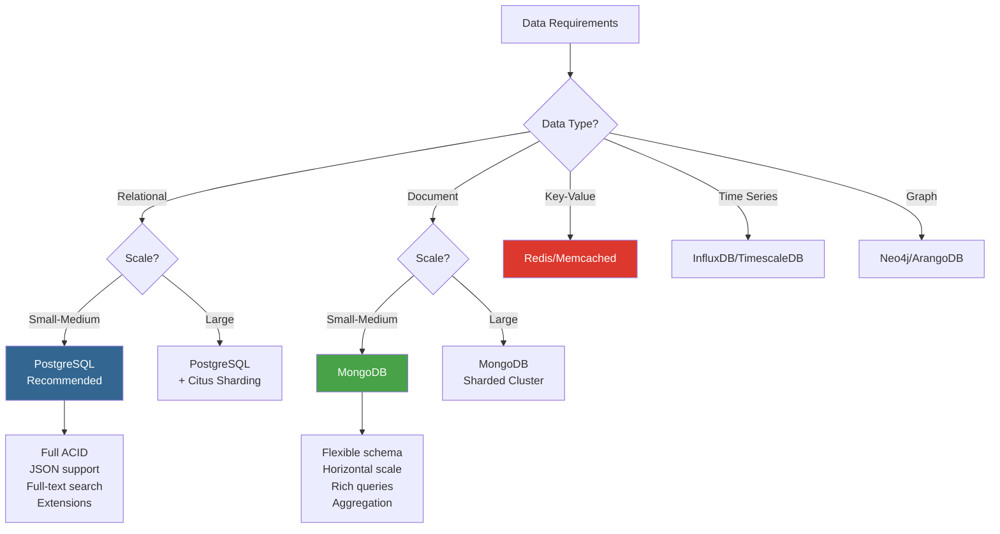
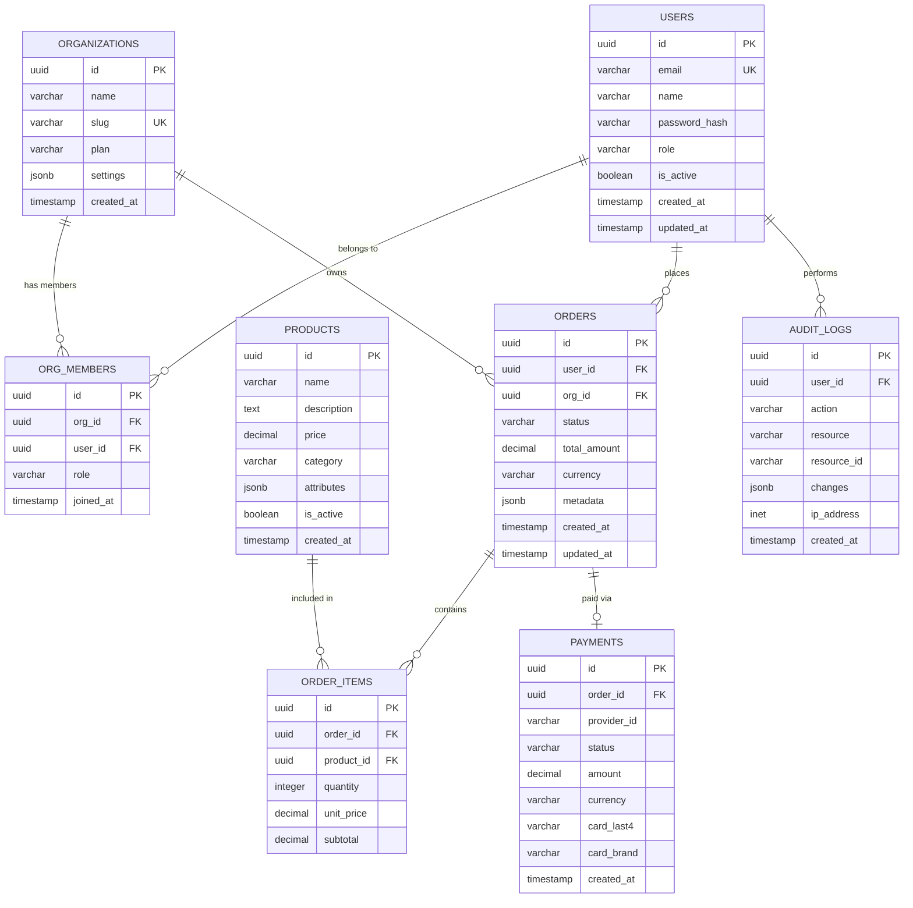

# Database Schema & Data Modeling

## Database Selection Guide



## Entity Relationship Diagram



## Schema Definitions

### PostgreSQL Schema

```sql
-- Enable required extensions
CREATE EXTENSION IF NOT EXISTS "uuid-ossp";
CREATE EXTENSION IF NOT EXISTS "pgcrypto";
CREATE EXTENSION IF NOT EXISTS "pg_trgm";    -- Fuzzy text search

-- Users table
CREATE TABLE users (
    id UUID PRIMARY KEY DEFAULT uuid_generate_v4(),
    email VARCHAR(255) NOT NULL UNIQUE,
    name VARCHAR(255) NOT NULL,
    password_hash VARCHAR(255) NOT NULL,
    role VARCHAR(50) NOT NULL DEFAULT 'user'
        CHECK (role IN ('super_admin', 'admin', 'manager', 'user', 'viewer')),
    is_active BOOLEAN NOT NULL DEFAULT true,
    mfa_enabled BOOLEAN NOT NULL DEFAULT false,
    mfa_secret VARCHAR(255),
    last_login_at TIMESTAMPTZ,
    failed_login_attempts INTEGER NOT NULL DEFAULT 0,
    locked_until TIMESTAMPTZ,
    created_at TIMESTAMPTZ NOT NULL DEFAULT NOW(),
    updated_at TIMESTAMPTZ NOT NULL DEFAULT NOW(),
    deleted_at TIMESTAMPTZ  -- Soft delete
);

-- Indexes
CREATE INDEX idx_users_email ON users(email);
CREATE INDEX idx_users_role ON users(role) WHERE deleted_at IS NULL;
CREATE INDEX idx_users_created ON users(created_at DESC);
CREATE INDEX idx_users_name_trgm ON users USING gin(name gin_trgm_ops);

-- Organizations
CREATE TABLE organizations (
    id UUID PRIMARY KEY DEFAULT uuid_generate_v4(),
    name VARCHAR(255) NOT NULL,
    slug VARCHAR(100) NOT NULL UNIQUE,
    plan VARCHAR(50) NOT NULL DEFAULT 'free'
        CHECK (plan IN ('free', 'starter', 'pro', 'enterprise')),
    settings JSONB NOT NULL DEFAULT '{}',
    max_members INTEGER NOT NULL DEFAULT 5,
    created_at TIMESTAMPTZ NOT NULL DEFAULT NOW(),
    updated_at TIMESTAMPTZ NOT NULL DEFAULT NOW()
);

-- Organization Members
CREATE TABLE org_members (
    id UUID PRIMARY KEY DEFAULT uuid_generate_v4(),
    org_id UUID NOT NULL REFERENCES organizations(id) ON DELETE CASCADE,
    user_id UUID NOT NULL REFERENCES users(id) ON DELETE CASCADE,
    role VARCHAR(50) NOT NULL DEFAULT 'member'
        CHECK (role IN ('owner', 'admin', 'member', 'viewer')),
    joined_at TIMESTAMPTZ NOT NULL DEFAULT NOW(),
    UNIQUE(org_id, user_id)
);

-- Products
CREATE TABLE products (
    id UUID PRIMARY KEY DEFAULT uuid_generate_v4(),
    name VARCHAR(255) NOT NULL,
    description TEXT,
    price DECIMAL(10, 2) NOT NULL CHECK (price >= 0),
    category VARCHAR(100),
    attributes JSONB NOT NULL DEFAULT '{}',
    is_active BOOLEAN NOT NULL DEFAULT true,
    created_at TIMESTAMPTZ NOT NULL DEFAULT NOW(),
    updated_at TIMESTAMPTZ NOT NULL DEFAULT NOW()
);

CREATE INDEX idx_products_category ON products(category) WHERE is_active = true;
CREATE INDEX idx_products_price ON products(price) WHERE is_active = true;
CREATE INDEX idx_products_name_search ON products USING gin(name gin_trgm_ops);

-- Orders
CREATE TABLE orders (
    id UUID PRIMARY KEY DEFAULT uuid_generate_v4(),
    user_id UUID NOT NULL REFERENCES users(id),
    org_id UUID REFERENCES organizations(id),
    status VARCHAR(50) NOT NULL DEFAULT 'pending'
        CHECK (status IN ('pending', 'confirmed', 'processing', 'shipped', 'delivered', 'cancelled', 'refunded')),
    total_amount DECIMAL(10, 2) NOT NULL CHECK (total_amount >= 0),
    currency CHAR(3) NOT NULL DEFAULT 'USD',
    metadata JSONB NOT NULL DEFAULT '{}',
    created_at TIMESTAMPTZ NOT NULL DEFAULT NOW(),
    updated_at TIMESTAMPTZ NOT NULL DEFAULT NOW()
);

CREATE INDEX idx_orders_user ON orders(user_id, created_at DESC);
CREATE INDEX idx_orders_org ON orders(org_id, created_at DESC) WHERE org_id IS NOT NULL;
CREATE INDEX idx_orders_status ON orders(status, created_at DESC);
CREATE INDEX idx_orders_created ON orders(created_at DESC);

-- Order Items
CREATE TABLE order_items (
    id UUID PRIMARY KEY DEFAULT uuid_generate_v4(),
    order_id UUID NOT NULL REFERENCES orders(id) ON DELETE CASCADE,
    product_id UUID NOT NULL REFERENCES products(id),
    quantity INTEGER NOT NULL CHECK (quantity > 0),
    unit_price DECIMAL(10, 2) NOT NULL CHECK (unit_price >= 0),
    subtotal DECIMAL(10, 2) GENERATED ALWAYS AS (quantity * unit_price) STORED,
    created_at TIMESTAMPTZ NOT NULL DEFAULT NOW()
);

CREATE INDEX idx_order_items_order ON order_items(order_id);

-- Payments
CREATE TABLE payments (
    id UUID PRIMARY KEY DEFAULT uuid_generate_v4(),
    order_id UUID NOT NULL REFERENCES orders(id),
    provider_id VARCHAR(255) NOT NULL,
    status VARCHAR(50) NOT NULL
        CHECK (status IN ('pending', 'processing', 'completed', 'failed', 'refunded')),
    amount DECIMAL(10, 2) NOT NULL CHECK (amount >= 0),
    currency CHAR(3) NOT NULL DEFAULT 'USD',
    card_last4 CHAR(4),
    card_brand VARCHAR(50),
    metadata JSONB NOT NULL DEFAULT '{}',
    created_at TIMESTAMPTZ NOT NULL DEFAULT NOW()
);

CREATE INDEX idx_payments_order ON payments(order_id);
CREATE INDEX idx_payments_provider ON payments(provider_id);

-- Audit Logs (append-only)
CREATE TABLE audit_logs (
    id UUID PRIMARY KEY DEFAULT uuid_generate_v4(),
    user_id UUID REFERENCES users(id),
    action VARCHAR(100) NOT NULL,
    resource VARCHAR(100) NOT NULL,
    resource_id VARCHAR(100),
    changes JSONB,
    ip_address INET,
    user_agent TEXT,
    created_at TIMESTAMPTZ NOT NULL DEFAULT NOW()
);

CREATE INDEX idx_audit_user ON audit_logs(user_id, created_at DESC);
CREATE INDEX idx_audit_resource ON audit_logs(resource, resource_id);
CREATE INDEX idx_audit_action ON audit_logs(action, created_at DESC);
CREATE INDEX idx_audit_created ON audit_logs(created_at DESC);

-- Partition audit_logs by month
CREATE TABLE audit_logs_2024_01 PARTITION OF audit_logs
    FOR VALUES FROM ('2024-01-01') TO ('2024-02-01');

-- Row Level Security
ALTER TABLE orders ENABLE ROW LEVEL SECURITY;

CREATE POLICY orders_user_isolation ON orders
    USING (user_id = current_setting('app.current_user_id')::UUID);

-- Updated at trigger
CREATE OR REPLACE FUNCTION update_updated_at_column()
RETURNS TRIGGER AS $$
BEGIN
    NEW.updated_at = NOW();
    RETURN NEW;
END;
$$ language 'plpgsql';

CREATE TRIGGER update_users_updated_at
    BEFORE UPDATE ON users
    FOR EACH ROW EXECUTE FUNCTION update_updated_at_column();

CREATE TRIGGER update_orders_updated_at
    BEFORE UPDATE ON orders
    FOR EACH ROW EXECUTE FUNCTION update_updated_at_column();
```

## Data Modeling Patterns

### Active Record (ORM)

```typescript
// Prisma Schema
model User {
  id            String    @id @default(uuid())
  email         String    @unique
  name          String
  passwordHash  String    @map("password_hash")
  role          Role      @default(USER)
  isActive      Boolean   @default(true) @map("is_active")
  createdAt     DateTime  @default(now()) @map("created_at")
  updatedAt     DateTime  @updatedAt @map("updated_at")

  // Relations
  orgMembers    OrgMember[]
  orders        Order[]
  auditLogs     AuditLog[]

  @@map("users")
}

model Order {
  id          String    @id @default(uuid())
  userId      String    @map("user_id")
  orgId       String?   @map("org_id")
  status      OrderStatus @default(PENDING)
  totalAmount Decimal   @map("total_amount")
  currency    String    @default("USD")
  createdAt   DateTime  @default(now()) @map("created_at")
  updatedAt   DateTime  @updatedAt @map("updated_at")

  // Relations
  user        User      @relation(fields: [userId], references: [id])
  organization Organization? @relation(fields: [orgId], references: [id])
  items       OrderItem[]
  payment     Payment?

  @@index([userId, createdAt(sort: Desc)])
  @@index([status, createdAt(sort: Desc)])
  @@map("orders")
}

enum Role {
  SUPER_ADMIN
  ADMIN
  MANAGER
  USER
  VIEWER
}

enum OrderStatus {
  PENDING
  CONFIRMED
  PROCESSING
  SHIPPED
  DELIVERED
  CANCELLED
  REFUNDED
}
```

### Repository Pattern

```typescript
// Repository interface
interface UserRepository {
  findById(id: string): Promise<User | null>;
  findByEmail(email: string): Promise<User | null>;
  findMany(params: FindManyParams): Promise<PaginatedResult<User>>;
  create(data: CreateUserDTO): Promise<User>;
  update(id: string, data: UpdateUserDTO): Promise<User>;
  delete(id: string): Promise<void>;
  count(filters?: UserFilters): Promise<number>;
}

// PostgreSQL implementation
class PostgresUserRepository implements UserRepository {
  constructor(private db: Database) {}

  async findById(id: string): Promise<User | null> {
    return this.db.query(
      'SELECT * FROM users WHERE id = $1 AND deleted_at IS NULL',
      [id],
    );
  }

  async findMany(params: FindManyParams): Promise<PaginatedResult<User>> {
    const { page = 1, limit = 20, filters = {}, sort = 'created_at', order = 'desc' } = params;
    const offset = (page - 1) * limit;

    const where = this.buildWhereClause(filters);
    const query = `
      SELECT * FROM users
      WHERE deleted_at IS NULL ${where}
      ORDER BY ${sort} ${order}
      LIMIT $1 OFFSET $2
    `;
    const countQuery = `
      SELECT COUNT(*) FROM users
      WHERE deleted_at IS NULL ${where}
    `;

    const [data, countResult] = await Promise.all([
      this.db.query(query, [limit, offset]),
      this.db.query(countQuery),
    ]);

    return {
      data,
      pagination: {
        page,
        limit,
        total: parseInt(countResult.rows[0].count),
        total_pages: Math.ceil(parseInt(countResult.rows[0].count) / limit),
      },
    };
  }

  async create(data: CreateUserDTO): Promise<User> {
    const result = await this.db.query(
      `INSERT INTO users (email, name, password_hash, role)
       VALUES ($1, $2, $3, $4)
       RETURNING *`,
      [data.email, data.name, data.passwordHash, data.role],
    );
    return result.rows[0];
  }

  private buildWhereClause(filters: UserFilters): string {
    const conditions: string[] = [];

    if (filters.role) conditions.push(`role = '${filters.role}'`);
    if (filters.isActive !== undefined) conditions.push(`is_active = ${filters.isActive}`);
    if (filters.search) {
      conditions.push(`(name ILIKE '%${filters.search}%' OR email ILIKE '%${filters.search}%')`);
    }

    return conditions.length > 0 ? 'AND ' + conditions.join(' AND ') : '';
  }
}
```

## Caching Patterns

### Cache-Aside (Lazy Loading)

```typescript
class CachedUserRepository {
  private cacheTTL = 300; // 5 minutes

  constructor(
    private repo: UserRepository,
    private cache: CacheService,
  ) {}

  async findById(id: string): Promise<User | null> {
    const cacheKey = `user:${id}`;

    // Try cache first
    const cached = await this.cache.get<User>(cacheKey);
    if (cached) return cached;

    // Fetch from database
    const user = await this.repo.findById(id);
    if (user) {
      await this.cache.set(cacheKey, user, this.cacheTTL);
    }

    return user;
  }

  async update(id: string, data: UpdateUserDTO): Promise<User> {
    // Update database
    const user = await this.repo.update(id, data);

    // Invalidate cache
    await this.cache.del(`user:${id}`);
    await this.cache.del(`user:email:${user.email}`);

    // Optionally: update cache with new data
    await this.cache.set(`user:${id}`, user, this.cacheTTL);

    return user;
  }

  async invalidateAll(): Promise<void> {
    // Invalidate all user caches
    const keys = await this.cache.keys('user:*');
    if (keys.length > 0) {
      await this.cache.del(...keys);
    }
  }
}
```

### Write-Through Cache

```typescript
class WriteThroughCache {
  async set(key: string, value: any, ttl: number): Promise<void> {
    // Write to cache and database simultaneously
    await Promise.all([
      this.cache.set(key, value, ttl),
      this.db.upsert(key, value),
    ]);
  }
}
```

## Database Optimization

### Query Performance

```sql
-- EXPLAIN ANALYZE for slow queries
EXPLAIN (ANALYZE, BUFFERS, FORMAT TEXT)
SELECT o.*, u.name as user_name
FROM orders o
JOIN users u ON o.user_id = u.id
WHERE o.status = 'pending'
AND o.created_at > NOW() - INTERVAL '7 days'
ORDER BY o.created_at DESC
LIMIT 20;

-- Create covering indexes
CREATE INDEX idx_orders_covering ON orders(status, created_at DESC)
    INCLUDE (user_id, total_amount, currency);

-- Partial indexes for common queries
CREATE INDEX idx_orders_pending ON orders(created_at DESC)
    WHERE status = 'pending';

-- Materialized views for analytics
CREATE MATERIALIZED VIEW mv_monthly_revenue AS
SELECT
    DATE_TRUNC('month', created_at) as month,
    COUNT(*) as order_count,
    SUM(total_amount) as revenue
FROM orders
WHERE status = 'completed'
GROUP BY DATE_TRUNC('month', created_at)
ORDER BY month DESC;

-- Refresh periodically
REFRESH MATERIALIZED VIEW CONCURRENTLY mv_monthly_revenue;
```

### Connection Pooling

```typescript
// Database connection pool configuration
const poolConfig = {
  max: 20,              // Maximum connections
  min: 5,               // Minimum connections
  idleTimeoutMillis: 30000,  // Close idle connections after 30s
  connectionTimeoutMillis: 5000,  // Timeout for new connections
  statement_timeout: 10000,  // Query timeout 10s
  application_name: '[PROJECT_NAME]',
};
```

## Data Migration Strategy

```typescript
// Migration template
export default {
  up: async (queryInterface: QueryInterface) => {
    await queryInterface.createTable('users', {
      id: {
        type: DataTypes.UUID,
        defaultValue: DataTypes.UUIDV4,
        primaryKey: true,
      },
      email: {
        type: DataTypes.STRING(255),
        allowNull: false,
        unique: true,
      },
      created_at: {
        type: DataTypes.DATE,
        allowNull: false,
        defaultValue: DataTypes.NOW,
      },
    });
  },

  down: async (queryInterface: QueryInterface) => {
    await queryInterface.dropTable('users');
  },
};
```
