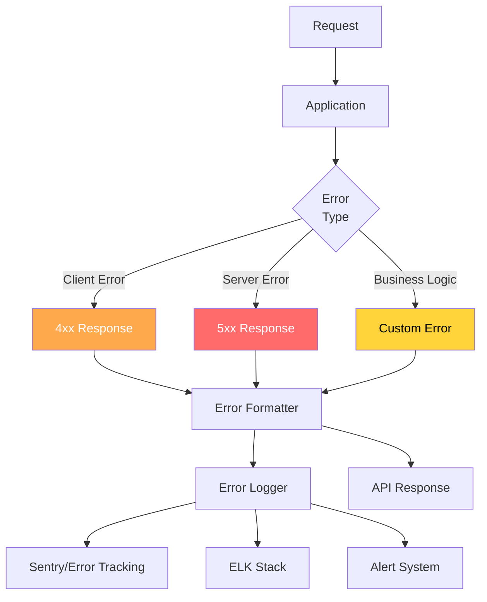

# Error Handling & Logging Standards

## Error Response Architecture



## Error Response Format

```typescript
// Standard error response interface
interface ApiError {
  error: {
    code: string;              // Machine-readable code
    message: string;           // Human-readable message
    details?: ErrorDetail[];   // Field-level errors
    request_id: string;        // Unique request ID
    timestamp: string;         // ISO 8601 timestamp
    documentation_url?: string; // Link to error docs
  };
}

interface ErrorDetail {
  field: string;     // Field path (e.g., "address.city")
  message: string;   // Human-readable message
  code: string;      // Error code (e.g., "REQUIRED", "INVALID_FORMAT")
  rejected_value?: any; // The value that failed validation
}

// Example responses
const errorExamples = {
  validation: {
    error: {
      code: 'VALIDATION_ERROR',
      message: 'Request validation failed',
      details: [
        {
          field: 'email',
          message: 'Invalid email format',
          code: 'INVALID_FORMAT',
          rejected_value: 'not-an-email',
        },
        {
          field: 'password',
          message: 'Password must be at least 12 characters',
          code: 'TOO_SHORT',
          rejected_value: '***',
        },
      ],
      request_id: 'req_abc123',
      timestamp: '2024-01-15T10:30:00Z',
    },
  },

  notFound: {
    error: {
      code: 'NOT_FOUND',
      message: 'User not found',
      request_id: 'req_abc123',
      timestamp: '2024-01-15T10:30:00Z',
      documentation_url: 'https://docs.api.com/errors#NOT_FOUND',
    },
  },

  unauthorized: {
    error: {
      code: 'UNAUTHORIZED',
      message: 'Invalid or expired token',
      request_id: 'req_abc123',
      timestamp: '2024-01-15T10:30:00Z',
    },
  },

  rateLimited: {
    error: {
      code: 'RATE_LIMITED',
      message: 'Too many requests. Please retry after 30 seconds',
      request_id: 'req_abc123',
      timestamp: '2024-01-15T10:30:00Z',
    },
  },
};
```

## Error Codes Reference

### Client Errors (4xx)

| Code | Status | Description |
|------|--------|-------------|
| `VALIDATION_ERROR` | 400 | Request body/query validation failed |
| `INVALID_REQUEST` | 400 | Malformed request |
| `UNAUTHORIZED` | 401 | Authentication required or failed |
| `TOKEN_EXPIRED` | 401 | JWT token has expired |
| `TOKEN_INVALID` | 401 | JWT token is malformed |
| `FORBIDDEN` | 403 | Insufficient permissions |
| `NOT_FOUND` | 404 | Resource not found |
| `METHOD_NOT_ALLOWED` | 405 | HTTP method not supported |
| `CONFLICT` | 409 | Resource already exists or state conflict |
| `GONE` | 410 | Resource permanently deleted |
| `UNPROCESSABLE` | 422 | Semantically invalid request |
| `TOO_MANY_REQUESTS` | 429 | Rate limit exceeded |
| `REQUEST_TOO_LARGE` | 413 | Request body too large |

### Server Errors (5xx)

| Code | Status | Description |
|------|--------|-------------|
| `INTERNAL_ERROR` | 500 | Unexpected server error |
| `NOT_IMPLEMENTED` | 501 | Feature not implemented |
| `SERVICE_UNAVAILABLE` | 503 | Service temporarily unavailable |
| `GATEWAY_TIMEOUT` | 504 | Upstream service timeout |
| `DATABASE_ERROR` | 500 | Database operation failed |
| `EXTERNAL_SERVICE_ERROR` | 502 | Third-party service failure |

## Error Handling Implementation

### Base Error Classes

```typescript
// Custom application errors
class AppError extends Error {
  public readonly code: string;
  public readonly statusCode: number;
  public readonly isOperational: boolean;
  public readonly details?: ErrorDetail[];

  constructor(
    message: string,
    code: string,
    statusCode: number,
    isOperational = true,
    details?: ErrorDetail[],
  ) {
    super(message);
    this.code = code;
    this.statusCode = statusCode;
    this.isOperational = isOperational;
    this.details = details;
    Error.captureStackTrace(this, this.constructor);
  }
}

class NotFoundError extends AppError {
  constructor(resource: string, id?: string) {
    super(
      id ? `${resource} with id '${id}' not found` : `${resource} not found`,
      'NOT_FOUND',
      404,
    );
  }
}

class ValidationError extends AppError {
  constructor(message: string, details: ErrorDetail[]) {
    super(message, 'VALIDATION_ERROR', 400, true, details);
  }
}

class ConflictError extends AppError {
  constructor(message: string) {
    super(message, 'CONFLICT', 409);
  }
}

class UnauthorizedError extends AppError {
  constructor(message = 'Authentication required') {
    super(message, 'UNAUTHORIZED', 401);
  }
}

class ForbiddenError extends AppError {
  constructor(message = 'Insufficient permissions') {
    super(message, 'FORBIDDEN', 403);
  }
}

class RateLimitError extends AppError {
  constructor(retryAfter: number) {
    super(
      `Rate limit exceeded. Retry after ${retryAfter} seconds`,
      'RATE_LIMITED',
      429,
    );
    this.retryAfter = retryAfter;
  }
  retryAfter: number;
}

class ExternalServiceError extends AppError {
  constructor(service: string, message: string) {
    super(
      `External service error: ${service} - ${message}`,
      'EXTERNAL_SERVICE_ERROR',
      502,
    );
  }
}
```

### Error Handler Middleware

```typescript
import { Request, Response, NextFunction } from 'express';
import { v4 as uuidv4 } from 'uuid';

// Global error handler
const errorHandler = (
  err: Error,
  req: Request,
  res: Response,
  next: NextFunction,
) => {
  const requestId = req.headers['x-request-id'] as string || uuidv4();

  // Log the error
  logger.error({
    requestId,
    error: {
      name: err.name,
      message: err.message,
      stack: err.stack,
      code: (err as AppError).code,
    },
    request: {
      method: req.method,
      path: req.path,
      query: req.query,
      ip: req.ip,
      userId: req.user?.id,
    },
  });

  // Handle known operational errors
  if (err instanceof AppError) {
    const response: ApiError = {
      error: {
        code: err.code,
        message: err.message,
        details: err.details,
        request_id: requestId,
        timestamp: new Date().toISOString(),
      },
    };

    // Add retry-after header for rate limits
    if (err instanceof RateLimitError) {
      res.setHeader('Retry-After', err.retryAfter);
    }

    return res.status(err.statusCode).json(response);
  }

  // Handle JWT errors
  if (err.name === 'JsonWebTokenError') {
    return res.status(401).json({
      error: {
        code: 'TOKEN_INVALID',
        message: 'Invalid token',
        request_id: requestId,
        timestamp: new Date().toISOString(),
      },
    });
  }

  if (err.name === 'TokenExpiredError') {
    return res.status(401).json({
      error: {
        code: 'TOKEN_EXPIRED',
        message: 'Token has expired',
        request_id: requestId,
        timestamp: new Date().toISOString(),
      },
    });
  }

  // Handle database errors
  if (err.name === 'QueryFailedError') {
    return handleDatabaseError(err, res, requestId);
  }

  // Unexpected errors - don't leak details
  return res.status(500).json({
    error: {
      code: 'INTERNAL_ERROR',
      message: 'An unexpected error occurred',
      request_id: requestId,
      timestamp: new Date().toISOString(),
    },
  });
};

function handleDatabaseError(err: Error, res: Response, requestId: string) {
  const dbError = err as any;

  // Unique constraint violation
  if (dbError.code === '23505') {
    return res.status(409).json({
      error: {
        code: 'CONFLICT',
        message: 'Resource already exists',
        request_id: requestId,
        timestamp: new Date().toISOString(),
      },
    });
  }

  // Foreign key violation
  if (dbError.code === '23503') {
    return res.status(400).json({
      error: {
        code: 'INVALID_REFERENCE',
        message: 'Referenced resource does not exist',
        request_id: requestId,
        timestamp: new Date().toISOString(),
      },
    });
  }

  // Generic database error
  return res.status(500).json({
    error: {
      code: 'DATABASE_ERROR',
      message: 'Database operation failed',
      request_id: requestId,
      timestamp: new Date().toISOString(),
    },
  });
}
```

### Async Error Wrapper

```typescript
// Async route handler wrapper
const asyncHandler = (
  fn: (req: Request, res: Response, next: NextFunction) => Promise<any>,
) => {
  return (req: Request, res: Response, next: NextFunction) => {
    Promise.resolve(fn(req, res, next)).catch(next);
  };
};

// Usage
router.get('/users/:id', asyncHandler(async (req, res) => {
  const user = await userService.findById(req.params.id);
  if (!user) throw new NotFoundError('User', req.params.id);
  res.json({ data: user });
}));
```

## Logging Standards

### Structured Logging

```typescript
// Logger configuration
import pino from 'pino';

const logger = pino({
  level: process.env.LOG_LEVEL || 'info',
  formatters: {
    level: (label) => ({ level: label }),
  },
  timestamp: pino.stdTimeFunctions.isoTime,
  serializers: {
    err: pino.stdSerializers.err,
    req: pino.stdSerializers.req,
    res: pino.stdSerializers.res,
  },
});

// Request logging middleware
const requestLogger = (req: Request, res: Response, next: NextFunction) => {
  const requestId = req.headers['x-request-id'] as string || uuidv4();
  const start = Date.now();

  // Add requestId to request context
  req.requestId = requestId;

  // Log request
  logger.info({
    requestId,
    method: req.method,
    path: req.path,
    query: req.query,
    ip: req.ip,
    userId: req.user?.id,
    userAgent: req.headers['user-agent'],
  }, 'Request received');

  // Log response
  res.on('finish', () => {
    const duration = Date.now() - start;
    const logLevel = res.statusCode >= 500 ? 'error'
      : res.statusCode >= 400 ? 'warn'
      : 'info';

    logger[logLevel]({
      requestId,
      method: req.method,
      path: req.path,
      statusCode: res.statusCode,
      duration,
      userId: req.user?.id,
    }, 'Request completed');
  });

  next();
};
```

### Log Levels

| Level | Usage | Example |
|-------|-------|---------|
| `fatal` | System crash, unrecoverable | Database connection pool exhausted |
| `error` | Operation failed, needs attention | Payment processing failed |
| `warn` | Unexpected but handled | Rate limit hit, retry after |
| `info` | Normal operations | User created, order placed |
| `debug` | Development debugging | SQL query executed, cache hit |
| `trace` | Very detailed debugging | Function entry/exit |

### Error Logging Pattern

```typescript
// Structured error logging
class ErrorLogger {
  static log(error: Error, context: Record<string, any> = {}) {
    const errorInfo = {
      name: error.name,
      message: error.message,
      stack: error.stack,
      code: (error as AppError).code,
      statusCode: (error as AppError).statusCode,
      ...context,
    };

    if ((error as AppError).isOperational) {
      logger.warn(errorInfo, 'Operational error');
    } else {
      logger.error(errorInfo, 'System error');

      // Alert on unexpected errors
      if (process.env.NODE_ENV === 'production') {
        this.alert(errorInfo);
      }
    }
  }

  private static async alert(errorInfo: Record<string, any>) {
    // Send to error tracking service (Sentry, etc.)
    if (sentryDsn) {
      Sentry.captureException(errorInfo);
    }

    // Send to alerting system for critical errors
    if (errorInfo.statusCode === 500) {
      await alertService.send({
        severity: 'critical',
        title: `Server Error: ${errorInfo.name}`,
        message: errorInfo.message,
        metadata: errorInfo,
      });
    }
  }
}
```

## Request/Response Logging

```typescript
// Sensitive data filtering
const sanitizeLog = (data: any): any => {
  const sensitiveFields = [
    'password', 'passwordHash', 'token',
    'authorization', 'creditCard', 'cvv',
    'ssn', 'secret', 'apiKey',
  ];

  if (typeof data !== 'object' || data === null) return data;

  const sanitized = { ...data };
  for (const key of Object.keys(sanitized)) {
    if (sensitiveFields.some((field) =>
      key.toLowerCase().includes(field.toLowerCase())
    )) {
      sanitized[key] = '[REDACTED]';
    } else if (typeof sanitized[key] === 'object') {
      sanitized[key] = sanitizeLog(sanitized[key]);
    }
  }

  return sanitized;
};

// Request body logging (with sanitization)
app.use((req, res, next) => {
  if (req.body) {
    req.logBody = sanitizeLog(req.body);
  }
  next();
});
```

## Health Check Endpoints

```typescript
// Health check implementation
router.get('/health', async (req, res) => {
  const checks = {
    status: 'healthy',
    timestamp: new Date().toISOString(),
    uptime: process.uptime(),
    version: process.env.APP_VERSION,
    checks: {} as Record<string, any>,
  };

  // Database check
  try {
    await db.query('SELECT 1');
    checks.checks.database = { status: 'healthy', latency: '2ms' };
  } catch (error) {
    checks.checks.database = { status: 'unhealthy', error: error.message };
    checks.status = 'degraded';
  }

  // Redis check
  try {
    const start = Date.now();
    await redis.ping();
    checks.checks.redis = {
      status: 'healthy',
      latency: `${Date.now() - start}ms`,
    };
  } catch (error) {
    checks.checks.redis = { status: 'unhealthy', error: error.message };
    checks.status = 'degraded';
  }

  // Memory check
  const memUsage = process.memoryUsage();
  const heapUsedPercent = (memUsage.heapUsed / memUsage.heapTotal) * 100;
  checks.checks.memory = {
    status: heapUsedPercent < 90 ? 'healthy' : 'warning',
    heap_used: `${Math.round(heapUsedPercent)}%`,
    rss: `${Math.round(memUsage.rss / 1024 / 1024)}MB`,
  };

  const statusCode = checks.status === 'healthy' ? 200 : 503;
  res.status(statusCode).json(checks);
});

// Readiness probe (for Kubernetes)
router.get('/ready', async (req, res) => {
  const ready = await checkReadiness();
  res.status(ready ? 200 : 503).json({ ready });
});

// Liveness probe
router.get('/live', (req, res) => {
  res.json({ alive: true });
});
```

## Error Handling Checklist

```yaml
client_errors:
  - [ ] All 4xx errors use standard format
  - [ ] Error codes are machine-readable
  - [ ] Messages are user-friendly
  - [ ] Field-level errors include field path
  - [ ] No stack traces in responses

server_errors:
  - [ ] 500 errors logged with full context
  - [ ] No internal details in responses
  - [ ] Request ID included for debugging
  - [ ] Critical errors trigger alerts
  - [ ] Graceful degradation implemented

logging:
  - [ ] Structured logging format (JSON)
  - [ ] Sensitive data redacted
  - [ ] Request/response logging
  - [ ] Error context captured
  - [ ] Log levels configured correctly

monitoring:
  - [ ] Error rate metrics
  - [ ] Response time tracking
  - [ ] Health check endpoints
  - [ ] Alerting configured
  - [ ] Dashboard for error trends
```
