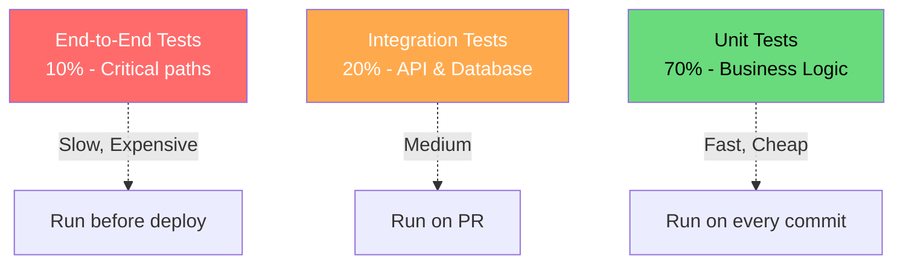

# Backend Testing Strategy

## Testing Pyramid



## Test Configuration

### Jest Configuration

```typescript
// jest.config.ts
import type { Config } from 'jest';

const config: Config = {
  preset: 'ts-jest',
  testEnvironment: 'node',
  roots: ['<rootDir>/src'],
  testMatch: ['**/*.test.ts', '**/*.spec.ts'],
  collectCoverageFrom: [
    'src/**/*.ts',
    '!src/**/*.d.ts',
    '!src/**/*.test.ts',
    '!src/**/index.ts',
  ],
  coverageThresholds: {
    global: {
      branches: 80,
      functions: 80,
      lines: 80,
      statements: 80,
    },
  },
  setupFilesAfterSetup: ['<rootDir>/src/test/setup.ts'],
  testTimeout: 10000,
  verbose: true,
};

export default config;
```

### Test Setup

```typescript
// src/test/setup.ts
import { PrismaClient } from '@prisma/client';
import { execSync } from 'child_process';
import { seed } from './seed';

const prisma = new PrismaClient();

beforeAll(async () => {
  // Reset and seed test database
  execSync('npx prisma migrate reset --force');
  await seed();
});

afterAll(async () => {
  await prisma.$disconnect();
});

// Global test utilities
global.testUtils = {
  prisma,
  createTestUser: async (overrides?: Partial<User>) => {
    return prisma.user.create({
      data: {
        email: `test-${Date.now()}@example.com`,
        name: 'Test User',
        passwordHash: await hash('password123'),
        role: 'user',
        ...overrides,
      },
    });
  },
};
```

## Unit Tests

### Service Unit Tests

```typescript
// src/modules/users/users.service.test.ts
import { UserService } from './users.service';
import { UserRepository } from './users.repository';
import { NotFoundError, ConflictError, ValidationError } from '@/shared/errors';

// Mock repository
jest.mock('./users.repository');
const mockRepo = jest.mocked(UserRepository);

describe('UserService', () => {
  let service: UserService;

  beforeEach(() => {
    service = new UserService(mockRepo);
    jest.clearAllMocks();
  });

  describe('findById', () => {
    it('should return user when found', async () => {
      const mockUser = { id: '1', email: 'test@example.com', name: 'Test' };
      mockRepo.findById.mockResolvedValue(mockUser);

      const result = await service.findById('1');

      expect(result).toEqual(mockUser);
      expect(mockRepo.findById).toHaveBeenCalledWith('1');
    });

    it('should throw NotFoundError when user not found', async () => {
      mockRepo.findById.mockResolvedValue(null);

      await expect(service.findById('999'))
        .rejects.toThrow(NotFoundError);
    });
  });

  describe('create', () => {
    it('should create user with valid data', async () => {
      const input = { email: 'new@example.com', name: 'New', password: 'password123' };
      const mockUser = { id: '1', ...input, passwordHash: 'hash' };
      mockRepo.create.mockResolvedValue(mockUser);

      const result = await service.create(input);

      expect(result).toHaveProperty('id');
      expect(mockRepo.create).toHaveBeenCalled();
    });

    it('should throw ValidationError for invalid email', async () => {
      const input = { email: 'invalid', name: 'Test', password: 'password123' };

      await expect(service.create(input))
        .rejects.toThrow(ValidationError);
    });

    it('should throw ConflictError for duplicate email', async () => {
      const input = { email: 'existing@example.com', name: 'Test', password: 'password123' };
      mockRepo.create.mockRejectedValue(new Error('Unique constraint'));

      await expect(service.create(input))
        .rejects.toThrow(ConflictError);
    });
  });

  describe('update', () => {
    it('should update existing user', async () => {
      const existing = { id: '1', email: 'old@example.com', name: 'Old' };
      const updated = { ...existing, name: 'New' };
      mockRepo.findById.mockResolvedValue(existing);
      mockRepo.update.mockResolvedValue(updated);

      const result = await service.update('1', { name: 'New' });

      expect(result.name).toBe('New');
    });

    it('should throw NotFoundError for non-existent user', async () => {
      mockRepo.findById.mockResolvedValue(null);

      await expect(service.update('999', { name: 'New' }))
        .rejects.toThrow(NotFoundError);
    });
  });
});
```

### Validation Tests

```typescript
// src/shared/validation.test.ts
import { validateSchema } from './validation';
import { z } from 'zod';

describe('validateSchema', () => {
  const schema = z.object({
    email: z.string().email(),
    age: z.number().min(0).max(150),
  });

  it('should return data for valid input', () => {
    const result = validateSchema(schema, {
      email: 'test@example.com',
      age: 25,
    });

    expect(result.success).toBe(true);
    expect(result.data).toEqual({ email: 'test@example.com', age: 25 });
  });

  it('should return errors for invalid input', () => {
    const result = validateSchema(schema, {
      email: 'invalid',
      age: -1,
    });

    expect(result.success).toBe(false);
    expect(result.errors).toHaveLength(2);
  });
});
```

## Integration Tests

### API Integration Tests

```typescript
// src/modules/users/users.integration.test.ts
import request from 'supertest';
import app from '@/app';
import { prisma } from '@/config/database';
import { createTestUser, generateToken } from '@/test/utils';

describe('Users API', () => {
  let authToken: string;
  let testUser: any;

  beforeAll(async () => {
    testUser = await createTestUser();
    authToken = generateToken(testUser);
  });

  describe('GET /api/v1/users', () => {
    it('should return paginated users', async () => {
      const response = await request(app)
        .get('/api/v1/users')
        .set('Authorization', `Bearer ${authToken}`)
        .expect(200);

      expect(response.body.data).toBeInstanceOf(Array);
      expect(response.body.meta.pagination).toBeDefined();
      expect(response.body.meta.pagination.total).toBeGreaterThan(0);
    });

    it('should filter users by role', async () => {
      const response = await request(app)
        .get('/api/v1/users?role=admin')
        .set('Authorization', `Bearer ${authToken}`)
        .expect(200);

      response.body.data.forEach((user: any) => {
        expect(user.role).toBe('admin');
      });
    });

    it('should return 401 without auth token', async () => {
      await request(app)
        .get('/api/v1/users')
        .expect(401);
    });

    it('should return 403 with insufficient permissions', async () => {
      const viewerToken = generateToken({ ...testUser, role: 'viewer' });

      await request(app)
        .get('/api/v1/users')
        .set('Authorization', `Bearer ${viewerToken}`)
        .expect(403);
    });
  });

  describe('POST /api/v1/users', () => {
    it('should create user with valid data', async () => {
      const response = await request(app)
        .post('/api/v1/users')
        .set('Authorization', `Bearer ${authToken}`)
        .send({
          email: 'new@example.com',
          name: 'New User',
          password: 'SecurePass123!',
        })
        .expect(201);

      expect(response.body.data).toHaveProperty('id');
      expect(response.body.data.email).toBe('new@example.com');
    });

    it('should return 400 for invalid data', async () => {
      const response = await request(app)
        .post('/api/v1/users')
        .set('Authorization', `Bearer ${authToken}`)
        .send({
          email: 'invalid',
          name: '',
          password: 'short',
        })
        .expect(400);

      expect(response.body.error.details).toHaveLength(3);
    });

    it('should return 409 for duplicate email', async () => {
      await request(app)
        .post('/api/v1/users')
        .set('Authorization', `Bearer ${authToken}`)
        .send({
          email: testUser.email,
          name: 'Duplicate',
          password: 'SecurePass123!',
        })
        .expect(409);
    });
  });

  describe('GET /api/v1/users/:id', () => {
    it('should return user by ID', async () => {
      const response = await request(app)
        .get(`/api/v1/users/${testUser.id}`)
        .set('Authorization', `Bearer ${authToken}`)
        .expect(200);

      expect(response.body.data.id).toBe(testUser.id);
    });

    it('should return 404 for non-existent user', async () => {
      await request(app)
        .get('/api/v1/users/non-existent-id')
        .set('Authorization', `Bearer ${authToken}`)
        .expect(404);
    });
  });
});
```

### Database Integration Tests

```typescript
// src/modules/users/users.repository.integration.test.ts
import { UserRepository } from './users.repository';
import { prisma } from '@/config/database';

describe('UserRepository', () => {
  let repo: UserRepository;

  beforeAll(() => {
    repo = new UserRepository(prisma);
  });

  describe('create', () => {
    it('should persist user to database', async () => {
      const userData = {
        email: `test-${Date.now()}@example.com`,
        name: 'Test User',
        passwordHash: 'hash',
        role: 'user' as const,
      };

      const user = await repo.create(userData);

      expect(user.id).toBeDefined();

      // Verify in database
      const dbUser = await prisma.user.findUnique({
        where: { id: user.id },
      });
      expect(dbUser).not.toBeNull();
      expect(dbUser!.email).toBe(userData.email);
    });
  });

  describe('findMany', () => {
    it('should return paginated results', async () => {
      const result = await repo.findMany({ page: 1, limit: 10 });

      expect(result.data).toBeInstanceOf(Array);
      expect(result.pagination).toHaveProperty('total');
    });

    it('should filter by role', async () => {
      const result = await repo.findMany({
        page: 1,
        limit: 10,
        filters: { role: 'admin' },
      });

      result.data.forEach((user) => {
        expect(user.role).toBe('admin');
      });
    });
  });
});
```

## End-to-End Tests

### API E2E Tests

```typescript
// e2e/users.e2e.test.ts
import request from 'supertest';
import app from '@/app';

describe('Users E2E', () => {
  let adminToken: string;
  let userId: string;

  beforeAll(async () => {
    // Login as admin
    const loginResponse = await request(app)
      .post('/api/v1/auth/login')
      .send({ email: 'admin@example.com', password: 'admin123' });

    adminToken = loginResponse.body.data.accessToken;
  });

  it('should complete full user lifecycle', async () => {
    // Create user
    const createResponse = await request(app)
      .post('/api/v1/users')
      .set('Authorization', `Bearer ${adminToken}`)
      .send({
        email: `e2e-${Date.now()}@example.com`,
        name: 'E2E User',
        password: 'SecurePass123!',
      })
      .expect(201);

    userId = createResponse.body.data.id;

    // Read user
    const getResponse = await request(app)
      .get(`/api/v1/users/${userId}`)
      .set('Authorization', `Bearer ${adminToken}`)
      .expect(200);

    expect(getResponse.body.data.name).toBe('E2E User');

    // Update user
    const updateResponse = await request(app)
      .patch(`/api/v1/users/${userId}`)
      .set('Authorization', `Bearer ${adminToken}`)
      .send({ name: 'Updated E2E User' })
      .expect(200);

    expect(updateResponse.body.data.name).toBe('Updated E2E User');

    // Delete user
    await request(app)
      .delete(`/api/v1/users/${userId}`)
      .set('Authorization', `Bearer ${adminToken}`)
      .expect(204);

    // Verify deleted
    await request(app)
      .get(`/api/v1/users/${userId}`)
      .set('Authorization', `Bearer ${adminToken}`)
      .expect(404);
  });
});
```

## Load Testing

### k6 Load Test

```typescript
// load/users.load.ts
import http from 'k6/http';
import { check, sleep } from 'k6';

export const options = {
  stages: [
    { duration: '30s', target: 20 },  // Ramp up
    { duration: '1m', target: 20 },   // Stay at 20 users
    { duration: '30s', target: 0 },   // Ramp down
  ],
  thresholds: {
    http_req_duration: ['p(95)<500'],  // 95% of requests under 500ms
    http_req_failed: ['rate<0.01'],    // Less than 1% errors
  },
};

export default function () {
  const baseUrl = __ENV.BASE_URL || 'http://localhost:3000';
  const token = __ENV.AUTH_TOKEN;

  const params = {
    headers: {
      Authorization: `Bearer ${token}`,
      'Content-Type': 'application/json',
    },
  };

  // Test list users
  const listRes = http.get(`${baseUrl}/api/v1/users?page=1&limit=20`, params);
  check(listRes, {
    'list users status is 200': (r) => r.status === 200,
    'list users response time < 500ms': (r) => r.timings.duration < 500,
    'list users returns data': (r) => JSON.parse(r.body).data.length > 0,
  });

  sleep(1);

  // Test get user
  const users = JSON.parse(listRes.body).data;
  if (users.length > 0) {
    const getRes = http.get(`${baseUrl}/api/v1/users/${users[0].id}`, params);
    check(getRes, {
      'get user status is 200': (r) => r.status === 200,
      'get user response time < 200ms': (r) => r.timings.duration < 200,
    });
  }

  sleep(1);
}
```

### Artillery Load Test

```yaml
# load/artillery.yml
config:
  target: "http://localhost:3000"
  phases:
    - duration: 60
      arrivalRate: 10
      name: "Warm up"
    - duration: 120
      arrivalRate: 50
      name: "Ramp up"
    - duration: 300
      arrivalRate: 100
      name: "Sustained load"
  defaults:
    headers:
      Authorization: "Bearer {{ $processEnvironment.AUTH_TOKEN }}"

scenarios:
  - name: "User API flow"
    flow:
      - get:
          url: "/api/v1/users"
          qs:
            page: 1
            limit: 20
          expect:
            - statusCode: 200
      - think: 1
      - get:
          url: "/api/v1/users/{{ $randomUUID() }}"
          expect:
            - statusCode: [200, 404]
```

## Test Commands

```json
{
  "scripts": {
    "test": "jest",
    "test:watch": "jest --watch",
    "test:coverage": "jest --coverage",
    "test:integration": "jest --config jest.integration.config.ts",
    "test:e2e": "jest --config jest.e2e.config.ts",
    "test:load": "k6 run load/users.load.ts",
    "test:all": "npm run test && npm run test:integration && npm run test:e2e"
  }
}
```

## Testing Checklist

```yaml
unit_tests:
  - [ ] All service methods tested
  - [ ] All validation logic tested
  - [ ] Error handling tested
  - [ ] Edge cases covered
  - [ ] Mocks properly configured

integration_tests:
  - [ ] API endpoints tested
  - [ ] Database operations tested
  - [ ] Authentication tested
  - [ ] Authorization tested
  - [ ] External service mocks configured

e2e_tests:
  - [ ] Critical user flows covered
  - [ ] Cross-service interactions tested
  - [ ] Error scenarios tested
  - [ ] Performance baseline established

load_tests:
  - [ ] Baseline performance established
  - [ ] Stress testing completed
  - [ ] Scalability verified
  - [ ] Memory leak detection
  - [ ] Response time SLAs met
```
