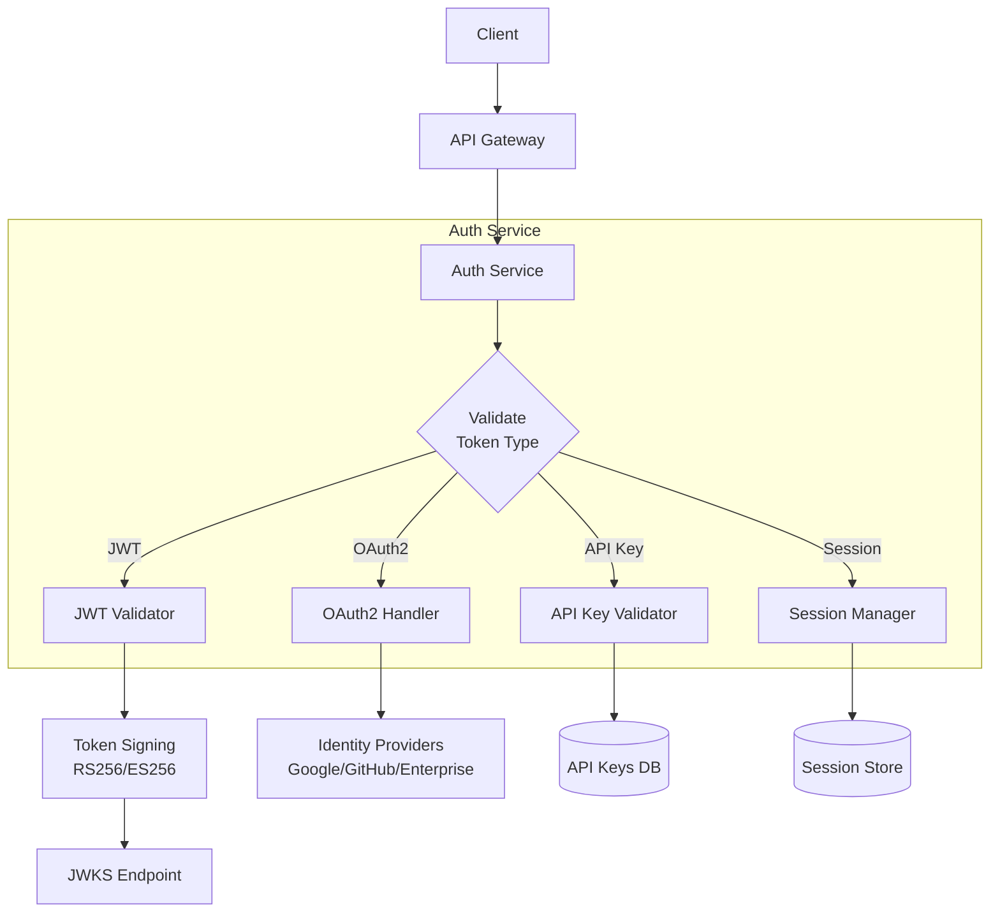
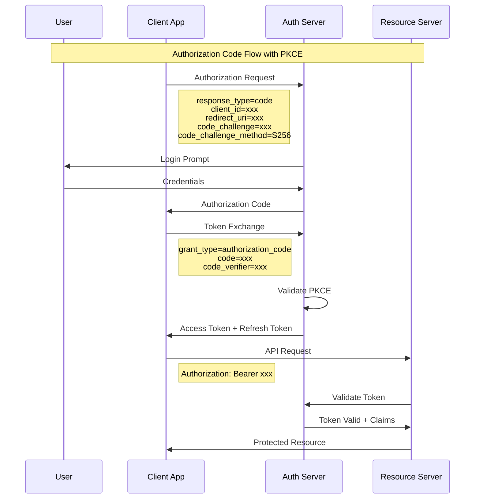
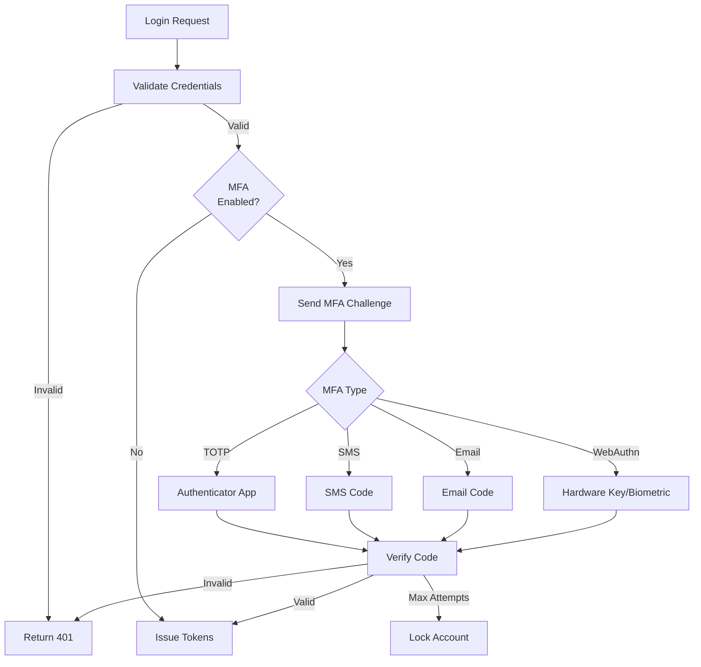

# Authentication Patterns

## Authentication Architecture



## JWT Authentication

### Token Structure

```json
{
  "header": {
    "alg": "RS256",
    "typ": "JWT",
    "kid": "key-id-2024-01"
  },
  "payload": {
    "iss": "https://auth.[PROJECT_NAME].com",
    "sub": "user-uuid-123",
    "aud": "https://api.[PROJECT_NAME].com",
    "exp": 1700000000,
    "iat": 1699996400,
    "nbf": 1699996400,
    "jti": "unique-token-id",
    "email": "user@example.com",
    "role": "admin",
    "permissions": ["read:users", "write:users", "read:orders"]
  }
}
```

### JWT Implementation

```typescript
// Node.js / TypeScript - JWT Service
import jwt from 'jsonwebtoken';
import { v4 as uuidv4 } from 'uuid';

interface TokenPayload {
  sub: string;
  email: string;
  role: string;
  permissions: string[];
  iss: string;
  aud: string;
}

interface TokenPair {
  accessToken: string;
  refreshToken: string;
  expiresIn: number;
  tokenType: 'Bearer';
}

class JWTService {
  private privateKey: string;
  private publicKey: string;
  private accessExpiresIn: string = '15m';
  private refreshExpiresIn: string = '7d';

  constructor(privateKey: string, publicKey: string) {
    this.privateKey = privateKey;
    this.publicKey = publicKey;
  }

  generateTokenPair(user: TokenPayload): TokenPair {
    const accessToken = this.generateAccessToken(user);
    const refreshToken = this.generateRefreshToken(user);

    return {
      accessToken,
      refreshToken,
      expiresIn: 900, // 15 minutes in seconds
      tokenType: 'Bearer',
    };
  }

  private generateAccessToken(user: TokenPayload): string {
    return jwt.sign(
      {
        email: user.email,
        role: user.role,
        permissions: user.permissions,
      },
      this.privateKey,
      {
        algorithm: 'RS256',
        expiresIn: this.accessExpiresIn,
        issuer: user.iss,
        subject: user.sub,
        audience: user.aud,
        jwtid: uuidv4(),
      }
    );
  }

  private generateRefreshToken(user: TokenPayload): string {
    return jwt.sign(
      { tokenVersion: 1 },
      this.privateKey,
      {
        algorithm: 'RS256',
        expiresIn: this.refreshExpiresIn,
        issuer: user.iss,
        subject: user.sub,
        jwtid: uuidv4(),
      }
    );
  }

  verifyAccessToken(token: string): TokenPayload {
    return jwt.verify(token, this.publicKey, {
      algorithms: ['RS256'],
      issuer: 'https://auth.[PROJECT_NAME].com',
      audience: 'https://api.[PROJECT_NAME].com',
    }) as TokenPayload;
  }

  async rotateRefreshToken(refreshToken: string): Promise<TokenPair> {
    const decoded = jwt.verify(refreshToken, this.publicKey, {
      algorithms: ['RS256'],
    }) as { sub: string };

    // Fetch user from DB to get current permissions
    const user = await this.getUserById(decoded.sub);

    // Invalidate old refresh token
    await this.invalidateRefreshToken(refreshToken);

    // Generate new pair
    return this.generateTokenPair(user);
  }
}
```

### Python JWT Implementation

```python
# Python / FastAPI - JWT Authentication
from datetime import datetime, timedelta
from typing import Optional
from jose import JWTError, jwt
from passlib.context import CryptContext
from fastapi import Depends, HTTPException, status
from fastapi.security import HTTPBearer, HTTPAuthorizationCredentials

security = HTTPBearer()

class JWTService:
    def __init__(
        self,
        secret_key: str,
        algorithm: str = "RS256",
        access_token_expire_minutes: int = 15,
        refresh_token_expire_days: int = 7,
    ):
        self.secret_key = secret_key
        self.algorithm = algorithm
        self.access_token_expire_minutes = access_token_expire_minutes
        self.refresh_token_expire_days = refresh_token_expire_days

    def create_access_token(
        self,
        data: dict,
        expires_delta: Optional[timedelta] = None,
    ) -> str:
        to_encode = data.copy()
        expire = datetime.utcnow() + (
            expires_delta or timedelta(minutes=self.access_token_expire_minutes)
        )
        to_encode.update({
            "exp": expire,
            "iat": datetime.utcnow(),
            "jti": str(uuid.uuid4()),
        })
        return jwt.encode(to_encode, self.secret_key, algorithm=self.algorithm)

    def create_refresh_token(self, data: dict) -> str:
        to_encode = data.copy()
        expire = datetime.utcnow() + timedelta(days=self.refresh_token_expire_days)
        to_encode.update({
            "exp": expire,
            "iat": datetime.utcnow(),
            "jti": str(uuid.uuid4()),
            "token_version": 1,
        })
        return jwt.encode(to_encode, self.secret_key, algorithm=self.algorithm)

    def verify_token(self, token: str) -> dict:
        try:
            payload = jwt.decode(
                token,
                self.secret_key,
                algorithms=[self.algorithm],
            )
            return payload
        except JWTError as e:
            raise HTTPException(
                status_code=status.HTTP_401_UNAUTHORIZED,
                detail=f"Invalid token: {str(e)}",
                headers={"WWW-Authenticate": "Bearer"},
            )


async def get_current_user(
    credentials: HTTPAuthorizationCredentials = Depends(security),
    jwt_service: JWTService = Depends(get_jwt_service),
) -> User:
    payload = jwt_service.verify_token(credentials.credentials)
    user = await get_user_by_id(payload["sub"])
    if user is None:
        raise HTTPException(status_code=404, detail="User not found")
    if not user.is_active:
        raise HTTPException(status_code=403, detail="User is inactive")
    return user
```

### JWKS Endpoint

```typescript
// JWKS (JSON Web Key Set) endpoint
import express from 'express';
import { exportJWK } from 'jose';
import * as fs from 'fs';

const router = express.Router();

router.get('/.well-known/jwks.json', async (req, res) => {
  const privateKey = fs.readFileSync('private-key.pem');
  const jwk = await exportJWK(privateKey);
  jwk.kid = 'key-id-2024-01';
  jwk.alg = 'RS256';
  jwk.use = 'sig';

  res.json({
    keys: [jwk],
  });
});
```

## OAuth2 / OpenID Connect

### OAuth2 Flow



### OAuth2 Implementation

```typescript
// OAuth2 Configuration
interface OAuth2Config {
  providers: {
    google: {
      clientId: string;
      clientSecret: string;
      scope: string[];
      callbackUrl: string;
    };
    github: {
      clientId: string;
      clientSecret: string;
      scope: string[];
      callbackUrl: string;
    };
    enterprise: {
      issuer: string;
      clientId: string;
      clientSecret: string;
      redirectUri: string;
    };
  };
}

// OAuth2 Handler
class OAuth2Service {
  async handleCallback(
    provider: string,
    code: string,
    state: string,
  ): Promise<TokenPair> {
    // Validate state parameter (CSRF protection)
    await this.validateState(state);

    // Exchange code for tokens
    const tokens = await this.exchangeCode(provider, code);

    // Get user info from provider
    const userInfo = await this.getUserInfo(provider, tokens.accessToken);

    // Find or create user in our system
    const user = await this.findOrCreateUser(provider, userInfo);

    // Generate our own JWT tokens
    return this.generateTokenPair(user);
  }

  async generateOAuthState(): Promise<{ state: string; nonce: string }> {
    const state = crypto.randomBytes(32).toString('hex');
    const nonce = crypto.randomBytes(32).toString('hex');

    // Store state with 10-minute expiry
    await redis.setex(`oauth:state:${state}`, 600, nonce);

    return { state, nonce };
  }

  private async validateState(state: string): Promise<void> {
    const nonce = await redis.get(`oauth:state:${state}`);
    if (!nonce) {
      throw new Error('Invalid or expired OAuth state');
    }
    await redis.del(`oauth:state:${state}`);
  }
}
```

## API Key Authentication

### API Key Implementation

```typescript
import crypto from 'crypto';
import bcrypt from 'bcrypt';

interface ApiKey {
  id: string;
  key: string;       // stored hashed
  prefix: string;    // first 8 chars for identification
  name: string;
  scopes: string[];
  rateLimit: number;
  expiresAt?: Date;
  createdAt: Date;
}

class ApiKeyService {
  async generateApiKey(
    name: string,
    scopes: string[],
    options: { expiresIn?: number; rateLimit?: number } = {},
  ): Promise<{ key: string; apiKey: ApiKey }> {
    // Generate a cryptographically secure key
    const rawKey = `sk_live_${crypto.randomBytes(32).toString('hex')}`;
    const prefix = rawKey.substring(0, 11); // sk_live_xxx

    // Hash the key for storage (never store raw keys)
    const hashedKey = await bcrypt.hash(rawKey, 12);

    const apiKey: ApiKey = {
      id: crypto.randomUUID(),
      key: hashedKey,
      prefix,
      name,
      scopes,
      rateLimit: options.rateLimit || 1000,
      expiresAt: options.expiresIn
        ? new Date(Date.now() + options.expiresIn * 1000)
        : undefined,
      createdAt: new Date(),
    };

    await db.apiKeys.create(apiKey);

    // Return raw key only once
    return { key: rawKey, apiKey };
  }

  async validateApiKey(key: string): Promise<ApiKey | null> {
    const prefix = key.substring(0, 11);

    // Find by prefix (fast lookup)
    const candidate = await db.apiKeys.findByPrefix(prefix);
    if (!candidate) return null;

    // Check expiry
    if (candidate.expiresAt && candidate.expiresAt < new Date()) {
      return null;
    }

    // Verify hash
    const valid = await bcrypt.compare(key, candidate.key);
    if (!valid) return null;

    // Update last used
    await db.apiKeys.updateLastUsed(candidate.id);

    return candidate;
  }

  async revokeApiKey(id: string): Promise<void> {
    await db.apiKeys.delete(id);
  }
}
```

### API Key Middleware

```typescript
// Express middleware
const apiKeyAuth = async (
  req: Request,
  res: Response,
  next: NextFunction,
) => {
  const apiKey = req.headers['x-api-key'] as string;

  if (!apiKey) {
    return res.status(401).json({
      error: {
        code: 'MISSING_API_KEY',
        message: 'API key is required',
      },
    });
  }

  const validKey = await apiKeyService.validateApiKey(apiKey);
  if (!validKey) {
    return res.status(401).json({
      error: {
        code: 'INVALID_API_KEY',
        message: 'Invalid or expired API key',
      },
    });
  }

  // Check scopes
  const requiredScope = getRequiredScope(req.method, req.path);
  if (requiredScope && !validKey.scopes.includes(requiredScope)) {
    return res.status(403).json({
      error: {
        code: 'INSUFFICIENT_SCOPE',
        message: `Required scope: ${requiredScope}`,
      },
    });
  }

  // Check rate limit
  const rateLimitKey = `ratelimit:${validKey.id}`;
  const current = await redis.incr(rateLimitKey);
  if (current === 1) {
    await redis.expire(rateLimitKey, 60);
  }
  if (current > validKey.rateLimit) {
    return res.status(429).json({
      error: {
        code: 'RATE_LIMITED',
        message: 'Rate limit exceeded',
      },
    });
  }

  req.apiKey = validKey;
  next();
};
```

## Session-Based Authentication

```typescript
// Session configuration
interface SessionConfig {
  secret: string;
  name: string;
  cookie: {
    maxAge: number;       // 24 hours
    httpOnly: true;       // prevent XSS
    secure: true;         // HTTPS only
    sameSite: 'lax';     // CSRF protection
    domain: string;
  };
  resave: false;
  saveUninitialized: false;
  store: RedisStore;     // server-side session store
}

// Session management
class SessionService {
  async createSession(userId: string, metadata: SessionMetadata): Promise<string> {
    const sessionId = crypto.randomBytes(32).toString('hex');

    const session: Session = {
      id: sessionId,
      userId,
      ip: metadata.ip,
      userAgent: metadata.userAgent,
      createdAt: new Date(),
      expiresAt: new Date(Date.now() + 24 * 60 * 60 * 1000),
    };

    await redis.setex(
      `session:${sessionId}`,
      86400, // 24 hours
      JSON.stringify(session),
    );

    return sessionId;
  }

  async validateSession(sessionId: string): Promise<Session | null> {
    const data = await redis.get(`session:${sessionId}`);
    if (!data) return null;

    const session: Session = JSON.parse(data);

    // Check expiry
    if (session.expiresAt < new Date()) {
      await this.destroySession(sessionId);
      return null;
    }

    // Extend session (sliding window)
    await redis.expire(`session:${sessionId}`, 86400);

    return session;
  }

  async destroySession(sessionId: string): Promise<void> {
    await redis.del(`session:${sessionId}`);
  }

  async destroyAllUserSessions(userId: string): Promise<void> {
    const keys = await redis.keys('session:*');
    for (const key of keys) {
      const session = await this.validateSession(key.replace('session:', ''));
      if (session && session.userId === userId) {
        await redis.del(key);
      }
    }
  }
}
```

## Multi-Factor Authentication (MFA)



```typescript
// TOTP Implementation
import { authenticator } from 'otplib';

class MFAService {
  async generateTOTPSecret(userId: string): Promise<{
    secret: string;
    qrCodeUrl: string;
  }> {
    const secret = authenticator.generateSecret();
    const otpauth = authenticator.keyuri(
      userId,
      '[PROJECT_NAME]',
      secret,
    );

    // Store secret (encrypted at rest)
    await db.users.updateMfaSecret(userId, await encrypt(secret));

    return {
      secret,
      qrCodeUrl: otpauth,
    };
  }

  async verifyTOTP(userId: string, token: string): Promise<boolean> {
    const user = await db.users.findById(userId);
    const secret = await decrypt(user.mfaSecret);

    // Check current and one adjacent window for clock drift
    const isValid = authenticator.verify({
      token,
      secret,
    });

    if (isValid) {
      await this.recordSuccessfulMFA(userId);
    } else {
      await this.recordFailedMFAAttempt(userId);
    }

    return isValid;
  }

  async generateBackupCodes(userId: string): Promise<string[]> {
    const codes = Array.from({ length: 10 }, () =>
      crypto.randomBytes(4).toString('hex').toUpperCase()
    );

    const hashedCodes = await Promise.all(
      codes.map(async (code) => ({
        code: await bcrypt.hash(code, 10),
        used: false,
      })),
    );

    await db.users.updateBackupCodes(userId, hashedCodes);
    return codes; // Return plain codes, only shown once
  }
}
```

## Token Revocation

```typescript
class TokenRevocationService {
  // Token blacklist using Redis with TTL
  async revokeToken(jti: string, expiresAt: Date): Promise<void> {
    const ttl = Math.floor((expiresAt.getTime() - Date.now()) / 1000);
    if (ttl > 0) {
      await redis.setex(`revoked:${jti}`, ttl, '1');
    }
  }

  async isTokenRevoked(jti: string): Promise<boolean> {
    return (await redis.get(`revoked:${jti}`)) === '1';
  }

  // Revoke all user tokens (e.g., on password change)
  async revokeAllUserTokens(userId: string): Promise<void> {
    const version = await redis.incr(`token_version:${userId}`);
    await redis.expire(`token_version:${userId}`, 86400 * 30);
    return version;
  }

  // Middleware to check revocation
  async middleware(req: Request, res: Response, next: NextFunction) {
    const token = req.headers.authorization?.split(' ')[1];
    if (!token) return next();

    const decoded = jwt.decode(token) as { jti: string; sub: string };
    if (!decoded) return next();

    // Check if token is revoked
    if (await this.isTokenRevoked(decoded.jti)) {
      return res.status(401).json({
        error: { code: 'TOKEN_REVOKED', message: 'Token has been revoked' },
      });
    }

    // Check token version (for bulk revocation)
    const currentVersion = await redis.get(`token_version:${decoded.sub}`);
    const tokenVersion = jwt.verify(token, publicKey) as { tokenVersion?: number };

    if (currentVersion && tokenVersion.tokenVersion &&
        tokenVersion.tokenVersion < parseInt(currentVersion)) {
      return res.status(401).json({
        error: { code: 'TOKEN_REVOKED', message: 'Token version outdated' },
      });
    }

    next();
  }
}
```

## Authentication Comparison

| Feature | JWT | OAuth2 | API Key | Session |
|---------|-----|--------|---------|---------|
| Stateless | Yes | Varies | Yes | No |
| Cross-domain | Yes | Yes | Yes | No |
| Token lifetime | Short (15m) | Varies | Long | Sliding |
| Revocable | Difficult | Yes | Yes | Yes |
| Use case | SPA/Mobile | Third-party | Server-to-server | Traditional web |
| Storage | Client-side | Client-side | Server config | Server-side |

## Security Headers for Auth

```typescript
// Security middleware
app.use((req, res, next) => {
  // Prevent token leakage
  res.setHeader('X-Content-Type-Options', 'nosniff');
  res.setHeader('X-Frame-Options', 'DENY');

  // CORS for auth endpoints
  res.setHeader('Access-Control-Allow-Origin', 'https://[PROJECT_NAME].com');
  res.setHeader('Access-Control-Allow-Methods', 'GET, POST, OPTIONS');
  res.setHeader('Access-Control-Allow-Headers', 'Authorization, Content-Type');
  res.setHeader('Access-Control-Allow-Credentials', 'true');

  // HSTS
  res.setHeader('Strict-Transport-Security', 'max-age=31536000; includeSubDomains');

  next();
});
```
