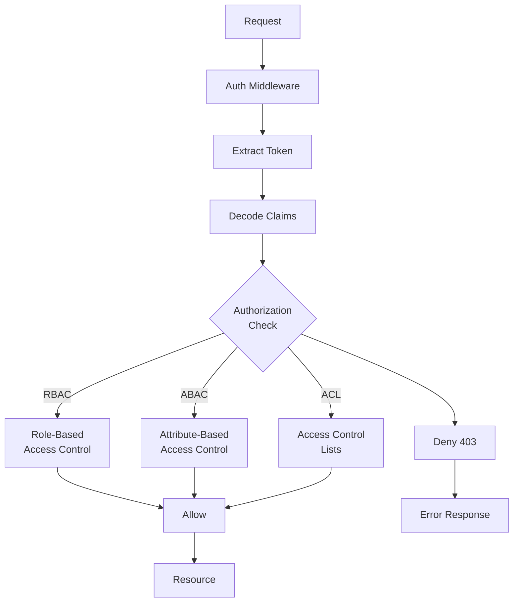
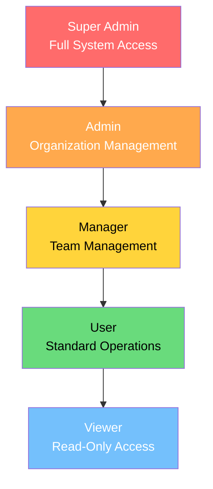
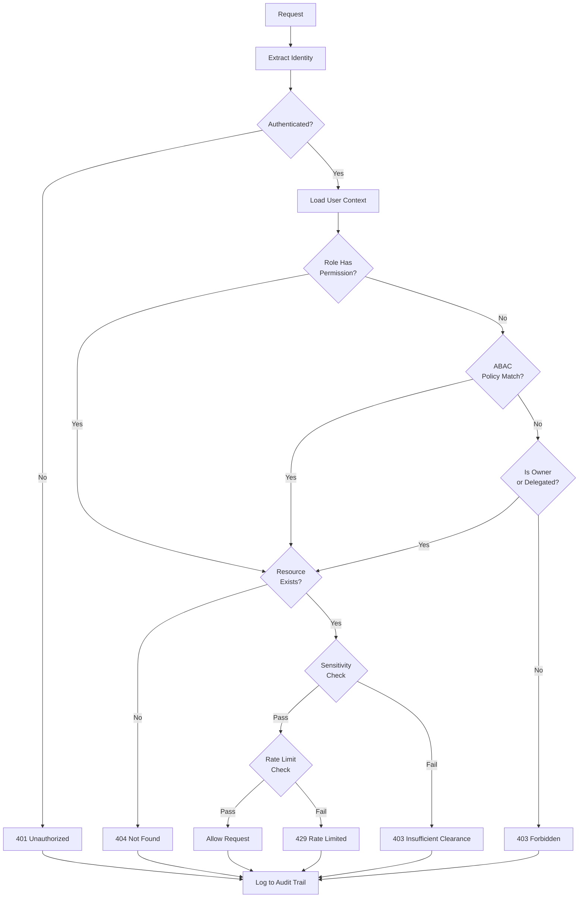

# Authorization & Access Control

## Authorization Architecture



## RBAC (Role-Based Access Control)

### Role Hierarchy



### Role Definitions

```typescript
// Role and permission definitions
enum Role {
  SUPER_ADMIN = 'super_admin',
  ADMIN = 'admin',
  MANAGER = 'manager',
  USER = 'user',
  VIEWER = 'viewer',
}

enum Permission {
  // User permissions
  USER_READ = 'user:read',
  USER_WRITE = 'user:write',
  USER_DELETE = 'user:delete',
  USER_MANAGE = 'user:manage',

  // Order permissions
  ORDER_READ = 'order:read',
  ORDER_WRITE = 'order:write',
  ORDER_CANCEL = 'order:cancel',
  ORDER_MANAGE = 'order:manage',

  // Analytics permissions
  ANALYTICS_READ = 'analytics:read',
  ANALYTICS_EXPORT = 'analytics:export',

  // System permissions
  SYSTEM_SETTINGS = 'system:settings',
  SYSTEM_AUDIT = 'system:audit',
  SYSTEM_BILLING = 'system:billing',
}

// Role-Permission mapping
const ROLE_PERMISSIONS: Record<Role, Permission[]> = {
  [Role.SUPER_ADMIN]: Object.values(Permission),
  [Role.ADMIN]: [
    Permission.USER_READ,
    Permission.USER_WRITE,
    Permission.USER_DELETE,
    Permission.USER_MANAGE,
    Permission.ORDER_READ,
    Permission.ORDER_WRITE,
    Permission.ORDER_MANAGE,
    Permission.ANALYTICS_READ,
    Permission.ANALYTICS_EXPORT,
    Permission.SYSTEM_SETTINGS,
  ],
  [Role.MANAGER]: [
    Permission.USER_READ,
    Permission.USER_WRITE,
    Permission.ORDER_READ,
    Permission.ORDER_WRITE,
    Permission.ORDER_CANCEL,
    Permission.ANALYTICS_READ,
    Permission.ANALYTICS_EXPORT,
  ],
  [Role.USER]: [
    Permission.USER_READ,
    Permission.ORDER_READ,
    Permission.ORDER_WRITE,
  ],
  [Role.VIEWER]: [
    Permission.USER_READ,
    Permission.ORDER_READ,
    Permission.ANALYTICS_READ,
  ],
};
```

### RBAC Middleware

```typescript
// Express/Fastify middleware
class RBACMiddleware {
  private userPermissions: Map<string, Set<Permission>> = new Map();

  async checkPermission(
    userId: string,
    requiredPermission: Permission,
  ): Promise<boolean> {
    const userRole = await this.getUserRole(userId);
    const rolePermissions = ROLE_PERMISSIONS[userRole];

    return rolePermissions.includes(requiredPermission);
  }

  // Middleware factory
  requirePermission(...permissions: Permission[]) {
    return async (req: Request, res: Response, next: NextFunction) => {
      const userId = req.user?.id;
      if (!userId) {
        return res.status(401).json({
          error: { code: 'UNAUTHORIZED', message: 'Authentication required' },
        });
      }

      const hasPermission = await Promise.all(
        permissions.map((p) => this.checkPermission(userId, p)),
      );

      if (!hasPermission.every(Boolean)) {
        // Log unauthorized access attempt
        await auditLogger.log({
          action: 'ACCESS_DENIED',
          userId,
          requiredPermissions: permissions,
          resource: req.path,
          method: req.method,
        });

        return res.status(403).json({
          error: {
            code: 'FORBIDDEN',
            message: 'Insufficient permissions',
            required: permissions,
          },
        });
      }

      next();
    };
  }

  // Check any of the permissions (OR logic)
  requireAnyPermission(...permissions: Permission[]) {
    return async (req: Request, res: Response, next: NextFunction) => {
      const userId = req.user?.id;
      if (!userId) {
        return res.status(401).json({
          error: { code: 'UNAUTHORIZED', message: 'Authentication required' },
        });
      }

      const hasAnyPermission = await Promise.any(
        permissions.map((p) => this.checkPermission(userId, p)),
      );

      if (!hasAnyPermission) {
        return res.status(403).json({
          error: { code: 'FORBIDDEN', message: 'Insufficient permissions' },
        });
      }

      next();
    };
  }
}

// Usage in routes
router.get('/users', rbac.requirePermission(Permission.USER_READ));
router.post('/users', rbac.requirePermission(Permission.USER_WRITE));
router.delete('/users/:id', rbac.requirePermission(Permission.USER_DELETE));
router.get('/analytics', rbac.requireAnyPermission(
  Permission.ANALYTICS_READ,
  Permission.ANALYTICS_EXPORT,
));
```

## ABAC (Attribute-Based Access Control)

### Policy Definitions

```typescript
// ABAC Policy Engine
interface PolicyContext {
  subject: {
    id: string;
    role: string;
    department: string;
    clearanceLevel: number;
  };
  resource: {
    type: string;
    ownerId?: string;
    sensitivity: 'public' | 'internal' | 'confidential' | 'restricted';
    department?: string;
  };
  action: 'read' | 'write' | 'delete' | 'admin';
  environment: {
    time: Date;
    ipAddress: string;
    location: string;
    device: string;
  };
}

// Policy rules
const policies: Policy[] = [
  {
    name: 'Owner access',
    description: 'Users can always access their own resources',
    evaluate: (ctx) =>
      ctx.resource.ownerId === ctx.subject.id,
  },
  {
    name: 'Admin override',
    description: 'Super admins can access anything',
    evaluate: (ctx) =>
      ctx.subject.role === 'super_admin',
  },
  {
    name: 'Department isolation',
    description: 'Users can only access resources in their department',
    evaluate: (ctx) =>
      ctx.subject.department === ctx.resource.department,
  },
  {
    name: 'Clearance check',
    description: 'User clearance must meet resource sensitivity',
    evaluate: (ctx) => {
      const sensitivityMap = { public: 0, internal: 1, confidential: 2, restricted: 3 };
      return ctx.subject.clearanceLevel >= sensitivityMap[ctx.resource.sensitivity];
    },
  },
  {
    name: 'Business hours only',
    description: 'Write operations only during business hours',
    evaluate: (ctx) => {
      if (ctx.action !== 'write') return true;
      const hour = ctx.environment.time.getHours();
      return hour >= 9 && hour <= 17;
    },
  },
  {
    name: 'IP whitelist for admin',
    description: 'Admin actions only from whitelisted IPs',
    evaluate: (ctx) => {
      if (ctx.action !== 'admin') return true;
      const whitelist = ['10.0.0.0/8', '192.168.1.0/24'];
      return whitelist.some((range) => ipInRange(ctx.environment.ipAddress, range));
    },
  },
];

class ABACEngine {
  async evaluate(context: PolicyContext): Promise<{
    allowed: boolean;
    reason: string;
    matchedPolicies: string[];
  }> {
    const matchedPolicies: string[] = [];
    let allowed = false;

    for (const policy of policies) {
      if (policy.evaluate(context)) {
        matchedPolicies.push(policy.name);
        allowed = true;
      }
    }

    return {
      allowed,
      reason: allowed ? 'Policies matched' : 'No policies matched',
      matchedPolicies,
    };
  }
}

// ABAC middleware
const abacMiddleware = async (
  req: Request,
  res: Response,
  next: NextFunction,
) => {
  const context: PolicyContext = {
    subject: {
      id: req.user.id,
      role: req.user.role,
      department: req.user.department,
      clearanceLevel: req.user.clearanceLevel,
    },
    resource: {
      type: getResourceType(req.path),
      ownerId: req.params.id,
      sensitivity: await getResourceSensitivity(req.params.id),
    },
    action: mapMethodToAction(req.method),
    environment: {
      time: new Date(),
      ipAddress: req.ip,
      location: req.headers['x-forwarded-for'] as string,
      device: req.headers['user-agent'] || 'unknown',
    },
  };

  const result = await abacEngine.evaluate(context);

  if (!result.allowed) {
    await auditLogger.log({
      action: 'ABAC_DENIED',
      userId: req.user.id,
      resource: req.path,
      reason: result.reason,
      matchedPolicies: result.matchedPolicies,
    });

    return res.status(403).json({
      error: {
        code: 'ACCESS_DENIED',
        message: 'Access denied by policy',
      },
    });
  }

  next();
};
```

## Resource-Level Authorization

```typescript
// Ownership-based access control
class ResourceAuthorization {
  async canAccess(
    userId: string,
    resourceId: string,
    resourceType: string,
    action: string,
  ): Promise<boolean> {
    const resource = await db.findById(resourceType, resourceId);
    if (!resource) return false;

    // Owner always has access
    if (resource.ownerId === userId) return true;

    // Check if user has delegated access
    const hasDelegatedAccess = await db.accessGrants.findOne({
      resourceId,
      granteeId: userId,
      expiresAt: { $gt: new Date() },
    });

    if (hasDelegatedAccess) {
      // Check if the granted permissions cover the requested action
      return hasDelegatedAccess.permissions.includes(action);
    }

    // Check role-based access
    const userRole = await this.getUserRole(userId);
    return this.roleHasAccess(userRole, resourceType, action);
  }

  async grantAccess(
    ownerId: string,
    resourceId: string,
    granteeId: string,
    permissions: string[],
    expiresAt?: Date,
  ): Promise<void> {
    // Verify the granter has permission to grant
    const canGrant = await this.canAccess(ownerId, resourceId, 'grant');
    if (!canGrant) {
      throw new ForbiddenError('Cannot grant access to this resource');
    }

    await db.accessGrants.create({
      resourceId,
      granterId: ownerId,
      granteeId,
      permissions,
      expiresAt: expiresAt || new Date(Date.now() + 30 * 24 * 60 * 60 * 1000),
    });
  }

  async revokeAccess(
    ownerId: string,
    resourceId: string,
    granteeId: string,
  ): Promise<void> {
    await db.accessGrants.delete({
      resourceId,
      granteeId,
    });
  }
}
```

## Attribute-Based Resource Policies (YAML)

```yaml
# policies/authorization.yml
policies:
  - name: document_access
    description: Access control for documents
    effect: Allow
    principals:
      - role: admin
      - role: manager
        conditions:
          - department_equals: resource.department
    resources:
      - type: document
    actions:
      - read
      - write

  - name: sensitive_data_access
    description: Access to sensitive data requires clearance
    effect: Allow
    principals:
      - role: "*"
        conditions:
          - clearance_gte: resource.sensitivity_level
    resources:
      - type: sensitive_data
    actions:
      - read

  - name: ip_restriction
    description: Restrict admin operations to office IPs
    effect: Deny
    principals:
      - role: admin
    resources:
      - type: "*"
    actions:
      - admin
    conditions:
      - ip_not_in:
          - "10.0.0.0/8"
          - "192.168.1.0/24"

  - name: rate_limit_by_role
    description: Different rate limits per role
    effects:
      - role: viewer
        limit: 100/hour
      - role: user
        limit: 1000/hour
      - role: admin
        limit: 10000/hour
```

## Audit Logging

```typescript
interface AuditLog {
  id: string;
  timestamp: Date;
  userId: string;
  action: string;
  resource: string;
  resourceId: string;
  details: Record<string, any>;
  ipAddress: string;
  userAgent: string;
  result: 'success' | 'denied' | 'error';
}

class AuditLogger {
  async log(entry: Omit<AuditLog, 'id' | 'timestamp'>): Promise<void> {
    const logEntry: AuditLog = {
      id: crypto.randomUUID(),
      timestamp: new Date(),
      ...entry,
    };

    // Store in append-only log
    await db.auditLogs.create(logEntry);

    // Alert on suspicious activity
    if (entry.result === 'denied') {
      const recentDenials = await this.getRecentDenials(entry.userId, 5);
      if (recentDenials >= 5) {
        await alertService.send({
          severity: 'high',
          message: `Multiple denied access attempts for user ${entry.userId}`,
          details: { recentDenials, lastAction: entry.action },
        });
      }
    }
  }

  // Query audit logs
  async query(filters: {
    userId?: string;
    action?: string;
    resource?: string;
    startDate?: Date;
    endDate?: Date;
    result?: string;
  }): Promise<AuditLog[]> {
    return db.auditLogs.findMany({
      where: filters,
      orderBy: { timestamp: 'desc' },
      limit: 1000,
    });
  }
}
```

## Authorization Decision Flow



## Permission Inheritance Rules

| Rule | Description | Example |
|------|-------------|---------|
| Hierarchical | Child roles inherit parent permissions | Manager inherits User permissions |
| Explicit Deny | Deny always wins over Allow | Deny:write overrides Allow:* |
| Scoping | Permissions scoped to resource | User can only edit own posts |
| Temporal | Permissions with time constraints | Temporary admin access expires |
| Conditional | Permissions with conditions | Write only during business hours |
| Delegated | Owner grants access to others | Share document with colleague |
