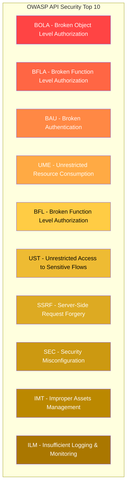

# Security Best Practices

## OWASP Top 10 (2021) for APIs



### API1: Broken Object Level Authorization (BOLA)

```typescript
// VULNERABLE: Direct ID access without ownership check
app.get('/api/orders/:id', async (req, res) => {
  const order = await db.orders.findById(req.params.id);
  res.json(order); // Any user can access any order!
});

// SECURE: Ownership verification
app.get('/api/orders/:id', authenticate, async (req, res) => {
  const order = await db.orders.findById(req.params.id);

  if (!order) {
    return res.status(404).json({
      error: { code: 'NOT_FOUND', message: 'Order not found' },
    });
  }

  // Verify ownership or admin role
  if (order.userId !== req.user.id && req.user.role !== 'admin') {
    // Log the attempt
    await auditLogger.log({
      action: 'BOLA_ATTEMPT',
      userId: req.user.id,
      resource: 'order',
      resourceId: req.params.id,
      ipAddress: req.ip,
    });

    // Return 404 (not 403) to prevent information disclosure
    return res.status(404).json({
      error: { code: 'NOT_FOUND', message: 'Order not found' },
    });
  }

  res.json(order);
});
```

### API2: Broken Function Level Authorization

```typescript
// VULNERABLE: Admin function accessible to all
app.delete('/api/admin/users/:id', async (req, res) => {
  await db.users.delete(req.params.id);
  res.json({ success: true });
});

// SECURE: Role-based function access
app.delete('/api/admin/users/:id',
  authenticate,
  requireRole('admin'),
  async (req, res) => {
    await db.users.delete(req.params.id);
    res.json({ success: true });
  }
);

// SECURE: Middleware factory for reusable checks
function requireFunctionAccess(requiredRole: string) {
  return async (req: Request, res: Response, next: NextFunction) => {
    const userRole = req.user?.role;
    const roleHierarchy = ['viewer', 'user', 'manager', 'admin', 'super_admin'];

    if (roleHierarchy.indexOf(userRole) < roleHierarchy.indexOf(requiredRole)) {
      return res.status(403).json({
        error: {
          code: 'INSUFFICIENT_ROLE',
          message: 'Function requires elevated privileges',
        },
      });
    }
    next();
  };
}
```

### API3: Broken Authentication

```typescript
// Authentication security checklist
const authSecurity = {
  // 1. Prevent credential stuffing
  loginRateLimit: {
    maxAttempts: 5,
    windowMinutes: 15,
    lockoutMinutes: 30,
  },

  // 2. Password requirements
  passwordPolicy: {
    minLength: 12,
    requireUppercase: true,
    requireLowercase: true,
    requireNumbers: true,
    requireSpecial: true,
    checkBreachedPasswords: true, // HaveIBeenPwned API
  },

  // 3. Token security
  tokenSecurity: {
    algorithm: 'RS256',
    accessTokenTTL: '15m',
    refreshTokenTTL: '7d',
    rotateRefreshTokens: true,
    revokeOnPasswordChange: true,
  },

  // 4. Session management
  sessionSecurity: {
    httpOnly: true,
    secure: true,
    sameSite: 'lax',
    maxAge: 86400000,
    regenerateOnLogin: true,
  },
};

// Account lockout implementation
class AccountLockoutService {
  private maxAttempts = 5;
  private lockoutDuration = 30 * 60 * 1000; // 30 minutes

  async recordFailedAttempt(userId: string): Promise<{
    locked: boolean;
    remainingAttempts: number;
  }> {
    const key = `login_attempts:${userId}`;
    const attempts = await redis.incr(key);
    await redis.expire(key, 900); // 15 minute window

    if (attempts >= this.maxAttempts) {
      await redis.setex(
        `lockout:${userId}`,
        this.lockoutDuration / 1000,
        'locked',
      );

      await alertService.send({
        severity: 'medium',
        message: `Account locked: ${userId}`,
        details: { attempts, lockoutExpiry: new Date(Date.now() + this.lockoutDuration) },
      });

      return { locked: true, remainingAttempts: 0 };
    }

    return {
      locked: false,
      remainingAttempts: this.maxAttempts - attempts,
    };
  }

  async isLocked(userId: string): Promise<boolean> {
    return (await redis.get(`lockout:${userId}`)) === 'locked';
  }

  async resetAttempts(userId: string): Promise<void> {
    await redis.del(`login_attempts:${userId}`);
    await redis.del(`lockout:${userId}`);
  }
}
```

### API4: Unrestricted Resource Consumption

```typescript
// Rate limiting implementation
class RateLimiter {
  // Sliding window rate limiter
  async checkRateLimit(
    identifier: string,
    limit: number,
    windowMs: number,
  ): Promise<{ allowed: boolean; remaining: number; resetAt: number }> {
    const now = Date.now();
    const windowStart = now - windowMs;

    // Remove old entries
    await redis.zremrangebyscore(`ratelimit:${identifier}`, 0, windowStart);

    // Count current requests
    const count = await redis.zcard(`ratelimit:${identifier}`);

    if (count >= limit) {
      const resetAt = await redis.zrange(
        `ratelimit:${identifier}`, 0, 0, 'WITHSCORES',
      );
      return {
        allowed: false,
        remaining: 0,
        resetAt: resetAt.length > 1
          ? parseInt(resetAt[1]) + windowMs
          : now + windowMs,
      };
    }

    // Add current request
    await redis.zadd(`ratelimit:${identifier}`, now, `${now}`);
    await redis.expire(`ratelimit:${identifier}`, windowMs / 1000);

    return {
      allowed: true,
      remaining: limit - count - 1,
      resetAt: now + windowMs,
    };
  }

  // Tiered rate limits
  getLimits(userTier: string): RateLimitConfig {
    const limits: Record<string, RateLimitConfig> = {
      anonymous: { requests: 30, windowMs: 60000 },
      free: { requests: 100, windowMs: 60000 },
      pro: { requests: 1000, windowMs: 60000 },
      enterprise: { requests: 10000, windowMs: 60000 },
    };
    return limits[userTier] || limits.anonymous;
  }
}

// Request size limiting
app.use(express.json({ limit: '1mb' }));
app.use(express.urlencoded({ extended: true, limit: '1mb' }));

// Pagination enforcement
const enforcePagination = (req: Request, res: Response, next: NextFunction) => {
  const limit = Math.min(parseInt(req.query.limit as string) || 20, 100);
  const page = Math.max(parseInt(req.query.page as string) || 1, 1);

  req.query.limit = limit.toString();
  req.query.page = page.toString();
  next();
};
```

### API7: Server-Side Request Forgery (SSRF)

```typescript
// SSRF prevention
class SSRFProtection {
  private blockedRanges = [
    '10.0.0.0/8',
    '172.16.0.0/12',
    '192.168.0.0/16',
    '127.0.0.0/8',
    '169.254.0.0/16',
    '::1/128',
    'fc00::/7',
    'fe80::/10',
  ];

  private blockedHosts = [
    'localhost',
    'metadata.google.internal',
    '169.254.169.254', // AWS metadata
    'instance-data',    // GCP metadata
  ];

  async validateUrl(url: string): Promise<{
    valid: boolean;
    reason?: string;
  }> {
    try {
      const parsed = new URL(url);

      // Block non-HTTP(S) schemes
      if (!['http:', 'https:'].includes(parsed.protocol)) {
        return { valid: false, reason: 'Invalid protocol' };
      }

      // Block internal hosts
      if (this.blockedHosts.includes(parsed.hostname)) {
        return { valid: false, reason: 'Internal host blocked' };
      }

      // Resolve DNS and check for internal IPs
      const addresses = await dns.resolve4(parsed.hostname);
      for (const addr of addresses) {
        if (this.isPrivateIP(addr)) {
          return { valid: false, reason: 'Private IP blocked' };
        }
      }

      return { valid: true };
    } catch (e) {
      return { valid: false, reason: 'Invalid URL' };
    }
  }

  private isPrivateIP(ip: string): boolean {
    return this.blockedRanges.some((range) => ipInRange(ip, range));
  }

  // Safe fetch with SSRF protection
  async safeFetch(url: string, options: RequestInit = {}): Promise<Response> {
    const validation = await this.validateUrl(url);
    if (!validation.valid) {
      throw new Error(`SSRF blocked: ${validation.reason}`);
    }

    return fetch(url, {
      ...options,
      signal: AbortSignal.timeout(10000), // 10 second timeout
    });
  }
}
```

## Security Headers

```typescript
import helmet from 'helmet';

// Comprehensive security headers
app.use(helmet({
  contentSecurityPolicy: {
    directives: {
      defaultSrc: ["'self'"],
      scriptSrc: ["'self'"],
      styleSrc: ["'self'", "'unsafe-inline'"],
      imgSrc: ["'self'", "data:", "https:"],
      connectSrc: ["'self'"],
      fontSrc: ["'self'"],
      objectSrc: ["'none'"],
      mediaSrc: ["'none'"],
      frameSrc: ["'none'"],
    },
  },
  crossOriginEmbedderPolicy: true,
  crossOriginOpenerPolicy: true,
  crossOriginResourcePolicy: { policy: "same-site" },
  dnsPrefetchControl: true,
  frameguard: { action: 'deny' },
  hidePoweredBy: true,
  hsts: {
    maxAge: 31536000,
    includeSubDomains: true,
    preload: true,
  },
  ieNoOpen: true,
  noSniff: true,
  referrerPolicy: { policy: 'strict-origin-when-cross-origin' },
  xssFilter: true,
}));

// Additional custom headers
app.use((req, res, next) => {
  res.setHeader('X-Request-ID', crypto.randomUUID());
  res.setHeader('Cache-Control', 'no-store, no-cache, must-revalidate');
  res.setHeader('Pragma', 'no-cache');
  res.setHeader('Permissions-Policy',
    'camera=(), microphone=(), geolocation=(), payment=()'
  );
  next();
});
```

## Input Validation

```typescript
import { z } from 'zod';

// Comprehensive input validation
const CreateUserSchema = z.object({
  email: z.string().email().max(255).toLowerCase(),
  name: z.string().min(1).max(255).trim(),
  password: z
    .string()
    .min(12)
    .max(128)
    .regex(/[A-Z]/, 'Must contain uppercase')
    .regex(/[a-z]/, 'Must contain lowercase')
    .regex(/[0-9]/, 'Must contain number')
    .regex(/[^A-Za-z0-9]/, 'Must contain special character'),
  role: z.enum(['user', 'viewer']).default('user'),
});

// Validation middleware
function validateBody(schema: z.ZodSchema) {
  return (req: Request, res: Response, next: NextFunction) => {
    const result = schema.safeParse(req.body);

    if (!result.success) {
      const errors = result.error.errors.map((e) => ({
        field: e.path.join('.'),
        message: e.message,
      }));

      return res.status(400).json({
        error: {
          code: 'VALIDATION_ERROR',
          message: 'Request validation failed',
          details: errors,
        },
      });
    }

    req.body = result.data; // Use sanitized/validated data
    next();
  };
}

// SQL injection prevention
// ALWAYS use parameterized queries
// BAD: `SELECT * FROM users WHERE id = '${userId}'`
// GOOD: db.query('SELECT * FROM users WHERE id = $1', [userId])

// NoSQL injection prevention
// BAD: db.users.find({ email: req.body.email })
// GOOD: Use schema validation before queries
// GOOD: Use MongoDB's $where avoidance
```

## Secrets Management

```typescript
// Secrets management with rotation
class SecretsManager {
  private secretsCache: Map<string, { value: string; expiresAt: number }> = new Map();

  async getSecret(name: string): Promise<string> {
    // Check cache
    const cached = this.secretsCache.get(name);
    if (cached && cached.expiresAt > Date.now()) {
      return cached.value;
    }

    // Fetch from secrets manager (Vault, AWS SM, etc.)
    const secret = await this.fetchFromProvider(name);

    // Cache with 5-minute expiry
    this.secretsCache.set(name, {
      value: secret,
      expiresAt: Date.now() + 5 * 60 * 1000,
    });

    return secret;
  }

  async rotateSecret(name: string): Promise<string> {
    // Generate new secret
    const newSecret = crypto.randomBytes(32).toString('hex');

    // Update in provider
    await this.updateInProvider(name, newSecret);

    // Clear cache
    this.secretsCache.delete(name);

    // Log rotation
    await auditLogger.log({
      action: 'SECRET_ROTATED',
      resource: name,
      timestamp: new Date(),
    });

    return newSecret;
  }

  private async fetchFromProvider(name: string): Promise<string> {
    // Implementation depends on provider
    // AWS Secrets Manager, HashiCorp Vault, etc.
    const provider = process.env.SECRETS_PROVIDER;

    switch (provider) {
      case 'vault':
        return this.fetchFromVault(name);
      case 'aws':
        return this.fetchFromAWS(name);
      default:
        throw new Error(`Unknown secrets provider: ${provider}`);
    }
  }
}
```

## Security Checklist

### Pre-Deployment Security Checklist

```yaml
authentication:
  - [ ] Password hashing uses Argon2id/bcrypt
  - [ ] JWT tokens have short expiry (15 min access)
  - [ ] Refresh tokens are rotated on use
  - [ ] Account lockout after failed attempts
  - [ ] MFA available for all admin accounts
  - [ ] API keys are hashed before storage

authorization:
  - [ ] RBAC implemented for all endpoints
  - [ ] Resource ownership verified
  - [ ] Admin functions require admin role
  - [ ] CORS configured correctly
  - [ ] No default credentials in code

input_validation:
  - [ ] All inputs validated with schema
  - [ ] SQL injection prevented (parameterized queries)
  - [ ] XSS prevented (output encoding)
  - [ ] File upload validated (type, size)
  - [ ] Request size limits configured

secrets:
  - [ ] No hardcoded credentials
  - [ ] Environment variables for configuration
  - [ ] Secrets rotation plan documented
  - [ ] .gitignore includes .env files

infrastructure:
  - [ ] HTTPS enforced (HSTS)
  - [ ] Security headers configured
  - [ ] Rate limiting implemented
  - [ ] Request logging enabled
  - [ ] Error responses don't leak info

dependencies:
  - [ ] Dependencies audited for vulnerabilities
  - [ ] Automated security scanning in CI
  - [ ] Lock file committed
  - [ ] Regular update schedule
```

## Vulnerability Scanning

```yaml
# .github/workflows/security.yml
security_scan:
  runs-on: ubuntu-latest
  steps:
    - uses: actions/checkout@v4

    - name: Run Trivy vulnerability scanner
      uses: aquasecurity/trivy-action@master
      with:
        scan-type: 'fs'
        scan-ref: '.'
        format: 'sarif'
        output: 'trivy-results.sarif'
        severity: 'CRITICAL,HIGH'

    - name: Run Snyk security scan
      uses: snyk/actions/node@master
      env:
        SNYK_TOKEN: ${{ secrets.SNYK_TOKEN }}
      with:
        args: --severity-threshold=high

    - name: Run OWASP dependency check
      uses: dependency-check/Dependency-Check_Action@main
      with:
        path: '.'
        format: 'HTML'

    - name: Secret scanning
      uses: trufflesecurity/trufflehog@main
      with:
        extra_args: --only-verified
```

## Threat Model Template

```yaml
threat_model:
  system: "[PROJECT_NAME] Backend API"
  scope: "API endpoints, database, authentication"

  assets:
    - user_data: "PII, credentials"
    - business_data: "Orders, payments"
    - system_data: "Configuration, secrets"

  trust_boundaries:
    - internet: "External clients"
    - dmz: "API Gateway"
    - internal: "Application servers"
    - data: "Database layer"

  threats:
    - id: T001
      name: "Credential stuffing"
      asset: user_data
      boundary: internet
      mitigations:
        - rate_limiting
        - account_lockout
        - captcha

    - id: T002
      name: "SQL injection"
      asset: business_data
      boundary: dmz
      mitigations:
        - parameterized_queries
        - input_validation
        - waf

    - id: T003
      name: "Privilege escalation"
      asset: system_data
      boundary: internal
      mitigations:
        - rbac
        - resource_ownership
        - audit_logging

  last_updated: "2024-01-01"
  review_cycle: "quarterly"
```
