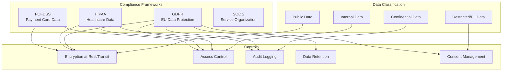
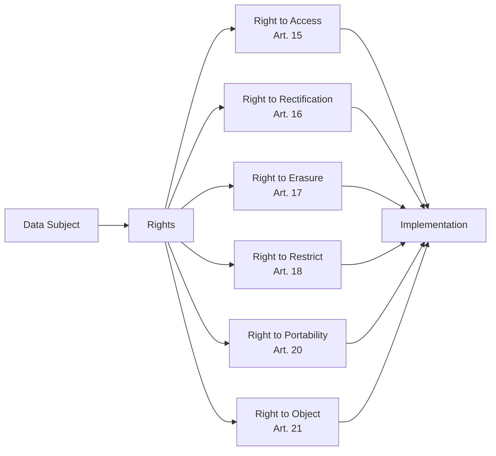
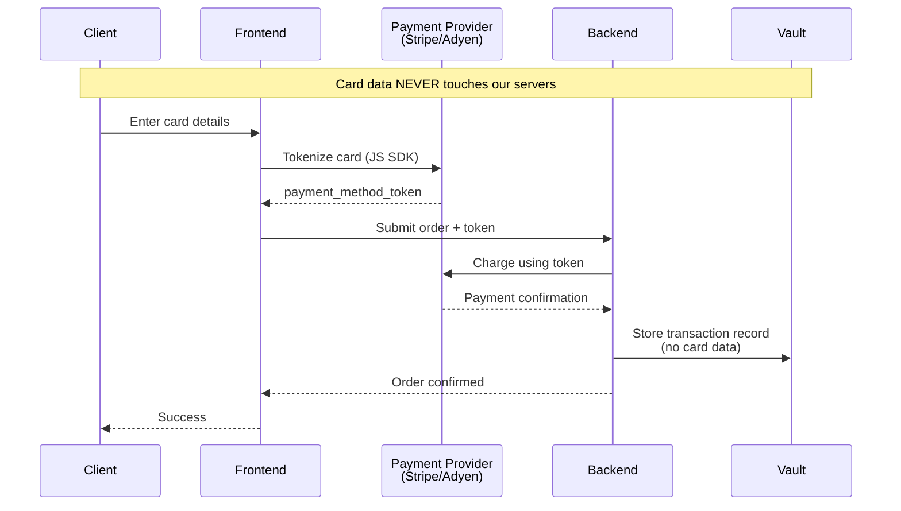
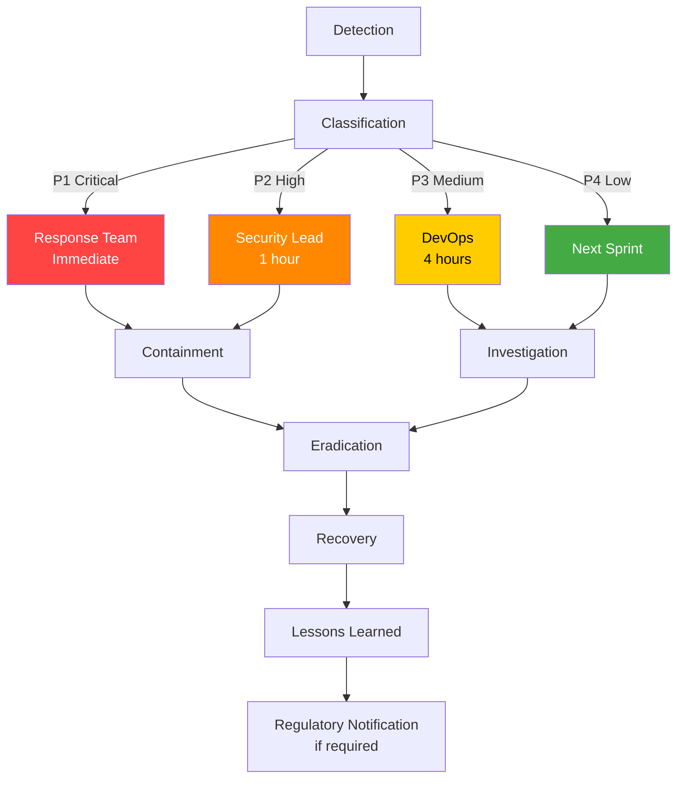

# Compliance & Regulatory Requirements

## Compliance Architecture



## GDPR Compliance

### Data Subject Rights



### GDPR Implementation

```typescript
// GDPR Data Subject Request Handler
class GDPRService {
  // Right to Access (Article 15)
  async handleAccessRequest(userId: string): Promise<DataExport> {
    // Collect all personal data
    const userData = await this.collectAllUserData(userId);

    return {
      personalData: {
        profile: userData.profile,
        orders: userData.orders,
        logs: userData.accessLogs,
        preferences: userData.preferences,
        consent: userData.consents,
      },
      processingActivities: [
        'Account management',
        'Order processing',
        'Marketing communications',
        'Analytics and profiling',
      ],
      dataRecipients: [
        'Payment processor (Stripe)',
        'Email service (SendGrid)',
        'Analytics (Google Analytics)',
      ],
      retentionPeriods: {
        profile: 'Until account deletion + 30 days',
        orders: '7 years (legal requirement)',
        logs: '90 days',
        marketing: 'Until consent withdrawn',
      },
      exportFormat: 'JSON',
      generatedAt: new Date().toISOString(),
    };
  }

  // Right to Erasure (Article 17)
  async handleErasureRequest(userId: string): Promise<{
    deleted: string[];
    retained: string[];
    reason: string;
  }> {
    const deleted: string[] = [];
    const retained: string[] = [];

    // Check for legal obligations to retain
    const hasActiveOrders = await this.hasActiveOrders(userId);
    const hasLegalHold = await this.hasLegalHold(userId);

    if (hasActiveOrders || hasLegalHold) {
      // Anonymize instead of delete
      await this.anonymizeUserData(userId);
      retained.push('Order history (legal obligation)');
    } else {
      // Full deletion
      await this.deleteAllUserData(userId);
      deleted.push('Profile data');
      deleted.push('Order history');
      deleted.push('Activity logs');
      deleted.push('Marketing preferences');
    }

    // Always log the erasure request
    await this.logErasureRequest(userId, deleted, retained);

    return {
      deleted,
      retained,
      reason: hasActiveOrders
        ? 'Active orders require data retention'
        : hasLegalHold
        ? 'Legal hold in place'
        : 'Full erasure completed',
    };
  }

  // Right to Data Portability (Article 20)
  async handlePortabilityRequest(userId: string): Promise<{
    format: string;
    data: any;
    metadata: Record<string, any>;
  }> {
    const data = await this.collectStructuredData(userId);

    return {
      format: 'application/json',
      data,
      metadata: {
        exportedAt: new Date().toISOString(),
        dataController: '[ORG_NAME]',
        processingBasis: 'consent',
        version: '1.0',
      },
    };
  }

  // Consent Management
  async recordConsent(
    userId: string,
    consentType: string,
    granted: boolean,
    source: string,
  ): Promise<void> {
    await db.consents.create({
      userId,
      type: consentType,
      granted,
      source,
      timestamp: new Date(),
      version: '1.0',
      ipAddress: source === 'api' ? 'internal' : undefined,
    });
  }

  async getConsentStatus(userId: string): Promise<ConsentStatus> {
    const consents = await db.consents.findMany({
      where: { userId },
      orderBy: { timestamp: 'desc' },
    });

    return {
      analytics: this.getLatestConsent(consents, 'analytics'),
      marketing: this.getLatestConsent(consents, 'marketing'),
      thirdParty: this.getLatestConsent(consents, 'third_party'),
      profiling: this.getLatestConsent(consents, 'profiling'),
    };
  }

  private async collectAllUserData(userId: string) {
    return {
      profile: await db.users.findById(userId),
      orders: await db.orders.findByUser(userId),
      accessLogs: await db.accessLogs.findByUser(userId),
      preferences: await db.preferences.findByUser(userId),
      consents: await db.consents.findByUser(userId),
    };
  }

  private async deleteAllUserData(userId: string): Promise<void> {
    // Use transactions for atomicity
    await db.transaction(async (tx) => {
      await tx.consents.deleteMany({ where: { userId } });
      await tx.preferences.deleteMany({ where: { userId } });
      await tx.accessLogs.deleteMany({ where: { userId } });
      await tx.orders.deleteMany({ where: { userId } });
      await tx.users.delete({ where: { id: userId } });
    });
  }
}
```

### Data Processing Agreement Template

```yaml
data_processing_agreement:
  parties:
    controller: "[ORG_NAME]"
    processor: "[SERVICE_PROVIDER]"
  
  scope:
    purpose: "Providing backend API services"
    duration: "Duration of service agreement"
  
  data_categories:
    - Personal identifiers (name, email)
    - Usage data (API calls, logs)
    - Technical data (IP address, user agent)
  
  security_measures:
    - Encryption at rest (AES-256)
    - Encryption in transit (TLS 1.3)
    - Access control (RBAC)
    - Audit logging
    - Regular security assessments
  
  sub_processors:
    - name: "Cloud Provider"
      purpose: "Infrastructure hosting"
      location: "EU/US"
    - name: "CDN Provider"
      purpose: "Content delivery"
      location: "Global"
```

## HIPAA Compliance

### PHI Protection

```typescript
// Protected Health Information (PHI) handling
class HIPAAService {
  private readonly PHI_FIELDS = [
    'name', 'address', 'date_of_birth',
    'phone', 'email', 'ssn', 'medical_record_number',
    'health_plan_beneficiary_number', 'diagnosis',
    'treatment_records', 'prescription_information',
  ];

  // Encrypt PHI at rest
  async encryptPHI(data: Record<string, any>): Promise<EncryptedPHI> {
    const encrypted: Record<string, string> = {};
    const plaintext: Record<string, any> = {};

    for (const [key, value] of Object.entries(data)) {
      if (this.PHI_FIELDS.includes(key)) {
        encrypted[key] = await encryption.encrypt(JSON.stringify(value));
      } else {
        plaintext[key] = value;
      }
    }

    return {
      encrypted,
      plaintext,
      encryptedAt: new Date().toISOString(),
      encryptionVersion: '2.0',
    };
  }

  // De-identify data for analytics (Safe Harbor method)
  async deidentifyPHI(data: Record<string, any>): Promise<Record<string, any>> {
    const deidentified = { ...data };

    // Remove all 18 HIPAA identifiers
    const identifiers = [
      'name', 'address', 'dates', 'phone', 'fax', 'email',
      'ssn', 'mrn', 'health_plan', 'account', 'certificate',
      'vehicle', 'device', 'urls', 'ip_address', 'biometric',
      'photo', 'any_unique_number',
    ];

    for (const id of identifiers) {
      if (deidentified[id]) {
        delete deidentified[id];
      }
    }

    // Generalize dates (keep year only)
    if (deidentified.date_of_birth) {
      deidentified.birth_year = new Date(deidentified.date_of_birth).getFullYear();
      delete deidentified.date_of_birth;
    }

    return deidentified;
  }

  // Access logging for PHI
  async logPHIAccess(
    userId: string,
    patientId: string,
    action: string,
    fields: string[],
  ): Promise<void> {
    await db.phiAccessLogs.create({
      id: crypto.randomUUID(),
      userId,
      patientId,
      action,
      fieldsAccessed: fields,
      timestamp: new Date(),
      ipAddress: 'logged_separately',
      reason: 'treatment', // or 'payment', 'operations'
    });
  }

  // Minimum necessary principle
  async getMinimumNecessary(
    userId: string,
    purpose: string,
  ): Promise<string[]> {
    const accessMatrix: Record<string, string[]> = {
      treatment: [
        'name', 'dob', 'medical_record_number',
        'diagnosis', 'treatment_records',
      ],
      payment: [
        'name', 'dob', 'insurance_info',
        'billing_codes',
      ],
      operations: [
        'name', 'department', 'status',
      ],
      research: [], // De-identified only
    };

    return accessMatrix[purpose] || [];
  }
}
```

### HIPAA Technical Safeguards

```typescript
// HIPAA required technical safeguards
const hipaaSafeguards = {
  accessControl: {
    uniqueUserIdentification: true,
    emergencyAccessProcedure: true,
    automaticLogoff: true, // 15 minutes
    encryption: true,
  },
  auditControls: {
    hardware: true,
    software: true,
    procedural: true,
    recordAndReview: true,
  },
  integrityControls: {
    authentication: true,
    electronicVerification: true,
  },
  transmissionSecurity: {
    integrity: true, // TLS 1.2+
    encryption: true,
  },
};
```

## PCI-DSS Compliance

### Payment Data Flow



### PCI-DSS Implementation

```typescript
// PCI-DSS compliant payment handling
class PCISService {
  // NEVER store card numbers, CVVs, or magnetic stripe data
  // Use tokenization via payment provider

  async processPayment(
    order: Order,
    paymentMethodToken: string,
  ): Promise<PaymentResult> {
    // Token received from frontend (never raw card data)
    const charge = await paymentProvider.charge({
      amount: order.total,
      currency: 'usd',
      payment_method: paymentMethodToken,
      idempotency_key: order.id,
      metadata: {
        order_id: order.id,
        customer_id: order.userId,
      },
    });

    // Store ONLY non-sensitive transaction data
    await db.payments.create({
      id: crypto.randomUUID(),
      orderId: order.id,
      providerId: charge.id,
      amount: charge.amount,
      currency: charge.currency,
      status: charge.status,
      // NEVER store: card number, CVV, magnetic stripe
      last4: charge.card.last4,  // OK to store
      brand: charge.card.brand,   // OK to store
      expMonth: charge.card.exp_month, // OK to store
      expYear: charge.card.exp_year,   // OK to store
    });

    return {
      success: charge.status === 'succeeded',
      transactionId: charge.id,
    };
  }

  // Webhook handler for payment events
  async handleWebhook(event: PaymentWebhookEvent): Promise<void> {
    // Verify webhook signature
    const isValid = this.verifyWebhookSignature(event);
    if (!isValid) {
      throw new Error('Invalid webhook signature');
    }

    switch (event.type) {
      case 'payment.succeeded':
        await this.handlePaymentSuccess(event.data);
        break;
      case 'payment.failed':
        await this.handlePaymentFailure(event.data);
        break;
      case 'refund.created':
        await this.handleRefund(event.data);
        break;
    }
  }
}
```

### PCI-DSS Requirements Checklist

| Requirement | Status | Implementation |
|-------------|--------|----------------|
| Install and maintain network security controls | Required | Firewall, IDS/IPS |
| Apply secure configurations | Required | CIS benchmarks |
| Protect stored account data | Required | Tokenization only |
| Encrypt transmission of cardholder data | Required | TLS 1.2+ |
| Protect against malicious software | Required | AV, WAF |
| Develop secure systems | Required | Secure SDLC |
| Restrict access by need-to-know | Required | RBAC |
| Identify users and authenticate access | Required | MFA |
| Restrict physical access | Required | Data center controls |
| Log and monitor all access | Required | SIEM |
| Test security regularly | Required | Penetration testing |
| Maintain information security policy | Required | Security program |

## SOC 2 Compliance

```yaml
soc2_controls:
  security:
    - access_controls: "RBAC with MFA"
    - change_management: "PR review + CI/CD gates"
    - data_protection: "Encryption at rest and in transit"
    - incident_response: "Documented IR plan"
    - vulnerability_management: "Regular scans + patching"

  availability:
    - monitoring: "24/7 monitoring with alerts"
    - backup_recovery: "Daily backups, tested quarterly"
    - disaster_recovery: "RPO: 1 hour, RTO: 4 hours"
    - capacity_planning: "Auto-scaling + load testing"

  processing_integrity:
    - input_validation: "Schema validation on all inputs"
    - error_handling: "Centralized error handling"
    - monitoring: "Transaction monitoring"
    - testing: "Automated test suite"

  confidentiality:
    - data_classification: "4-tier classification"
    - access_restrictions: "Role-based access"
    - encryption: "AES-256 + TLS 1.3"
    - disposal: "Secure data deletion"

  privacy:
    - consent_management: "GDPR consent tracking"
    - data_minimization: "Collect only necessary"
    - retention_policies: "Automated data lifecycle"
    - cross_border: "Data transfer agreements"
```

## Data Retention Policies

```yaml
retention_policies:
  user_profiles:
    retention: "Until deletion request + 30 days"
    legal_basis: "Contract performance"
    deletion_method: "Secure erasure"

  order_history:
    retention: "7 years"
    legal_basis: "Tax/accounting requirements"
    deletion_method: "Automated purge after period"

  access_logs:
    retention: "90 days"
    legal_basis: "Security monitoring"
    deletion_method: "Automated rotation"

  audit_logs:
    retention: "1 year"
    legal_basis: "Compliance requirement"
    deletion_method: "Archive then delete"

  marketing_data:
    retention: "Until consent withdrawal"
    legal_basis: "Consent"
    deletion_method: "Immediate on withdrawal"

  payment_records:
    retention: "7 years"
    legal_basis: "Financial regulations"
    deletion_method: "Automated purge"
```

## Encryption Standards

```yaml
encryption:
  at_rest:
    algorithm: "AES-256-GCM"
    key_management: "AWS KMS / HashiCorp Vault"
    key_rotation: "90 days"
    scope: "All PII and PHI fields"

  in_transit:
    tls_version: "1.3 (minimum 1.2)"
    cipher_suites:
      - "TLS_AES_256_GCM_SHA384"
      - "TLS_CHACHA20_POLY1305_SHA256"
      - "TLS_AES_128_GCM_SHA256"
    certificate_pinning: true
    hsts: "max-age=31536000; includeSubDomains"

  application_level:
    password_hashing:
      algorithm: "Argon2id"
      memory_cost: "64MB"
      time_cost: 3
      parallelism: 4
    token_signing:
      algorithm: "RS256"
      key_size: 2048
    field_encryption:
      algorithm: "AES-256-GCM"
      per_field_key: true
```

## Incident Response Plan


