# Detailed Component Architecture

## Component Hierarchy

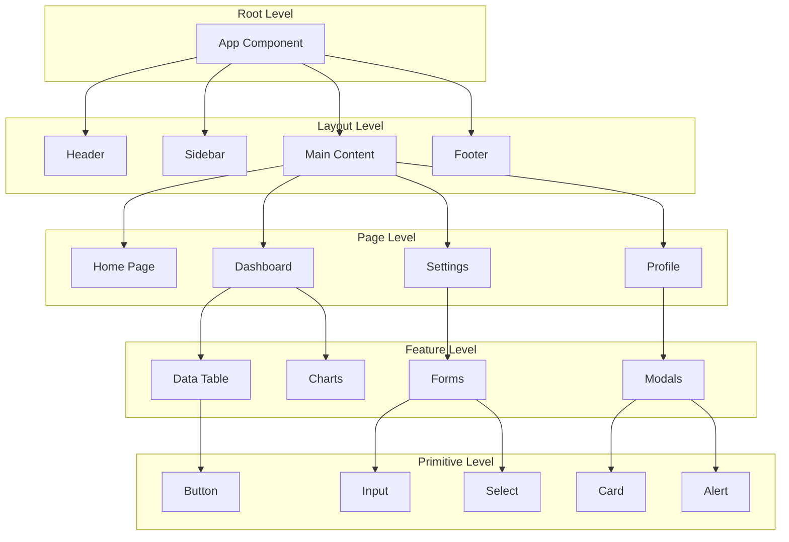

## Component Composition Pattern

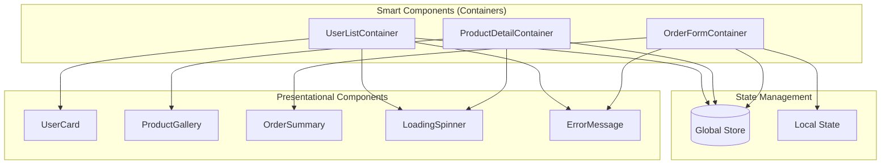

## React Component Example

```tsx
// Container Component
import { useSelector, useDispatch } from 'react-redux';
import { UserCard } from './UserCard';
import { LoadingSpinner } from './LoadingSpinner';
import { ErrorMessage } from './ErrorMessage';
import { fetchUsers } from '../store/userSlice';
import type { RootState, AppDispatch } from '../store';

interface UserListContainerProps {
  role?: 'admin' | 'user';
  limit?: number;
}

export function UserListContainer({ role, limit = 10 }: UserListContainerProps) {
  const dispatch = useDispatch<AppDispatch>();
  const { users, loading, error } = useSelector(
    (state: RootState) => state.users
  );

  useEffect(() => {
    dispatch(fetchUsers({ role, limit }));
  }, [dispatch, role, limit]);

  if (loading) return <LoadingSpinner />;
  if (error) return <ErrorMessage message={error} />;

  return (
    <div className="user-list">
      {users.map(user => (
        <UserCard
          key={user.id}
          user={user}
          onSelect={(id) => navigate(`/users/${id}`)}
        />
      ))}
    </div>
  );
}
```

## Vue Component Example

```vue
<template>
  <div class="user-list">
    <LoadingSpinner v-if="loading" />
    <ErrorMessage v-else-if="error" :message="error" />
    <UserCard
      v-for="user in users"
      :key="user.id"
      :user="user"
      @select="handleSelect"
    />
  </div>
</template>

<script setup lang="ts">
import { computed, onMounted } from 'vue';
import { useStore } from 'vuex';
import { useRouter } from 'vue-router';
import type { User } from '@/types';

interface Props {
  role?: 'admin' | 'user';
  limit?: number;
}

const props = withDefaults(defineProps<Props>(), {
  role: undefined,
  limit: 10
});

const store = useStore();
const router = useRouter();

const users = computed(() => store.state.users.list);
const loading = computed(() => store.state.users.loading);
const error = computed(() => store.state.users.error);

onMounted(() => {
  store.dispatch('users/fetchUsers', {
    role: props.role,
    limit: props.limit
  });
});

const handleSelect = (id: string) => {
  router.push(`/users/${id}`);
};
</script>
```

## Data Flow Diagram

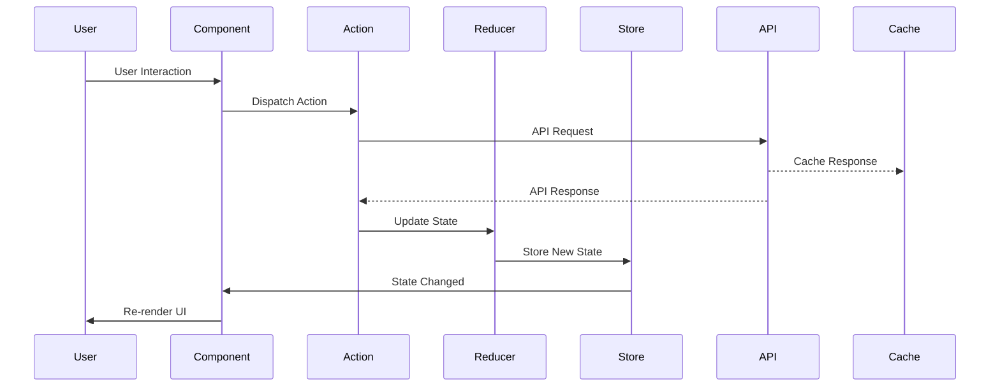

## Component Communication Patterns

### Parent to Child (Props)

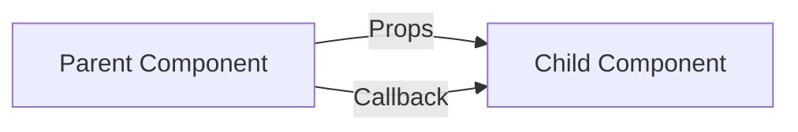

### Child to Parent (Events)

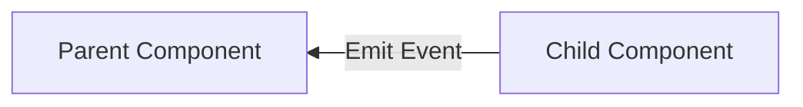

### Sibling Communication (Shared State)

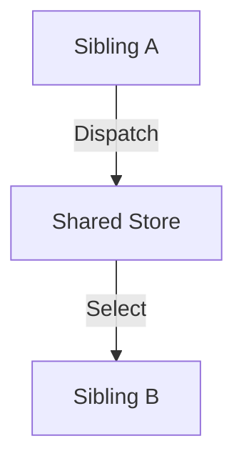

### Cross-Component Communication (Context/Provide-Inject)

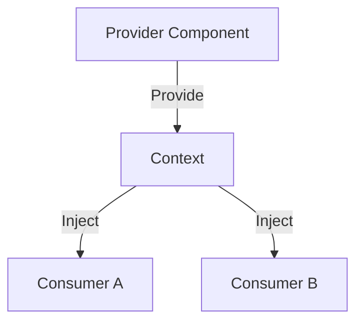

## Atomic Design Pattern

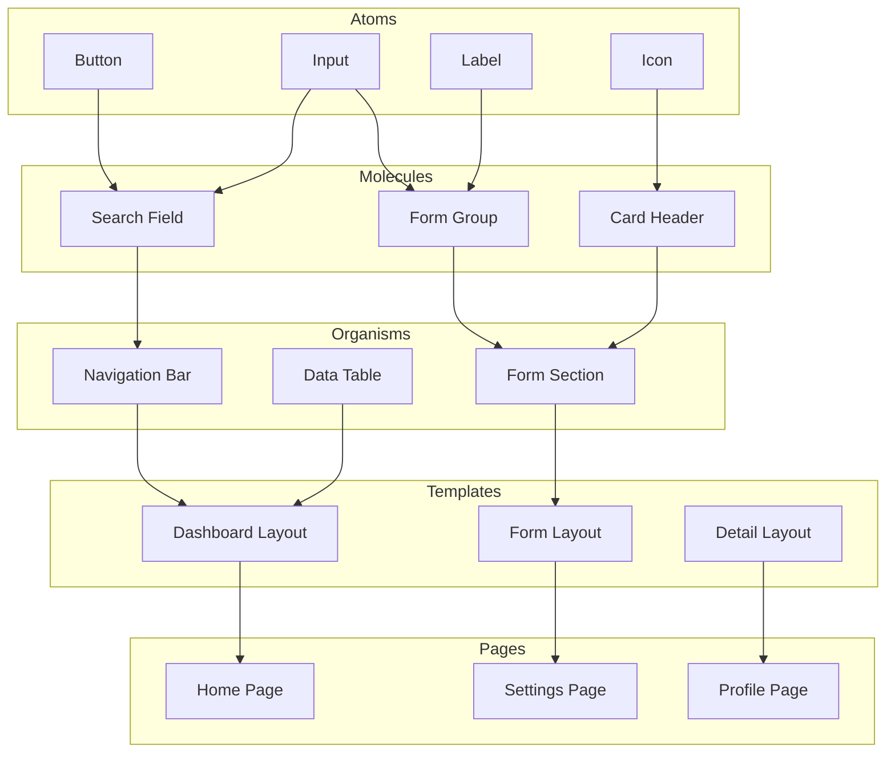

## Lazy Loading Implementation

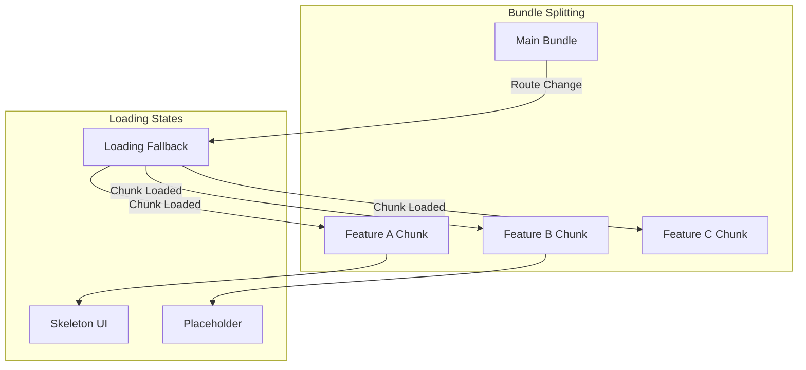

## Error Boundary Pattern

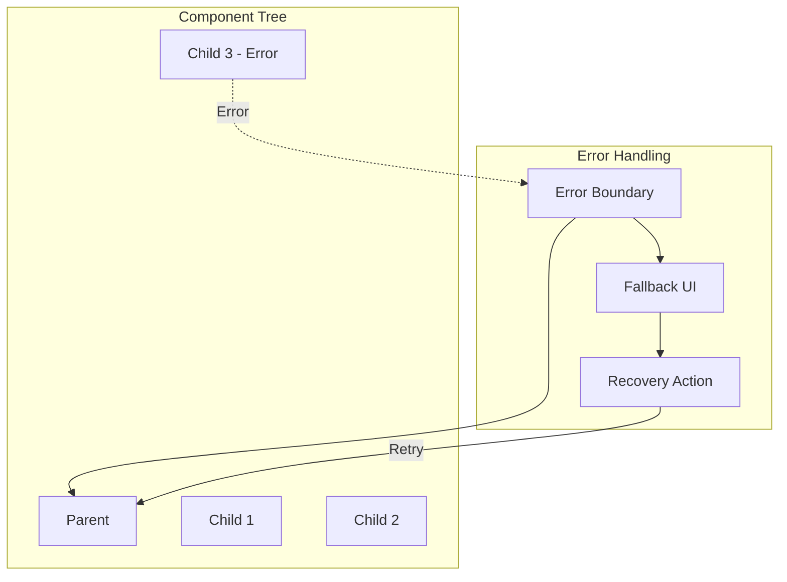

## Performance Optimization Map

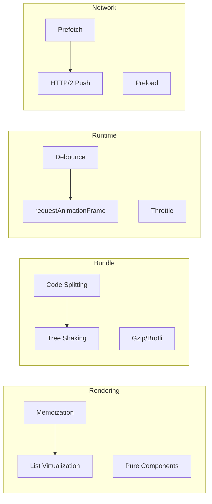

## Component Testing Strategy

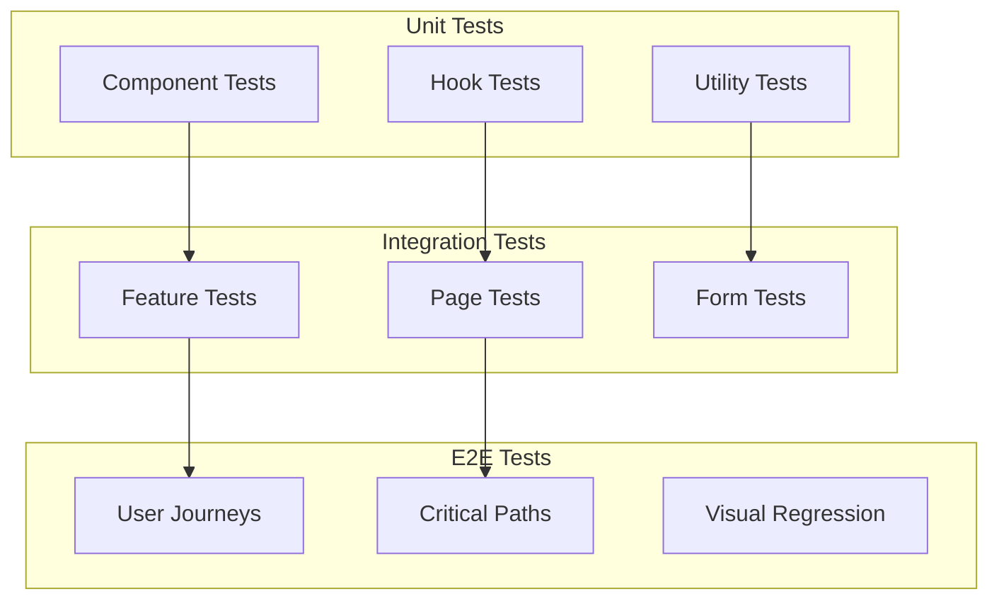
