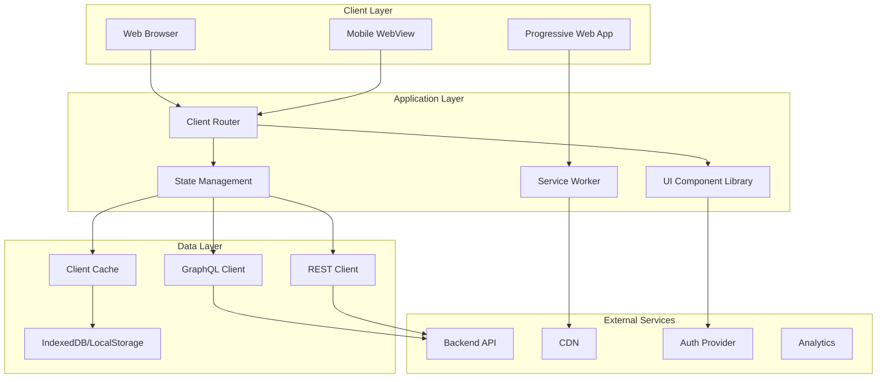
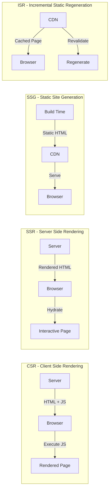
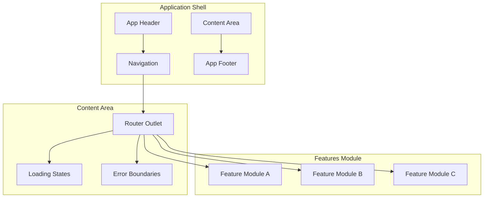
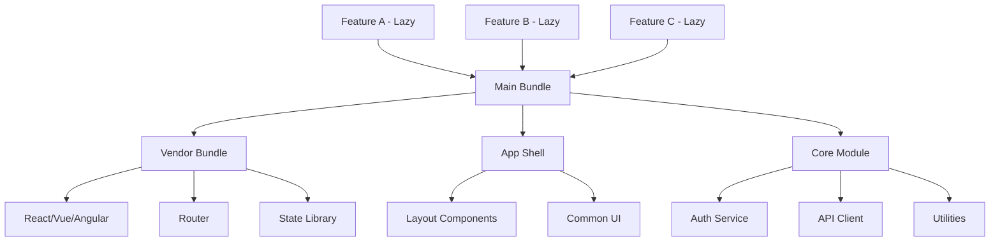
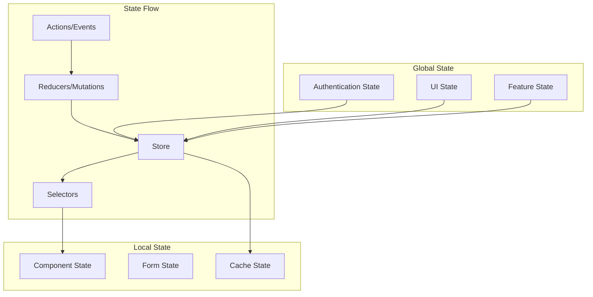
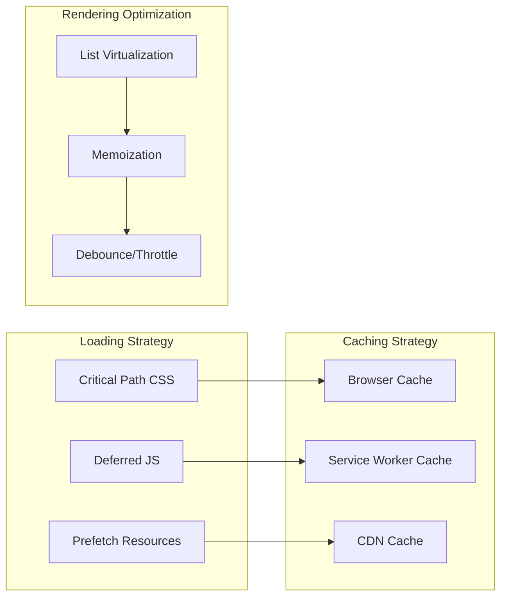
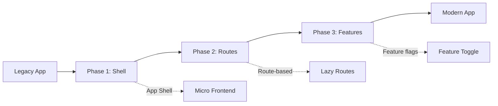

# High-Level Frontend Architecture

## Architecture Overview

## Layer Responsibilities

### Presentation Layer
- Renders UI components based on state
- Handles user interactions and events
- Manages component lifecycle
- Implements responsive layouts

### Application Layer
- Routes navigation between views
- Manages global application state
- Coordinates component communication
- Handles side effects (API calls, timers)

### Data Layer
- Caches responses for performance
- Manages offline data synchronization
- Handles data transformation and normalization
- Implements optimistic updates

## Rendering Strategies

## Application Shell Architecture

## Code Splitting Strategy

## State Management Architecture

## Performance Architecture

## Technology Stack Matrix

| Layer | React | Vue | Angular | Svelte |
|-------|-------|-----|---------|--------|
| Routing | React Router | Vue Router | Angular Router | SvelteKit |
| State | Redux/Zustand | Pinia | NgRx/NgXS | Svelte Store |
| HTTP | Axios/Fetch | Axios/Fetch | HttpClient | Fetch API |
| Forms | React Hook Form | VeeValidate | Reactive Forms | Superforms |
| Styling | Tailwind/CSS Modules | Tailwind/Sass | SCSS/Material | Tailwind |
| Testing | Jest/RTL | Vitest/Test Utils | Jest/Karma | Vitest |

## Decision Points

### When to Use SSR
- SEO-critical pages
- First paint performance requirements
- Social media sharing (meta tags)
- Initial data requirements on page load

### When to Use CSR
- Dashboard/admin applications
- Authenticated-only pages
- Highly interactive applications
- Real-time data updates

### When to Use SSG
- Marketing pages
- Blog/documentation sites
- Pages with infrequent updates
- Maximum performance requirements

## Migration Patterns

