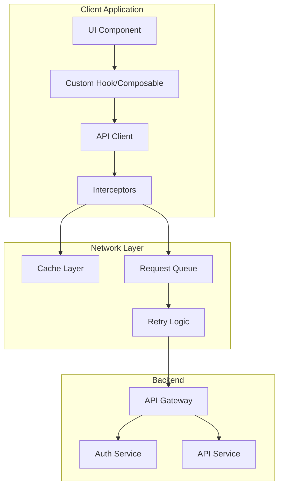
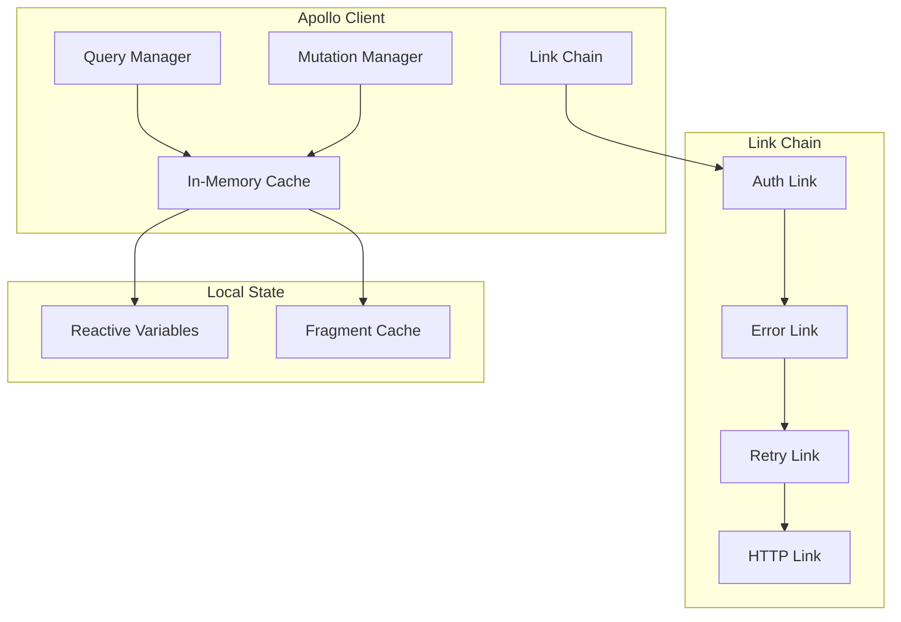
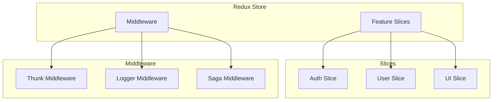
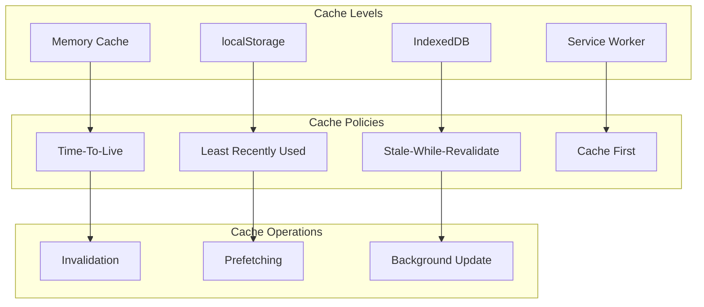
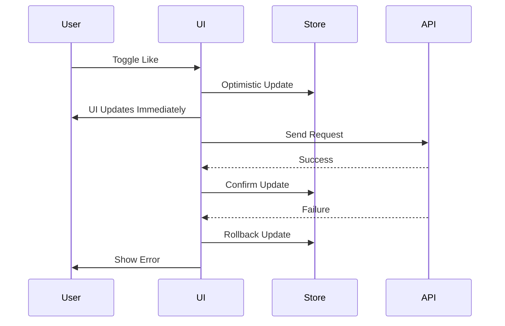
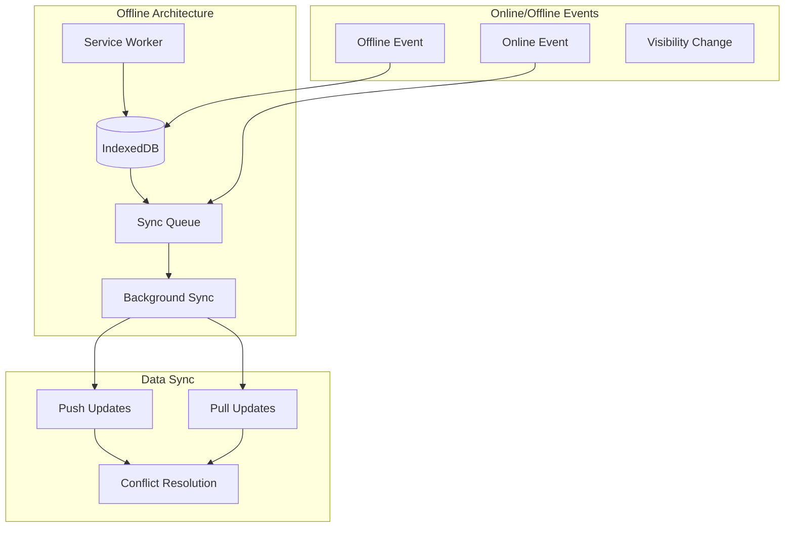

# API Integration & State Management

## API Integration Architecture



## REST API Client Setup

### React/TypeScript Example

```typescript
// src/api/client.ts
import axios, { AxiosInstance, AxiosError, InternalAxiosRequestConfig } from 'axios';
import { store } from '../store';
import { refreshToken, logout } from '../store/authSlice';
import type { ApiResponse, ApiError } from '../types/api';

class ApiClient {
  private instance: AxiosInstance;
  private isRefreshing = false;
  private failedQueue: Array<{
    resolve: (value: unknown) => void;
    reject: (reason?: unknown) => void;
  }> = [];

  constructor() {
    this.instance = axios.create({
      baseURL: import.meta.env.VITE_API_BASE_URL || '/api',
      timeout: 15000,
      headers: {
        'Content-Type': 'application/json',
      },
    });

    this.setupInterceptors();
  }

  private setupInterceptors() {
    // Request interceptor
    this.instance.interceptors.request.use(
      (config: InternalAxiosRequestConfig) => {
        const token = store.getState().auth.accessToken;
        if (token) {
          config.headers.Authorization = `Bearer ${token}`;
        }
        return config;
      },
      (error) => Promise.reject(error)
    );

    // Response interceptor
    this.instance.interceptors.response.use(
      (response) => response,
      async (error: AxiosError<ApiError>) => {
        const originalRequest = error.config;

        if (error.response?.status === 401 && !originalRequest._retry) {
          if (this.isRefreshing) {
            return new Promise((resolve, reject) => {
              this.failedQueue.push({ resolve, reject });
            }).then((token) => {
              originalRequest.headers.Authorization = `Bearer ${token}`;
              return this.instance(originalRequest);
            });
          }

          originalRequest._retry = true;
          this.isRefreshing = true;

          try {
            const refreshTokenValue = store.getState().auth.refreshToken;
            const newToken = await store.dispatch(refreshToken(refreshTokenValue));

            this.failedQueue.forEach(({ resolve }) => resolve(newToken));
            this.failedQueue = [];

            originalRequest.headers.Authorization = `Bearer ${newToken}`;
            return this.instance(originalRequest);
          } catch (refreshError) {
            this.failedQueue.forEach(({ reject }) => reject(refreshError));
            this.failedQueue = [];
            store.dispatch(logout());
            return Promise.reject(refreshError);
          } finally {
            this.isRefreshing = false;
          }
        }

        return Promise.reject(error);
      }
    );
  }

  async get<T>(url: string, params?: Record<string, unknown>): Promise<T> {
    const response = await this.instance.get<ApiResponse<T>>(url, { params });
    return response.data.data;
  }

  async post<T>(url: string, data?: unknown): Promise<T> {
    const response = await this.instance.post<ApiResponse<T>>(url, data);
    return response.data.data;
  }

  async put<T>(url: string, data?: unknown): Promise<T> {
    const response = await this.instance.put<ApiResponse<T>>(url, data);
    return response.data.data;
  }

  async delete<T>(url: string): Promise<T> {
    const response = await this.instance.delete<ApiResponse<T>>(url);
    return response.data.data;
  }
}

export const apiClient = new ApiClient();
```

### Vue/TypeScript Example

```typescript
// src/api/client.ts
import axios, { AxiosInstance, AxiosError } from 'axios';
import { useAuthStore } from '@/stores/auth';
import type { ApiResponse, ApiError } from '@/types/api';

class ApiClient {
  private instance: AxiosInstance;

  constructor() {
    this.instance = axios.create({
      baseURL: import.meta.env.VITE_API_BASE_URL || '/api',
      timeout: 15000,
      headers: {
        'Content-Type': 'application/json',
      },
    });

    this.setupInterceptors();
  }

  private setupInterceptors() {
    this.instance.interceptors.request.use((config) => {
      const authStore = useAuthStore();
      if (authStore.accessToken) {
        config.headers.Authorization = `Bearer ${authStore.accessToken}`;
      }
      return config;
    });

    this.instance.interceptors.response.use(
      (response) => response,
      async (error: AxiosError<ApiError>) => {
        if (error.response?.status === 401) {
          const authStore = useAuthStore();
          try {
            await authStore.refreshAccessToken();
            return this.instance(error.config!);
          } catch {
            authStore.logout();
            return Promise.reject(error);
          }
        }
        return Promise.reject(error);
      }
    );
  }

  async get<T>(url: string, params?: Record<string, unknown>): Promise<T> {
    const response = await this.instance.get<ApiResponse<T>>(url, { params });
    return response.data.data;
  }

  async post<T>(url: string, data?: unknown): Promise<T> {
    const response = await this.instance.post<ApiResponse<T>>(url, data);
    return response.data.data;
  }

  async put<T>(url: string, data?: unknown): Promise<T> {
    const response = await this.instance.put<ApiResponse<T>>(url, data);
    return response.data.data;
  }

  async delete<T>(url: string): Promise<T> {
    const response = await this.instance.delete<ApiResponse<T>>(url);
    return response.data.data;
  }
}

export const apiClient = new ApiClient();
```

## GraphQL Integration



### GraphQL Client Setup

```typescript
// src/graphql/client.ts
import {
  ApolloClient,
  InMemoryCache,
  createHttpLink,
  from,
} from '@apollo/client';
import { setContext } from '@context/link/auth';
import { onError } from '@context/link/error';
import { RetryLink } from '@context/link/retry';
import { store } from '../store';

const httpLink = createHttpLink({
  uri: import.meta.env.VITE_GRAPHQL_URL || '/graphql',
});

const authLink = setContext((_, { headers }) => {
  const token = store.getState().auth.accessToken;
  return {
    headers: {
      ...headers,
      authorization: token ? `Bearer ${token}` : '',
    },
  };
});

const errorLink = onError(({ graphQLErrors, networkError }) => {
  if (graphQLErrors) {
    graphQLErrors.forEach(({ message, locations, path }) => {
      console.error(`[GraphQL error]: ${message}`);
    });
  }
  if (networkError) {
    console.error(`[Network error]: ${networkError}`);
  }
});

const retryLink = new RetryLink({
  delay: {
    initial: 300,
    max: 5000,
    jitter: true,
  },
  attempts: {
    max: 3,
    retryIf: (error) => !!error && error.statusCode !== 401,
  },
});

export const apolloClient = new ApolloClient({
  link: from([authLink, errorLink, retryLink, httpLink]),
  cache: new InMemoryCache({
    typePolicies: {
      Query: {
        fields: {
          users: {
            keyArgs: ['filter'],
            merge(existing, incoming) {
              return incoming;
            },
          },
        },
      },
    },
  }),
  defaultOptions: {
    watchQuery: {
      fetchPolicy: 'cache-and-network',
    },
  },
});
```

## State Management Patterns

### Redux Toolkit (React)



```typescript
// src/store/slices/userSlice.ts
import { createSlice, createAsyncThunk } from '@reduxjs/toolkit';
import { apiClient } from '../../api/client';
import type { User, UserFilter } from '../../types';

interface UserState {
  users: User[];
  selectedUser: User | null;
  loading: boolean;
  error: string | null;
  pagination: {
    page: number;
    limit: number;
    total: number;
  };
}

const initialState: UserState = {
  users: [],
  selectedUser: null,
  loading: false,
  error: null,
  pagination: { page: 1, limit: 10, total: 0 },
};

export const fetchUsers = createAsyncThunk(
  'users/fetchUsers',
  async (params: UserFilter, { rejectWithValue }) => {
    try {
      return await apiClient.get<User[]>('/users', params);
    } catch (error) {
      return rejectWithValue(
        error instanceof Error ? error.message : 'Failed to fetch users'
      );
    }
  }
);

export const createUser = createAsyncThunk(
  'users/createUser',
  async (userData: Partial<User>, { rejectWithValue }) => {
    try {
      return await apiClient.post<User>('/users', userData);
    } catch (error) {
      return rejectWithValue(
        error instanceof Error ? error.message : 'Failed to create user'
      );
    }
  }
);

const userSlice = createSlice({
  name: 'users',
  initialState,
  reducers: {
    clearError: (state) => {
      state.error = null;
    },
    setSelectedUser: (state, action) => {
      state.selectedUser = action.payload;
    },
  },
  extraReducers: (builder) => {
    builder
      .addCase(fetchUsers.pending, (state) => {
        state.loading = true;
        state.error = null;
      })
      .addCase(fetchUsers.fulfilled, (state, action) => {
        state.loading = false;
        state.users = action.payload;
      })
      .addCase(fetchUsers.rejected, (state, action) => {
        state.loading = false;
        state.error = action.payload as string;
      })
      .addCase(createUser.fulfilled, (state, action) => {
        state.users.unshift(action.payload);
      });
  },
});

export const { clearError, setSelectedUser } = userSlice.actions;
export default userSlice.reducer;
```

### Pinia (Vue)

```typescript
// src/stores/user.ts
import { defineStore } from 'pinia';
import { apiClient } from '@/api/client';
import type { User, UserFilter } from '@/types';

interface UserState {
  users: User[];
  selectedUser: User | null;
  loading: boolean;
  error: string | null;
}

export const useUserStore = defineStore('users', {
  state: (): UserState => ({
    users: [],
    selectedUser: null,
    loading: false,
    error: null,
  }),

  getters: {
    userCount: (state) => state.users.length,
    getUserById: (state) => (id: string) =>
      state.users.find((u) => u.id === id),
  },

  actions: {
    async fetchUsers(params: UserFilter) {
      this.loading = true;
      this.error = null;
      try {
        this.users = await apiClient.get<User[]>('/users', params);
      } catch (error) {
        this.error =
          error instanceof Error ? error.message : 'Failed to fetch users';
      } finally {
        this.loading = false;
      }
    },

    async createUser(userData: Partial<User>) {
      const newUser = await apiClient.post<User>('/users', userData);
      this.users.unshift(newUser);
      return newUser;
    },

    async updateUser(id: string, userData: Partial<User>) {
      const updatedUser = await apiClient.put<User>(`/users/${id}`, userData);
      const index = this.users.findIndex((u) => u.id === id);
      if (index !== -1) {
        this.users[index] = updatedUser;
      }
      return updatedUser;
    },

    async deleteUser(id: string) {
      await apiClient.delete(`/users/${id}`);
      this.users = this.users.filter((u) => u.id !== id);
    },
  },
});
```

## Caching Strategy



### SWR Pattern Implementation

```typescript
// src/hooks/useSWR.ts
import useSWR from 'swr';
import { apiClient } from '../api/client';

const fetcher = (url: string) => apiClient.get(url);

export function useUsers(params?: UserFilter) {
  const queryString = params ? `?${new URLSearchParams(params)}` : '';
  return useSWR(`/users${queryString}`, fetcher, {
    revalidateOnFocus: true,
    revalidateOnReconnect: true,
    dedupingInterval: 5000,
    errorRetryCount: 3,
  });
}

export function useUser(id: string | null) {
  return useSWR(id ? `/users/${id}` : null, fetcher);
}
```

## Optimistic Updates



```typescript
// Optimistic update example
export const toggleLike = createAsyncThunk(
  'posts/toggleLike',
  async ({ postId, userId }: { postId: string; userId: string }, { dispatch }) => {
    // Optimistic update
    dispatch(postsSlice.actions.optimisticLike({ postId, userId }));

    try {
      const result = await apiClient.post(`/posts/${postId}/like`);
      return result;
    } catch (error) {
      // Rollback on failure
      dispatch(postsSlice.actions.optimisticLike({ postId, userId }));
      throw error;
    }
  }
);
```

## Offline Support



## WebSocket Integration

```typescript
// src/services/websocket.ts
class WebSocketService {
  private ws: WebSocket | null = null;
  private reconnectAttempts = 0;
  private maxReconnectAttempts = 5;
  private reconnectDelay = 1000;

  connect(url: string) {
    this.ws = new WebSocket(url);

    this.ws.onopen = () => {
      console.log('WebSocket connected');
      this.reconnectAttempts = 0;
    };

    this.ws.onmessage = (event) => {
      const data = JSON.parse(event.data);
      this.handleMessage(data);
    };

    this.ws.onclose = () => {
      this.reconnect();
    };

    this.ws.onerror = (error) => {
      console.error('WebSocket error:', error);
    };
  }

  private reconnect() {
    if (this.reconnectAttempts < this.maxReconnectAttempts) {
      setTimeout(() => {
        this.reconnectAttempts++;
        this.connect(this.ws!.url);
      }, this.reconnectDelay * Math.pow(2, this.reconnectAttempts));
    }
  }

  private handleMessage(data: { type: string; payload: unknown }) {
    // Dispatch to store or event handlers
    window.dispatchEvent(
      new CustomEvent(`ws:${data.type}`, { detail: data.payload })
    );
  }

  send(type: string, payload: unknown) {
    if (this.ws?.readyState === WebSocket.OPEN) {
      this.ws.send(JSON.stringify({ type, payload }));
    }
  }

  disconnect() {
    this.ws?.close();
  }
}

export const wsService = new WebSocketService();
```
