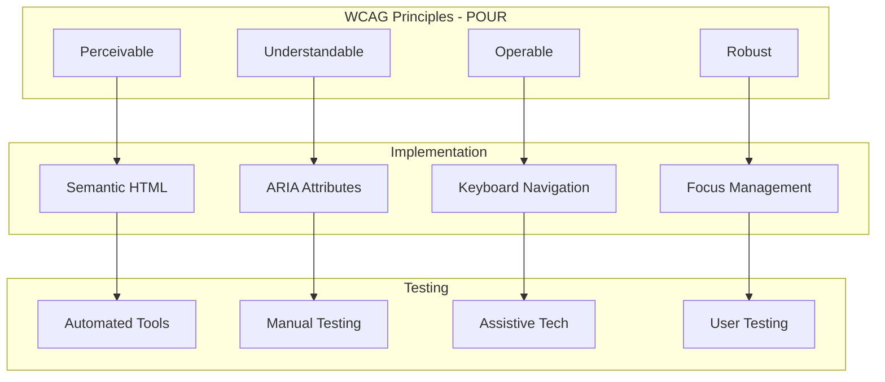

# WCAG Compliance & ARIA Patterns

## Accessibility Architecture



## WCAG 2.1 AA Checklist

### Perceivable

- [ ] All images have descriptive alt text
- [ ] Decorative images use `alt=""` or `aria-hidden="true"`
- [ ] Color is not the only means of conveying information
- [ ] Contrast ratio >= 4.5:1 for normal text
- [ ] Contrast ratio >= 3:1 for large text
- [ ] Text can be resized up to 200% without loss
- [ ] Video has captions and audio descriptions
- [ ] Content adapts to different orientations

### Operable

- [ ] All functionality available via keyboard
- [ ] No keyboard traps
- [ ] Skip navigation links provided
- [ ] Focus visible on all interactive elements
- [ ] Focus order is logical and intuitive
- [ ] Page titles are descriptive and unique
- [ ] Link text is descriptive (no "click here")
- [ ] Target size >= 44x44 CSS pixels

### Understandable

- [ ] Language of page declared (`lang` attribute)
- [ ] Form inputs have visible labels
- [ ] Error messages are specific and helpful
- [ ] Consistent navigation across pages
- [ ] Consistent identification of components

### Robust

- [ ] Valid HTML markup
- [ ] ARIA used correctly
- [ ] Status messages use `role="status"`
- [ ] Custom components have appropriate ARIA roles

## Semantic HTML Patterns

```html
<!-- Page Structure -->
<html lang="en">
<body>
  <a href="#main" class="skip-link">Skip to main content</a>

  <header role="banner">
    <nav aria-label="Main navigation">
      <ul>
        <li><a href="/" aria-current="page">Home</a></li>
        <li><a href="/about">About</a></li>
      </ul>
    </nav>
  </header>

  <main id="main" tabindex="-1">
    <article>
      <h1>Page Title</h1>
      <section aria-labelledby="section-1">
        <h2 id="section-1">Section Title</h2>
        <p>Content...</p>
      </section>
    </article>
  </main>

  <aside aria-label="Related content">
    <h2>Related</h2>
  </aside>

  <footer role="contentinfo">
    <p>&copy; 2024 Company</p>
  </footer>
</body>
</html>
```

## ARIA Patterns

### Navigation Menu

```tsx
function NavigationMenu() {
  const [openSubmenu, setOpenSubmenu] = useState<string | null>(null);

  return (
    <nav aria-label="Main navigation">
      <ul role="menubar">
        <li role="none">
          <a href="/" role="menuitem" aria-current="page">
            Home
          </a>
        </li>
        <li role="none">
          <button
            role="menuitem"
            aria-haspopup="true"
            aria-expanded={openSubmenu === 'products'}
            onClick={() =>
              setOpenSubmenu(openSubmenu === 'products' ? null : 'products')
            }
          >
            Products
          </button>
          {openSubmenu === 'products' && (
            <ul role="menu" aria-label="Products submenu">
              <li role="none">
                <a href="/products/a" role="menuitem">Product A</a>
              </li>
              <li role="none">
                <a href="/products/b" role="menuitem">Product B</a>
              </li>
            </ul>
          )}
        </li>
      </ul>
    </nav>
  );
}
```

### Modal Dialog

```tsx
function Modal({ isOpen, onClose, title, children }: ModalProps) {
  const previousFocus = useRef<HTMLElement | null>(null);
  const modalRef = useRef<HTMLDivElement>(null);

  useEffect(() => {
    if (isOpen) {
      previousFocus.current = document.activeElement as HTMLElement;
      modalRef.current?.focus();
    } else {
      previousFocus.current?.focus();
    }
  }, [isOpen]);

  const handleKeyDown = (e: React.KeyboardEvent) => {
    if (e.key === 'Escape') {
      onClose();
      return;
    }

    if (e.key === 'Tab') {
      const focusableElements = modalRef.current?.querySelectorAll(
        'button, [href], input, select, textarea, [tabindex]:not([tabindex="-1"])'
      );

      if (!focusableElements?.length) return;

      const firstElement = focusableElements[0];
      const lastElement = focusableElements[focusableElements.length - 1];

      if (e.shiftKey && document.activeElement === firstElement) {
        e.preventDefault();
        (lastElement as HTMLElement).focus();
      } else if (!e.shiftKey && document.activeElement === lastElement) {
        e.preventDefault();
        (firstElement as HTMLElement).focus();
      }
    }
  };

  if (!isOpen) return null;

  return createPortal(
    <div className="fixed inset-0 z-modal flex items-center justify-center">
      <div
        className="fixed inset-0 bg-black/50"
        onClick={onClose}
        aria-hidden="true"
      />
      <div
        ref={modalRef}
        role="dialog"
        aria-modal="true"
        aria-labelledby="modal-title"
        tabIndex={-1}
        onKeyDown={handleKeyDown}
        className="relative rounded-xl bg-surface p-6 shadow-xl"
      >
        <h2 id="modal-title">{title}</h2>
        {children}
        <button onClick={onClose} aria-label="Close dialog">
          <CloseIcon />
        </button>
      </div>
    </div>,
    document.body
  );
}
```

### Accordion

```tsx
function Accordion({ items }: AccordionProps) {
  const [openItems, setOpenItems] = useState<Set<string>>(new Set());

  const toggle = (id: string) => {
    setOpenItems((prev) => {
      const next = new Set(prev);
      if (next.has(id)) {
        next.delete(id);
      } else {
        next.add(id);
      }
      return next;
    });
  };

  return (
    <div className="accordion">
      {items.map((item) => (
        <div key={item.id} className="accordion-item">
          <h3>
            <button
              id={`accordion-header-${item.id}`}
              aria-expanded={openItems.has(item.id)}
              aria-controls={`accordion-panel-${item.id}`}
              onClick={() => toggle(item.id)}
              className="accordion-trigger"
            >
              {item.title}
              <ChevronIcon
                className={cn(
                  'transition-transform',
                  openItems.has(item.id) && 'rotate-180'
                )}
                aria-hidden="true"
              />
            </button>
          </h3>
          <div
            id={`accordion-panel-${item.id}`}
            role="region"
            aria-labelledby={`accordion-header-${item.id}`}
            hidden={!openItems.has(item.id)}
            className="accordion-content"
          >
            {item.content}
          </div>
        </div>
      ))}
    </div>
  );
}
```

### Tabs

```tsx
function Tabs({ tabs, defaultTab }: TabsProps) {
  const [activeTab, setActiveTab] = useState(defaultTab || tabs[0].id);
  const tabListRef = useRef<HTMLDivElement>(null);

  const handleKeyDown = (e: React.KeyboardEvent, currentIndex: number) => {
    const tabElements = tabListRef.current?.querySelectorAll('[role="tab"]');
    if (!tabElements) return;

    let newIndex = currentIndex;

    switch (e.key) {
      case 'ArrowRight':
        newIndex = (currentIndex + 1) % tabElements.length;
        break;
      case 'ArrowLeft':
        newIndex = (currentIndex - 1 + tabElements.length) % tabElements.length;
        break;
      case 'Home':
        newIndex = 0;
        break;
      case 'End':
        newIndex = tabElements.length - 1;
        break;
      default:
        return;
    }

    e.preventDefault();
    (tabElements[newIndex] as HTMLElement).focus();
    setActiveTab(tabs[newIndex].id);
  };

  return (
    <div className="tabs">
      <div
        ref={tabListRef}
        role="tablist"
        aria-label="Tab navigation"
        className="tab-list"
      >
        {tabs.map((tab, index) => (
          <button
            key={tab.id}
            role="tab"
            id={`tab-${tab.id}`}
            aria-selected={activeTab === tab.id}
            aria-controls={`panel-${tab.id}`}
            tabIndex={activeTab === tab.id ? 0 : -1}
            onClick={() => setActiveTab(tab.id)}
            onKeyDown={(e) => handleKeyDown(e, index)}
            className="tab-button"
          >
            {tab.label}
          </button>
        ))}
      </div>

      {tabs.map((tab) => (
        <div
          key={tab.id}
          role="tabpanel"
          id={`panel-${tab.id}`}
          aria-labelledby={`tab-${tab.id}`}
          hidden={activeTab !== tab.id}
          tabIndex={0}
          className="tab-panel"
        >
          {tab.content}
        </div>
      ))}
    </div>
  );
}
```

## Focus Management

```css
/* Visible focus styles */
:focus-visible {
  outline: 2px solid var(--color-focus-ring);
  outline-offset: 2px;
}

/* Remove default outline for mouse users */
:focus:not(:focus-visible) {
  outline: none;
}

/* Skip link */
.skip-link {
  position: absolute;
  top: -40px;
  left: 0;
  background: var(--color-primary-600);
  color: white;
  padding: 8px 16px;
  z-index: 100;
  transition: top 0.3s;
}

.skip-link:focus {
  top: 0;
}

/* Screen reader only utility */
.sr-only {
  position: absolute;
  width: 1px;
  height: 1px;
  padding: 0;
  margin: -1px;
  overflow: hidden;
  clip: rect(0, 0, 0, 0);
  white-space: nowrap;
  border-width: 0;
}
```

## Accessible Color Usage

```tsx
// Don't rely on color alone
function StatusBadge({ status }: { status: 'success' | 'error' | 'warning' }) {
  const config = {
    success: { icon: <CheckIcon />, label: 'Success', className: 'bg-success-50' },
    error: { icon: <XIcon />, label: 'Error', className: 'bg-error-50' },
    warning: { icon: <WarningIcon />, label: 'Warning', className: 'bg-warning-50' },
  };

  const { icon, label, className } = config[status];

  return (
    <span className={cn('inline-flex items-center gap-1', className)}>
      {icon}
      {label}
    </span>
  );
}

// Form error example
function FormError({ message }: { message: string }) {
  return (
    <div role="alert" className="flex items-center gap-2 text-error-600">
      <ErrorIcon aria-hidden="true" />
      <span>{message}</span>
    </div>
  );
}
```

## Testing Tools

| Tool | Type | Purpose |
|------|------|---------|
| axe-core | Automated | Browser extension for WCAG testing |
| Lighthouse | Automated | Performance + accessibility audit |
| WAVE | Automated | Visual accessibility feedback |
| NVDA/VoiceOver | Manual | Screen reader testing |
| Keyboard | Manual | Tab/arrow key navigation |
