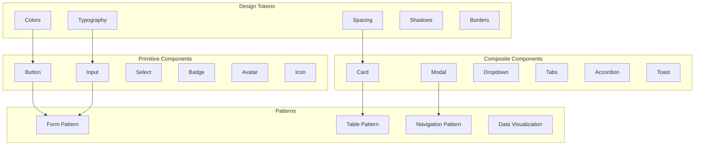

# Web Design System

## Design System Architecture



## Design Tokens

### Colors

```css
:root {
  /* Primary */
  --color-primary-50: #eff6ff;
  --color-primary-100: #dbeafe;
  --color-primary-200: #bfdbfe;
  --color-primary-300: #93c5fd;
  --color-primary-400: #60a5fa;
  --color-primary-500: #3b82f6;
  --color-primary-600: #2563eb;
  --color-primary-700: #1d4ed8;
  --color-primary-800: #1e40af;
  --color-primary-900: #1e3a8a;

  /* Neutral */
  --color-neutral-50: #f8fafc;
  --color-neutral-100: #f1f5f9;
  --color-neutral-200: #e2e8f0;
  --color-neutral-300: #cbd5e1;
  --color-neutral-400: #94a3b8;
  --color-neutral-500: #64748b;
  --color-neutral-600: #475569;
  --color-neutral-700: #334155;
  --color-neutral-800: #1e293b;
  --color-neutral-900: #0f172a;

  /* Success */
  --color-success-50: #f0fdf4;
  --color-success-500: #22c55e;
  --color-success-700: #15803d;

  /* Warning */
  --color-warning-50: #fffbeb;
  --color-warning-500: #f59e0b;
  --color-warning-700: #b45309;

  /* Error */
  --color-error-50: #fef2f2;
  --color-error-500: #ef4444;
  --color-error-700: #b91c1c;

  /* Semantic */
  --color-bg: var(--color-neutral-50);
  --color-surface: #ffffff;
  --color-text: var(--color-neutral-900);
  --color-text-muted: var(--color-neutral-500);
  --color-border: var(--color-neutral-200);
  --color-focus-ring: var(--color-primary-500);
}
```

### Component Tokens

```css
:root {
  /* Border Radius */
  --radius-sm: 0.25rem;
  --radius-md: 0.375rem;
  --radius-lg: 0.5rem;
  --radius-xl: 0.75rem;
  --radius-2xl: 1rem;
  --radius-full: 9999px;

  /* Shadows */
  --shadow-sm: 0 1px 2px 0 rgb(0 0 0 / 0.05);
  --shadow-md: 0 4px 6px -1px rgb(0 0 0 / 0.1);
  --shadow-lg: 0 10px 15px -3px rgb(0 0 0 / 0.1);
  --shadow-xl: 0 20px 25px -5px rgb(0 0 0 / 0.1);

  /* Z-Index */
  --z-dropdown: 50;
  --z-sticky: 100;
  --z-modal: 200;
  --z-toast: 300;
  --z-tooltip: 400;
}
```

## Button Component

```tsx
import { type ButtonHTMLAttributes, forwardRef } from 'react';

type ButtonVariant = 'primary' | 'secondary' | 'outline' | 'ghost' | 'danger';
type ButtonSize = 'sm' | 'md' | 'lg';

interface ButtonProps extends ButtonHTMLAttributes<HTMLButtonElement> {
  variant?: ButtonVariant;
  size?: ButtonSize;
  loading?: boolean;
  leftIcon?: ReactNode;
  rightIcon?: ReactNode;
}

const variantStyles: Record<ButtonVariant, string> = {
  primary: 'bg-primary-600 text-white hover:bg-primary-700 focus:ring-primary-500',
  secondary: 'bg-neutral-100 text-neutral-900 hover:bg-neutral-200 focus:ring-neutral-400',
  outline: 'border border-neutral-300 text-neutral-700 hover:bg-neutral-50 focus:ring-primary-500',
  ghost: 'text-neutral-700 hover:bg-neutral-100 focus:ring-neutral-400',
  danger: 'bg-error-600 text-white hover:bg-error-700 focus:ring-error-500',
};

const sizeStyles: Record<ButtonSize, string> = {
  sm: 'px-3 py-1.5 text-sm',
  md: 'px-4 py-2 text-base',
  lg: 'px-6 py-3 text-lg',
};

export const Button = forwardRef<HTMLButtonElement, ButtonProps>(
  (
    {
      variant = 'primary',
      size = 'md',
      loading = false,
      leftIcon,
      rightIcon,
      disabled,
      className,
      children,
      ...props
    },
    ref
  ) => {
    return (
      <button
        ref={ref}
        disabled={disabled || loading}
        className={cn(
          'inline-flex items-center justify-center rounded-md font-medium',
          'transition-colors duration-150',
          'focus:outline-none focus:ring-2 focus:ring-offset-2',
          'disabled:opacity-50 disabled:cursor-not-allowed',
          variantStyles[variant],
          sizeStyles[size],
          className
        )}
        aria-busy={loading}
        {...props}
      >
        {loading ? (
          <Spinner className="mr-2 h-4 w-4" aria-hidden="true" />
        ) : leftIcon ? (
          <span className="mr-2" aria-hidden="true">{leftIcon}</span>
        ) : null}
        {children}
        {rightIcon && !loading && (
          <span className="ml-2" aria-hidden="true">{rightIcon}</span>
        )}
      </button>
    );
  }
);

Button.displayName = 'Button';
```

## Input Component

```tsx
interface InputProps extends InputHTMLAttributes<HTMLInputElement> {
  label: string;
  error?: string;
  helpText?: string;
  leftAddon?: ReactNode;
  rightAddon?: ReactNode;
}

export const Input = forwardRef<HTMLInputElement, InputProps>(
  ({ label, error, helpText, leftAddon, rightAddon, id, ...props }, ref) => {
    const inputId = id || `input-${label.toLowerCase().replace(/\s/g, '-')}`;
    const errorId = `${inputId}-error`;
    const helpId = `${inputId}-help`;

    return (
      <div className="form-field">
        <label htmlFor={inputId} className="form-label">
          {label}
          {props.required && <span className="text-error-500 ml-1">*</span>}
        </label>

        <div className="relative">
          {leftAddon && (
            <span className="absolute left-3 top-1/2 -translate-y-1/2 text-neutral-500">
              {leftAddon}
            </span>
          )}

          <input
            ref={ref}
            id={inputId}
            aria-invalid={error ? 'true' : 'false'}
            aria-describedby={[error && errorId, helpText && helpId]
              .filter(Boolean)
              .join(' ')}
            className={cn(
              'w-full rounded-md border px-3 py-2',
              'focus:outline-none focus:ring-2 focus:ring-primary-500',
              'disabled:bg-neutral-100 disabled:cursor-not-allowed',
              error
                ? 'border-error-500 focus:ring-error-500'
                : 'border-neutral-300',
              leftAddon && 'pl-10',
              rightAddon && 'pr-10'
            )}
            {...props}
          />

          {rightAddon && (
            <span className="absolute right-3 top-1/2 -translate-y-1/2 text-neutral-500">
              {rightAddon}
            </span>
          )}
        </div>

        {helpText && !error && (
          <p id={helpId} className="mt-1 text-sm text-neutral-500">
            {helpText}
          </p>
        )}

        {error && (
          <p id={errorId} className="mt-1 text-sm text-error-600" role="alert">
            {error}
          </p>
        )}
      </div>
    );
  }
);
```

## Card Component

```tsx
interface CardProps {
  children: ReactNode;
  variant?: 'default' | 'outlined' | 'elevated';
  padding?: 'none' | 'sm' | 'md' | 'lg';
  className?: string;
}

const variantStyles = {
  default: 'bg-surface border border-neutral-200',
  outlined: 'bg-transparent border-2 border-neutral-300',
  elevated: 'bg-surface shadow-lg',
};

const paddingStyles = {
  none: '',
  sm: 'p-4',
  md: 'p-6',
  lg: 'p-8',
};

export function Card({
  children,
  variant = 'default',
  padding = 'md',
  className,
}: CardProps) {
  return (
    <div
      className={cn(
        'rounded-xl',
        variantStyles[variant],
        paddingStyles[padding],
        className
      )}
    >
      {children}
    </div>
  );
}

Card.Header = function CardHeader({ children, className }: CardProps) {
  return (
    <div className={cn('border-b border-neutral-200 px-6 py-4', className)}>
      {children}
    </div>
  );
};

Card.Body = function CardBody({ children, className }: CardProps) {
  return <div className={cn('px-6 py-4', className)}>{children}</div>;
};

Card.Footer = function CardFooter({ children, className }: CardProps) {
  return (
    <div className={cn('border-t border-neutral-200 px-6 py-4', className)}>
      {children}
    </div>
  );
};
```

## Modal Component

```tsx
import { useEffect, useRef } from 'react';
import { createPortal } from 'react-dom';

interface ModalProps {
  isOpen: boolean;
  onClose: () => void;
  title: string;
  children: ReactNode;
  size?: 'sm' | 'md' | 'lg' | 'xl';
}

export function Modal({
  isOpen,
  onClose,
  title,
  children,
  size = 'md',
}: ModalProps) {
  const dialogRef = useRef<HTMLDivElement>(null);

  useEffect(() => {
    const handleEscape = (e: KeyboardEvent) => {
      if (e.key === 'Escape') onClose();
    };

    if (isOpen) {
      document.addEventListener('keydown', handleEscape);
      document.body.style.overflow = 'hidden';
      dialogRef.current?.focus();
    }

    return () => {
      document.removeEventListener('keydown', handleEscape);
      document.body.style.overflow = '';
    };
  }, [isOpen, onClose]);

  if (!isOpen) return null;

  const sizeStyles = {
    sm: 'max-w-md',
    md: 'max-w-lg',
    lg: 'max-w-2xl',
    xl: 'max-w-4xl',
  };

  return createPortal(
    <div className="fixed inset-0 z-modal flex items-center justify-center p-4">
      <div
        className="fixed inset-0 bg-black/50"
        onClick={onClose}
        aria-hidden="true"
      />
      <div
        ref={dialogRef}
        role="dialog"
        aria-modal="true"
        aria-labelledby="modal-title"
        className={cn(
          'relative w-full rounded-xl bg-surface shadow-xl',
          'max-h-[90vh] overflow-y-auto',
          sizeStyles[size]
        )}
      >
        <div className="flex items-center justify-between border-b border-neutral-200 px-6 py-4">
          <h2 id="modal-title" className="text-xl font-semibold">
            {title}
          </h2>
          <button
            onClick={onClose}
            className="rounded-lg p-1 hover:bg-neutral-100"
            aria-label="Close modal"
          >
            <CloseIcon />
          </button>
        </div>
        <div className="px-6 py-4">{children}</div>
      </div>
    </div>,
    document.body
  );
}
```

## Toast Component

```tsx
// Toast notification system
type ToastType = 'success' | 'error' | 'warning' | 'info';

interface Toast {
  id: string;
  type: ToastType;
  message: string;
  duration?: number;
}

class ToastManager {
  private toasts: Toast[] = [];
  private listener: ((toasts: Toast[]) => void) | null = null;

  subscribe(listener: (toasts: Toast[]) => void) {
    this.listener = listener;
    return () => {
      this.listener = null;
    };
  }

  private notify() {
    this.listener?.([...this.toasts]);
  }

  show(type: ToastType, message: string, duration = 5000) {
    const id = crypto.randomUUID();
    const toast: Toast = { id, type, message, duration };

    this.toasts.push(toast);
    this.notify();

    setTimeout(() => this.dismiss(id), duration);
  }

  dismiss(id: string) {
    this.toasts = this.toasts.filter((t) => t.id !== id);
    this.notify();
  }

  success(message: string) {
    this.show('success', message);
  }

  error(message: string) {
    this.show('error', message);
  }

  warning(message: string) {
    this.show('warning', message);
  }

  info(message: string) {
    this.show('info', message);
  }
}

export const toast = new ToastManager();
```

## Usage Examples

```tsx
// Button variants
<Button variant="primary">Save Changes</Button>
<Button variant="outline">Cancel</Button>
<Button variant="danger" loading={isDeleting}>Delete</Button>

// Form with validation
<Input
  label="Email"
  type="email"
  required
  error={errors.email}
  helpText="We'll never share your email"
/>

// Card layout
<Card variant="elevated">
  <Card.Header>
    <h3>Recent Activity</h3>
  </Card.Header>
  <Card.Body>
    <ActivityList items={activities} />
  </Card.Body>
</Card>

// Toast notifications
toast.success('Changes saved successfully');
toast.error('Failed to load data');
```
