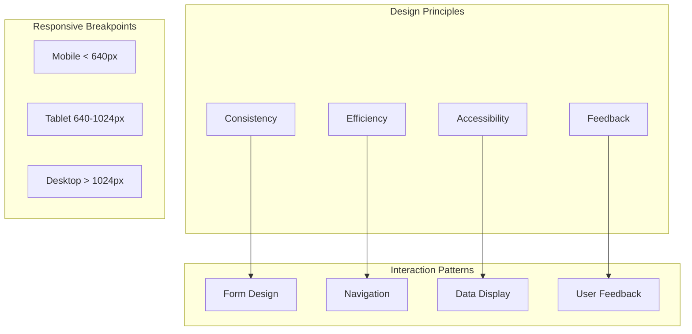

# Web UX Principles & Responsive Design

## UX Architecture



## Responsive Breakpoint System

```css
/* Mobile-first responsive design */
:root {
  --breakpoint-sm: 640px;
  --breakpoint-md: 768px;
  --breakpoint-lg: 1024px;
  --breakpoint-xl: 1280px;
  --breakpoint-2xl: 1536px;
}

/* Mobile: 1 column, full width */
.grid {
  display: grid;
  grid-template-columns: 1fr;
  gap: 1rem;
}

/* Tablet: 2 columns */
@media (min-width: 640px) {
  .grid {
    grid-template-columns: repeat(2, 1fr);
  }
}

/* Desktop: 3 columns */
@media (min-width: 1024px) {
  .grid {
    grid-template-columns: repeat(3, 1fr);
    gap: 1.5rem;
  }
}

/* Wide desktop: 4 columns */
@media (min-width: 1280px) {
  .grid {
    grid-template-columns: repeat(4, 1fr);
  }
}
```

## Layout Patterns

### Holy Grail Layout

```css
.layout {
  display: grid;
  grid-template-areas:
    "header"
    "nav"
    "main"
    "footer";
  min-height: 100vh;
}

.header { grid-area: header; }
.nav { grid-area: nav; }
.main { grid-area: main; }
.footer { grid-area: footer; }

@media (min-width: 768px) {
  .layout {
    grid-template-areas:
      "header header"
      "nav    main"
      "footer footer";
    grid-template-columns: 250px 1fr;
  }
}

@media (min-width: 1024px) {
  .layout {
    grid-template-areas:
      "header header header"
      "nav    main   aside"
      "footer footer footer";
    grid-template-columns: 250px 1fr 300px;
  }
}
```

### Sidebar Navigation

```css
.sidebar-layout {
  display: flex;
  min-height: 100vh;
}

.sidebar {
  width: 280px;
  background: var(--color-sidebar);
  transition: transform 0.3s ease;
}

.content {
  flex: 1;
  padding: 2rem;
}

/* Mobile: sidebar overlays */
@media (max-width: 768px) {
  .sidebar {
    position: fixed;
    left: 0;
    top: 0;
    height: 100vh;
    transform: translateX(-100%);
    z-index: 50;
  }

  .sidebar.open {
    transform: translateX(0);
  }

  .sidebar-overlay {
    position: fixed;
    inset: 0;
    background: rgba(0, 0, 0, 0.5);
    z-index: 40;
  }
}
```

## Typography Scale

```css
:root {
  --text-xs: 0.75rem;
  --text-sm: 0.875rem;
  --text-base: 1rem;
  --text-lg: 1.125rem;
  --text-xl: 1.25rem;
  --text-2xl: 1.5rem;
  --text-3xl: 1.875rem;
  --text-4xl: 2.25rem;
  --text-5xl: 3rem;

  --font-sans: 'Inter', -apple-system, BlinkMacSystemFont, sans-serif;
  --font-mono: 'Fira Code', 'Consolas', monospace;

  --leading-tight: 1.25;
  --leading-normal: 1.5;
  --leading-relaxed: 1.75;
}

body {
  font-family: var(--font-sans);
  font-size: var(--text-base);
  line-height: var(--leading-normal);
  color: var(--color-text);
}

h1 { font-size: var(--text-4xl); line-height: var(--leading-tight); }
h2 { font-size: var(--text-3xl); line-height: var(--leading-tight); }
h3 { font-size: var(--text-2xl); line-height: var(--leading-tight); }
h4 { font-size: var(--text-xl); line-height: var(--leading-normal); }
```

## Spacing System

```css
:root {
  --space-0: 0;
  --space-1: 0.25rem;   /* 4px */
  --space-2: 0.5rem;    /* 8px */
  --space-3: 0.75rem;   /* 12px */
  --space-4: 1rem;      /* 16px */
  --space-5: 1.25rem;   /* 20px */
  --space-6: 1.5rem;    /* 24px */
  --space-8: 2rem;      /* 32px */
  --space-10: 2.5rem;   /* 40px */
  --space-12: 3rem;     /* 48px */
  --space-16: 4rem;     /* 64px */
  --space-20: 5rem;     /* 80px */
}

/* Usage */
.card {
  padding: var(--space-6);
  margin-bottom: var(--space-4);
}

.container {
  padding: var(--space-4);
}

@media (min-width: 768px) {
  .container {
    padding: var(--space-8);
  }
}
```

## Form Design Patterns

```tsx
// Accessible form with validation
interface FormFieldProps {
  label: string;
  name: string;
  type?: string;
  error?: string;
  required?: boolean;
  helpText?: string;
}

function FormField({
  label,
  name,
  type = 'text',
  error,
  required,
  helpText,
}: FormFieldProps) {
  const id = `field-${name}`;
  const errorId = `${id}-error`;
  const helpId = `${id}-help`;

  return (
    <div className="form-field">
      <label htmlFor={id} className="form-label">
        {label}
        {required && <span className="required" aria-hidden="true">*</span>}
      </label>

      {helpText && (
        <p id={helpId} className="form-help">
          {helpText}
        </p>
      )}

      <input
        id={id}
        name={name}
        type={type}
        required={required}
        aria-invalid={error ? 'true' : 'false'}
        aria-describedby={[error && errorId, helpText && helpId]
          .filter(Boolean)
          .join(' ')}
        className={`form-input ${error ? 'form-input--error' : ''}`}
      />

      {error && (
        <p id={errorId} className="form-error" role="alert">
          {error}
        </p>
      )}
    </div>
  );
}
```

## Loading States

```tsx
// Skeleton loading pattern
function CardSkeleton() {
  return (
    <div className="card skeleton" aria-busy="true" aria-label="Loading">
      <div className="skeleton-image" />
      <div className="skeleton-text skeleton-text--short" />
      <div className="skeleton-text" />
      <div className="skeleton-text skeleton-text--long" />
    </div>
  );
}

// Progress indicator
function LoadingSpinner({ size = 'md', label = 'Loading...' }: LoadingSpinnerProps) {
  return (
    <div
      className={`spinner spinner--${size}`}
      role="status"
      aria-label={label}
    >
      <span className="sr-only">{label}</span>
    </div>
  );
}
```

## Dark Mode Support

```css
:root {
  --color-bg: #ffffff;
  --color-text: #1a1a1a;
  --color-primary: #2563eb;
  --color-secondary: #64748b;
  --color-border: #e2e8f0;
}

@media (prefers-color-scheme: dark) {
  :root {
    --color-bg: #0f172a;
    --color-text: #f1f5f9;
    --color-primary: #3b82f6;
    --color-secondary: #94a3b8;
    --color-border: #334155;
  }
}

/* Manual theme toggle */
[data-theme='dark'] {
  --color-bg: #0f172a;
  --color-text: #f1f5f9;
  --color-primary: #3b82f6;
  --color-secondary: #94a3b8;
  --color-border: #334155;
}
```

## Motion & Animation

```css
/* Respect user preferences */
@media (prefers-reduced-motion: reduce) {
  *,
  *::before,
  *::after {
    animation-duration: 0.01ms !important;
    animation-iteration-count: 1 !important;
    transition-duration: 0.01ms !important;
    scroll-behavior: auto !important;
  }
}

/* Smooth transitions for non-reduced-motion users */
@media (prefers-reduced-motion: no-preference) {
  .transition {
    transition: all 0.2s ease-in-out;
  }
}
```

## Responsive Data Table

```tsx
// Card view for mobile, table for desktop
function ResponsiveDataTable({ data, columns }: DataTableProps) {
  const isMobile = useMediaQuery('(max-width: 768px)');

  if (isMobile) {
    return (
      <div className="card-list">
        {data.map((row) => (
          <div key={row.id} className="card-item">
            {columns.map((col) => (
              <div key={col.key} className="card-item-field">
                <span className="card-item-label">{col.label}</span>
                <span className="card-item-value">
                  {col.render ? col.render(row[col.key]) : row[col.key]}
                </span>
              </div>
            ))}
          </div>
        ))}
      </div>
    );
  }

  return (
    <div className="table-container" role="region" aria-label="Data table" tabIndex={0}>
      <table className="data-table">
        <thead>
          <tr>
            {columns.map((col) => (
              <th key={col.key}>{col.label}</th>
            ))}
          </tr>
        </thead>
        <tbody>
          {data.map((row) => (
            <tr key={row.id}>
              {columns.map((col) => (
                <td key={col.key}>
                  {col.render ? col.render(row[col.key]) : row[col.key]}
                </td>
              ))}
            </tr>
          ))}
        </tbody>
      </table>
    </div>
  );
}
```

## Performance Best Practices

- Use CSS containment for complex components
- Implement image lazy loading with `loading="lazy"`
- Use `will-change` sparingly for animations
- Debounce search inputs and resize handlers
- Virtualize long lists
- Use `font-display: swap` for web fonts
- Prefetch routes on hover
