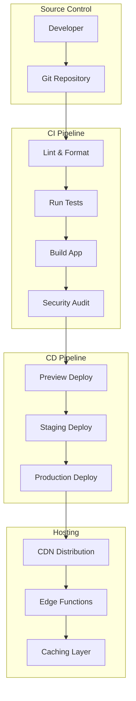
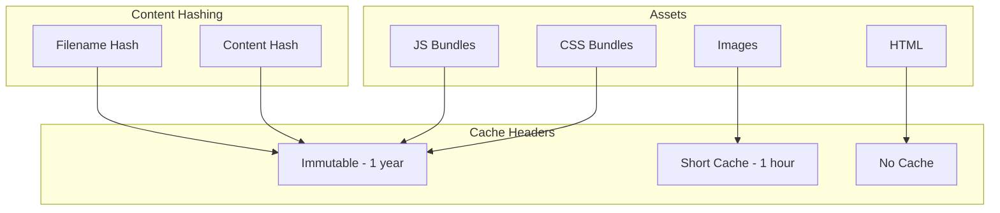

# Frontend Deployment & CI/CD

## Deployment Architecture



## CI/CD Pipeline

### GitHub Actions

```yaml
# .github/workflows/ci.yml
name: CI/CD Pipeline

on:
  push:
    branches: [main, develop]
  pull_request:
    branches: [main]

env:
  NODE_VERSION: '18'
  PNPM_VERSION: '8'

jobs:
  lint:
    name: Lint & Format
    runs-on: ubuntu-latest
    steps:
      - uses: actions/checkout@v4
      - uses: pnpm/action-setup@v2
        with:
          version: ${{ env.PNPM_VERSION }}
      - uses: actions/setup-node@v4
        with:
          node-version: ${{ env.NODE_VERSION }}
          cache: 'pnpm'
      - run: pnpm install --frozen-lockfile
      - run: pnpm lint
      - run: pnpm format:check
      - run: pnpm typecheck

  test:
    name: Unit & Integration Tests
    runs-on: ubuntu-latest
    steps:
      - uses: actions/checkout@v4
      - uses: pnpm/action-setup@v2
        with:
          version: ${{ env.PNPM_VERSION }}
      - uses: actions/setup-node@v4
        with:
          node-version: ${{ env.NODE_VERSION }}
          cache: 'pnpm'
      - run: pnpm install --frozen-lockfile
      - run: pnpm test:coverage
      - uses: actions/upload-artifact@v4
        if: always()
        with:
          name: coverage-report
          path: coverage/

  build:
    name: Build
    runs-on: ubuntu-latest
    needs: [lint, test]
    steps:
      - uses: actions/checkout@v4
      - uses: pnpm/action-setup@v2
        with:
          version: ${{ env.PNPM_VERSION }}
      - uses: actions/setup-node@v4
        with:
          node-version: ${{ env.NODE_VERSION }}
          cache: 'pnpm'
      - run: pnpm install --frozen-lockfile
      - run: pnpm build
      - uses: actions/upload-artifact@v4
        with:
          name: build-output
          path: dist/

  e2e:
    name: E2E Tests
    runs-on: ubuntu-latest
    needs: build
    steps:
      - uses: actions/checkout@v4
      - uses: pnpm/action-setup@v2
        with:
          version: ${{ env.PNPM_VERSION }}
      - uses: actions/setup-node@v4
        with:
          node-version: ${{ env.NODE_VERSION }}
          cache: 'pnpm'
      - run: pnpm install --frozen-lockfile
      - run: pnpm exec playwright install --with-deps
      - run: pnpm test:e2e
      - uses: actions/upload-artifact@v4
        if: always()
        with:
          name: playwright-report
          path: playwright-report/

  security:
    name: Security Audit
    runs-on: ubuntu-latest
    needs: build
    steps:
      - uses: actions/checkout@v4
      - uses: pnpm/action-setup@v2
        with:
          version: ${{ env.PNPM_VERSION }}
      - uses: actions/setup-node@v4
        with:
          node-version: ${{ env.NODE_VERSION }}
          cache: 'pnpm'
      - run: pnpm install --frozen-lockfile
      - run: pnpm audit --audit-level=high

  deploy-preview:
    name: Deploy Preview
    runs-on: ubuntu-latest
    needs: [build, e2e]
    if: github.event_name == 'pull_request'
    environment:
      name: preview
      url: ${{ steps.deploy.outputs.url }}
    steps:
      - uses: actions/download-artifact@v4
        with:
          name: build-output
          path: dist/
      - id: deploy
        run: |
          echo "Deploy to preview environment"
          # Add your deployment script here
          echo "url=https://preview-${{ github.event.pull_request.number }}.example.com" >> $GITHUB_OUTPUT

  deploy-staging:
    name: Deploy Staging
    runs-on: ubuntu-latest
    needs: [build, e2e, security]
    if: github.ref == 'refs/heads/develop'
    environment:
      name: staging
      url: https://staging.example.com
    steps:
      - uses: actions/download-artifact@v4
        with:
          name: build-output
          path: dist/
      - run: |
          echo "Deploy to staging"

  deploy-production:
    name: Deploy Production
    runs-on: ubuntu-latest
    needs: [build, e2e, security]
    if: github.ref == 'refs/heads/main'
    environment:
      name: production
      url: https://example.com
    steps:
      - uses: actions/download-artifact@v4
        with:
          name: build-output
          path: dist/
      - run: |
          echo "Deploy to production"
```

## Hosting Options

### Vercel

```json
// vercel.json
{
  "buildCommand": "npm run build",
  "outputDirectory": "dist",
  "framework": "vite",
  "rewrites": [
    { "source": "/(.*)", "destination": "/index.html" }
  ],
  "headers": [
    {
      "source": "/assets/(.*)",
      "headers": [
        { "key": "Cache-Control", "value": "public, max-age=31536000, immutable" }
      ]
    }
  ]
}
```

### Netlify

```toml
# netlify.toml
[build]
  command = "npm run build"
  publish = "dist"

[[redirects]]
  from = "/*"
  to = "/index.html"
  status = 200

[[headers]]
  for = "/assets/*"
  [headers.values]
    Cache-Control = "public, max-age=31536000, immutable"
```

### AWS S3 + CloudFront

```yaml
# buildspec.yml
version: 0.2

phases:
  install:
    runtime-versions:
      nodejs: 18
    commands:
      - npm ci
  build:
    commands:
      - npm run build
artifacts:
  base-directory: dist
  files:
    - '**/*'
cache:
  paths:
    - 'node_modules/**/*'

# CloudFront invalidation
aws cloudfront create-invalidation \
  --distribution-id $DISTRIBUTION_ID \
  --paths "/*"
```

## Performance Budgets

```json
// package.json
{
  "budgets": [
    {
      "type": "initial",
      "maximumWarning": "200kb",
      "maximumError": "300kb"
    },
    {
      "type": "anyComponentStyle",
      "maximumWarning": "4kb",
      "maximumError": "8kb"
    }
  ]
}
```

### Lighthouse CI

```yaml
# lighthouserc.json
{
  "ci": {
    "collect": {
      "url": ["http://localhost:3000/"],
      "numberOfRuns": 3
    },
    "assert": {
      "assertions": {
        "categories:performance": ["error", { "minScore": 0.9 }],
        "categories:accessibility": ["error", { "minScore": 0.95 }],
        "categories:best-practices": ["error", { "minScore": 0.9 }],
        "categories:seo": ["error", { "minScore": 0.9 }]
      }
    },
    "upload": {
      "target": "lhci"
    }
  }
}
```

## Environment Configuration

```typescript
// src/config.ts
const config = {
  development: {
    apiUrl: 'http://localhost:8080/api',
    enableMocks: true,
    enableDevtools: true,
  },
  staging: {
    apiUrl: 'https://staging-api.example.com/api',
    enableMocks: false,
    enableDevtools: false,
  },
  production: {
    apiUrl: 'https://api.example.com/api',
    enableMocks: false,
    enableDevtools: false,
  },
};

const environment = import.meta.env.MODE || 'development';
export default config[environment as keyof typeof config];
```

## Cache Invalidation Strategy



## Rollback Strategy

```bash
# Quick rollback script
#!/bin/bash
PREVIOUS_VERSION=$1

if [ -z "$PREVIOUS_VERSION" ]; then
  echo "Usage: ./rollback.sh <version>"
  exit 1
fi

# For Vercel
vercel promote $PREVIOUS_VERSION

# For S3
aws s3 sync s3://backup-$PREVIOUS_VERSION s3://production-bucket

# For CloudFront
aws cloudfront create-invalidation --distribution-id $DIST_ID --paths "/*"
```

## Monitoring & Alerting

```yaml
# Monitor key metrics
metrics:
  - name: LCP (Largest Contentful Paint)
    threshold: 2500ms
    alert: critical
  - name: FID (First Input Delay)
    threshold: 100ms
    alert: warning
  - name: CLS (Cumulative Layout Shift)
    threshold: 0.1
    alert: warning
  - name: Bundle Size
    threshold: 300KB
    alert: warning
  - name: Error Rate
    threshold: 1%
    alert: critical
```
