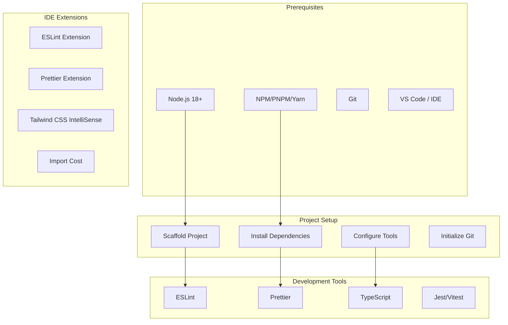

# Frontend Development Environment Setup

## Setup Overview



## Prerequisites Installation

### Node.js

```bash
# Using nvm (recommended)
curl -o- https://raw.githubusercontent.com/nvm-sh/nvm/v0.39.0/install.sh | bash
nvm install 18
nvm use 18

# Verify installation
node --version  # Should be 18.x or higher
npm --version   # Should be 9.x or higher
```

### Package Manager

```bash
# NPM (comes with Node.js)
npm --version

# PNPM (recommended for better performance)
corepack enable
corepack prepare pnpm@latest --activate

# Yarn
corepack enable
corepack prepare yarn@stable --activate
```

## Project Scaffolding

### React (Vite + TypeScript)

```bash
npm create vite@latest my-app -- --template react-ts
cd my-app
npm install
```

### Vue (Vite + TypeScript)

```bash
npm create vue@latest my-app
cd my-app
npm install
```

### Angular

```bash
npx @angular/cli new my-app --style=scss --routing --strict
cd my-app
```

### Svelte (SvelteKit)

```bash
npm create svelte@latest my-app
cd my-app
npm install
```

## Essential Configuration Files

### package.json Scripts

```json
{
  "scripts": {
    "dev": "vite",
    "build": "tsc && vite build",
    "preview": "vite preview",
    "lint": "eslint . --ext ts,tsx --report-unused-disable-directives --max-warnings 0",
    "lint:fix": "eslint . --ext ts,tsx --fix",
    "format": "prettier --write \"src/**/*.{ts,tsx,css,md}\"",
    "format:check": "prettier --check \"src/**/*.{ts,tsx,css,md}\"",
    "typecheck": "tsc --noEmit",
    "test": "vitest",
    "test:ui": "vitest --ui",
    "test:coverage": "vitest run --coverage",
    "test:e2e": "playwright test",
    "prepare": "husky install"
  }
}
```

### TypeScript Configuration

```json
{
  "compilerOptions": {
    "target": "ES2020",
    "lib": ["ES2020", "DOM", "DOM.Iterable"],
    "module": "ESNext",
    "skipLibCheck": true,
    "moduleResolution": "bundler",
    "allowImportingTsExtensions": true,
    "resolveJsonModule": true,
    "isolatedModules": true,
    "noEmit": true,
    "jsx": "react-jsx",
    "strict": true,
    "noUnusedLocals": true,
    "noUnusedParameters": true,
    "noFallthroughCasesInSwitch": true,
    "baseUrl": ".",
    "paths": {
      "@/*": ["./src/*"]
    }
  },
  "include": ["src"],
  "references": [{ "path": "./tsconfig.node.json" }]
}
```

### ESLint Configuration

```javascript
// eslint.config.js
import js from '@eslint/js';
import ts from 'typescript-eslint';
import react from 'eslint-plugin-react';
import reactHooks from 'eslint-plugin-react-hooks';
import importPlugin from 'eslint-plugin-import';

export default ts.config(
  js.configs.recommended,
  ...ts.configs.recommended,
  {
    plugins: {
      react,
      'react-hooks': reactHooks,
      import: importPlugin,
    },
    rules: {
      'react-hooks/rules-of-hooks': 'error',
      'react-hooks/exhaustive-deps': 'warn',
      'import/order': [
        'warn',
        {
          groups: [
            'builtin',
            'external',
            'internal',
            'parent',
            'sibling',
            'index',
          ],
          'newlines-between': 'always',
          alphabetize: { order: 'asc' },
        },
      ],
      '@typescript-eslint/no-unused-vars': [
        'warn',
        { argsIgnorePattern: '^_' },
      ],
    },
    settings: {
      react: { version: 'detect' },
    },
  }
);
```

### Prettier Configuration

```json
{
  "semi": true,
  "trailingComma": "es5",
  "singleQuote": true,
  "printWidth": 100,
  "tabWidth": 2,
  "useTabs": false,
  "bracketSpacing": true,
  "jsxSingleQuote": false,
  "arrowParens": "always",
  "endOfLine": "lf"
}
```

### Tailwind CSS Configuration

```javascript
// tailwind.config.js
/** @type {import('tailwindcss').Config} */
export default {
  content: ['./index.html', './src/**/*.{js,ts,jsx,tsx}'],
  darkMode: 'class',
  theme: {
    extend: {
      colors: {
        primary: {
          50: '#eff6ff',
          100: '#dbeafe',
          200: '#bfdbfe',
          300: '#93c5fd',
          400: '#60a5fa',
          500: '#3b82f6',
          600: '#2563eb',
          700: '#1d4ed8',
          800: '#1e40af',
          900: '#1e3a8a',
        },
      },
      fontFamily: {
        sans: ['Inter', 'system-ui', 'sans-serif'],
        mono: ['Fira Code', 'monospace'],
      },
    },
  },
  plugins: [require('@tailwindcss/forms')],
};
```

### Vite Configuration

```typescript
// vite.config.ts
import { defineConfig } from 'vite';
import react from '@vitejs/plugin-react';
import { resolve } from 'path';

export default defineConfig({
  plugins: [react()],
  resolve: {
    alias: {
      '@': resolve(__dirname, './src'),
    },
  },
  server: {
    port: 3000,
    open: true,
    proxy: {
      '/api': {
        target: 'http://localhost:8080',
        changeOrigin: true,
      },
    },
  },
  build: {
    outDir: 'dist',
    sourcemap: true,
    rollupOptions: {
      output: {
        manualChunks: {
          vendor: ['react', 'react-dom'],
          router: ['react-router-dom'],
        },
      },
    },
  },
});
```

## VS Code Extensions

```json
// .vscode/extensions.json
{
  "recommendations": [
    "esbenp.prettier-vscode",
    "dbaeumer.vscode-eslint",
    "bradlc.vscode-tailwindcss",
    "formulahendry.auto-rename-tag",
    "christian-kohler.path-intellisense",
    "ms-vscode.vscode-typescript-next",
    "streetsidesoftware.code-spell-checker"
  ]
}
```

## Environment Variables

```bash
# .env.development
VITE_API_BASE_URL=http://localhost:8080/api
VITE_APP_NAME=My App
VITE_ENABLE_MOCKS=true

# .env.production
VITE_API_BASE_URL=https://api.example.com
VITE_APP_NAME=My App
VITE_ENABLE_MOCKS=false
```

## Git Hooks (Husky + lint-staged)

```bash
# Install husky
npx husky install

# Add pre-commit hook
npx husky add .husky/pre-commit "npx lint-staged"
```

```json
// package.json
{
  "lint-staged": {
    "*.{ts,tsx}": ["eslint --fix", "prettier --write"],
    "*.{css,md,json}": ["prettier --write"]
  }
}
```

## Quick Start Commands

```bash
# Clone and setup
git clone <repo-url>
cd my-app
npm install

# Start development
npm run dev

# Run tests
npm test

# Build for production
npm run build

# Preview production build
npm run preview
```
