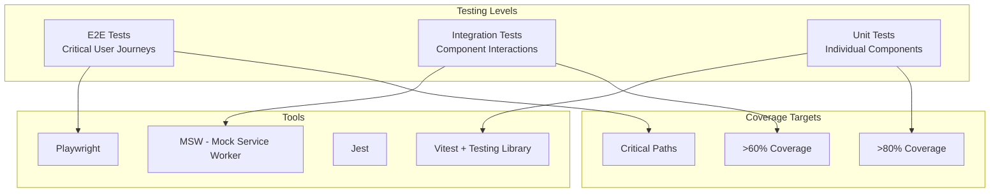

# Frontend Testing Strategy

## Testing Pyramid



## Unit Testing

### Component Testing with Vitest + React Testing Library

```tsx
// src/components/ui/Button.test.tsx
import { render, screen, fireEvent } from '@testing-library/react';
import { Button } from './Button';

describe('Button', () => {
  it('renders with text', () => {
    render(<Button>Click me</Button>);
    expect(screen.getByRole('button', { name: /click me/i })).toBeInTheDocument();
  });

  it('applies variant styles', () => {
    render(<Button variant="primary">Primary</Button>);
    const button = screen.getByRole('button');
    expect(button.className).toContain('bg-primary-600');
  });

  it('calls onClick when clicked', async () => {
    const onClick = vi.fn();
    render(<Button onClick={onClick}>Click</Button>);

    await fireEvent.click(screen.getByRole('button'));
    expect(onClick).toHaveBeenCalledTimes(1);
  });

  it('is disabled when disabled prop is true', () => {
    render(<Button disabled>Disabled</Button>);
    expect(screen.getByRole('button')).toBeDisabled();
  });

  it('shows loading state', () => {
    render(<Button loading>Loading</Button>);
    expect(screen.getByRole('button')).toHaveAttribute('aria-busy', 'true');
  });

  it('is not clickable when loading', async () => {
    const onClick = vi.fn();
    render(<Button loading onClick={onClick}>Save</Button>);

    await fireEvent.click(screen.getByRole('button'));
    expect(onClick).not.toHaveBeenCalled();
  });
});
```

### Hook Testing

```typescript
// src/hooks/useDebounce.test.ts
import { renderHook, act } from '@testing-library/react';
import { useDebounce } from './useDebounce';

describe('useDebounce', () => {
  beforeEach(() => {
    vi.useFakeTimers();
  });

  afterEach(() => {
    vi.useRealTimers();
  });

  it('returns initial value immediately', () => {
    const { result } = renderHook(() => useDebounce('hello', 500));
    expect(result.current).toBe('hello');
  });

  it('debounces value changes', () => {
    const { result, rerender } = renderHook(
      ({ value, delay }) => useDebounce(value, delay),
      { initialProps: { value: 'hello', delay: 500 } }
    );

    rerender({ value: 'world', delay: 500 });
    expect(result.current).toBe('hello');

    act(() => vi.advanceTimersByTime(500));
    expect(result.current).toBe('world');
  });
});
```

### Utility Function Testing

```typescript
// src/lib/utils.test.ts
import { formatDate, generateId, truncate } from './utils';

describe('formatDate', () => {
  it('formats ISO date string', () => {
    expect(formatDate('2024-01-15')).toBe('January 15, 2024');
  });

  it('handles invalid date', () => {
    expect(formatDate('invalid')).toBe('Invalid Date');
  });
});

describe('generateId', () => {
  it('generates unique ids', () => {
    const id1 = generateId();
    const id2 = generateId();
    expect(id1).not.toBe(id2);
  });

  it('generates ids of specified length', () => {
    const id = generateId(16);
    expect(id).toHaveLength(16);
  });
});

describe('truncate', () => {
  it('truncates long strings', () => {
    expect(truncate('Hello World', 5)).toBe('Hello...');
  });

  it('does not truncate short strings', () => {
    expect(truncate('Hi', 5)).toBe('Hi');
  });
});
```

## Integration Testing

### API Integration Testing with MSW

```typescript
// src/test/server.ts
import { setupServer } from 'msw/node';
import { http, HttpResponse } from 'msw';
import { db } from './db';

export const handlers = [
  http.get('/api/users', () => {
    return HttpResponse.json({
      data: db.user.getAll(),
      total: db.user.count(),
    });
  }),

  http.get('/api/users/:id', ({ params }) => {
    const user = db.user.findById(params.id as string);
    if (!user) {
      return new HttpResponse(null, { status: 404 });
    }
    return HttpResponse.json({ data: user });
  }),

  http.post('/api/users', async ({ request }) => {
    const body = await request.json();
    const user = db.user.create(body);
    return HttpResponse.json({ data: user }, { status: 201 });
  }),
];

export const server = setupServer(...handlers);
```

### Page Integration Test

```tsx
// src/pages/UsersPage.test.tsx
import { render, screen, waitFor } from '@testing-library/react';
import { http, HttpResponse } from 'msw';
import { server } from '../test/server';
import { UsersPage } from './UsersPage';
import { createWrapper } from '../test/utils';

describe('UsersPage', () => {
  it('renders list of users', async () => {
    render(<UsersPage />, { wrapper: createWrapper() });

    await waitFor(() => {
      expect(screen.getByText('John Doe')).toBeInTheDocument();
      expect(screen.getByText('Jane Smith')).toBeInTheDocument();
    });
  });

  it('shows error state on API failure', async () => {
    server.use(
      http.get('/api/users', () => {
        return new HttpResponse(null, { status: 500 });
      })
    );

    render(<UsersPage />, { wrapper: createWrapper() });

    await waitFor(() => {
      expect(screen.getByText(/failed to load/i)).toBeInTheDocument();
    });
  });

  it('shows empty state when no users', async () => {
    server.use(
      http.get('/api/users', () => {
        return HttpResponse.json({ data: [], total: 0 });
      })
    );

    render(<UsersPage />, { wrapper: createWrapper() });

    await waitFor(() => {
      expect(screen.getByText(/no users found/i)).toBeInTheDocument();
    });
  });
});
```

## E2E Testing with Playwright

```typescript
// tests/user-flow.spec.ts
import { test, expect } from '@playwright/test';

test.describe('User Management', () => {
  test.beforeEach(async ({ page }) => {
    await page.goto('/users');
  });

  test('displays user list', async ({ page }) => {
    await expect(page.getByRole('heading', { name: 'Users' })).toBeVisible();
    await expect(page.getByRole('row')).toHaveCount(10);
  });

  test('can create a new user', async ({ page }) => {
    await page.getByRole('button', { name: 'Add User' }).click();

    await page.getByLabel('First Name').fill('John');
    await page.getByLabel('Last Name').fill('Doe');
    await page.getByLabel('Email').fill('john@example.com');
    await page.getByRole('button', { name: 'Save' }).click();

    await expect(page.getByText('User created successfully')).toBeVisible();
    await expect(page.getByText('John Doe')).toBeVisible();
  });

  test('can search for users', async ({ page }) => {
    await page.getByPlaceholder('Search users').fill('Jane');
    await page.getByRole('button', { name: 'Search' }).click();

    await expect(page.getByText('Jane Smith')).toBeVisible();
    await expect(page.getByText('John Doe')).not.toBeVisible();
  });

  test('validates required fields', async ({ page }) => {
    await page.getByRole('button', { name: 'Add User' }).click();
    await page.getByRole('button', { name: 'Save' }).click();

    await expect(page.getByText('First name is required')).toBeVisible();
    await expect(page.getByText('Email is required')).toBeVisible();
  });
});
```

### Playwright Configuration

```typescript
// playwright.config.ts
import { defineConfig } from '@playwright/test';

export default defineConfig({
  testDir: './tests',
  fullyParallel: true,
  forbidOnly: !!process.env.CI,
  retries: process.env.CI ? 2 : 0,
  workers: process.env.CI ? 1 : undefined,
  reporter: 'html',
  use: {
    baseURL: 'http://localhost:3000',
    trace: 'on-first-retry',
    screenshot: 'only-on-failure',
  },
  projects: [
    { name: 'chromium', use: { browserName: 'chromium' } },
    { name: 'firefox', use: { browserName: 'firefox' } },
    { name: 'webkit', use: { browserName: 'webkit' } },
  ],
  webServer: {
    command: 'npm run dev',
    url: 'http://localhost:3000',
    reuseExistingServer: !process.env.CI,
  },
});
```

## Visual Regression Testing

```typescript
// tests/visual/homepage.spec.ts
import { test, expect } from '@playwright/test';

test('homepage visual regression', async ({ page }) => {
  await page.goto('/');
  await expect(page).toHaveScreenshot('homepage.png', {
    maxDiffPixelRatio: 0.01,
  });
});

test('dark mode visual regression', async ({ page }) => {
  await page.goto('/');
  await page.emulateMedia({ colorScheme: 'dark' });
  await expect(page).toHaveScreenshot('homepage-dark.png', {
    maxDiffPixelRatio: 0.01,
  });
});
```

## Test Utilities

```typescript
// src/test/utils.tsx
import { render } from '@testing-library/react';
import { QueryClient, QueryClientProvider } from '@tanstack/react-query';
import { MemoryRouter } from 'react-router-dom';

export function createWrapper() {
  const queryClient = new QueryClient({
    defaultOptions: {
      queries: { retry: false },
    },
  });

  return function Wrapper({ children }: { children: React.ReactNode }) {
    return (
      <QueryClientProvider client={queryClient}>
        <MemoryRouter>{children}</MemoryRouter>
      </QueryClientProvider>
    );
  };
}

export function createMockUser(overrides = {}) {
  return {
    id: '1',
    firstName: 'John',
    lastName: 'Doe',
    email: 'john@example.com',
    role: 'user',
    ...overrides,
  };
}
```

## Test Configuration

```typescript
// vitest.config.ts
import { defineConfig } from 'vitest/config';
import react from '@vitejs/plugin-react';

export default defineConfig({
  plugins: [react()],
  test: {
    globals: true,
    environment: 'jsdom',
    setupFiles: ['./src/test/setup.ts'],
    css: true,
    coverage: {
      reporter: ['text', 'json', 'html'],
      exclude: ['node_modules/', 'src/test/'],
      thresholds: {
        branches: 80,
        functions: 80,
        lines: 80,
        statements: 80,
      },
    },
  },
});
```

## CI Integration

```yaml
# .github/workflows/test.yml
name: Tests
on: [push, pull_request]

jobs:
  test:
    runs-on: ubuntu-latest
    steps:
      - uses: actions/checkout@v4
      - uses: actions/setup-node@v4
        with:
          node-version: 18
          cache: 'npm'
      - run: npm ci
      - run: npm run typecheck
      - run: npm run lint
      - run: npm run test:coverage
      - run: npx playwright install --with-deps
      - run: npm run test:e2e
```
