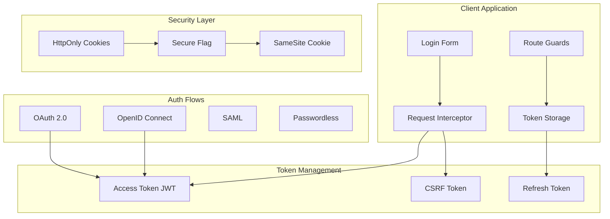
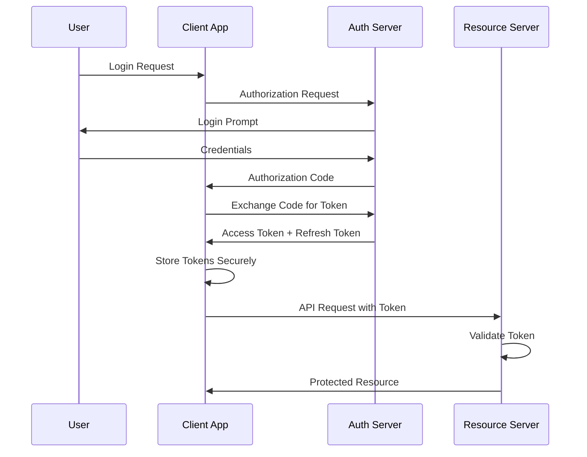
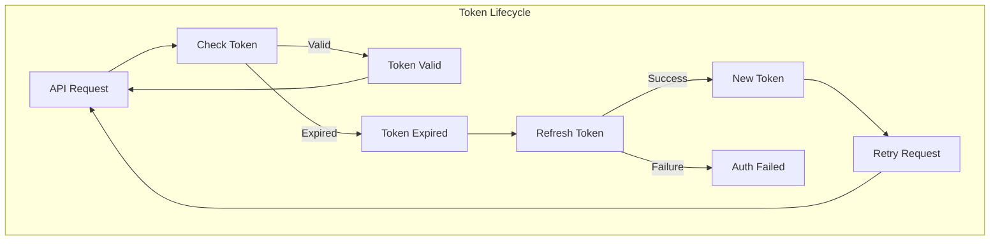
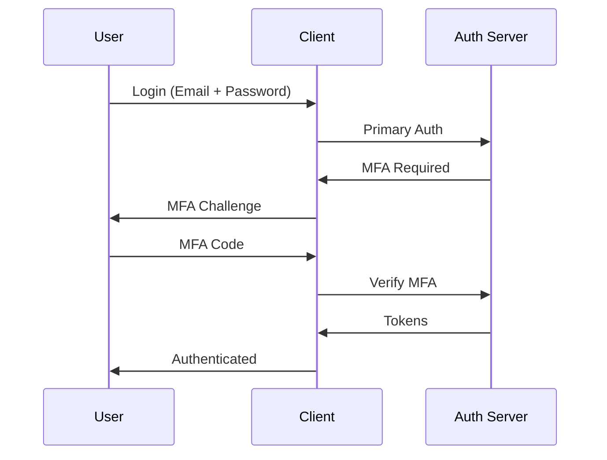

# Frontend Authentication Patterns

## Authentication Architecture



## OAuth 2.0 / OIDC Flow



## Token Storage Strategies

### Option 1: HttpOnly Cookies (Recommended)

```typescript
// Server sets cookie:
// Set-Cookie: access_token=xxx; HttpOnly; Secure; SameSite=Strict; Path=/api

// Client automatically sends cookies with requests
// No client-side token storage needed for access tokens

// For refresh tokens (if using rotation):
// Set-Cookie: refresh_token=xxx; HttpOnly; Secure; SameSite=Strict; Path=/api/auth; Max-Age=604800
```

### Option 2: Memory + Refresh Token

```typescript
// src/services/auth.ts
class AuthService {
  private accessToken: string | null = null;

  async login(email: string, password: string): Promise<void> {
    const response = await fetch('/api/auth/login', {
      method: 'POST',
      credentials: 'include', // Include cookies
      headers: { 'Content-Type': 'application/json' },
      body: JSON.stringify({ email, password }),
    });

    if (!response.ok) throw new Error('Login failed');

    const data = await response.json();
    // Store access token in memory only
    this.accessToken = data.accessToken;
    // Refresh token is stored in HttpOnly cookie
  }

  getAccessToken(): string | null {
    return this.accessToken;
  }

  async refreshAccessToken(): Promise<string> {
    const response = await fetch('/api/auth/refresh', {
      method: 'POST',
      credentials: 'include',
    });

    if (!response.ok) {
      this.logout();
      throw new Error('Refresh failed');
    }

    const data = await response.json();
    this.accessToken = data.accessToken;
    return data.accessToken;
  }

  logout(): void {
    this.accessToken = null;
    fetch('/api/auth/logout', {
      method: 'POST',
      credentials: 'include',
    });
  }
}

export const authService = new AuthService();
```

### Option 3: Secure localStorage (Not Recommended for Tokens)

```typescript
// ⚠️ This approach is less secure. Use only if cookies are not feasible.
// Access tokens should still be short-lived.

const AUTH_KEY = 'auth_tokens';

interface StoredTokens {
  accessToken: string;
  refreshToken: string;
  expiresAt: number;
}

export function storeTokens(tokens: StoredTokens): void {
  // Encode to prevent basic tampering
  const encoded = btoa(JSON.stringify(tokens));
  localStorage.setItem(AUTH_KEY, encoded);
}

export function getStoredTokens(): StoredTokens | null {
  const encoded = localStorage.getItem(AUTH_KEY);
  if (!encoded) return null;

  try {
    const tokens = JSON.parse(atob(encoded));
    if (tokens.expiresAt < Date.now()) {
      clearTokens();
      return null;
    }
    return tokens;
  } catch {
    clearTokens();
    return null;
  }
}

export function clearTokens(): void {
  localStorage.removeItem(AUTH_KEY);
}
```

## JWT Token Structure

```json
{
  "header": {
    "alg": "RS256",
    "typ": "JWT",
    "kid": "key-id-123"
  },
  "payload": {
    "sub": "user-123",
    "name": "John Doe",
    "email": "john@example.com",
    "roles": ["user", "admin"],
    "permissions": ["read", "write", "delete"],
    "iss": "https://auth.example.com",
    "aud": "https://api.example.com",
    "exp": 1700000000,
    "iat": 1699996400,
    "jti": "unique-token-id"
  }
}
```

## Token Refresh Pattern



## Multi-Factor Authentication (MFA)



## Session Management

```typescript
// src/services/session.ts
class SessionManager {
  private timeoutId: ReturnType<typeof setTimeout> | null = null;
  private readonly TIMEOUT = 30 * 60 * 1000; // 30 minutes
  private readonly WARNING = 5 * 60 * 1000; // 5 minutes before expiry

  constructor() {
    this.setupActivityListeners();
  }

  private setupActivityListeners() {
    const events = ['mousedown', 'keydown', 'scroll', 'touchstart'];
    events.forEach((event) => {
      document.addEventListener(event, () => this.resetTimer(), {
        passive: true,
      });
    });
  }

  start() {
    this.resetTimer();
  }

  private resetTimer() {
    if (this.timeoutId) clearTimeout(this.timeoutId);

    this.timeoutId = setTimeout(() => {
      this.showWarning();
    }, this.TIMEOUT - this.WARNING);
  }

  private showWarning() {
    // Show session expiry warning modal
    window.dispatchEvent(new CustomEvent('session:warning'));

    // Auto-logout after warning period
    setTimeout(() => {
      this.logout();
    }, this.WARNING);
  }

  private logout() {
    window.dispatchEvent(new CustomEvent('session:expired'));
  }

  stop() {
    if (this.timeoutId) clearTimeout(this.timeoutId);
  }
}

export const sessionManager = new SessionManager();
```

## CSRF Protection

```typescript
// src/utils/csrf.ts
function getCSRFToken(): string {
  const metaTag = document.querySelector('meta[name="csrf-token"]');
  return metaTag?.getAttribute('content') || '';
}

function getCSRF_COOKIE(): string {
  const match = document.cookie.match(/XSRF-TOKEN=([^;]+)/);
  return match ? decodeURIComponent(match[1]) : '';
}

// Add to all state-changing requests
export function csrfHeaders(): Record<string, string> {
  return {
    'X-CSRF-Token': getCSRFToken() || getCSRF_COOKIE(),
  };
}

// Axios interceptor for CSRF
apiClient.interceptors.request.use((config) => {
  if (['post', 'put', 'patch', 'delete'].includes(config.method || '')) {
    config.headers['X-CSRF-Token'] = getCSRF_COOKIE();
  }
  return config;
});
```

## Secure Authentication Checklist

- [ ] Never store tokens in localStorage/sessionStorage for production
- [ ] Use HttpOnly, Secure, SameSite=Strict cookies
- [ ] Implement token refresh with rotation
- [ ] Validate tokens server-side on every request
- [ ] Implement CSRF protection for cookie-based auth
- [ ] Use PKCE for OAuth 2.0 flows
- [ ] Implement rate limiting on auth endpoints
- [ ] Log authentication events for audit
- [ ] Implement account lockout after failed attempts
- [ ] Use secure password hashing (bcrypt/argon2) on server
- [ ] Implement session timeout with warning
- [ ] Clear all auth data on logout
