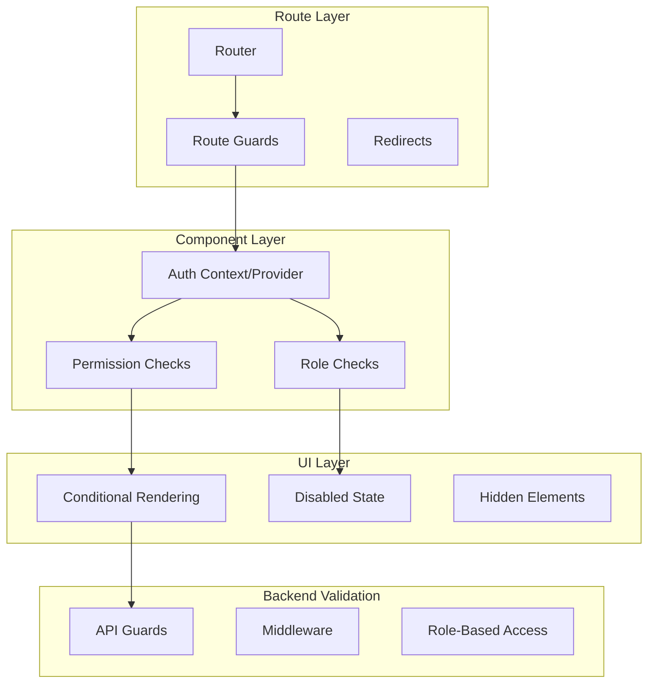
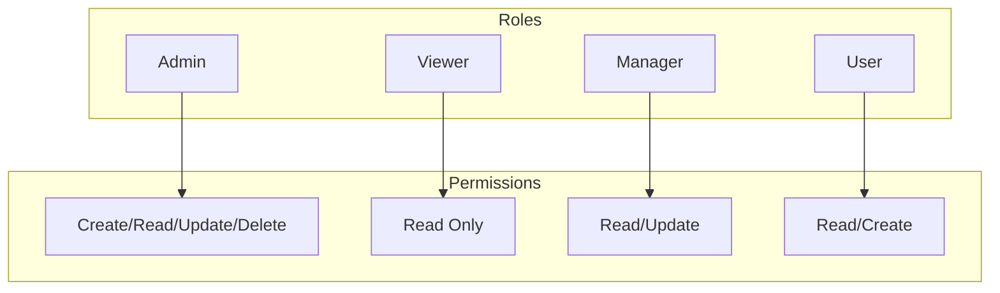
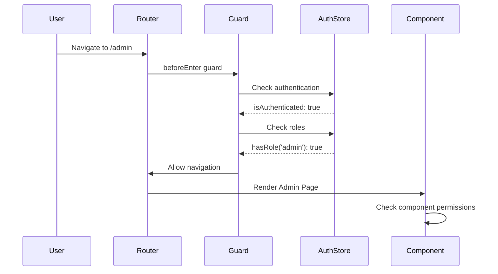

# Client-Side Authorization & Access Control

## Authorization Architecture



## Role-Based Access Control (RBAC)



## React Route Guard Implementation

```tsx
// src/components/auth/ProtectedRoute.tsx
import { Navigate, useLocation } from 'react-router-dom';
import { useAuth } from '../../hooks/useAuth';
import type { ReactNode } from 'react';

interface ProtectedRouteProps {
  children: ReactNode;
  requiredRoles?: string[];
  requiredPermissions?: string[];
  fallback?: string;
}

export function ProtectedRoute({
  children,
  requiredRoles = [],
  requiredPermissions = [],
  fallback = '/login',
}: ProtectedRouteProps) {
  const { user, isAuthenticated, hasRole, hasPermission } = useAuth();
  const location = useLocation();

  if (!isAuthenticated) {
    return <Navigate to={fallback} state={{ from: location }} replace />;
  }

  if (requiredRoles.length > 0) {
    const hasRequiredRole = requiredRoles.some((role) => hasRole(role));
    if (!hasRequiredRole) {
      return <Navigate to="/unauthorized" replace />;
    }
  }

  if (requiredPermissions.length > 0) {
    const hasRequiredPermission = requiredPermissions.every((perm) =>
      hasPermission(perm)
    );
    if (!hasRequiredPermission) {
      return <Navigate to="/unauthorized" replace />;
    }
  }

  return <>{children}</>;
}

// Usage in router
// <Route path="/admin" element={
//   <ProtectedRoute requiredRoles={['admin']}>
//     <AdminDashboard />
//   </ProtectedRoute>
// } />
```

## Vue Route Guard Implementation

```typescript
// src/router/guards.ts
import { useRouter, useRoute } from 'vue-router';
import { useAuthStore } from '@/stores/auth';
import type { RouteRecordRaw } from 'vue-router';

export function setupRouteGuards(routes: RouteRecordRaw[]) {
  const router = useRouter();

  router.beforeEach(async (to, from, next) => {
    const authStore = useAuthStore();

    // Check if route requires authentication
    if (to.meta.requiresAuth && !authStore.isAuthenticated) {
      return next({ name: 'login', query: { redirect: to.fullPath } });
    }

    // Check roles
    if (to.meta.roles) {
      const hasRequiredRole = to.meta.roles.some((role: string) =>
        authStore.hasRole(role)
      );
      if (!hasRequiredRole) {
        return next({ name: 'unauthorized' });
      }
    }

    // Check permissions
    if (to.meta.permissions) {
      const hasRequiredPermission = to.meta.permissions.every(
        (permission: string) => authStore.hasPermission(permission)
      );
      if (!hasRequiredPermission) {
        return next({ name: 'unauthorized' });
      }
    }

    next();
  });
}
```

## Component-Level Permission Hiding

```tsx
// React Permission Component
interface PermissionGateProps {
  permission: string | string[];
  requireAll?: boolean;
  fallback?: ReactNode;
  children: ReactNode;
}

export function PermissionGate({
  permission,
  requireAll = false,
  fallback = null,
  children,
}: PermissionGateProps) {
  const { hasPermission } = useAuth();
  const permissions = Array.isArray(permission) ? permission : [permission];

  const hasAccess = requireAll
    ? permissions.every((p) => hasPermission(p))
    : permissions.some((p) => hasPermission(p));

  if (!hasAccess) return <>{fallback}</>;
  return <>{children}</>;
}

// Vue Permission Directive
// app.directive('permission', {
//   mounted(el, binding) {
//     const authStore = useAuthStore();
//     const permissions = Array.isArray(binding.value)
//       ? binding.value
//       : [binding.value];
//     const hasAccess = permissions.some((p) => authStore.hasPermission(p));
//     if (!hasAccess) {
//       el.remove();
//     }
//   },
// });
```

## Conditional UI Rendering

```tsx
// Render differently based on permissions
export function UserActions({ user }: { user: User }) {
  const { hasPermission, hasRole } = useAuth();

  return (
    <div className="user-actions">
      <Button onClick={() => viewUser(user.id)}>View</Button>

      {hasPermission('user:update') && (
        <Button onClick={() => editUser(user.id)}>Edit</Button>
      )}

      <PermissionGate permission={['user:delete', 'admin:delete']}>
        <Button
          variant="danger"
          onClick={() => deleteUser(user.id)}
        >
          Delete
        </Button>
      </PermissionGate>

      {hasRole('admin') && (
        <Button onClick={() => impersonateUser(user.id)}>
          Impersonate
        </Button>
      )}
    </div>
  );
}
```

## API Authorization Headers

```typescript
// Add role/permission context to API requests
apiClient.interceptors.request.use((config) => {
  const authStore = useAuthStore();

  if (authStore.user) {
    config.headers['X-User-Id'] = authStore.user.id;
    config.headers['X-User-Roles'] = authStore.user.roles.join(',');
  }

  return config;
});
```

## Authorization State Flow



## Permission Constants

```typescript
// src/constants/permissions.ts
export const PERMISSIONS = {
  USER: {
    CREATE: 'user:create',
    READ: 'user:read',
    UPDATE: 'user:update',
    DELETE: 'user:delete',
    LIST: 'user:list',
  },
  POST: {
    CREATE: 'post:create',
    READ: 'post:read',
    UPDATE: 'post:update',
    DELETE: 'post:delete',
    PUBLISH: 'post:publish',
  },
  SETTINGS: {
    READ: 'settings:read',
    UPDATE: 'settings:update',
  },
} as const;

export const ROLES = {
  SUPER_ADMIN: 'super_admin',
  ADMIN: 'admin',
  MANAGER: 'manager',
  USER: 'user',
  VIEWER: 'viewer',
} as const;

// Role-Permission mapping
export const ROLE_PERMISSIONS: Record<string, string[]> = {
  [ROLES.SUPER_ADMIN]: Object.values(PERMISSIONS).flatMap(Object.values),
  [ROLES.ADMIN]: [
    ...Object.values(PERMISSIONS.USER),
    ...Object.values(PERMISSIONS.POST),
    PERMISSIONS.SETTINGS.READ,
  ],
  [ROLES.MANAGER]: [
    PERMISSIONS.USER.READ,
    PERMISSIONS.USER.LIST,
    PERMISSIONS.POST.CREATE,
    PERMISSIONS.POST.READ,
    PERMISSIONS.POST.UPDATE,
  ],
  [ROLES.USER]: [
    PERMISSIONS.USER.READ,
    PERMISSIONS.POST.READ,
    PERMISSIONS.POST.CREATE,
  ],
  [ROLES.VIEWER]: [PERMISSIONS.USER.READ, PERMISSIONS.POST.READ],
};
```

## Security Considerations

- **Never rely solely on client-side authorization** - always validate on the server
- **Hide UI elements** - don't just disable them, remove them entirely
- **Use route-level AND component-level guards** - defense in depth
- **Audit authorization decisions** - log access attempts
- **Handle expired sessions gracefully** - redirect to login with context
