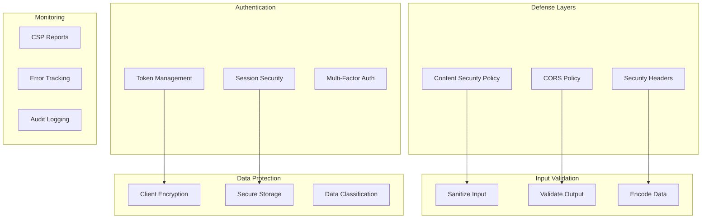

# Frontend Security Best Practices

## Security Architecture



## OWASP Top 10 Mitigations

### A01: Broken Access Control

```typescript
// Always validate permissions server-side
// Client-side checks are UX only, not security

// BAD: Client-only authorization
if (user.role === 'admin') {
  showAdminPanel(); // Attacker can bypass this
}

// GOOD: Server validates, client displays
const { data: adminData } = await fetch('/api/admin/check', {
  credentials: 'include',
});
if (adminData.isAdmin) {
  showAdminPanel();
}
```

### A02: Cryptographic Failures

```typescript
// Never store secrets in client code
// BAD
const API_KEY = 'sk_live_abc123'; // Exposed in bundle

// GOOD
const API_ENDPOINT = '/api/data'; // Use proxy, no secrets in client

// Never use weak hashing on client
// BAD
import md5 from 'md5';
const hash = md5(password); // Weak hash

// GOOD - Let server handle hashing
const response = await fetch('/api/auth/login', {
  method: 'POST',
  body: JSON.stringify({ email, password }), // Server uses bcrypt/argon2
});
```

### A03: Injection

```typescript
// XSS Prevention
function escapeHtml(unsafe: string): string {
  return unsafe
    .replace(/&/g, '&amp;')
    .replace(/</g, '&lt;')
    .replace(/>/g, '&gt;')
    .replace(/"/g, '&quot;')
    .replace(/'/g, '&#039;');
}

// React auto-escapes, but be careful with:
// 1. dangerouslySetInnerHTML (avoid)
// 2. URL attributes (javascript: protocol)
// 3. eval() and similar functions

// BAD
<div dangerouslySetInnerHTML={{ __html: userContent }} />
<a href={userProvidedUrl}>Click</a> // Could be javascript:alert(1)

// GOOD
<div>{userContent}</div> // Auto-escaped
<a href={sanitizeUrl(userProvidedUrl)}>Click</a>

function sanitizeUrl(url: string): string {
  try {
    const parsed = new URL(url);
    if (['http:', 'https:'].includes(parsed.protocol)) {
      return url;
    }
  } catch {}
  return '#';
}
```

### A04: Insecure Design

```typescript
// Implement rate limiting on client
class RateLimiter {
  private attempts: Map<string, number[]> = new Map();

  isAllowed(key: string, maxAttempts: number, windowMs: number): boolean {
    const now = Date.now();
    const attempts = this.attempts.get(key) || [];

    // Remove old attempts outside window
    const validAttempts = attempts.filter((time) => now - time < windowMs);

    if (validAttempts.length >= maxAttempts) {
      return false;
    }

    validAttempts.push(now);
    this.attempts.set(key, validAttempts);
    return true;
  }
}

const loginLimiter = new RateLimiter();

async function handleLogin(email: string, password: string) {
  if (!loginLimiter.isAllowed(email, 5, 60000)) {
    throw new Error('Too many login attempts. Please try again later.');
  }
  // Proceed with login
}
```

### A05: Security Misconfiguration

```typescript
// Content Security Policy meta tag
// Add to index.html:
// <meta http-equiv="Content-Security-Policy"
//   content="default-src 'self';
//     script-src 'self' https://trusted-cdn.com;
//     style-src 'self' 'unsafe-inline';
//     img-src 'self' data: https:;
//     connect-src 'self' https://api.example.com;
//     font-src 'self' https://fonts.gstatic.com;
//     frame-ancestors 'none';
//     base-uri 'self';
//     form-action 'self';">

// Environment variable validation
const requiredEnvVars = [
  'VITE_API_BASE_URL',
  'VITE_APP_NAME',
] as const;

requiredEnvVars.forEach((varName) => {
  if (!import.meta.env[varName]) {
    console.error(`Missing required environment variable: ${varName}`);
  }
});
```

### A06: Vulnerable Components

```typescript
// Regular dependency audits
// package.json scripts:
// "audit": "npm audit --production",
// "audit:fix": "npm audit fix"

// Automated dependency scanning in CI:
// - Dependabot
// - Snyk
// - npm audit
```

### A07: Authentication Failures

```typescript
// Secure password requirements
const PASSWORD_REQUIREMENTS = {
  minLength: 12,
  maxLength: 128,
  requireUppercase: true,
  requireLowercase: true,
  requireNumbers: true,
  requireSpecialChars: true,
  disallowCommonPasswords: true,
};

function validatePassword(password: string): string[] {
  const errors: string[] = [];

  if (password.length < PASSWORD_REQUIREMENTS.minLength) {
    errors.push(`Password must be at least ${PASSWORD_REQUIREMENTS.minLength} characters`);
  }
  if (password.length > PASSWORD_REQUIREMENTS.maxLength) {
    errors.push(`Password must be no more than ${PASSWORD_REQUIREMENTS.maxLength} characters`);
  }
  if (PASSWORD_REQUIREMENTS.requireUppercase && !/[A-Z]/.test(password)) {
    errors.push('Password must contain an uppercase letter');
  }
  if (PASSWORD_REQUIREMENTS.requireLowercase && !/[a-z]/.test(password)) {
    errors.push('Password must contain a lowercase letter');
  }
  if (PASSWORD_REQUIREMENTS.requireNumbers && !/\d/.test(password)) {
    errors.push('Password must contain a number');
  }
  if (PASSWORD_REQUIREMENTS.requireSpecialChars && !/[!@#$%^&*]/.test(password)) {
    errors.push('Password must contain a special character');
  }

  return errors;
}
```

### A08: Software & Data Integrity

```typescript
// Subresource Integrity for external resources
// <script src="https://cdn.example.com/lib.js"
//   integrity="sha384-oqVuAfXRKap7fdgcCY5uykM6+R9GqQ8K/uxy9rx7HNQlGYl1kPzQho1wx4JwY8w"
//   crossorigin="anonymous"></script>

// Verify API responses
async function secureFetch(url: string): Promise<Response> {
  const response = await fetch(url, {
    credentials: 'include',
    headers: {
      'X-Request-Id': crypto.randomUUID(),
    },
  });

  if (!response.ok) {
    throw new Error(`HTTP ${response.status}`);
  }

  return response;
}
```

### A09: Logging & Monitoring Failures

```typescript
// Error tracking without sensitive data
class ErrorTracker {
  private sanitizeError(error: unknown): Record<string, unknown> {
    const sanitized = {
      message: error instanceof Error ? error.message : 'Unknown error',
      stack: error instanceof Error ? error.stack : undefined,
      timestamp: new Date().toISOString(),
      url: window.location.href,
      userAgent: navigator.userAgent,
    };

    // Remove sensitive data
    return {
      ...sanitized,
      message: sanitized.message
        .replace(/password\s*[:=]\s*\S+/gi, 'password=[REDACTED]')
        .replace(/token\s*[:=]\s*\S+/gi, 'token=[REDACTED]'),
    };
  }

  reportError(error: unknown) {
    const sanitized = this.sanitizeError(error);

    // Send to error tracking service
    fetch('/api/errors', {
      method: 'POST',
      headers: { 'Content-Type': 'application/json' },
      body: JSON.stringify(sanitized),
    }).catch(() => {
      // Fail silently - don't crash the app for logging failures
    });
  }
}

export const errorTracker = new ErrorTracker();
```

### A10: Server-Side Request Forgery (SSRF)

```typescript
// Validate URLs before fetching
function isValidUrl(url: string): boolean {
  try {
    const parsed = new URL(url);
    const allowedProtocols = ['http:', 'https:'];
    const blockedHosts = ['localhost', '127.0.0.1', '0.0.0.0', '::1'];

    if (!allowedProtocols.includes(parsed.protocol)) return false;
    if (blockedHosts.includes(parsed.hostname)) return false;
    if (/^\d+\.\d+\.\d+\.\d+$/.test(parsed.hostname)) return false;

    return true;
  } catch {
    return false;
  }
}
```

## Security Headers Configuration

```typescript
// For production deployment (nginx example)
// add_header X-Frame-Options "DENY" always;
// add_header X-Content-Type-Options "nosniff" always;
// add_header X-XSS-Protection "1; mode=block" always;
// add_header Referrer-Policy "strict-origin-when-cross-origin" always;
// add_header Permissions-Policy "camera=(), microphone=(), geolocation=()" always;
// add_header Strict-Transport-Security "max-age=31536000; includeSubDomains" always;
// add_header Content-Security-Policy "default-src 'self'; script-src 'self'" always;
```

## Secure Coding Checklist

- [ ] No secrets in client-side code
- [ ] All inputs validated and sanitized
- [ ] Output encoding for all dynamic content
- [ ] CSRF protection for state-changing operations
- [ ] Rate limiting on sensitive endpoints
- [ ] Secure HTTP headers configured
- [ ] CSP policy implemented
- [ ] Dependencies regularly audited
- [ ] Error messages don't leak sensitive info
- [ ] Logs don't contain sensitive data
