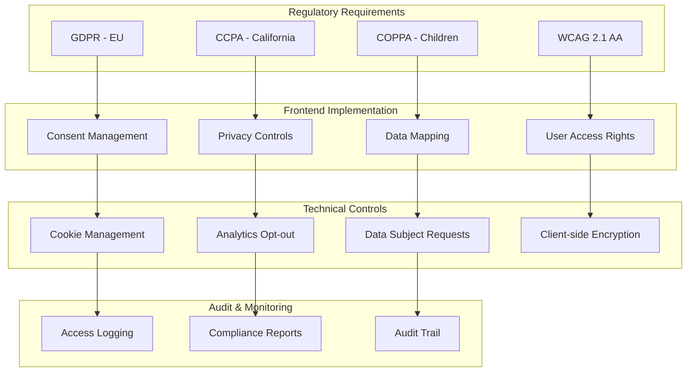

# Compliance: GDPR, CCPA, & Accessibility

## Compliance Architecture



## GDPR Compliance Checklist

### Data Collection & Consent

```typescript
// src/services/consent.ts
interface ConsentPreferences {
  necessary: boolean;
  analytics: boolean;
  marketing: boolean;
  personalization: boolean;
  timestamp: string;
  version: string;
}

class ConsentManager {
  private readonly CONSENT_KEY = 'user_consent';
  private readonly CONSENT_VERSION = '1.0';

  getConsent(): ConsentPreferences | null {
    const stored = localStorage.getItem(this.CONSENT_KEY);
    if (!stored) return null;

    const consent = JSON.parse(stored);
    if (consent.version !== this.CONSENT_VERSION) {
      this.clearConsent();
      return null;
    }
    return consent;
  }

  setConsent(preferences: Omit<ConsentPreferences, 'timestamp' | 'version'>) {
    const consent: ConsentPreferences = {
      ...preferences,
      timestamp: new Date().toISOString(),
      version: this.CONSENT_VERSION,
    };
    localStorage.setItem(this.CONSENT_KEY, JSON.stringify(consent));
    this.applyConsent(consent);
  }

  clearConsent() {
    localStorage.removeItem(this.CONSENT_KEY);
    this.disableAllTracking();
  }

  hasConsent(type: keyof Omit<ConsentPreferences, 'timestamp' | 'version'>): boolean {
    const consent = this.getConsent();
    return consent?.[type] ?? false;
  }

  private applyConsent(consent: ConsentPreferences) {
    if (consent.analytics) {
      this.enableAnalytics();
    } else {
      this.disableAnalytics();
    }

    if (consent.marketing) {
      this.enableMarketing();
    } else {
      this.disableMarketing();
    }
  }

  private enableAnalytics() {
    // Initialize analytics only after consent
    window.dataLayer = window.dataLayer || [];
    window.dataLayer.push(['consent', 'update', { analytics_storage: 'granted' }]);
  }

  private disableAnalytics() {
    window.dataLayer = window.dataLayer || [];
    window.dataLayer.push(['consent', 'update', { analytics_storage: 'denied' }]);
  }

  private enableMarketing() {
    window.dataLayer = window.dataLayer || [];
    window.dataLayer.push(['consent', 'update', { ad_storage: 'granted' }]);
  }

  private disableMarketing() {
    window.dataLayer = window.dataLayer || [];
    window.dataLayer.push(['consent', 'update', { ad_storage: 'denied' }]);
  }

  private disableAllTracking() {
    this.disableAnalytics();
    this.disableMarketing();
  }
}

export const consentManager = new ConsentManager();
```

### Cookie Consent Banner

```tsx
// src/components/CookieConsent.tsx
import { useState, useEffect } from 'react';
import { consentManager } from '../services/consent';

export function CookieConsent() {
  const [showBanner, setShowBanner] = useState(false);
  const [preferences, setPreferences] = useState({
    necessary: true,
    analytics: false,
    marketing: false,
    personalization: false,
  });

  useEffect(() => {
    const consent = consentManager.getConsent();
    if (!consent) {
      setShowBanner(true);
    }
  }, []);

  const handleAcceptAll = () => {
    consentManager.setConsent({
      necessary: true,
      analytics: true,
      marketing: true,
      personalization: true,
    });
    setShowBanner(false);
  };

  const handleSavePreferences = () => {
    consentManager.setConsent(preferences);
    setShowBanner(false);
  };

  if (!showBanner) return null;

  return (
    <div className="cookie-consent-banner" role="dialog" aria-label="Cookie consent">
      <p>
        We use cookies to enhance your experience. You can customize your
        preferences or accept all cookies.
      </p>
      <div className="cookie-options">
        <label>
          <input type="checkbox" checked disabled />
          Necessary (always active)
        </label>
        <label>
          <input
            type="checkbox"
            checked={preferences.analytics}
            onChange={(e) =>
              setPreferences({ ...preferences, analytics: e.target.checked })
            }
          />
          Analytics
        </label>
        <label>
          <input
            type="checkbox"
            checked={preferences.marketing}
            onChange={(e) =>
              setPreferences({ ...preferences, marketing: e.target.checked })
            }
          />
          Marketing
        </label>
        <label>
          <input
            type="checkbox"
            checked={preferences.personalization}
            onChange={(e) =>
              setPreferences({
                ...preferences,
                personalization: e.target.checked,
              })
            }
          />
          Personalization
        </label>
      </div>
      <div className="cookie-actions">
        <button onClick={handleSavePreferences}>Save Preferences</button>
        <button onClick={handleAcceptAll}>Accept All</button>
      </div>
    </div>
  );
}
```

## CCPA Compliance

```typescript
// src/services/ccpa.ts
class CCPAService {
  // Do Not Sell My Personal Information
  async getDoNotSellStatus(): Promise<boolean> {
    const response = await fetch('/api/ccpa/do-not-sell', {
      credentials: 'include',
    });
    const data = await response.json();
    return data.doNotSell;
  }

  async setDoNotSell(doNotSell: boolean): Promise<void> {
    await fetch('/api/ccpa/do-not-sell', {
      method: 'POST',
      credentials: 'include',
      headers: { 'Content-Type': 'application/json' },
      body: JSON.stringify({ doNotSell }),
    });
  }

  // Data Deletion Request
  async requestDataDeletion(): Promise<string> {
    const response = await fetch('/api/ccpa/delete-request', {
      method: 'POST',
      credentials: 'include',
    });
    const data = await response.json();
    return data.requestId;
  }

  // Data Access Request
  async requestDataAccess(): Promise<string> {
    const response = await fetch('/api/ccpa/access-request', {
      method: 'POST',
      credentials: 'include',
    });
    const data = await response.json();
    return data.requestId;
  }
}

export const ccpaService = new CCPAService();
```

## Privacy Policy Display

```tsx
// src/components/PrivacyPolicy.tsx
export function PrivacyPolicy() {
  return (
    <article className="privacy-policy" role="article">
      <h1>Privacy Policy</h1>
      <p><em>Last updated: {new Date().toLocaleDateString()}</em></p>

      <section>
        <h2>Information We Collect</h2>
        <p>We collect information you provide directly to us...</p>
      </section>

      <section>
        <h2>How We Use Your Information</h2>
        <p>We use the information we collect to...</p>
      </section>

      <section>
        <h2>Your Rights</h2>
        <p>Depending on your location, you may have the right to...</p>
        <ul>
          <li>Access your personal data</li>
          <li>Correct inaccurate data</li>
          <li>Request deletion of your data</li>
          <li>Opt-out of data selling (CCPA)</li>
          <li>Data portability</li>
        </ul>
      </section>

      <section>
        <h2>Contact Us</h2>
        <p>For privacy-related inquiries, contact us at...</p>
      </section>
    </article>
  );
}
```

## Data Subject Rights Implementation

```typescript
// src/services/dataRights.ts
interface DataRightsRequest {
  type: 'access' | 'deletion' | 'portability' | 'correction';
  details?: string;
}

class DataRightsService {
  async submitRequest(request: DataRightsRequest): Promise<string> {
    const response = await fetch('/api/privacy/request', {
      method: 'POST',
      credentials: 'include',
      headers: { 'Content-Type': 'application/json' },
      body: JSON.stringify(request),
    });
    const data = await response.json();
    return data.requestId;
  }

  async getRequestStatus(requestId: string): Promise<{
    status: 'pending' | 'processing' | 'completed' | 'rejected';
    updatedAt: string;
  }> {
    const response = await fetch(`/api/privacy/request/${requestId}`, {
      credentials: 'include',
    });
    return response.json();
  }

  async exportUserData(): Promise<Blob> {
    const response = await fetch('/api/privacy/export', {
      credentials: 'include',
    });
    return response.blob();
  }
}

export const dataRightsService = new DataRightsService();
```

## Accessibility Quick Reference

- All images must have descriptive `alt` text
- Color contrast ratio minimum 4.5:1 for normal text
- All interactive elements must be keyboard accessible
- Form inputs must have associated labels
- ARIA landmarks for page structure
- Focus management for modals and dynamic content
- Skip navigation links
- Reduced motion support via `prefers-reduced-motion`

## Legal Disclaimers

> **Template Notice:** This compliance template provides general guidance.
> Consult legal counsel for specific regulatory requirements applicable
> to your jurisdiction and industry.

## Privacy by Design Principles

1. **Data Minimization** - Collect only what's necessary
2. **Purpose Limitation** - Use data only for stated purposes
3. **Storage Limitation** - Retain data only as long as needed
4. **Accuracy** - Keep data accurate and up to date
5. **Integrity & Confidentiality** - Protect data appropriately
6. **Accountability** - Demonstrate compliance
