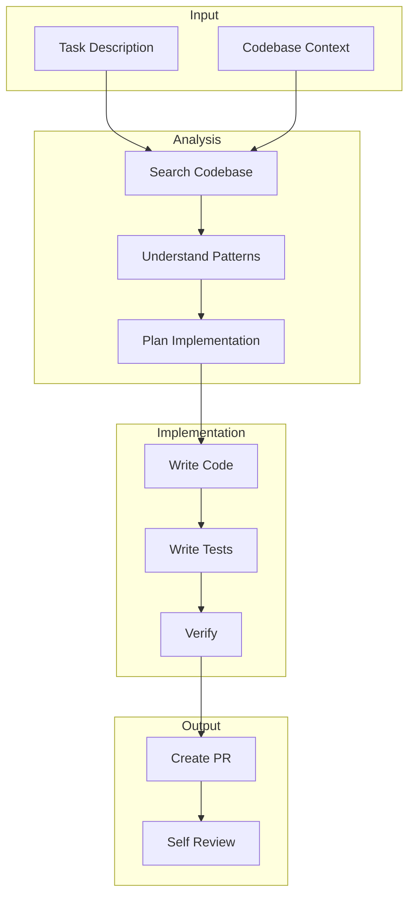

# AI Agent Instructions for Mobile Development

## Project Context

This document provides instructions for AI agents working on this mobile project. Follow these guidelines to maintain consistency and quality.

## Code Generation Rules

### Platform-Specific

```yaml
ios:
  language: Swift 5.9+
  min_deployment: iOS 16.0
  ui_framework: SwiftUI
  architecture: MVVM + Clean Architecture
  conventions: swift_api_design_guidelines
  di: factory_pattern_or_swinject
  
android:
  language: Kotlin 1.9+
  min_deployment: API 24 (Android 7.0)
  ui_framework: Jetpack Compose
  architecture: MVVM + Clean Architecture
  conventions: kotlin_coding_conventions
  di: hilt
  
react_native:
  language: TypeScript 5.0+
  runtime: React Native 0.73+
  ui_framework: React Native / NativeWind
  architecture: Feature-based
  state: Zustand / Redux Toolkit
  navigation: React Navigation 6
  
flutter:
  language: Dart 3.0+
  version: Flutter 3.x
  ui_framework: Material 3
  architecture: Feature-based + Clean
  state: Riverpod
  navigation: GoRouter
```

### File Naming

```
# Components/Views
{FeatureName}Screen.{ext}          # Screen-level component
{FeatureName}View.{ext}            # Reusable view
{ComponentName}.{ext}              # Generic component

# State/ViewModels
{FeatureName}ViewModel.{ext}       # iOS/Android
{featureName}Slice.{ext}           # React Native (Redux)
{featureName}Provider.{ext}        # Flutter (Riverpod)

# Models
{ModelName}.{ext}                  # Domain model
{ModelName}DTO.{ext}               # Data transfer object
{ModelName}Mapper.{ext}            # Data mapper

# Services
{ServiceName}Service.{ext}         # Service class
{ServiceName}Repository.{ext}      # Repository pattern

# Tests
{FeatureName}Tests.{ext}           # Test file
{FeatureName}Mock.{ext}            # Mock objects
```

### Code Patterns

```yaml
state_management:
  description: |
    Each feature should have a clear state object.
    State should be immutable.
    Only expose actions/methods that modify state.
    
  example: |
    // iOS: @Observable class
    @Observable
    class HomeViewModel {
        var items: [Item] = []
        var isLoading = false
        var error: String?
        
        func loadItems() async { ... }
    }
    
    // Android: StateFlow
    class HomeViewModel @Inject constructor(
        private val getItems: GetItemsUseCase
    ) : ViewModel() {
        private val _uiState = MutableStateFlow(HomeUiState())
        val uiState = _uiState.asStateFlow()
        
        fun loadItems() { ... }
    }

networking:
  description: |
    Always use the existing API client.
    Handle all error cases.
    Never hardcode URLs.
    Use proper HTTP methods.
    
  error_handling: |
    - Map API errors to domain errors
    - Handle network timeout (30s)
    - Implement retry with exponential backoff
    - Cache last successful response

storage:
  description: |
    Use platform secure storage for sensitive data.
    Use regular storage for preferences.
    Implement proper encryption for local data.
    Handle storage errors gracefully.

testing:
  unit_test_coverage: 80%
  naming_convention: "test_{action}_{expected_result}"
  structure: "Given_When_Then"
```

## Code Review Checklist

When reviewing code, check for:

### Security

```yaml
security_checks:
  - no_hardcoded_secrets_or_api_keys
  - tokens_stored_in_secure_storage_only
  - network_communication_over_tls
  - input_validation_on_all_user_input
  - proper_error_handling_without_leaking_info
  - jailbreak_detection_if_required
  - certificate_pinning_configured
  - sensitive_data_not_in_logs
```

### Performance

```yaml
performance_checks:
  - images_properly_sized_and_cached
  - lists_use_lazy_loading
  - no_blocking_main_thread_operations
  - network_requests_use_background_threads
  - memory_leaks_checked
  - image_compression_applied
```

### Accessibility

```yaml
accessibility_checks:
  - all_interactive_elements_have_labels
  - color_contrast_meets_4.5_ratio
  - touch_targets_are_44pt_48dp_minimum
  - dynamic_type_supported
  - reduce_motion_respected
  - screen_reader_navigation_logical
```

### Code Quality

```yaml
quality_checks:
  - follows_naming_conventions
  - no_duplicate_code
  - proper_error_handling
  - adequate_code_comments
  - no_force_unwraps_or_casts
  - immutable_data_structures
  - proper_thread_safety
```

## Feature Implementation Template

When implementing a new feature:

```markdown
## 1. Plan
- Identify affected files
- Review existing patterns
- Define data models
- Plan testing approach

## 2. Implement
- Create data models
- Implement data layer
- Create repository/use cases
- Build ViewModel/State
- Build UI components
- Add navigation

## 3. Test
- Write unit tests
- Add integration tests
- Manual testing
- Accessibility check

## 4. Document
- Update API documentation
- Add inline comments if complex
- Update README if needed
```

## Common Tasks

### Adding a New Screen

```yaml
steps:
  1: Create screen file in feature directory
  2: Create ViewModel/State class
  3: Add navigation route
  4: Implement screen UI
  5: Connect to ViewModel
  6: Add to tab/drawer if needed
  7: Write tests
  8: Add accessibility labels
```

### Adding an API Endpoint

```yaml
steps:
  1: Define request/response models
  2: Add endpoint to API service
  3: Create repository method
  4: Create use case
  5: Update ViewModel to use use case
  6: Handle loading/error states
  7: Write unit tests
  8: Write integration tests
```

### Adding a New Feature Flag

```yaml
steps:
  1: Define flag in feature flag service
  2: Add flag to remote config
  3: Implement feature behind flag
  4: Add fallback for when flag is off
  5: Document flag purpose
```

## Error Messages

Use user-friendly error messages:

```yaml
error_messages:
  network:
    offline: "No internet connection. Please check your network settings."
    timeout: "Connection timed out. Please try again."
    server: "Something went wrong. Please try again later."
    
  auth:
    invalid_credentials: "Incorrect email or password."
    account_locked: "Account temporarily locked. Please try again in {minutes} minutes."
    session_expired: "Your session expired. Please log in again."
    
  permission:
    camera: "Camera access is needed for this feature. Please enable it in Settings."
    location: "Location access is needed. Please enable it in Settings."
    
  generic:
    unexpected: "An unexpected error occurred. Please try again."
    feature_unavailable: "This feature is currently unavailable."
```

## AI Agent Workflow



## Configuration

[CONFIGURE] Update for your project:
- Platform versions and requirements
- Architecture choices
- Naming conventions
- Testing requirements
- Code style rules
- Security requirements
