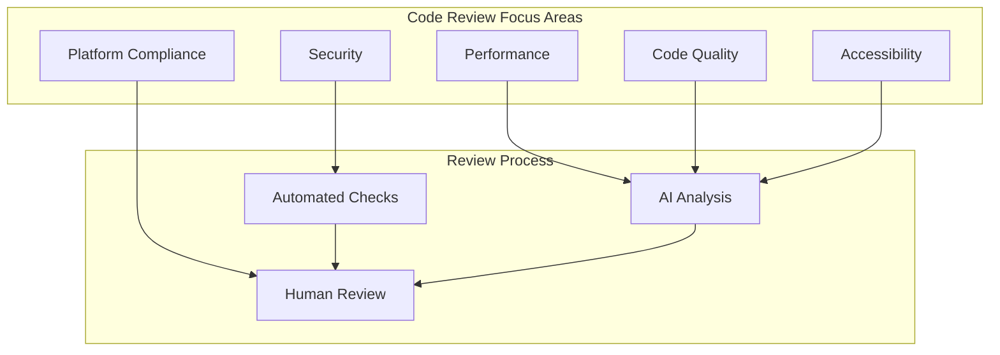
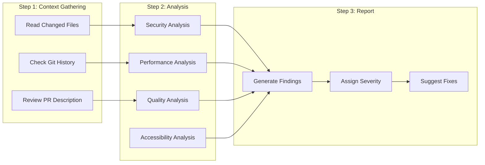

# AI Code Review Guidelines for Mobile

## Review Scope



## Automated Review Rules

### Security Rules

```yaml
security_rules:
  - id: SEC-001
    name: No hardcoded secrets
    pattern: "(api[_-]?key|secret|password|token|credential)\\s*=\\s*[\"'][^\"']+[\"']"
    severity: critical
    fix: "Move to secure storage or environment variables"
    
  - id: SEC-002
    name: Insecure storage
    pattern: "UserDefaults|SharedPreferences|AsyncStorage.*sensitive"
    severity: high
    fix: "Use Keychain/EncryptedSharedPreferences for sensitive data"
    
  - id: SEC-003
    name: HTTP instead of HTTPS
    pattern: "http://"
    severity: high
    fix: "Use HTTPS for all network communications"
    
  - id: SEC-004
    name: Weak cryptography
    pattern: "(MD5|SHA-1|DES|3DES|RC4)"
    severity: high
    fix: "Use SHA-256+ for hashing, AES-256-GCM for encryption"
    
  - id: SEC-005
    name: Console logging sensitive data
    pattern: "print\\(|NSLog\\(|Log\\.d\\(|console\\.log\\(.*(?:token|password|key)"
    severity: medium
    fix: "Remove or use proper logging framework with levels"
```

### Performance Rules

```yaml
performance_rules:
  - id: PERF-001
    name: Main thread blocking
    patterns:
      - "DispatchQueue.main.*sync"
      - "runBlocking"
      - "Thread.sleep"
    severity: high
    fix: "Use async/await or background threads"
    
  - id: PERF-002
    name: Unbounded lists
    patterns:
      - "LazyVStack|LazyColumn|FlatList" without "count" or "limit"
    severity: medium
    fix: "Implement pagination or virtual scrolling"
    
  - id: PERF-003
    name: Missing image optimization
    patterns:
      - "UIImage\\(contentsOfFile|BitmapFactory\\.decodeFile" without compression
    severity: medium
    fix: "Resize and compress images before display"
    
  - id: PERF-004
    name: N+1 queries
    patterns:
      - "for.*in.*query|for.*in.*fetch" inside loops
    severity: high
    fix: "Batch database queries or API calls"
```

### Quality Rules

```yaml
quality_rules:
  - id: QUAL-001
    name: Force unwrap
    patterns:
      - "![^=]"  # Swift force unwrap
      - "!!"     # Kotlin force unwrap
    severity: high
    fix: "Use optional binding or safe calls"
    
  - id: QUAL-002
    name: Magic numbers
    patterns:
      - "if.*[><=!]+\\s*\\d{2,}" (outside constants)
    severity: low
    fix: "Extract to named constants"
    
  - id: QUAL-003
    name: Long function
    metric: function_length > 50 lines
    severity: medium
    fix: "Break into smaller, focused functions"
    
  - id: QUAL-004
    name: Deep nesting
    metric: nesting_depth > 3
    severity: medium
    fix: "Use early returns or extract to methods"
    
  - id: QUAL-005
    name: Duplicate code
    metric: similarity > 80% across files
    severity: medium
    fix: "Extract common logic to shared utility"
```

### Accessibility Rules

```yaml
accessibility_rules:
  - id: A11Y-001
    name: Missing accessibility label
    patterns:
      - "Image.*without.*accessibilityLabel"
      - "Button.*without.*accessibilityLabel"
    severity: high
    fix: "Add accessibilityLabel to all interactive elements"
    
  - id: A11Y-002
    name: Hardcoded text size
    patterns:
      - "\\.font\\(.*size:\\s*\\d+\\)" without dynamic type
    severity: medium
    fix: "Use system text styles or dynamic type scaling"
    
  - id: A11Y-003
    name: Color-only information
    patterns:
      - Error/success indicators using only color
    severity: medium
    fix: "Add text or icon indicators alongside color"
```

## AI Review Process



## Review Comment Templates

### Critical Issue

```markdown
**🔴 Critical: [Issue Title]**

**File:** `path/to/file.ext:line`

**Problem:**
[Description of the critical issue]

**Risk:**
[Potential security/crash/data loss impact]

**Fix:**
```code
// Suggested fix
```

**Reference:** [OWASP/CWE link if applicable]
```

### Warning

```markdown
**🟡 Warning: [Issue Title]**

**File:** `path/to/file.ext:line`

**Problem:**
[Description of the issue]

**Suggestion:**
[How to improve]

**Example:**
```code
// Better approach
```
```

### Information

```markdown
**🔵 Info: [Suggestion Title]**

**File:** `path/to/file.ext:line`

**Note:**
[Optional improvement suggestion]

**Alternative:**
[Better pattern or approach]
```

## Review Checklist

### For Every PR

```yaml
checklist:
  security:
    - no_secrets_exposed
    - secure_storage_used
    - input_validated
    - auth_properly_handled
    
  performance:
    - no_main_thread_blocking
    - images_optimized
    - lists_lazily_loaded
    - memory_usage_optimal
    
  quality:
    - code_follows_conventions
    - no_force_unwraps
    - proper_error_handling
    - adequate_test_coverage
    
  accessibility:
    - labels_on_interactive_elements
    - dynamic_type_supported
    - color_contrast_sufficient
    - screen_reader_tested
    
  platform:
    - ios_guidelines_followed
    - android_guidelines_followed
    - edge_cases_handled
    - offline_state_handled
```

### For New Features

```yaml
additional_checks:
  - feature_flagged_if_needed
  - analytics_tracking_added
  - deep_link_support_if_applicable
  - push_notification_support_if_needed
  - offline_support_implemented
  - error_states_all_covered
  - loading_states_implemented
  - empty_states_implemented
  - retry_mechanism_implemented
```

## Severity Levels

| Level | Description | Action Required |
|-------|-------------|-----------------|
| Critical | Security vulnerability, data loss risk, crash | Must fix before merge |
| High | Performance issue, accessibility blocker | Should fix before merge |
| Medium | Code quality, maintainability | Fix or create follow-up |
| Low | Style, minor improvements | Optional fix |

## Configuration

[CONFIGURE] Update for your project:
- Custom rule patterns for your codebase
- Severity thresholds
- Review templates
- Team-specific guidelines
- Platform-specific rules
