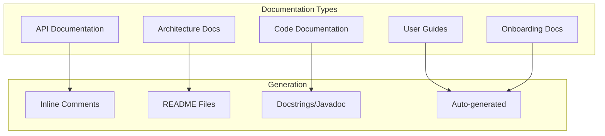

# AI Documentation Standards for Mobile

## Documentation Overview



## Code Documentation Standards

### Swift Documentation

```swift
/// Manages user authentication flows and token lifecycle.
///
/// This service handles login, logout, token refresh, and
/// biometric authentication setup. All tokens are stored
/// securely in the Keychain.
///
/// ## Usage
/// ```swift
/// let authManager = AuthService(keychain: keychainService)
/// let tokens = try await authManager.login(email: "user@example.com", password: "pass")
/// ```
///
/// - Important: This class is not thread-safe. Use from a single queue.
/// - Note: Tokens are automatically refreshed before expiry.
final class AuthService {
    
    /// The currently authenticated user, if any.
    ///
    /// Returns `nil` if no user is authenticated or tokens are expired.
    private(set) var currentUser: User?
    
    /// Authenticates a user with email and password.
    ///
    /// This method sends credentials to the authentication server
    /// and stores the returned tokens in secure storage.
    ///
    /// - Parameters:
    ///   - email: The user's registered email address.
    ///   - password: The user's password. Must be at least 8 characters.
    /// - Returns: A `TokenPair` containing access and refresh tokens.
    /// - Throws:
    ///   - `AuthError.invalidCredentials`: If email/password combination is incorrect.
    ///   - `AuthError.accountLocked`: If too many failed attempts.
    ///   - `NetworkError.timeout`: If the request times out.
    func login(email: String, password: String) async throws -> TokenPair {
        // Implementation
    }
}
```

### Kotlin Documentation

```kotlin
/**
 * Manages user authentication flows and token lifecycle.
 *
 * This service handles login, logout, token refresh, and
 * biometric authentication setup. All tokens are stored
 * securely in the Android Keystore.
 *
 * ## Usage
 * ```kotlin
 * val authService = AuthService(keychainService, apiClient)
 * val tokens = authService.login("user@example.com", "password")
 * ```
 *
 * @constructor Creates an AuthService with the given dependencies.
 * @param keychainService Secure storage for tokens.
 * @param apiClient HTTP client for API communication.
 */
class AuthService @Inject constructor(
    private val keychainService: KeychainService,
    private val apiClient: APIClient
) {
    
    /**
     * The currently authenticated user, if any.
     *
     * Returns `null` if no user is authenticated or tokens are expired.
     */
    val currentUser: User?
        get() = _currentUser.value
    
    /**
     * Authenticates a user with email and password.
     *
     * This method sends credentials to the authentication server
     * and stores the returned tokens in secure storage.
     *
     * @param email The user's registered email address.
     * @param password The user's password. Must be at least 8 characters.
     * @return A [TokenPair] containing access and refresh tokens.
     * @throws AuthException.InvalidCredentials If email/password is incorrect.
     * @throws AuthException.AccountLocked If too many failed attempts.
     * @throws NetworkException.Timeout If the request times out.
     */
    suspend fun login(
        email: String,
        password: String
    ): TokenPair {
        // Implementation
    }
}
```

### TypeScript Documentation

```typescript
/**
 * Manages user authentication flows and token lifecycle.
 *
 * This service handles login, logout, token refresh, and
 * biometric authentication setup. All tokens are stored
 * securely in the platform's secure storage.
 *
 * @example
 * ```typescript
 * const authService = new AuthService(keychain, apiClient);
 * const tokens = await authService.login('user@example.com', 'password');
 * ```
 */
export class AuthService {
  /**
   * The currently authenticated user, if any.
   * Returns `null` if no user is authenticated or tokens are expired.
   */
  get currentUser(): User | null {
    return this._currentUser;
  }

  /**
   * Authenticates a user with email and password.
   *
   * @param email - The user's registered email address.
   * @param password - The user's password. Must be at least 8 characters.
   * @returns A Promise resolving to a TokenPair with access and refresh tokens.
   * @throws {AuthError.InvalidCredentials} If email/password combination is incorrect.
   * @throws {AuthError.AccountLocked} If too many failed attempts.
   * @throws {NetworkError.Timeout} If the request times out.
   */
  async login(email: string, password: string): Promise<TokenPair> {
    // Implementation
  }
}
```

## README Template

```markdown
# {Project Name}

{One-line description of what the app does}

## Features

- Feature 1: Description
- Feature 2: Description
- Feature 3: Description

## Requirements

- iOS 16.0+ / Android 7.0+ (API 24)
- Xcode 15+ / Android Studio Hedgehog+
- Node.js 18+ (for React Native)

## Getting Started

### Prerequisites
- [List prerequisites]

### Installation
1. Clone the repository
   ```bash
   git clone https://github.com/your-org/your-app.git
   ```
2. Install dependencies
   ```bash
   # iOS
   cd ios && pod install
   
   # Android
   ./gradlew build
   
   # React Native
   npm install
   ```
3. Configure environment
   ```bash
   cp .env.example .env
   # Edit .env with your configuration
   ```

### Running
```bash
# iOS
xcodebuild run -scheme MyApp

# Android
./gradlew installDebug

# React Native
npx react-native run-ios
```

## Architecture

This project uses [Architecture Pattern] with [Framework].

See [ARCHITECTURE.md](docs/ARCHITECTURE.md) for details.

## Testing

```bash
# Unit tests
xcodebuild test  # iOS
./gradlew test   # Android
npm test          # React Native

# UI tests
xcodebuild test -scheme MyAppUITests  # iOS
./gradlew connectedAndroidTest        # Android
npx detox test                         # React Native
```

## Contributing

See [CONTRIBUTING.md](CONTRIBUTING.md) for guidelines.

## License

[License Type] - See [LICENSE](LICENSE) for details.
```

## API Documentation

```yaml
api_documentation:
  format: OpenAPI 3.0
  auto_generation:
    ios: swift-doc / jazzy
    android: Dokka
    react_native: TypeDoc
    flutter: dartdoc
    
  sections:
    - title: "Authentication"
      description: "Login, register, token management"
      endpoints: "See /api/v1/auth/*"
      
    - title: "Users"
      description: "User profile management"
      endpoints: "See /api/v1/users/*"
      
    - title: "Resources"
      description: "Core business resources"
      endpoints: "See /api/v1/resources/*"
      
  conventions:
    - use_consistent_naming
    - document_all_parameters
    - provide_example_requests
    - document_error_responses
    - version_all_endpoints
```

## Changelog Format

```markdown
# Changelog

## [1.2.0] - 2024-01-15

### Added
- Biometric login support for Face ID and Touch ID
- Push notification preferences screen
- Dark mode support

### Changed
- Improved app startup time by 30%
- Updated design system to v2

### Fixed
- Crash on profile image upload (iOS 16)
- Memory leak in chat feature
- Offline mode sync issues

### Security
- Updated encryption algorithms
- Patched dependency vulnerabilities

## [1.1.0] - 2023-12-01

### Added
- Social login (Google, Apple)
- In-app purchases
- Offline data sync

### Fixed
- Login timeout issues
- Notification badge count
```

## Architecture Decision Records

```markdown
# ADR-001: Use SwiftUI for iOS UI

## Status
Accepted

## Context
We need to choose a UI framework for the iOS app. Options include UIKit, SwiftUI, or a cross-platform solution.

## Decision
We will use SwiftUI as the primary UI framework for iOS.

## Consequences
### Positive
- Declarative syntax reduces boilerplate
- Built-in state management
- Better preview support
- Future-proof (Apple's direction)

### Negative
- Requires iOS 14+ minimum
- Some UIKit features not available
- Learning curve for team members familiar with UIKit

### Risks
- SwiftUI is still maturing
- May need UIKit for some advanced features
```

## Inline Comment Rules

```yaml
comment_rules:
  when_to_comment:
    - complex_algorithm
    - business_rule
    - workaround_for_bug
    - non_obvious_code
    - performance_critical
    
  when_not_to_comment:
    - obvious_code
    - self_documenting_names
    - standard_patterns
    - to_do_fixme_without_plan
    
  style:
    - use_proper_grammar
    - explain_why_not_what
    - keep_comments_current
    - use_todos_with_tickets
    
  todo_format:
    ios: "// TODO(auth-123): Implement token refresh"
    android: "// TODO(auth-123): Implement token refresh"
    react_native: "// TODO(auth-123): Implement token refresh"
```

## Configuration

[CONFIGURE] Update for your project:
- Documentation tool choices
- Comment style preferences
- README content
- API documentation approach
- Changelog format
- ADR process
