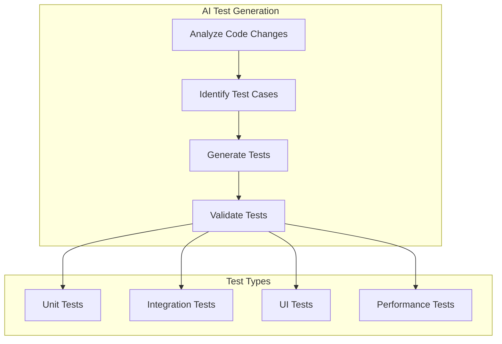
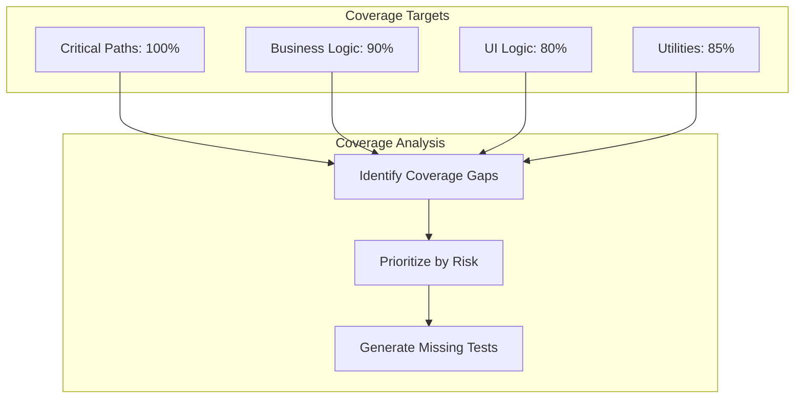
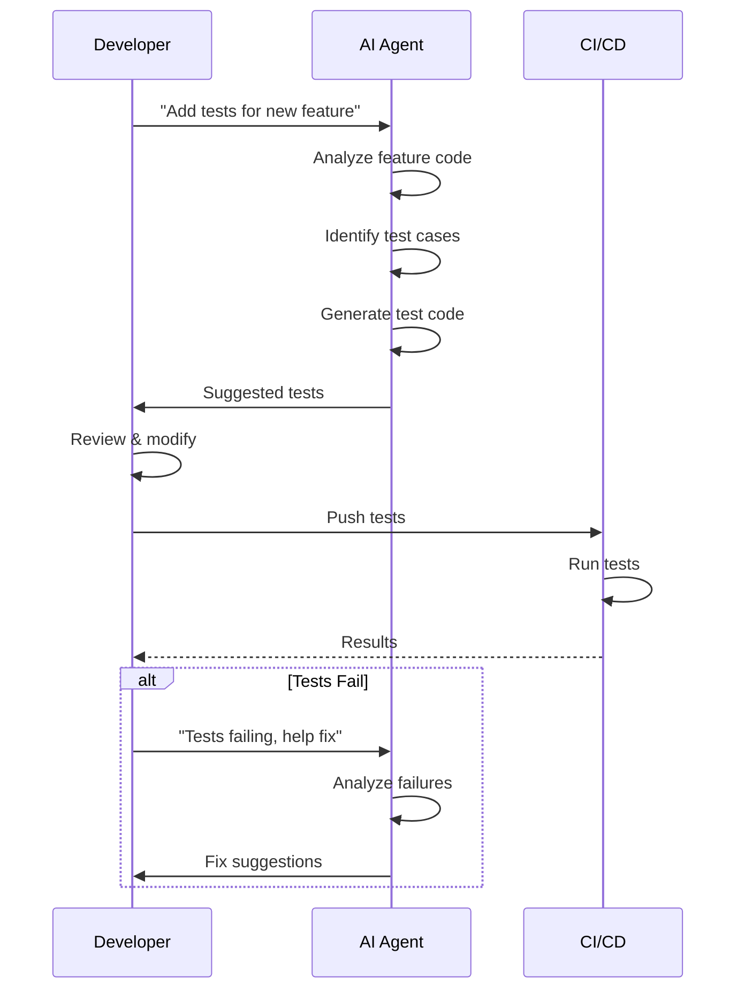

# AI Testing Strategy for Mobile

## Testing Approach



## Test Generation Rules

### Unit Test Generation

```yaml
unit_test_generation:
  triggers:
    - new_function_added
    - existing_function_modified
    - bug_fix_implemented
    - edge_case_identified
    
  patterns:
    happy_path:
      description: "Test the expected successful behavior"
      structure: |
        // Arrange
        setup mocks and test data
        
        // Act
        call the function under test
        
        // Assert
        verify expected outcome
        
    error_path:
      description: "Test error conditions"
      cases:
        - null_input
        - empty_input
        - invalid_input
        - network_error
        - timeout
        - permission_denied
        
    boundary:
      description: "Test boundary conditions"
      cases:
        - empty_string
        - max_length_string
        - zero_values
        - negative_values
        - max_integer_values
        
  naming_convention: "test_{method}_{condition}_{expected_result}"
  
  mock_strategy:
    - mock_all_external_dependencies
    - use_injection_for_testability
    - verify_interactions_not_implementations
    - reset_mocks_between_tests
```

### Integration Test Generation

```yaml
integration_test_generation:
  scenarios:
    api_integration:
      - test_successful_request_response
      - test_error_handling
      - test_retry_mechanism
      - test_token_refresh
      - test_timeout_handling
      
    storage_integration:
      - test_data_persistence
      - test_encryption_decryption
      - test_cache_invalidation
      - test_concurrent_access
      
    navigation_integration:
      - test_deep_link_handling
      - test_navigation_flow
      - test_back_stack_behavior
      
  approach:
    - use_real_api_with_test_server
    - use_real_database_with_test_data
    - mock_only_unavailable_services
    - test_complete_user_flows
```

### UI Test Generation

```yaml
ui_test_generation:
  screen_coverage:
    - test_screen_renders_correctly
    - test_user_interactions
    - test_state_changes
    - test_error_states
    - test_loading_states
    - test_empty_states
    
  interaction_types:
    - tap
    - swipe
    - long_press
    - pinch_zoom
    - text_input
    - keyboard_navigation
    
  accessibility_testing:
    - test_with_screen_reader
    - test_dynamic_text_size
    - test_reduce_motion
    - test_voice_control
    
  visual_testing:
    - screenshot_comparison
    - dark_mode_screenshots
    - large_text_screenshots
    - tablet_layout_screenshots
```

## Test Data Generation

```yaml
test_data_generation:
  user_data:
    valid_users:
      - email: "test.user@example.com"
        name: "Test User"
        phone: "+1-555-0100"
      - email: "jane.doe@example.com"
        name: "Jane Doe"
        
    invalid_users:
      - email: ""
        reason: "empty email"
      - email: "not-an-email"
        reason: "invalid format"
      - email: "a".repeat(255) + "@example.com"
        reason: "too long"
        
  api_responses:
    success:
      status: 200
      body: "fixture_success_response.json"
    error_400:
      status: 400
      body: "fixture_validation_error.json"
    error_401:
      status: 401
      body: "fixture_unauthorized.json"
    error_500:
      status: 500
      body: "fixture_server_error.json"
      
  edge_cases:
    - empty_list
    - single_item_list
    - very_long_text
    - special_characters
    - unicode_characters
    - very_large_numbers
    - negative_numbers
```

## Mock Generation

```yaml
mock_generation:
  strategy:
    - auto_generate_from_interfaces
    - manual_for_complex_behaviors
    - spy_for_verification
    
  mock_targets:
    - api_client
    - storage_service
    - authentication_service
    - analytics_service
    - notification_service
    
  mock_behavior:
    default:
      return: "reasonable_default"
      delay: "none"
      
    network_mock:
      success: "return_expected_response"
      failure: "throw_network_error"
      timeout: "delay_then_throw"
      
    storage_mock:
      read: "return_cached_value"
      write: "store_and_return"
      delete: "return_success"
      
  verification:
    - verify_method_called_with_correct_params
    - verify_call_count
    - verify_call_order
    - verify_no_unexpected_interactions
```

## Test Coverage Strategy



### Coverage Rules

```yaml
coverage_rules:
  minimum_threshold: 80%
  
  critical_paths:
    - authentication_flow
    - payment_processing
    - data_persistence
    - core_navigation
    
  must_test:
    - public_api_surface
    - error_handling_paths
    - boundary_conditions
    - concurrent_operations
    
  skip:
    - generated_code
    - third_party_wrappers
    - simple_getters_setters
    - platform_specific_ui
```

## Test Execution

```yaml
test_execution:
  local:
    unit_tests:
      command: |
        # iOS
        xcodebuild test -scheme MyApp -destination 'platform=iOS Simulator,name=iPhone 15'
        # Android
        ./gradlew testDebugUnitTest
        # React Native
        npm test
      frequency: every_commit
      
    ui_tests:
      command: |
        # iOS
        xcodebuild test -scheme MyAppUITests
        # Android
        ./gradlew connectedAndroidTest
        # React Native
        npx detox test
      frequency: before_merge
      
  ci:
    stages:
      - lint
      - unit_tests
      - integration_tests
      - build
      - ui_tests
      - performance_tests
      
    parallelization:
      enabled: true
      shards: 4
      
    caching:
      enabled: true
      paths:
        - ~/.gradle/caches
        - ~/Library/Caches/Pods
        - node_modules
```

## Performance Test Generation

```yaml
performance_tests:
  startup:
    metrics:
      - cold_launch_time
      - warm_launch_time
      - hot_launch_time
    threshold: "< 2 seconds cold, < 1 second warm"
    
  scroll:
    metrics:
      - frame_rate
      - jank_count
      - time_to_interactive
    threshold: "60fps, < 5 jank frames per 1000"
    
  memory:
    metrics:
      - baseline_usage
      - growth_per_session
      - peak_usage
    threshold: "< 200MB baseline, < 5MB growth"
    
  network:
    metrics:
      - request_latency
      - payload_size
      - cache_hit_rate
    threshold: "< 500ms p95, < 100KB average"
```

## Test Reporting

```yaml
reporting:
  formats:
    - unit_test_results
    - coverage_report
    - performance_benchmark
    - screenshot_diffs
    
  tools:
    coverage: "codecov, sonarqube"
    results: "junit xml, xcresult"
    screenshots: "percy, chromatic"
    
  thresholds:
    coverage_drop: "fail if > 2% decrease"
    performance_regression: "fail if > 10% slower"
    visual_regression: "fail if > 0 pixel differences"
    
  notifications:
    on_failure: "slack, email"
    on_regression: "github_pr_comment"
```

## AI Test Assistant Workflow



## Configuration

[CONFIGURE] Update for your project:
- Test coverage thresholds
- Performance benchmarks
- Mock strategy
- Test data factories
- CI test stages
- Reporting tools
