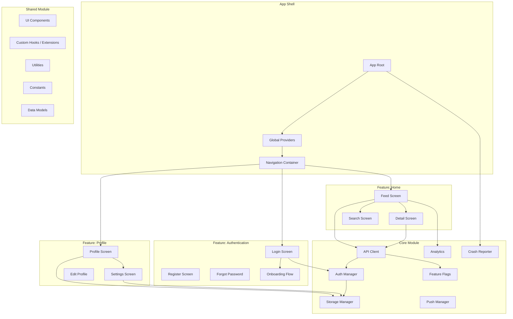
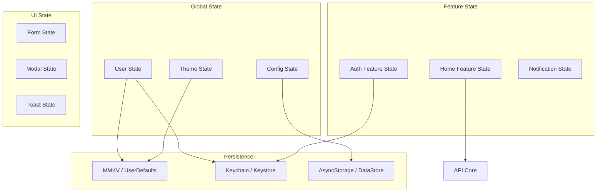
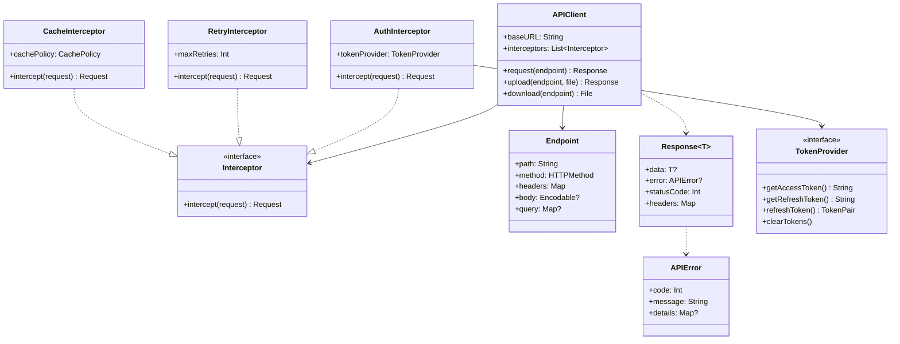
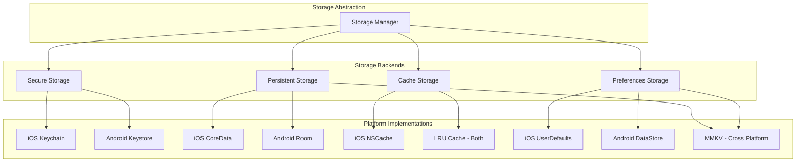
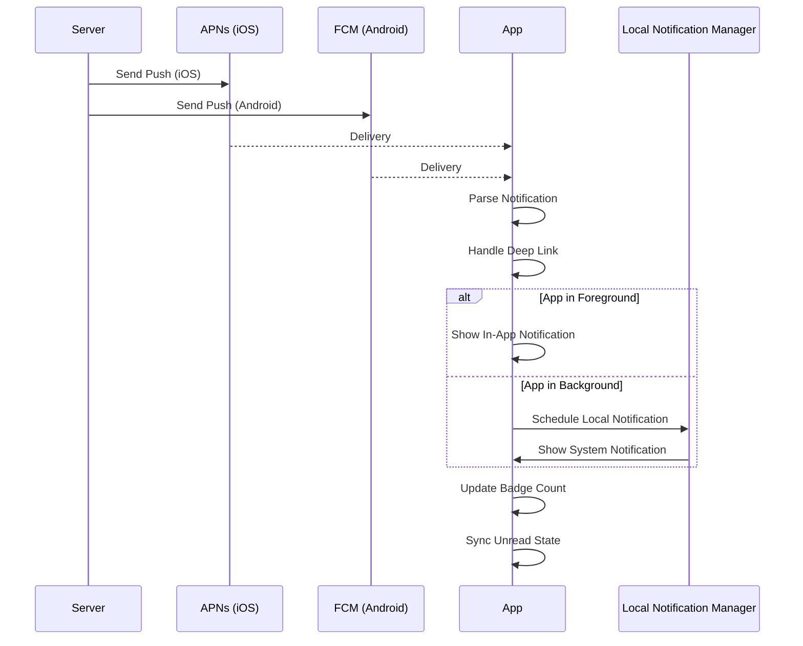
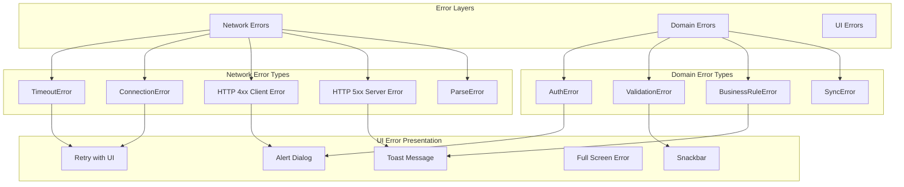
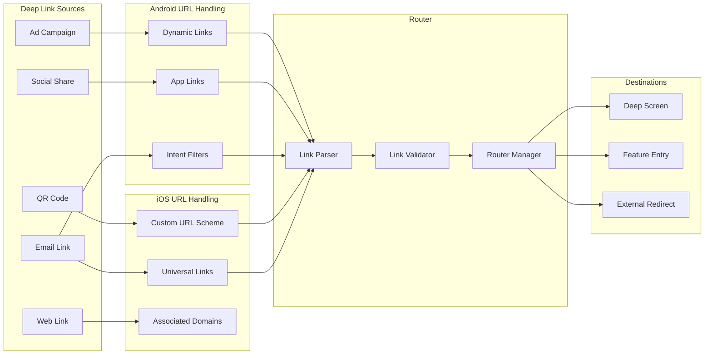

# Detailed Mobile Architecture

## Component Diagram

## State Management Architecture

## Network Layer Architecture

## Local Storage Architecture

## Push Notification Architecture

## Error Handling Architecture

## Deep Linking Architecture

## Configuration

[CONFIGURE] Update for your project:
- Feature modules based on your app's domain
- State management solution (Redux, BLoC, MobX, etc.)
- Network layer library choices
- Storage backend selections
- Error handling strategy
- Deep link URL patterns
