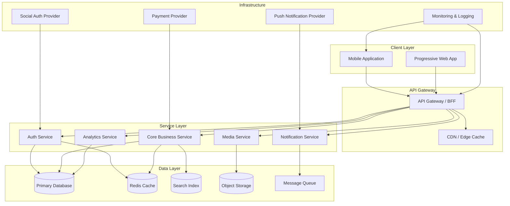
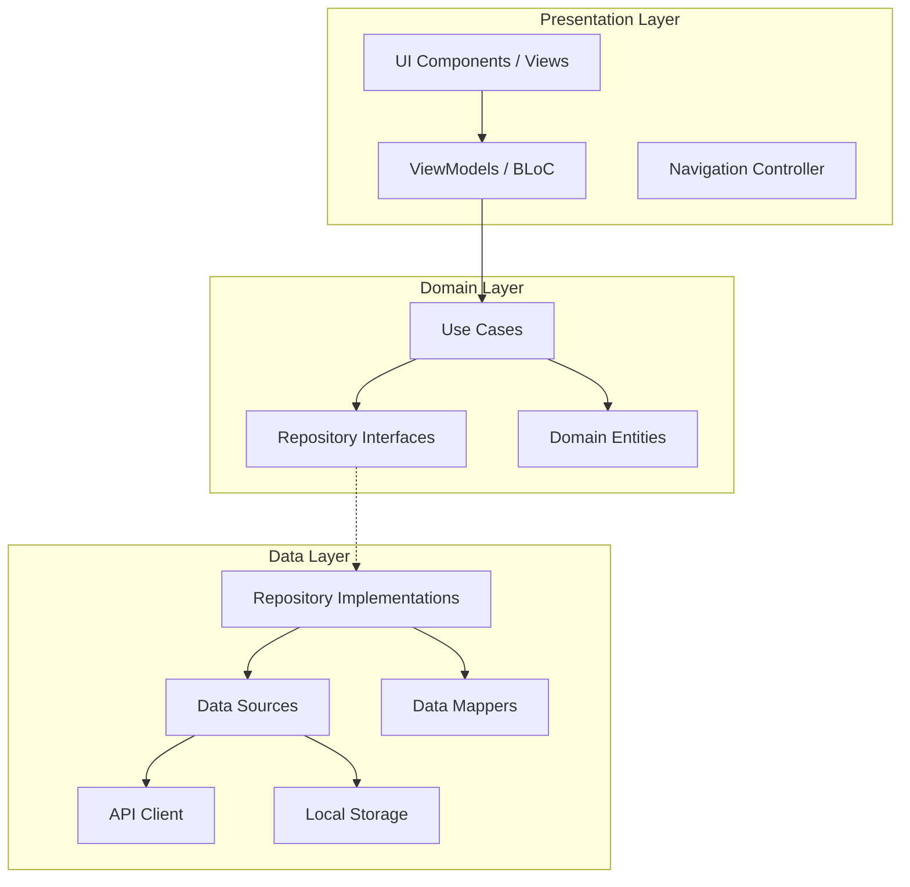
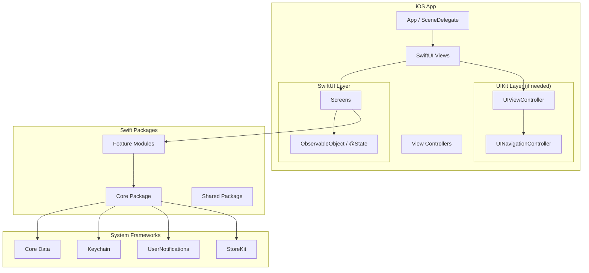
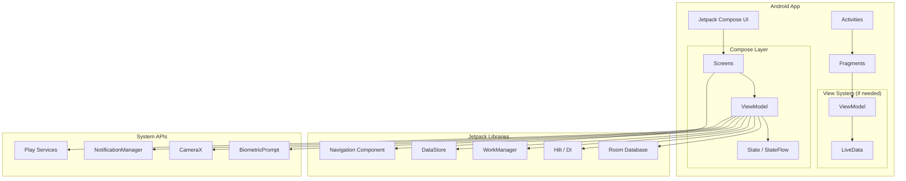
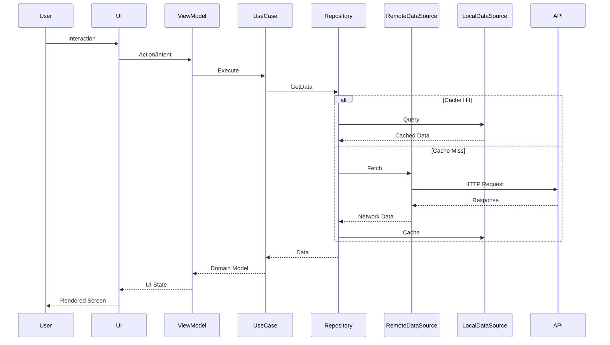
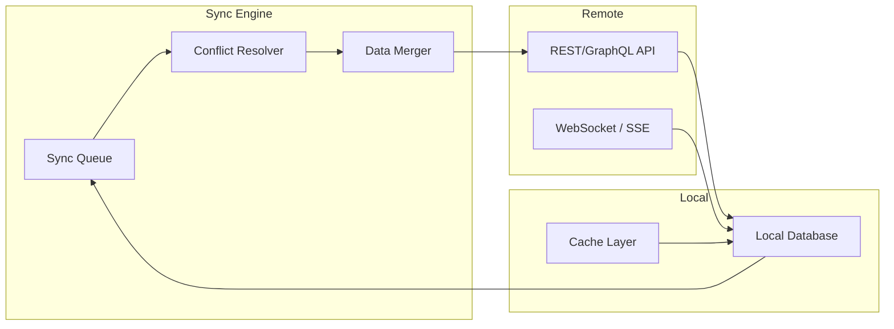

# High-Level Mobile Architecture

## System Overview

## Mobile App Architecture (Clean Architecture)

## Platform-Specific Architecture

### iOS Architecture

### Android Architecture

## Data Flow Architecture

## Cross-Platform Architecture Decision Matrix

| Concern | Native (iOS) | Native (Android) | React Native | Flutter |
|---------|-------------|------------------|--------------|---------|
| UI Framework | SwiftUI/UIKit | Compose/XML | React Native | Flutter Widgets |
| State Management | @State/Observed | ViewModel/StateFlow | Redux/MobX | BLoC/Riverpod |
| Navigation | NavigationStack | Nav Component | React Navigation | GoRouter |
| DI | Factory/Swinject | Hilt/Koin | Inversify | GetIt |
| Networking | URLSession | Retrofit/OkHttp | Axios/Dio | Dio/Http |
| Storage | CoreData/SwiftData | Room/DataStore | AsyncStorage/MMKV | Hive/Isar |

## Offline-First Architecture

## Configuration

[CONFIGURE] Update the following for your project:
- Service names and boundaries in the system overview
- Platform-specific choices based on your team expertise
- Data flow patterns based on your app's real-time requirements
- Offline-first vs online-first decision based on use case
