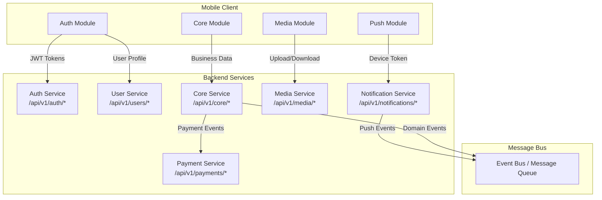
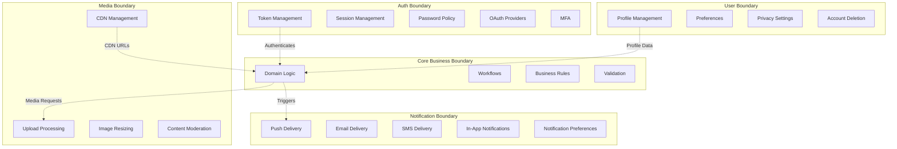
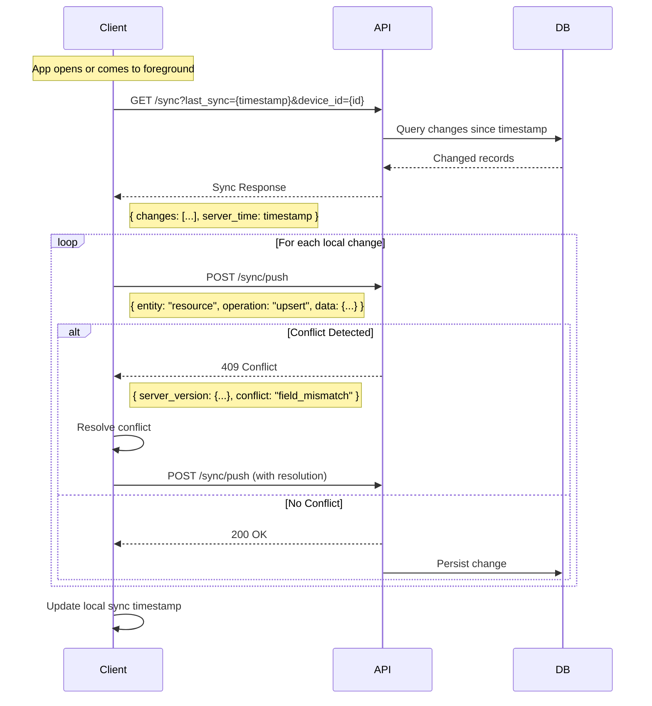

# Integration Architecture

## API Contract Overview



## REST API Contract

### Authentication Endpoints

```yaml
# POST /api/v1/auth/register
Request:
  body:
    email: string (required)
    password: string (required, min 8 chars)
    name: string (required)
    platform: enum [ios, android, web]
    push_token: string (optional)
    device_id: string (required)
  headers:
    Content-Type: application/json

Response 201:
  body:
    user:
      id: uuid
      email: string
      name: string
      created_at: iso8601
    tokens:
      access_token: jwt
      refresh_token: string
      expires_in: integer (seconds)

Response 409:
  body:
    error:
      code: "USER_EXISTS"
      message: "Email already registered"

# POST /api/v1/auth/login
Request:
  body:
    email: string (required)
    password: string (required)
    platform: enum [ios, android, web]
    push_token: string (optional)

Response 200:
  body:
    user:
      id: uuid
      email: string
      name: string
    tokens:
      access_token: jwt
      refresh_token: string
      expires_in: integer

# POST /api/v1/auth/refresh
Request:
  body:
    refresh_token: string (required)

Response 200:
  body:
    tokens:
      access_token: jwt
      refresh_token: string
      expires_in: integer

# POST /api/v1/auth/logout
Request:
  headers:
    Authorization: Bearer {access_token}
  body:
    push_token: string (optional, for single device logout)

# POST /api/v1/auth/forgot-password
Request:
  body:
    email: string (required)

Response 200:
  body:
    message: "If email exists, reset link sent"
```

### Resource Endpoints

```yaml
# GET /api/v1/resources
Request:
  headers:
    Authorization: Bearer {access_token}
  query:
    page: integer (default: 1)
    per_page: integer (default: 20, max: 100)
    sort: string (default: "created_at")
    order: enum [asc, desc]
    search: string (optional)
    filter[field]: string (optional)

Response 200:
  body:
    data: Resource[]
    meta:
      current_page: integer
      total_pages: integer
      total_count: integer
      per_page: integer
    links:
      self: string
      next: string | null
      prev: string | null

# GET /api/v1/resources/:id
Response 200:
  body:
    data: Resource

Response 404:
  body:
    error:
      code: "NOT_FOUND"
      message: "Resource not found"

# POST /api/v1/resources
Request:
  headers:
    Authorization: Bearer {access_token}
    Content-Type: application/json
  body:
    name: string (required)
    description: string (optional)

Response 201:
  body:
    data: Resource

# PUT /api/v1/resources/:id
# DELETE /api/v1/resources/:id
```

### Standard Error Response

```yaml
Response 4xx/5xx:
  body:
    error:
      code: string (machine-readable)
      message: string (human-readable)
      details: object (optional)
        field_errors:
          - field: string
            message: string
            code: string
      request_id: uuid
      timestamp: iso8601
```

## GraphQL Contract

```graphql
type Query {
  # User queries
  me: User!
  user(id: ID!): User
  
  # Core queries
  resources(filter: ResourceFilter, page: Int, perPage: Int): ResourceConnection!
  resource(id: ID!): Resource
  
  # Search
  search(query: String!, type: SearchType): SearchResult!
}

type Mutation {
  # Auth mutations
  login(input: LoginInput!): AuthPayload!
  register(input: RegisterInput!): AuthPayload!
  refreshToken(refreshToken: String!): AuthPayload!
  
  # Resource mutations
  createResource(input: CreateResourceInput!): Resource!
  updateResource(id: ID!, input: UpdateResourceInput!): Resource!
  deleteResource(id: ID!): Boolean!
}

type Subscription {
  # Real-time updates
  resourceUpdated(id: ID!): Resource!
  newNotification: Notification!
}

type User {
  id: ID!
  email: String!
  name: String!
  avatar: String
  createdAt: DateTime!
  updatedAt: DateTime!
}

type AuthPayload {
  user: User!
  accessToken: String!
  refreshToken: String!
  expiresIn: Int!
}

input LoginInput {
  email: String!
  password: String!
  platform: Platform!
  pushToken: String
}

enum Platform {
  IOS
  ANDROID
  WEB
}
```

## Service Boundaries



## Sync Protocol



## WebSocket Events

```yaml
# Connection
WebSocket: wss://api.example.com/ws?token={jwt}

# Client -> Server Events
events:
  - type: "ping"
  - type: "subscribe"
    payload:
      channel: "user:{user_id}"
  - type: "unsubscribe"
    payload:
      channel: "user:{user_id}"

# Server -> Client Events
events:
  - type: "pong"
  - type: "notification"
    payload:
      id: uuid
      type: enum [info, warning, alert]
      title: string
      body: string
      data: object (optional)
      created_at: iso8601
  - type: "resource.updated"
    payload:
      id: uuid
      changes: object
  - type: "presence"
    payload:
      user_id: uuid
      status: enum [online, offline]
```

## SDK Integration Contracts

### Analytics SDK

```typescript
interface AnalyticsSDK {
  identify(userId: string, traits: Record<string, any>): void;
  track(event: string, properties?: Record<string, any>): void;
  screen(name: string, properties?: Record<string, any>): void;
  flush(): Promise<void>;
  reset(): void;
}
```

### Crash Reporting SDK

```typescript
interface CrashReporter {
  setUserId(userId: string): void;
  setCustomKey(key: string, value: string | number | boolean): void;
  log(message: string, level: 'debug' | 'info' | 'warning' | 'error'): void;
  recordError(error: Error, context?: Record<string, any>): void;
  start(): void;
}
```

### Feature Flag SDK

```typescript
interface FeatureFlagSDK {
  isEnabled(flag: string, defaultValue?: boolean): boolean;
  getVariant(flag: string, defaultValue?: string): string;
  getConfiguration<T>(flag: string, defaultValue: T): T;
  onFlagChanged(flag: string, callback: (value: any) => void): () => void;
}
```

## Configuration

[CONFIGURE] Update for your project:
- API base URLs and versioning strategy
- Authentication provider (Firebase, Auth0, custom)
- GraphQL schema if using GraphQL
- Sync strategy based on offline requirements
- WebSocket events for real-time features
- SDK choices for analytics, crash reporting, feature flags
