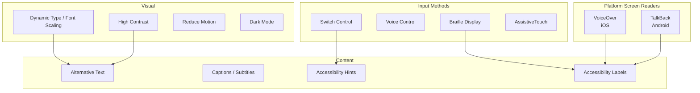

# Mobile Accessibility

## Accessibility Overview



## WCAG Mobile Mapping

| WCAG Criterion | Mobile Implementation | Priority |
|----------------|----------------------|----------|
| 1.1.1 Non-text Content | Image descriptions, icon labels | A |
| 1.3.1 Info & Structure | Semantic elements, headings | A |
| 1.4.3 Contrast | 4.5:1 text, 3:1 large text | AA |
| 1.4.4 Resize Text | Dynamic Type support | AA |
| 1.4.11 Non-text Contrast | 3:1 UI components | AA |
| 2.1.1 Keyboard | Full keyboard navigation | A |
| 2.4.3 Focus Order | Logical focus order | A |
| 2.5.5 Target Size | 44x44pt minimum | AAA |
| 3.1.1 Language of Page | Locale declaration | A |
| 4.1.2 Name, Role, Value | Component roles | A |

## iOS Accessibility Implementation

### VoiceOver Support

```swift
// Accessibility Labels
Image("heart")
    .accessibilityLabel("Favorite")

Button("Submit") { submit() }
    .accessibilityHint("Submits the form")

// Dynamic Content
Text("3 items remaining")
    .accessibilityElement(children: .combine)
    .accessibilityLabel("3 items remaining")

// Custom Actions
View()
    .accessibilityCustomActions([
        AccessibilityCustomAction("Delete") {
            deleteItem()
            return true
        },
        AccessibilityCustomAction("Share") {
            shareItem()
            return true
        }
    ])

// Grouping
VStack {
    Text("John Smith")
    Text("Developer")
}
.accessibilityElement(children: .combine)
.accessibilityLabel("John Smith, Developer")

// Hiding decorative elements
Image("background_pattern")
    .accessibilityHidden(true)
```

### Dynamic Type

```swift
// Automatic scaling with body text style
Text("Hello World")
    .font(.body)

// Custom font with dynamic type
Text("Title")
    .font(.custom("CustomFont", size: 17))
    .dynamicTypeSize(...DynamicTypeSize.accessibility3)

// Responding to text size changes
struct AdaptiveView: View {
    @Environment(\.dynamicTypeSize) var typeSize
    
    var body: some View {
        if typeSize >= .accessibility1 {
            VStack {
                // Stacked layout for large text
            }
        } else {
            HStack {
                // Side by side for normal text
            }
        }
    }
}
```

### Reduce Motion

```swift
struct AnimatedView: View {
    @Environment(\.accessibilityReduceMotion) var reduceMotion
    
    var body: some View {
        Image("logo")
            .scaleEffect(isVisible ? 1 : 0)
            .animation(
                reduceMotion ? .none : .spring(response: 0.5),
                value: isVisible
            )
    }
}
```

### Assistive Access (iOS)

```swift
// Declare supported modal presentation styles
// for Assistive Access mode
func application(
    _ application: UIApplication,
    didDiscardSceneSessions: Set<UISceneSession>
) {
    // Simplify UI for Assistive Access
}
```

## Android Accessibility Implementation

### TalkBack Support

```kotlin
// Content descriptions
ImageView(imageView).apply {
    contentDescription = "Favorite button"
    // Important for decorative images
    importantForAccessibility = View.IMPORTANT_FOR_ACCESSIBILITY_NO
}

// Custom accessibility actions
ViewCompat.replaceAccessibilityAction(
    itemView,
    AccessibilityNodeInfoCompat.ACTION_CLICK,
    "Long press to delete"
) { view, _ ->
    deleteItem()
    true
}

// Live regions for dynamic content
textView.apply {
    accessibilityLiveRegion = View.ACCESSIBILITY_LIVE_REGION_POLITE
    // Announces changes when they occur
}

// Custom accessibility delegate
ViewCompat.setAccessibilityDelegate(
    view,
    object : AccessibilityDelegateCompat() {
        override fun onInitializeAccessibilityNodeInfo(
            host: View,
            info: AccessibilityNodeInfoCompat
        ) {
            super.onInitializeAccessibilityNodeInfo(host, info)
            info.roleDescription = "Toggle switch"
            info.isCheckable = true
            info.isChecked = host.isSelected
        }
    }
)
```

### Font Scaling

```xml
<!-- Use sp for text sizes -->
<TextView
    android:textSize="16sp"
    android:text="Hello World" />

<!-- Respond to font scale changes -->
<style name="AppTheme">
    <item name="android:textAppearanceLarge">?android:attr/textAppearanceLarge</item>
    <item name="android:textAppearanceMedium">?android:attr/textAppearanceMedium</item>
    <item name="android:textAppearanceSmall">?android:attr/textAppearanceSmall</item>
</style>
```

### Material Design Accessibility

```kotlin
// Using Material components with built-in accessibility
MaterialButton(context).apply {
    text = "Submit"
    // MaterialButton handles touch targets, colors, etc.
}

// Use semantic properties in Compose
Text(
    text = "3 items",
    modifier = Modifier.semantics {
        contentDescription = "3 items in your list"
        stateDescription = "items"
    }
)

// State descriptions in Compose
Checkbox(
    checked = isChecked,
    onCheckedChange = { toggle() },
    modifier = Modifier.semantics {
        stateDescription = if (isChecked) "Checked" else "Unchecked"
    }
)
```

## Cross-Platform Accessibility (React Native)

```tsx
import { AccessibilityInfo, Platform } from 'react-native';

// Accessibility labels
<View accessible={true} accessibilityLabel="Submit button">
  <TouchableOpacity onPress={submit}>
    <Text>Submit</Text>
  </TouchableOpacity>
</View>

// Live regions
<View
  accessibilityLiveRegion="polite"
  accessibilityRole="alert"
>
  {error && <Text>{error}</Text>}
</View>

// Reduce motion
const [reduceMotion, setReduceMotion] = useState(false);
useEffect(() => {
  AccessibilityInfo.isReduceMotionEnabled().then(setReduceMotion);
  const sub = AccessibilityInfo.addEventListener(
    'reduceMotionDidChange',
    setReduceMotion
  );
  return () => sub.remove();
}, []);

// Announce for screen readers
AccessibilityInfo.announceForAccessibility('Item added to cart');

// Custom actions (iOS only)
accessibilityActions={[
  { name: 'delete', label: 'Delete' },
  { name: 'customAction', label: 'Share' },
]}
onAccessibilityAction={(event) => {
  if (event.nativeEvent.actionName === 'delete') {
    handleDelete();
  }
}}
```

## Cross-Platform Accessibility (Flutter)

```dart
// Semantics wrapper
Semantics(
  label: 'Submit button',
  button: true,
  onTap: submit,
  child: ElevatedButton(
    onPressed: submit,
    child: Text('Submit'),
  ),
)

// Exclude from semantics tree
ExcludeSemantics(
  child: Icon(Icons.star),
)

// Custom semantics actions
Semantics(
  customActions: [
    SemanticsAction(label: 'Delete', onLongPress: delete),
    SemanticsAction(label: 'Share', onLongPress: share),
  ],
  child: ListItem(),
)

// Live regions
Semantics(
  liveRegion: true,
  child: Text(errorMessage),
)

// Reduced motion
MediaQuery(
  data: MediaQuery.of(context).copyWith(
    disableAnimations: true,
  ),
  child: AnimatedWidget(),
)
```

## Accessibility Testing

### Manual Testing Checklist

| Test | VoiceOver | TalkBack |
|------|-----------|----------|
| All images have labels | | |
| Buttons have descriptive labels | | |
| Form fields have labels | | |
| Headings are properly nested | | |
| Focus order is logical | | |
| Custom actions work | | |
| Dynamic content announced | | |
| State changes announced | | |
| Gesture alternatives exist | | |
| No time-dependent interactions | | |
| Touch targets ≥ 44pt/48dp | | |

### Automated Testing

```yaml
accessibility_testing:
  ios:
    - tool: XCTest + Accessibility Audit
      description: Built-in Xcode accessibility testing
    - tool: Accessibility Inspector
      description: Real-time inspection tool
    - tool: axe-core-ios
      description: Automated WCAG testing

  android:
    - tool: Espresso Accessibility Checks
      description: Automated accessibility assertions
    - tool: Accessibility Scanner (Google)
      description: On-device scanning
    - tool: axe-android
      description: Comprehensive accessibility testing

  cross_platform:
    - tool: Detox Accessibility
      description: E2E testing with accessibility
    - tool: Accessibility Rules Engine
      description: Custom rule definitions

  ci_integration:
    - run_accessibility_scanner_on_screenshots
    - check_for_missing_labels
    - verify_color_contrast
    - validate_touch_target_sizes
```

## Common Accessibility Issues

| Issue | Fix | Priority |
|-------|-----|----------|
| Missing image descriptions | Add `accessibilityLabel` / `contentDescription` | Critical |
| Unlabeled buttons | Add descriptive labels, avoid "Button" | Critical |
| Poor contrast | Ensure 4.5:1 ratio for text | High |
| Small touch targets | Minimum 44x44pt / 48x48dp | High |
| No focus management | Set initial focus, manage focus order | High |
| Missing form labels | Associate labels with inputs | Critical |
| Time limits | Allow extension or removal | High |
| No skip links | Add skip navigation | Medium |
| Autoplay media | Allow pause/stop controls | High |
| No reduce motion support | Respect system setting | Medium |

## Configuration

[CONFIGURE] Update for your project:
- Accessibility testing tools to integrate
- Target WCAG level (A, AA, AAA)
- Platform-specific requirements
- Supported assistive technologies
- Accessibility acceptance criteria for features
