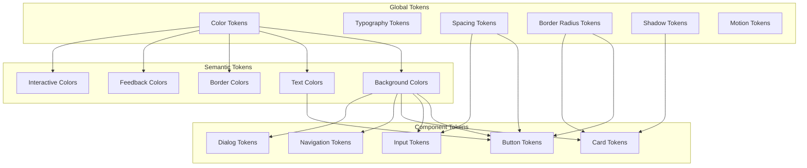

# Mobile Design System

## Design Token Architecture



## Color Tokens

```yaml
colors:
  # Global Palette
  primary:
    50: "#E3F2FD"
    100: "#BBDEFB"
    200: "#90CAF9"
    300: "#64B5F6"
    400: "#42A5F5"
    500: "#2196F3"  # Primary
    600: "#1E88E5"
    700: "#1976D2"
    800: "#1565C0"
    900: "#0D47A1"

  neutral:
    50: "#FAFAFA"
    100: "#F5F5F5"
    200: "#EEEEEE"
    300: "#E0E0E0"
    400: "#BDBDBD"
    500: "#9E9E9E"
    600: "#757575"
    700: "#616161"
    800: "#424242"
    900: "#212121"

  success:
    500: "#4CAF50"
    700: "#388E3C"
    
  warning:
    500: "#FF9800"
    700: "#F57C00"
    
  error:
    500: "#F44336"
    700: "#D32F2F"
    
  info:
    500: "#2196F3"
    700: "#1976D2"

  # Semantic Tokens (Light)
  light:
    background:
      primary: "{neutral.50}"
      secondary: "{neutral.100}"
      elevated: "#FFFFFF"
      surface: "#FFFFFF"
    
    text:
      primary: "{neutral.900}"
      secondary: "{neutral.600}"
      disabled: "{neutral.400}"
      inverse: "#FFFFFF"
      link: "{primary.500}"
    
    border:
      default: "{neutral.200}"
      focus: "{primary.500}"
      error: "{error.500}"
    
    interactive:
      primary: "{primary.500}"
      primary_hover: "{primary.700}"
      primary_pressed: "{primary.800}"
      disabled: "{neutral.300}"

  # Semantic Tokens (Dark)
  dark:
    background:
      primary: "{neutral.900}"
      secondary: "{neutral.800}"
      elevated: "{neutral.800}"
      surface: "{neutral.800}"
    
    text:
      primary: "{neutral.50}"
      secondary: "{neutral.400}"
      disabled: "{neutral.600}"
      inverse: "{neutral.900}"
      link: "{primary.300}"
    
    border:
      default: "{neutral.700}"
      focus: "{primary.300}"
      error: "{error.300}"
    
    interactive:
      primary: "{primary.300}"
      primary_hover: "{primary.200}"
      primary_pressed: "{primary.100}"
      disabled: "{neutral.700}"
```

## Typography System

```yaml
typography:
  # Type Scale
  display:
    large:
      size: 57
      weight: regular
      lineHeight: 64
      tracking: -0.25
      platform: { ios: 57pt, android: 57sp }
    medium:
      size: 45
      weight: regular
      lineHeight: 52
      tracking: 0
    small:
      size: 36
      weight: regular
      lineHeight: 44
      tracking: 0

  headline:
    large:
      size: 32
      weight: regular
      lineHeight: 40
      tracking: 0
    medium:
      size: 28
      weight: regular
      lineHeight: 36
      tracking: 0
    small:
      size: 24
      weight: regular
      lineHeight: 32
      tracking: 0

  title:
    large:
      size: 22
      weight: medium
      lineHeight: 28
      tracking: 0
    medium:
      size: 16
      weight: medium
      lineHeight: 24
      tracking: 0.15
    small:
      size: 14
      weight: medium
      lineHeight: 20
      tracking: 0.1

  body:
    large:
      size: 16
      weight: regular
      lineHeight: 24
      tracking: 0.5
    medium:
      size: 14
      weight: regular
      lineHeight: 20
      tracking: 0.25
    small:
      size: 12
      weight: regular
      lineHeight: 16
      tracking: 0.4

  label:
    large:
      size: 14
      weight: medium
      lineHeight: 20
      tracking: 0.1
    medium:
      size: 12
      weight: medium
      lineHeight: 16
      tracking: 0.5
    small:
      size: 11
      weight: medium
      lineHeight: 16
      tracking: 0.5

  # Platform Fonts
  fonts:
    ios:
      primary: SF Pro Text
      display: SF Pro Display
      mono: SF Mono
    android:
      primary: Roboto
      display: Roboto
      mono: Droid Sans Mono
    web:
      primary: -apple-system, BlinkMacSystemFont, "Segoe UI", Roboto
```

## Spacing System

```yaml
spacing:
  # 4px base unit
  0: 0
  1: 4      # xs
  2: 8      # sm
  3: 12     # md-small
  4: 16     # md (standard)
  5: 20     # md-large
  6: 24     # lg
  8: 32     # xl
  10: 40    # 2xl
  12: 48    # 3xl
  16: 64    # 4xl
  20: 80    # 5xl

  # Component-specific
  component:
    button_vertical_padding: 12
    button_horizontal_padding: 24
    input_vertical_padding: 12
    input_horizontal_padding: 16
    card_padding: 16
    dialog_padding: 24
    list_item_vertical: 12
    list_item_horizontal: 16

  # Screen margins
  screen:
    horizontal: 16
    horizontal_large: 24  # tablet
    top: 16
    bottom: 16

  # Touch targets
  touch:
    minimum: 44  # iOS
    recommended: 48  # Material
```

## Border Radius

```yaml
border_radius:
  none: 0
  xs: 4
  sm: 8
  md: 12
  lg: 16
  xl: 24
  full: 9999  # Pill shape

  component:
    button: "{border_radius.full}"
    button_outlined: "{border_radius.full}"
    card: "{border_radius.md}"
    dialog: "{border_radius.xl}"
    input: "{border_radius.sm}"
    avatar: "{border_radius.full}"
    chip: "{border_radius.full}"
    bottom_sheet: "{border_radius.xl} {border_radius.xl} 0 0"
```

## Shadow System

```yaml
shadows:
  none: "none"
  
  elevation_1:
    ios:
      shadow_offset: { x: 0, y: 1 }
      shadow_radius: 3
      shadow_opacity: 0.12
      shadow_color: "#000000"
    android:
      elevation: 1dp
      
  elevation_2:
    ios:
      shadow_offset: { x: 0, y: 2 }
      shadow_radius: 6
      shadow_opacity: 0.15
      shadow_color: "#000000"
    android:
      elevation: 2dp
      
  elevation_3:
    ios:
      shadow_offset: { x: 0, y: 4 }
      shadow_radius: 8
      shadow_opacity: 0.18
      shadow_color: "#000000"
    android:
      elevation: 4dp
      
  elevation_4:
    ios:
      shadow_offset: { x: 0, y: 8 }
      shadow_radius: 16
      shadow_opacity: 0.20
      shadow_color: "#000000"
    android:
      elevation: 8dp

  # Surface-specific
  card: "{elevation_2}"
  dialog: "{elevation_4}"
  floating_button: "{elevation_3}"
  dropdown: "{elevation_3}"
  app_bar: "{elevation_2}"
```

## Component Library

### Button

```yaml
components:
  button:
    variants:
      filled:
        background: "{interactive.primary}"
        text: "{text.inverse}"
        states: [default, hover, pressed, disabled]
      outlined:
        background: transparent
        border: 1px "{interactive.primary}"
        text: "{interactive.primary}"
      text:
        background: transparent
        text: "{interactive.primary}"
      icon:
        background: transparent
        icon_color: "{text.primary}"
        
    sizes:
      small:
        height: 32
        padding_horizontal: 16
        text_style: "{label.large}"
      medium:
        height: 40
        padding_horizontal: 24
        text_style: "{label.large}"
      large:
        height: 48
        padding_horizontal: 32
        text_style: "{label.large}"
        
    states:
      disabled:
        opacity: 0.38
        interactive: false
      loading:
        show_indicator: true
        hide_icon: true
```

### Input

```yaml
  input:
    variants:
      filled:
        background: "{background.secondary}"
        border_bottom: 1px "{border.default}"
        focus_border: 2px "{border.focus}"
      outlined:
        background: transparent
        border: 1px "{border.default}"
        focus_border: 2px "{border.focus}"
        
    states:
      default:
        border: "{border.default}"
        label: "{text.secondary}"
      focused:
        border: "{border.focus}"
        label: "{interactive.primary}"
      error:
        border: "{border.error}"
        label: "{error.500}"
        supporting_text: "{error.500}"
      disabled:
        background: "{neutral.100}"
        label: "{text.disabled}"
        
    elements:
      label:
        position: floating
        style: "{body.medium}"
      placeholder:
        style: "{body.medium}"
        color: "{text.disabled}"
      supporting_text:
        style: "{body.small}"
        margin_top: 4
      leading_icon:
        margin_end: 12
      trailing_icon:
        margin_start: 12
```

### Card

```yaml
  card:
    variants:
      elevated:
        background: "{background.surface}"
        shadow: "{card}"
      filled:
        background: "{background.secondary}"
        shadow: none
      outlined:
        background: "{background.surface}"
        border: 1px "{border.default}"
        
    padding: "{spacing.card_padding}"
    border_radius: "{border_radius.card}"
```

## Icon System

```yaml
icons:
  style: outlined  # outlined, filled, rounded
  size:
    small: 18
    medium: 24
    large: 32
    xl: 48
    
  library:
    ios: SF Symbols
    android: Material Icons
    cross_platform: 
      - Phosphor Icons
      - Lucide Icons
      
  naming_convention:
    format: "{category}-{name}-{variant}"
    examples:
      - navigation-arrow-left
      - action-edit-filled
      - content-image-cropped
      - communication-chat-outline
```

## Platform Adaptation

```yaml
platform_adaptation:
  components:
    button:
      ios: styled UIButton / SwiftUI Button
      android: MaterialButton
    navigation_bar:
      ios: UINavigationBar / NavigationStack
      android: TopAppBar / BottomNavigation
    dialog:
      ios: UIAlertController
      android: MaterialAlertDialog
    toast:
      ios: Custom banner / HUD
      android: Snackbar
    date_picker:
      ios: nativeDatePicker
      android: MaterialDatePicker
        
  gesture_handling:
    swipe_back:
      ios: built_in_navigation_gesture
      android: custom_implement
    pull_to_refresh:
      ios: UIRefreshControl
      android: SwipeRefreshLayout / PullRefresh
```

## Configuration

[CONFIGURE] Update for your project:
- Brand color palette
- Typography preferences
- Component variants needed
- Icon library choice
- Platform priority
- Dark mode strategy
