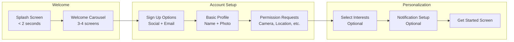
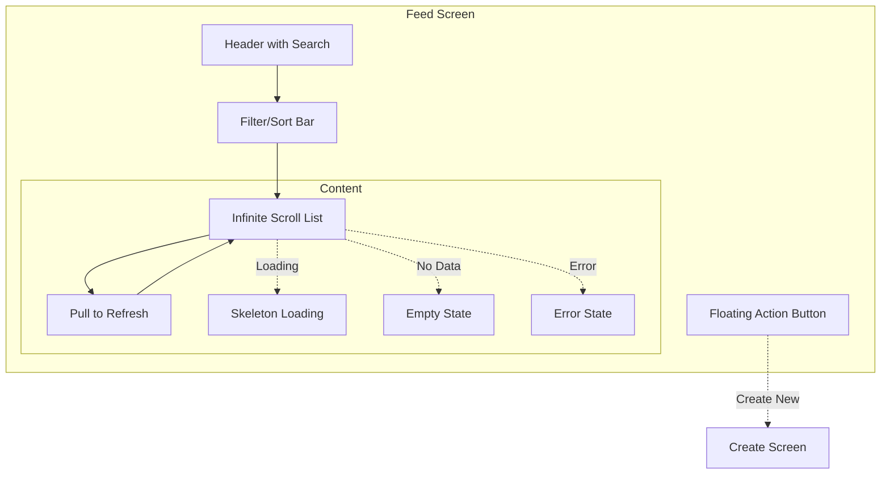
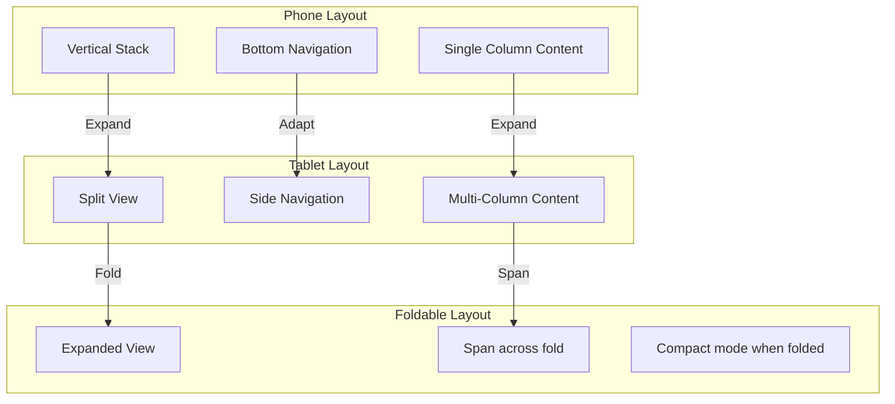

# Mobile UI Guidelines

## Platform Design Principles

### iOS (Human Interface Guidelines)

```yaml
ios_hig:
  core_principles:
    - clarity: "Text must be legible at all sizes, icons precise, decorations functional"
    - deference: "Fluid motion and crisp interface help users understand content"
    - depth: "Visual layers and realistic motion convey hierarchy"

  navigation_patterns:
    - name: Tab Bar
      usage: Primary sections (3-5 tabs max)
      platform: Bottom (iOS), can be top or bottom (Android)
    - name: Navigation Stack
      usage: Hierarchical navigation within a section
      platform: Push/pop transitions
    - name: Modal
      usage: Self-contained tasks
      platform: Present from bottom
    - name: Search Bar
      usage: Finding content
      platform: Top of screen or tab bar

  typography:
    font_family: SF Pro (system)
    large_title: 34pt bold
    title1: 28pt bold
    title2: 22pt bold
    title3: 20pt semibold
    headline: 17pt semibold
    body: 17pt regular
    callout: 16pt regular
    subheadline: 15pt regular
    footnote: 13pt regular
    caption1: 12pt regular
    caption2: 11pt regular

  spacing:
    margin_standard: 16pt
    margin_compact: 8pt
    section_gap: 24pt
    element_gap: 8pt
    
  touch_targets:
    minimum: 44x44pt
    recommended: 48x48pt
```

### Android (Material Design)

```yaml
material_design:
  core_principles:
    - material_is_the_metaphor: "Surfaces and edges of material provide visual cues"
    - bold_graphic_focus: "Bold graphic elements guide attention"
    - motion_provides_meaning: "Motion reinforces hierarchy and relationships"

  navigation_patterns:
    - name: Bottom Navigation
      usage: Top-level destinations (3-5 items)
      platform: Bottom of screen
    - name: Navigation Drawer
      usage: Many destinations, infrequent switches
      platform: Left edge swipe or hamburger
    - name: Navigation Component
      usage: In-app navigation with back stack
      platform: Fragment-based
    - name: FAB
      usage: Primary action on screen
      platform: Bottom right

  typography:
    font_family: Roboto (system) / Google Sans
    display_large: 57sp regular
    display_medium: 45sp regular
    display_small: 36sp regular
    headline_large: 32sp regular
    headline_medium: 28sp regular
    headline_small: 24sp regular
    title_large: 22sp medium
    title_medium: 16sp medium
    title_small: 14sp medium
    body_large: 16sp regular
    body_medium: 14sp regular
    body_small: 12sp regular
    label_large: 14sp medium
    label_medium: 12sp medium
    label_small: 11sp medium

  spacing:
    margin_standard: 16dp
    margin_compact: 8dp
    section_gap: 24dp
    element_gap: 8dp
    
  touch_targets:
    minimum: 48x48dp
    recommended: 48x48dp
```

## Screen Patterns

### Onboarding Flow



### Feed/List Pattern



### Form Pattern

```yaml
form_guidelines:
  layout:
    - single_column_layout
    - logical_grouping_of_fields
    - appropriate_keyboard_per_field
    - auto_advance_between_fields
    
  validation:
    - inline_validation_on_blur
    - clear_error_messages
    - summary_errors_at_top
    - preserve_user_input_on_error
    
  accessibility:
    - proper_labels_for_all_inputs
    - error_messages_announced
    - logical_tab_order
    - sufficient_contrast
    
  fields:
    text:
      placeholder: descriptive_hint
      max_length: visible_counter_if_relevant
      clear_button: for_search_and_short_fields
      
    email:
      keyboard: email_address
      autocapitalization: none
      
    password:
      visibility_toggle: required
      strength_indicator: recommended
      
    phone:
      keyboard: phone_pad
      country_code_picker: if_international
      
    date:
      native_picker: platform_default
      format: locale_aware
      
    dropdown:
      searchable: if_more_than_10_options
      single_selection: radio_style
      multi_selection: checkbox_style
```

## Responsive Design

### Breakpoints

```yaml
breakpoints:
  mobile:
    small: 0-320px
    medium: 321-375px
    large: 376-428px
    
  tablet:
    small: 429-768px
    medium: 769-1024px
    large: 1025-1194px
    
  adaptive_layout:
    phone_portrait: full_width
    phone_landscape: full_width_compact_height
    tablet_portrait: side_panel_content
    tablet_landscape: side_panel_wide_content
    
  foldable:
    single_fold: standard_phone_layout
    dual_fold: expanded_content_area
    tabletop: optimized_for_hinge_position
```

### Adaptive Layout



## Animation Guidelines

```yaml
animation_principles:
  timing:
    micro_interactions: 100-300ms
    screen_transitions: 300-500ms
    complex_animations: 500-1000ms
    
  easing:
    standard: cubic-bezier(0.4, 0, 0.2, 1)  # Material Design
    decelerate: cubic-bezier(0, 0, 0.2, 1)
    accelerate: cubic-bezier(0.4, 0, 1, 1)
    ios_default: ease-in-out
    
  platform_specific:
    ios:
      transition: UINavigationController push/pop
      modal: UIModalPresentationStyle
      spring: UISpringTimingParameters
    android:
      shared_element: MaterialContainerTransform
      fade: FadeThrough
      slide: SharedAxis
      container: ContainerTransform

  gestures:
    pull_to_refresh: rubber_band_effect
    swipe_to_delete: reveal_with_haptic
    drag_to_reorder: scale_on_drag
    pinch_to_zoom: smooth_interpolation
    
  haptics:
    light: UIImpactFeedbackGenerator.light
    medium: UIImpactFeedbackGenerator.medium
    heavy: UIImpactFeedbackGenerator.heavy
    success: UINotificationFeedbackGenerator.success
    warning: UINotificationFeedbackGenerator.warning
    error: UINotificationFeedbackGenerator.error
```

## Dark Mode

```yaml
dark_mode:
  colors:
    background: #121212 (Material) / system_default (iOS)
    surface: #1E1E1E / system_grouped_background
    on_surface: #E0E0E0 / label
    primary: maintain_brand_color
    error: #CF6679 / system_red
    
  considerations:
    - reduce_white_text_on_dark
    - adjust_image_contrast_for_dark
    - use_system_color_adaptive
    - test_all_screens_in_both_modes
    - avoid_pure_black_for_backgrounds_on_oled
    
  oled_optimization:
    pure_black: true_for_battery_savings
    contrast: higher_than_standard_dark
    shadows: reduce_or_eliminate
    borders: use_instead_of_shadows
```

## Configuration

[CONFIGURE] Update for your project:
- Primary platform (iOS-first, Android-first, or equal)
- Design system component library (if using)
- Brand colors and typography
- Custom animations (Lottie files, etc.)
- Onboarding flow steps
- Navigation structure
