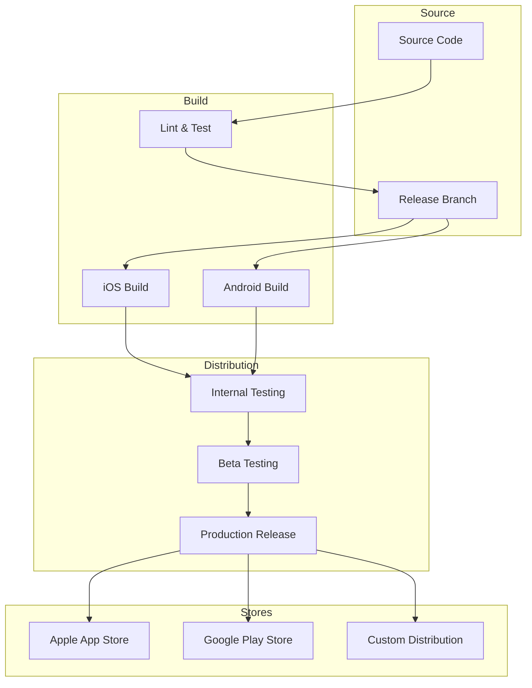
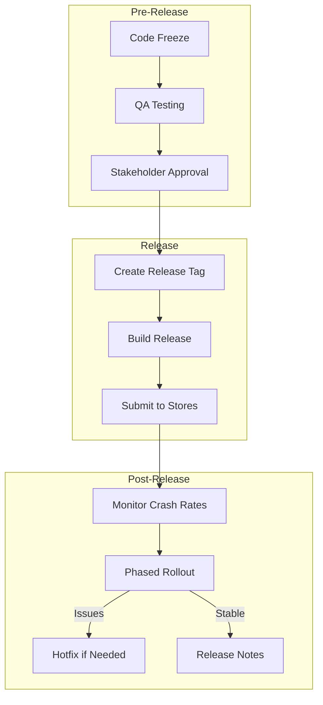
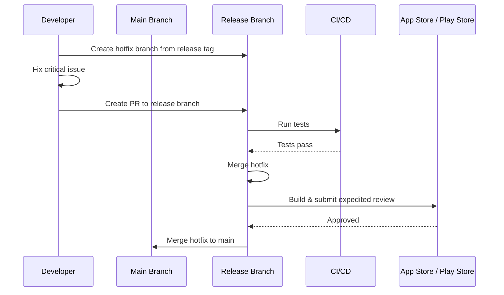

# Mobile Deployment Guide

## Deployment Pipeline



## iOS Deployment

### Build Configuration

```yaml
ios_build:
  configurations:
    Debug:
      code_signing: Development
      strip_swift_symbols: false
      optimization_level: -Onone
      enable_bitcode: false
    Release:
      code_signing: Distribution
      strip_swift_symbols: true
      optimization_level: -O
      enable_bitcode: false
      
  schemes:
    - MyApp
    - MyAppUITests
    
  destinations:
    simulator: "platform=iOS Simulator,name=iPhone 15"
    device: "platform=iOS,name=Meck's iPhone"
    
  build_commands:
    debug_simulator: |
      xcodebuild build \
        -workspace MyApp.xcworkspace \
        -scheme MyApp \
        -destination 'platform=iOS Simulator,name=iPhone 15' \
        -configuration Debug
    release_archive: |
      xcodebuild archive \
        -workspace MyApp.xcworkspace \
        -scheme MyApp \
        -archivePath build/MyApp.xcarchive \
        -configuration Release
```

### App Store Connect

```yaml
app_store_connect:
  api_key:
    key_id: "XXXXXXXXXX"
    issuer_id: "xxxxxxxx-xxxx-xxxx-xxxx-xxxxxxxxxxxx"
    key_file: "AuthKey_XXXXXXXXXX.p8"
    
  app_metadata:
    app_id: "com.example.myapp"
    primary_language: "en"
    bundle_version: "1"
    
  testflight:
    beta_groups:
      - Internal Testers
      - External Beta
    auto_distribute: true
    
  app_store:
    release_method: "AUTOMATIC"  # or MANUAL
    phased_release: true
    vendor_id: "XXXXXXXXXX"
    sku: "com.example.myapp"
```

### Fastlane Configuration

```ruby
# ios/fastlane/Fastfile
default_platform(:ios)

platform :ios do
  desc "Run tests"
  lane :test do
    scan(
      workspace: "MyApp.xcworkspace",
      scheme: "MyApp",
      devices: ["iPhone 15"],
      code_coverage: true
    )
  end

  desc "Build and upload to TestFlight"
  lane :beta do
    increment_build_number
    build_app(
      workspace: "MyApp.xcworkspace",
      scheme: "MyApp",
      export_method: "app-store"
    )
    upload_to_testflight(
      skip_waiting_for_build_processing: true
    )
  end

  desc "Release to App Store"
  lane :release do
    build_app(
      workspace: "MyApp.xcworkspace",
      scheme: "MyApp",
      export_method: "app-store"
    )
    upload_to_app_store(
      force: true,
      submit_for_review: true,
      automatic_release: true,
      phased_release: true
    )
  end

  desc "Capture screenshots"
  lane :screenshots do
    snapshot(
      workspace: "MyApp.xcworkspace",
      scheme: "MyApp"
    )
  end

  error do |lane, exception|
    # Send Slack notification
    slack(
      message: "iOS build failed in #{lane}: #{exception.message}",
      success: false
    )
  end
end
```

## Android Deployment

### Build Configuration

```groovy
// android/app/build.gradle
android {
    compileSdk 34
    
    defaultConfig {
        applicationId "com.example.myapp"
        minSdk 24
        targetSdk 34
        versionCode 1
        versionName "1.0.0"
    }
    
    buildTypes {
        debug {
            applicationIdSuffix ".debug"
            debuggable true
        }
        release {
            minifyEnabled true
            shrinkResources true
            proguardFiles getDefaultProguardFile('proguard-android-optimize.txt'),
                'proguard-rules.pro'
            signingConfig signingConfigs.release
        }
    }
    
    buildTypes {
        staging {
            initWith debug
            applicationIdSuffix ".staging"
            matchingFallbacks = ['debug']
        }
    }
}

// Version management
def versionMajor = 1
def versionMinor = 0
def versionPatch = 0
def versionCode = versionMajor * 10000 + versionMinor * 100 + versionPatch

android {
    defaultConfig {
        versionCode versionCode
        versionName "${versionMajor}.${versionMinor}.${versionPatch}"
    }
}
```

### Play Store Configuration

```yaml
play_store:
  service_account: "google-play-service-account.json"
  package_name: "com.example.myapp"
  
  tracks:
    internal:
      rollout_percentage: 100
    alpha:
      rollout_percentage: 100
    beta:
      rollout_percentage: 100
    production:
      rollout_percentage: 20  # Phased rollout
      
  store_listing:
    title: "MyApp"
    short_description: "A brief description (80 chars max)"
    full_description: |
      Detailed description of the app...
      Supports multiple lines.
    screenshots:
      phone: "screenshots/phone/*"
      tablet_7: "screenshots/tablet-7/*"
      tablet_10: "screenshots/tablet-10/*"
      
  content_rating:
    category: "Everyone"
    
  target_audience:
    primary: "Ages 13+"
```

### Fastlane Configuration (Android)

```ruby
# android/fastlane/Fastfile
default_platform(:android)

platform :android do
  desc "Run unit tests"
  lane :test do
    gradle(task: "testDebugUnitTest")
  end

  desc "Build debug APK"
  lane :build_debug do
    gradle(task: "assembleDebug")
  end

  desc "Build and upload to internal track"
  lane :internal do
    gradle(task: "bundleRelease")
    upload_to_play_store(
      track: "internal",
      aab: "app/build/outputs/bundle/release/app-release.aab"
    )
  end

  desc "Promote internal to production"
  lane :release do
    upload_to_play_store(
      track: "internal",
      track_promote_to: "production",
      rollout: "20%"
    )
  end

  desc "Capture screenshots"
  lane :screenshots do
    capture_android_screenshots(
      app_package_name: "com.example.myapp",
      use_tests_instrumented: true
    )
  end
end
```

## Version Management

```yaml
versioning:
  strategy: semantic_versioning
  format: "MAJOR.MINOR.PATCH"
  
  rules:
    MAJOR: "Breaking changes, platform requirement changes"
    MINOR: "New features, backward compatible"
    PATCH: "Bug fixes, security patches"
    
  ios:
    bundle_version: auto_increment
    marketing_version: semantic
    store_version: "1.0.0"
    
  android:
    version_code: auto_increment
    version_name: semantic
    
  react_native:
    uses_both: true
    
  flutter:
    pubspec_version: semantic
    build_number: auto_increment

  automation:
    bump_version: |
      # Using fastlane
      fastlane run increment_build_number
      # OR
      fastlane run increment_version_number bump_type: minor
```

## CI/CD Pipeline

```yaml
# .github/workflows/release.yml
name: Release Pipeline

on:
  push:
    tags:
      - 'v*'

jobs:
  test:
    runs-on: macos-latest
    steps:
      - uses: actions/checkout@v4
      - name: Run iOS Tests
        run: |
          cd ios
          pod install
          xcodebuild test -workspace MyApp.xcworkspace -scheme MyApp

  build-ios:
    needs: test
    runs-on: macos-latest
    steps:
      - uses: actions/checkout@v4
      - name: Build iOS
        run: |
          cd ios
          pod install
          fastlane beta
        env:
          APP_STORE_CONNECT_API_KEY_ID: ${{ secrets.APP_STORE_CONNECT_KEY_ID }}
          APP_STORE_CONNECT_API_ISSUER_ID: ${{ secrets.APP_STORE_CONNECT_ISSUER_ID }}
          APP_STORE_CONNECT_API_KEY: ${{ secrets.APP_STORE_CONNECT_KEY }}

  build-android:
    needs: test
    runs-on: ubuntu-latest
    steps:
      - uses: actions/checkout@v4
      - name: Setup Java
        uses: actions/setup-java@v4
        with:
          java-version: '17'
          distribution: 'temurin'
      - name: Build Android
        run: |
          cd android
          fastlane internal
        env:
          PLAY_STORE_JSON_KEY: ${{ secrets.PLAY_STORE_JSON_KEY }}
```

## Release Process



## Release Checklist

```yaml
pre_release:
  code:
    - all_tests_passing
    - no_critical_bugs
    - code_review_complete
    - security_scan_clean
    
  metadata:
    - version_number_updated
    - release_notes_written
    - screenshots_updated
    - privacy_policy_updated
    
  stores:
    - app_store_listing_reviewed
    - play_store_listing_reviewed
    - content_rating_set
    - pricing_configured
    
  infrastructure:
    - api_endpoints_ready
    - feature_flags_configured
    - analytics_tracking_verified
    - push_notifications_configured

post_release:
  monitoring:
    - crash_rate_monitoring
    - performance_monitoring
    - user_feedback_tracking
    - revenue_monitoring
    
  rollback_plan:
    - previous_version_archived
    - rollback_procedure_documented
    - team_notified
```

## Hotfix Process



## Configuration

[CONFIGURE] Update for your project:
- App Store Connect credentials
- Play Store service account
- Fastlane match certificates
- CI/CD secrets
- Rollout percentage strategy
- Release cadence
- Hotfix SLA
