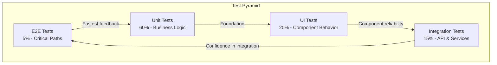
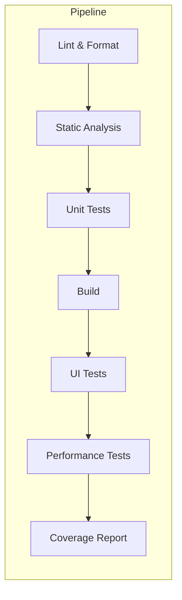

# Mobile Testing Strategy

## Test Pyramid



## Test Categories

### Unit Tests

```yaml
unit_tests:
  coverage_target: 80%
  framework:
    ios: XCTest / Quick+Nimble
    android: JUnit / MockK
    react_native: Jest / React Testing Library
    flutter: test package / mockito
    
  what_to_test:
    - domain_models
    - use_cases
    - view_models (state changes)
    - utilities (date formatting, validation)
    - repository_logic
    - data_mappers
    
  what_not_to_test:
    - ui_rendering
    - third_party_libraries
    - platform_specific_code_without_abstraction
    - trivial_getters_setters
    
  mocking:
    - mock_network_responses
    - mock_storage_operations
    - mock_external_dependencies
    - use_injection_for_testability
```

#### Unit Test Example (Swift)

```swift
import XCTest
@testable import MyApp

final class LoginViewModelTests: XCTestCase {
    
    var sut: LoginViewModel!
    var mockAuthManager: MockAuthManager!
    var mockRouter: MockRouter!
    
    override func setUp() {
        super.setUp()
        mockAuthManager = MockAuthManager()
        mockRouter = MockRouter()
        sut = LoginViewModel(
            authManager: mockAuthManager,
            router: mockRouter
        )
    }
    
    override func tearDown() {
        sut = nil
        mockAuthManager = nil
        mockRouter = nil
        super.tearDown()
    }
    
    func test_login_success_navigatesToHome() async {
        // Given
        mockAuthManager.loginResult = .success(TokenPair.mock)
        
        // When
        await sut.login(email: "test@example.com", password: "password123")
        
        // Then
        XCTAssertTrue(mockRouter navigatedToHome)
    }
    
    func test_login_failure_showsError() async {
        // Given
        mockAuthManager.loginResult = .failure(AuthError.invalidCredentials)
        
        // When
        await sut.login(email: "test@example.com", password: "wrong")
        
        // Then
        XCTAssertEqual(sut.errorMessage, "Invalid email or password")
    }
}
```

#### Unit Test Example (Kotlin)

```kotlin
import io.mockk.*
import kotlinx.coroutines.test.runTest
import org.junit.Assert.*
import org.junit.Before
import org.junit.Test

class LoginViewModelTest {
    
    private lateinit var viewModel: LoginViewModel
    private val authManager = mockk<AuthManager>()
    private val router = mockk<Router>(relaxed = true)
    
    @Before
    fun setUp() {
        viewModel = LoginViewModel(authManager, router)
    }
    
    @Test
    fun `login success navigates to home`() = runTest {
        // Given
        coEvery { authManager.login(any(), any()) } returns TokenPair.mock
        
        // When
        viewModel.login("test@example.com", "password123")
        
        // Then
        verify { router.navigateToHome() }
    }
    
    @Test
    fun `login failure shows error`() = runTest {
        // Given
        coEvery { authManager.login(any(), any()) } throws AuthException.InvalidCredentials
        
        // When
        viewModel.login("test@example.com", "wrong")
        
        // Then
        assertEquals("Invalid email or password", viewModel.uiState.value.errorMessage)
    }
}
```

### Integration Tests

```yaml
integration_tests:
  network_tests:
    - test_api_request_response
    - test_error_handling
    - test_retry_mechanism
    - test_token_refresh
    
  storage_tests:
    - test_crud_operations
    - test_data_persistence
    - test_encryption
    - test_cache_invalidation
    
  authentication_flow:
    - test_login_logout_cycle
    - test_token_refresh_flow
    - test_biometric_enrollment
    - test_session_timeout
    
  deep_linking:
    - test_universal_links
    - test_custom_url_schemes
    - test_notification_deep_links
```

### UI Tests

```yaml
ui_tests:
  framework:
    ios: XCUITest
    android: Espresso / Compose Testing
    react_native: Detox / Appium
    flutter: integration_test package
    
  what_to_test:
    - navigation_flows
    - form_submissions
    - error_state_rendering
    - loading_state_rendering
    - pull_to_refresh
    - pagination
    - accessibility
    
  screenshot_tests:
    enabled: true
    tools:
      - ios: SnapshotTesting
      - android: Paparazzi
      - cross_platform: Percy / Chromatic
    scenarios:
      - each_screen_light_mode
      - each_screen_dark_mode
      - each_screen_large_text
      - error_states
      - empty_states
```

#### E2E Test Example (Detox)

```typescript
describe('Login Flow', () => {
  beforeAll(async () => {
    await device.launchApp();
  });

  beforeEach(async () => {
    await device.reloadReactNative();
  });

  it('should login successfully', async () => {
    await element(by.id('email-input')).typeText('test@example.com');
    await element(by.id('password-input')).typeText('password123');
    await element(by.id('login-button')).tap();
    
    await expect(element(by.id('home-screen'))).toBeVisible();
  });

  it('should show error for invalid credentials', async () => {
    await element(by.id('email-input')).typeText('wrong@example.com');
    await element(by.id('password-input')).typeText('wrongpassword');
    await element(by.id('login-button')).tap();
    
    await expect(element(by.id('error-message'))).toBeVisible();
    await expect(element(by.id('error-message'))).toHaveText('Invalid email or password');
  });
});
```

### Performance Tests

```yaml
performance_tests:
  metrics:
    app_launch:
      cold_launch: < 2000ms
      warm_launch: < 1000ms
      hot_launch: < 500ms
      
    screen_render:
      first_frame: < 500ms
      subsequent: < 300ms
      
    scroll_performance:
      frame_rate: 60fps minimum
      jank_frames: < 1 per 1000 frames
      
    memory:
      baseline: < 200MB
      growth_rate: < 5MB per session
      
  tools:
    ios: Instruments (Time Profiler, Allocations)
    android: Android Profiler, Baseline Profiles
    react_native: Flipper, React DevTools
    flutter: DevTools, Skia debugger
    
  ci_integration:
    - run_startup_benchmark
    - check_memory_leaks
    - monitor_frame_rates
    - track_app_size
```

## Test Data Management

```yaml
test_data:
  fixtures:
    - mock_api_responses
    - seed_database_data
    - sample_user_accounts
    - test_media_files
    
  factories:
    - UserFactory.build()
    - PostFactory.build(title: "Test Post")
    - CommentFactory.build(count: 10)
    
  cleanup:
    - reset_database_before_test
    - clear_local_storage
    - reset_onboarding_state
    
  environments:
    test:
      api_base_url: "https://test-api.example.com"
      database: "in_memory"
    staging:
      api_base_url: "https://staging-api.example.com"
      database: "shared_test_db"
```

## CI Test Pipeline



```yaml
ci_test_config:
  stages:
    - name: lint
      timeout: 5 minutes
      commands:
        - swiftlint lint  # iOS
        - ktlint check    # Android
        - eslint run      # React Native
        
    - name: unit_tests
      timeout: 10 minutes
      parallel: true
      commands:
        - xcodebuild test  # iOS
        - ./gradlew test   # Android
        - npm test          # React Native
        
    - name: build
      timeout: 15 minutes
      commands:
        - xcodebuild build  # iOS
        - ./gradlew assembleDebug  # Android
        
    - name: ui_tests
      timeout: 30 minutes
      devices:
        - iPhone_15_Pro
        - Pixel_8
        
    - name: coverage
      threshold: 80%
      reports:
        - codecov
        - sonarqube
```

## Testing Checklist

| Category | Test | Automated | Manual |
|----------|------|-----------|--------|
| Auth | Login flow | Y | Y |
| Auth | Biometric login | Y | Y |
| Auth | Token refresh | Y | - |
| Auth | Logout cleanup | Y | Y |
| Navigation | Deep links | Y | Y |
| Navigation | Back button | Y | Y |
| Forms | Input validation | Y | Y |
| Forms | Keyboard handling | - | Y |
| Network | Offline mode | Y | Y |
| Network | Error states | Y | Y |
| Performance | Cold start | Y | Y |
| Performance | Scroll FPS | Y | - |
| Accessibility | VoiceOver | Y | Y |
| Accessibility | Dynamic text | Y | Y |
| Permissions | Camera | - | Y |
| Permissions | Notifications | - | Y |
| Platform | iOS specific | Y | Y |
| Platform | Android specific | Y | Y |

## Configuration

[CONFIGURE] Update for your project:
- Test coverage targets
- E2E testing framework choice
- Performance benchmarks
- CI pipeline stages
- Device matrix for testing
- Test data management approach
