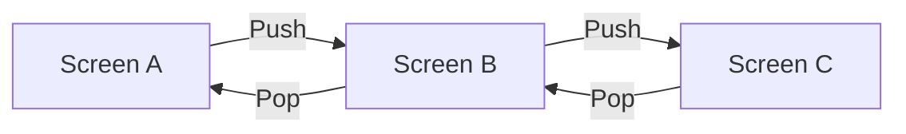
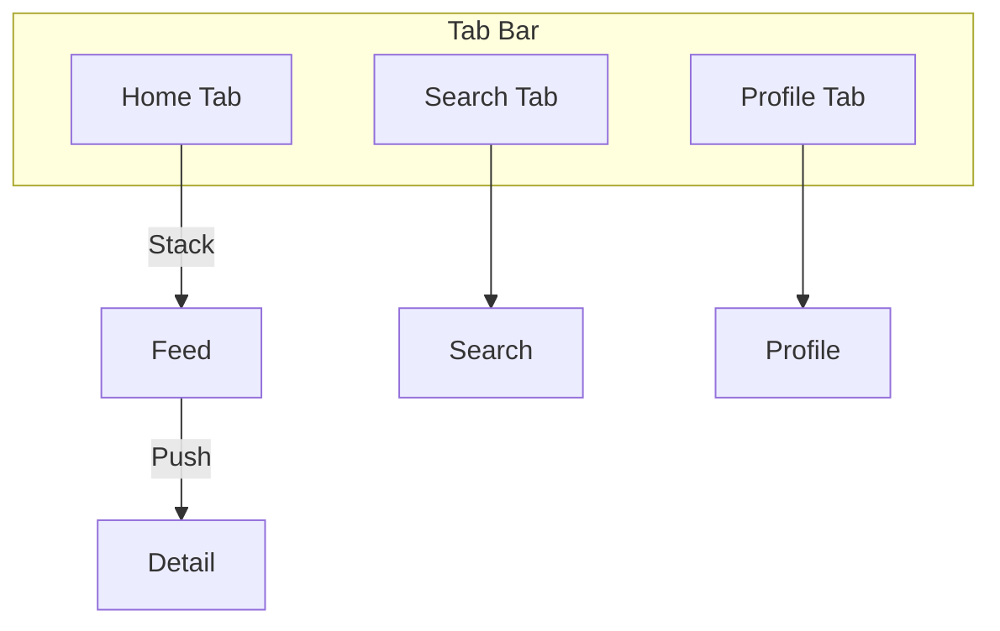
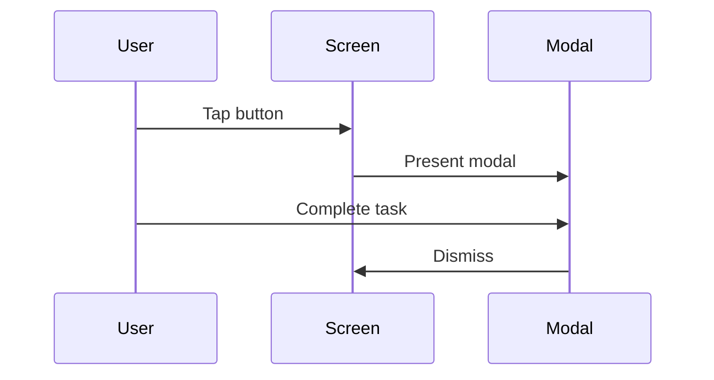
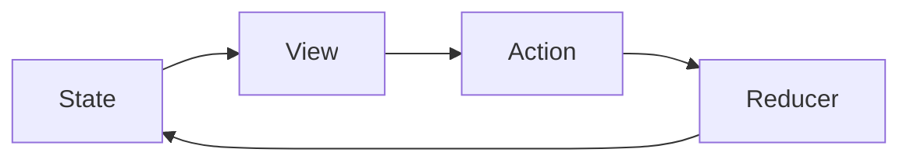
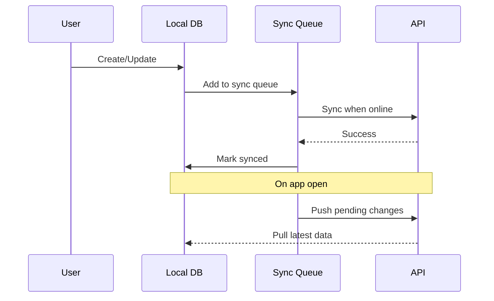
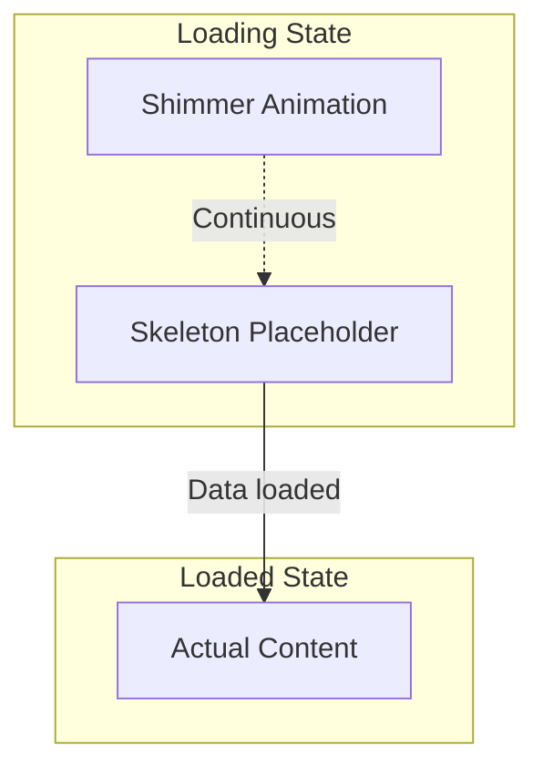
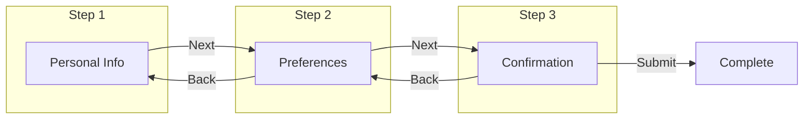
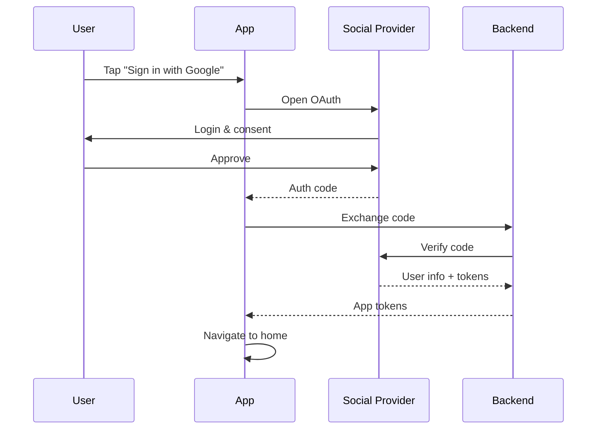
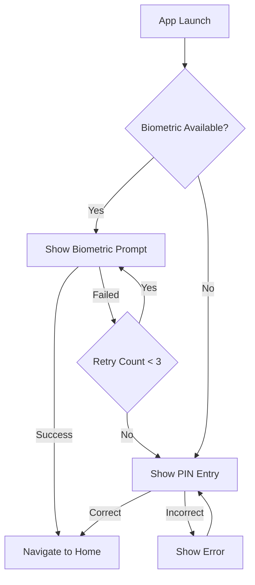

# Common Mobile Development Patterns

## Navigation Patterns

### Stack Navigation



**When to use:** Hierarchical content, settings, detail screens.

### Tab Navigation



**When to use:** Top-level sections, primary navigation.

### Modal Presentation



**When to use:** Self-contained tasks, forms, confirmations.

## State Management Patterns

### Unidirectional Data Flow



### Optimistic Updates

```typescript
// Pattern: Update UI immediately, revert on failure
async function toggleFavorite(item: Item) {
  // 1. Optimistic update
  updateItemOptimistically(item.id, { isFavorite: true });
  
  try {
    // 2. API call
    await api.toggleFavorite(item.id);
  } catch (error) {
    // 3. Revert on failure
    updateItemOptimistically(item.id, { isFavorite: false });
    showError('Failed to update. Please try again.');
  }
}
```

### Pagination Pattern

```typescript
// Infinite scroll pagination
function useInfiniteList<T>(fetchFn: (page: number) => Promise<T[]>) {
  const [data, setData] = useState<T[]>([]);
  const [page, setPage] = useState(1);
  const [hasMore, setHasMore] = useState(true);
  const [isLoading, setIsLoading] = useState(false);

  const loadMore = async () => {
    if (isLoading || !hasMore) return;
    
    setIsLoading(true);
    const newData = await fetchFn(page);
    
    if (newData.length === 0) {
      setHasMore(false);
    } else {
      setData(prev => [...prev, ...newData]);
      setPage(prev => prev + 1);
    }
    
    setIsLoading(false);
  };

  return { data, loadMore, hasMore, isLoading };
}
```

## Network Patterns

### Offline-First with Sync



### Request/Response Pattern

```typescript
// Standard API request wrapper
async function apiRequest<T>(
  endpoint: string,
  options?: RequestOptions
): Promise<ApiResponse<T>> {
  try {
    // 1. Add auth token
    const token = await getAuthToken();
    
    // 2. Make request
    const response = await fetch(`${API_BASE}${endpoint}`, {
      ...options,
      headers: {
        'Authorization': `Bearer ${token}`,
        'Content-Type': 'application/json',
        ...options?.headers,
      },
    });
    
    // 3. Handle response
    if (!response.ok) {
      throw await handleApiError(response);
    }
    
    return { data: await response.json(), error: null };
  } catch (error) {
    return { data: null, error: handleNetworkError(error) };
  }
}
```

### Retry with Exponential Backoff

```typescript
async function retryWithBackoff<T>(
  fn: () => Promise<T>,
  maxRetries = 3,
  baseDelay = 1000
): Promise<T> {
  for (let attempt = 0; attempt <= maxRetries; attempt++) {
    try {
      return await fn();
    } catch (error) {
      if (attempt === maxRetries) throw error;
      
      const delay = baseDelay * Math.pow(2, attempt);
      await sleep(delay);
    }
  }
  throw new Error('Max retries exceeded');
}
```

## Storage Patterns

### Secure Storage Wrapper

```typescript
// Platform-agnostic secure storage
interface SecureStorage {
  set(key: string, value: string): Promise<void>;
  get(key: string): Promise<string | null>;
  remove(key: string): Promise<void>;
  clear(): Promise<void>;
}

// iOS: Keychain, Android: EncryptedSharedPreferences
const secureStorage: SecureStorage = Platform.select({
  ios: () => new KeychainStorage(),
  android: () => new EncryptedStorage(),
})();
```

### Cache-First Pattern

```typescript
async function getWithCache<T>(
  key: string,
  fetcher: () => Promise<T>,
  ttl: number = 5 * 60 * 1000 // 5 minutes
): Promise<T> {
  // 1. Check cache
  const cached = await cache.get(key);
  if (cached && !isExpired(cached, ttl)) {
    return cached.data;
  }
  
  // 2. Fetch fresh data
  const data = await fetcher();
  
  // 3. Update cache
  await cache.set(key, { data, timestamp: Date.now() });
  
  return data;
}
```

## UI Patterns

### Skeleton Loading



### Pull to Refresh

```yaml
implementation:
  gesture: pull_down
  threshold: 80px
  feedback:
    visual: spinner_appears
    haptic: light_impact
  states:
    idle: "pull down to refresh"
    triggered: "release to refresh"
    loading: "refreshing..."
    complete: "updated"
```

### Empty State

```yaml
empty_state:
  components:
    - illustration: relevant_image
    - title: "No items yet"
    - description: "Create your first item to get started"
    - action: "Create Item" button
    
  variants:
    no_data:
      title: "Nothing here yet"
      action: "Get Started"
      
    no_results:
      title: "No results found"
      action: "Clear Filters"
      
    error:
      title: "Couldn't load data"
      action: "Try Again"
      
    offline:
      title: "You're offline"
      action: "Retry when online"
```

### Toast/Snackbar

```yaml
toast:
  positions:
    ios: top
    android: bottom
    
  types:
    success:
      color: green
      duration: 3 seconds
      auto_dismiss: true
    error:
      color: red
      duration: 5 seconds
      auto_dismiss: false
      action: "Dismiss"
    info:
      color: blue
      duration: 3 seconds
      auto_dismiss: true
    warning:
      color: orange
      duration: 4 seconds
      auto_dismiss: true
      
  stacking:
    max_visible: 3
    newest_on_top: true
```

## Form Patterns

### Form Validation

```typescript
// Reactive form validation
interface FieldConfig {
  name: string;
  rules: ValidationRule[];
}

interface ValidationRule {
  validate: (value: any) => boolean;
  message: string;
}

function useFormValidation(fields: FieldConfig[]) {
  const [errors, setErrors] = useState<Record<string, string>>({});
  
  const validate = (fieldName: string, value: any) => {
    const field = fields.find(f => f.name === fieldName);
    if (!field) return true;
    
    const error = field.rules
      .find(rule => !rule.validate(value))?.message;
    
    setErrors(prev => ({
      ...prev,
      [fieldName]: error || '',
    }));
    
    return !error;
  };
  
  const validateAll = () => {
    // Validate all fields
  };
  
  return { errors, validate, validateAll };
}
```

### Multi-Step Form



## Authentication Patterns

### Social Login Flow



### Biometric + PIN Fallback



## Real-Time Patterns

### WebSocket Connection

```typescript
class WebSocketManager {
  private ws: WebSocket | null = null;
  private reconnectAttempts = 0;
  private maxReconnectAttempts = 5;
  
  connect(url: string, token: string) {
    this.ws = new WebSocket(`${url}?token=${token}`);
    
    this.ws.onopen = () => {
      this.reconnectAttempts = 0;
    };
    
    this.ws.onclose = () => {
      this.handleReconnect(url, token);
    };
    
    this.ws.onmessage = (event) => {
      this.handleMessage(JSON.parse(event.data));
    };
  }
  
  private handleReconnect(url: string, token: string) {
    if (this.reconnectAttempts < this.maxReconnectAttempts) {
      const delay = Math.pow(2, this.reconnectAttempts) * 1000;
      setTimeout(() => {
        this.reconnectAttempts++;
        this.connect(url, token);
      }, delay);
    }
  }
}
```

### Optimistic Real-Time Updates

```typescript
// Handle incoming real-time updates
function handleRealTimeUpdate(update: RealTimeEvent) {
  switch (update.type) {
    case 'task.updated':
      // Merge with local state
      updateLocalTask(update.taskId, update.changes);
      break;
      
    case 'task.created':
      // Add to list if visible
      if (isOnRelevantBoard(update.task.boardId)) {
        addTaskToList(update.task);
      }
      break;
      
    case 'task.deleted':
      // Remove from local state
      removeTaskFromList(update.taskId);
      break;
  }
}
```

## Performance Patterns

### Image Optimization

```yaml
image_optimization:
  loading:
    strategy: lazy
    placeholder: blur_hash_or_skeleton
    fade_in: 300ms
    
  caching:
    memory_cache: "50MB max"
    disk_cache: "200MB max"
    strategy:LRU
    
  resizing:
    display_at: exact_device_pixels
    maximum_dimensions: 2048x2048
    format:
      webp: preferred
      jpeg: fallback
      png: for_transparency
      
  prefetch:
    next_visible_items: 3
    thumbnail_size: 200px
    full_size: on_demand
```

### List Virtualization

```yaml
virtualization:
  implementation:
    ios: UICollectionView
    android: RecyclerView
    react_native: FlatList / FlashList
    flutter: ListView.builder
    
  configuration:
    initial_render: 10 items
    window_size: 5 screens
    remove_clippedSubviews: true
    max_to_render_per_batch: 10
    
  optimization:
    stable_keys: true
    item_height: fixed_or_estimated
    header_footer: memoized
```

## Configuration

[CONFIGURE] Update for your project:
- Patterns relevant to your app
- Custom patterns for your domain
- Platform-specific optimizations
- Performance requirements
