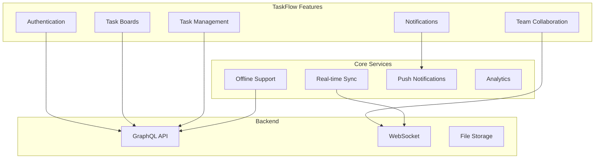

# Sample Mobile Project

This document shows an example of how to customize this template for a real project.

## Project: TaskFlow - Task Management App

### Project Overview

```yaml
project:
  name: TaskFlow
  description: "A collaborative task management app for teams"
  platforms: [iOS, Android]
  framework: React Native
  architecture: Feature-based + Clean Architecture
  state_management: Zustand + React Query
  
  team:
    size: 5 developers
    lead: "Senior Mobile Developer"
    
  target:
    ios: "iOS 16.0+"
    android: "Android 8.0+ (API 26)"
```

### Customized Architecture



### Feature Modules

```yaml
features:
  authentication:
    screens:
      - LoginScreen
      - RegisterScreen
      - ForgotPasswordScreen
    social_providers: [google, apple, github]
    biometric: true
    
  task_boards:
    screens:
      - BoardsListScreen
      - BoardDetailScreen
      - CreateBoardScreen
    components:
      - BoardCard
      - BoardGrid
      - BoardFilters
    features:
      - drag_and_drop
      - board_templates
      - board_sharing
      
  task_management:
    screens:
      - TaskDetailScreen
      - CreateTaskScreen
      - TaskListScreen
    components:
      - TaskCard
      - TaskAssigneePicker
      - TaskDatePicker
      - SubtaskList
    features:
      - subtasks
      - file_attachments
      - comments
      - activity_log
      
  team:
    screens:
      - TeamListScreen
      - MemberProfileScreen
      - InviteScreen
    components:
      - MemberAvatar
      - RoleSelector
    features:
      - roles_and_permissions
      - team_invites
      - presence_tracking
```

### API Design

```yaml
api:
  type: GraphQL
  base_url: "https://api.taskflow.app/graphql"
  
  queries:
    - me
    - boards(filter, pagination)
    - board(id)
    - tasks(boardId, filter, pagination)
    - task(id)
    - teamMembers
    
  mutations:
    - login(email, password)
    - register(email, password, name)
    - createBoard(input)
    - updateBoard(id, input)
    - deleteBoard(id)
    - createTask(input)
    - updateTask(id, input)
    - deleteTask(id)
    - assignTask(taskId, userId)
    - addComment(taskId, content)
    
  subscriptions:
    - taskUpdated(boardId)
    - boardUpdated(boardId)
    - newNotification
    - memberPresence(teamId)
```

### Security Configuration

```yaml
security:
  authentication:
    provider: Firebase Auth
    methods:
      - email_password
      - google_sign_in
      - apple_sign_in
      - github_oauth
      - biometric
      
  token_management:
    access_token_lifetime: 15 minutes
    refresh_token_lifetime: 30 days
    storage: react-native-keychain
    
  network:
    certificate_pinning: true
    tls_version: 1.3
    graphql_introspection: disabled_in_production
    
  device:
    jailbreak_detection: true
    screenshot_prevention: true_on_sensitive_screens
    
  data:
    encryption_at_rest: true
    encryption_key_rotation: 90_days
    pii_logging: prohibited
```

### Design System

```yaml
design_system:
  colors:
    primary: "#6366F1"  # Indigo
    secondary: "#10B981"  # Emerald
    background: "#FFFFFF"
    surface: "#F9FAFB"
    error: "#EF4444"
    
  typography:
    font: Inter
    scale:
      h1: 24pt bold
      h2: 20pt semibold
      h3: 16pt semibold
      body: 14pt regular
      caption: 12pt regular
      
  components:
    - Button (primary, secondary, ghost)
    - Input (text, email, password)
    - Card (elevated, outlined)
    - Avatar (small, medium, large)
    - Badge (count, status)
    - Modal (bottom sheet, dialog)
    - Toast (success, error, info)
    - Loading (spinner, skeleton)
    
  icons: Phosphor Icons
```

### CI/CD Pipeline

```yaml
ci_cd:
  platform: GitHub Actions
  
  stages:
    - lint:
        tools: [eslint, prettier, typescript]
    - test:
        unit: jest
        integration: msw
        e2e: detox
    - build:
        ios: xcodebuild
        android: gradle
    - deploy:
        internal: firebase app distribution
        production: app store / play store
        
  environments:
    dev:
      api: "https://dev-api.taskflow.app"
      firebase_project: "taskflow-dev"
    staging:
      api: "https://staging-api.taskflow.app"
      firebase_project: "taskflow-staging"
    production:
      api: "https://api.taskflow.app"
      firebase_project: "taskflow-prod"
```

### Testing Strategy

```yaml
testing:
  unit_tests:
    coverage_target: 85%
    key_areas:
      - task CRUD operations
      - board management logic
      - auth flow state management
      - offline sync logic
      
  integration_tests:
    scenarios:
      - login -> create board -> add task -> assign -> complete
      - offline -> create task -> sync when online
      - invite member -> assign task -> notification
      
  e2e_tests:
    critical_paths:
      - full_onboarding_flow
      - create_board_and_tasks
      - collaborate_with_team
      - handle_offline_mode
      
  performance_tests:
    metrics:
      - cold_start: "< 2s"
      - screen_transition: "< 300ms"
      - list_scroll: "60fps"
      - memory: "< 200MB"
```

### Deployment Checklist

```yaml
deployment:
  ios:
    app_store_connect:
      app_id: "com.taskflow.app"
      team_id: "XXXXXXXXXX"
    testflight:
      beta_groups: ["Internal", "External Beta"]
    app_store:
      release: "automatic"
      phased_release: true
      
  android:
    play_store:
      package: "com.taskflow.app"
      service_account: "google-play-key.json"
    tracks:
      internal: 100%
      production: 20%  # Phased rollout
      
  monitoring:
    crash_reporting: Firebase Crashlytics
    performance: Firebase Performance
    analytics: Mixpanel
    feature_flags: LaunchDarkly
```

## Customization Guide

To use this template for your project:

1. Replace `TaskFlow` with your project name
2. Update bundle IDs and package names
3. Modify feature modules to match your domain
4. Update API endpoints and schema
5. Configure security settings for your needs
6. Customize design tokens and components
7. Set up CI/CD for your infrastructure
8. Configure monitoring and analytics

## Configuration

[CONFIGURE] This is a sample configuration. Update all values to match your project.
