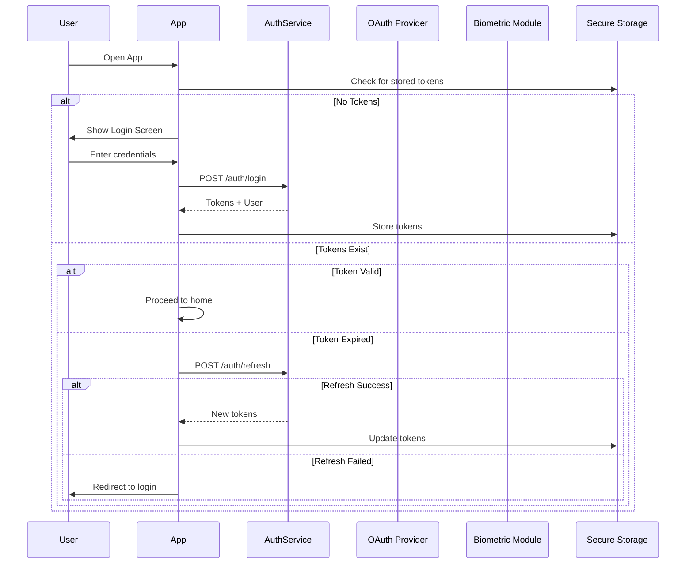
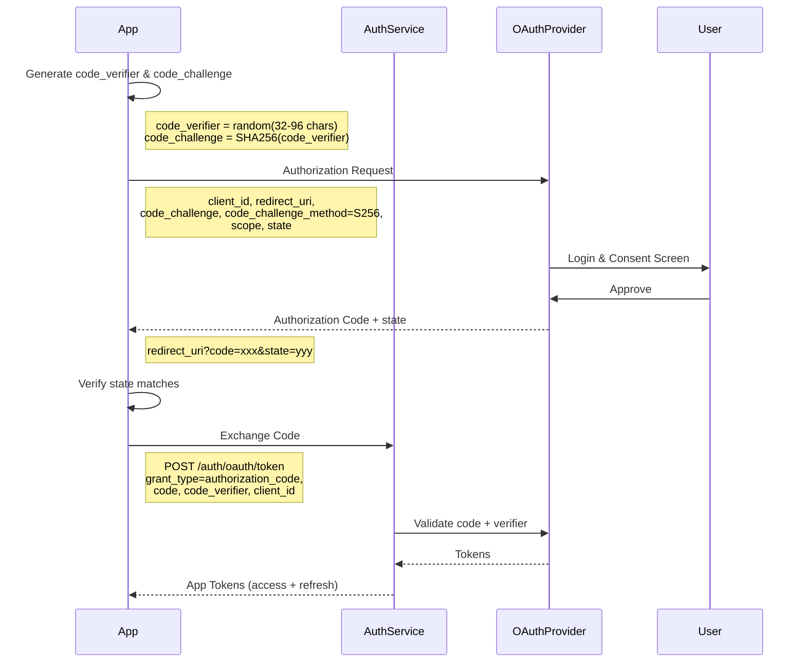
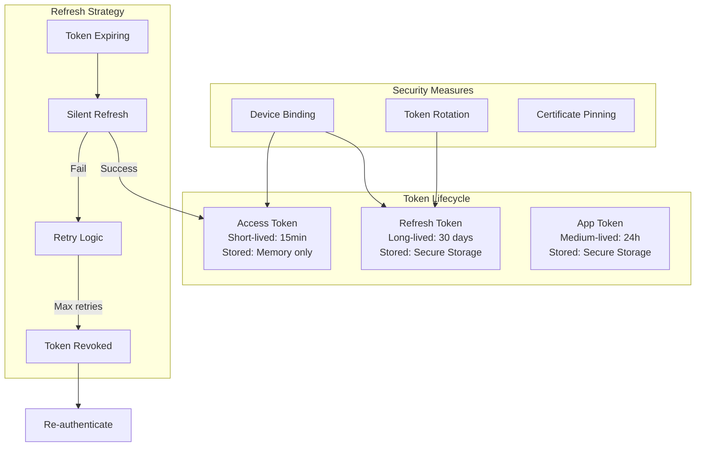
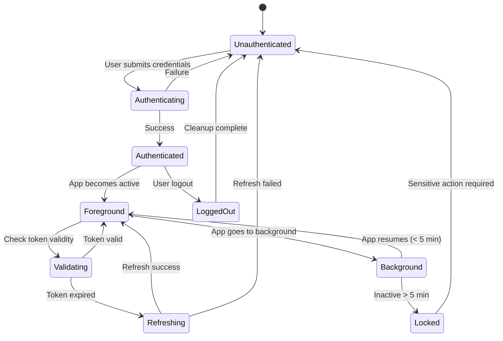
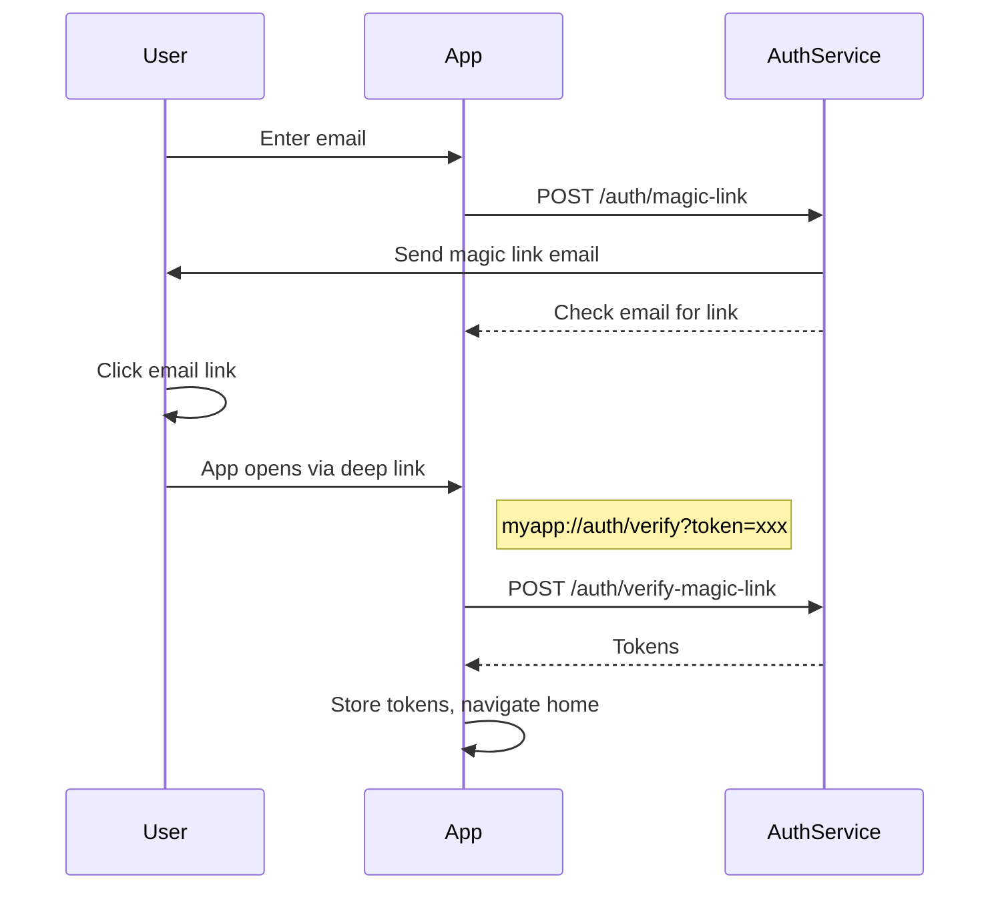

# Mobile Authentication Patterns

## Authentication Flow Overview



## Biometric Authentication

### iOS (Face ID / Touch ID)

```swift
import LocalAuthentication

class BiometricAuthManager {
    func authenticate(reason: String) async throws -> Bool {
        let context = LAContext()
        var error: NSError?
        
        guard context.canEvaluatePolicy(.deviceOwnerAuthenticationWithBiometrics, error: &error) else {
            throw BiometricError.notAvailable
        }
        
        let success = try await context.evaluatePolicy(
            .deviceOwnerAuthenticationWithBiometrics,
            localizedReason: reason
        )
        return success
    }
    
    func biometricType() -> BiometricType {
        let context = LAContext()
        var error: NSError?
        guard context.canEvaluatePolicy(.deviceOwnerAuthenticationWithBiometrics, error: &error) else {
            return .none
        }
        switch context.biometryType {
        case .faceID: return .faceID
        case .touchID: return .touchID
        case .opticID: return .opticID
        default: return .none
        }
    }
}

enum BiometricType {
    case none, faceID, touchID, opticID
}

enum BiometricError: Error {
    case notAvailable
    case cancelled
    case fallback
    case lockout
    case passcodeRequired
}
```

### Android (BiometricPrompt)

```kotlin
import androidx.biometric.BiometricPrompt
import androidx.fragment.app.FragmentActivity

class BiometricAuthManager(private val activity: FragmentActivity) {
    
    fun authenticate(
        title: String,
        subtitle: String,
        onSuccess: () -> Unit,
        onError: (Int, String) -> Unit,
        onFailed: () -> Unit
    ) {
        val executor = ContextCompat.getMainExecutor(activity)
        
        val callback = object : BiometricPrompt.AuthenticationCallback() {
            override fun onAuthenticationSucceeded(result: BiometricPrompt.AuthenticationResult) {
                super.onAuthenticationSucceeded(result)
                onSuccess()
            }
            
            override fun onAuthenticationError(errorCode: Int, errString: CharSequence) {
                super.onAuthenticationError(errorCode, errString)
                onError(errorCode, errString.toString())
            }
            
            override fun onAuthenticationFailed() {
                super.onAuthenticationFailed()
                onFailed()
            }
        }
        
        val promptInfo = BiometricPrompt.PromptInfo.Builder()
            .setTitle(title)
            .setSubtitle(subtitle)
            .setAllowedAuthenticators(BiometricManager.Authenticators.BIOMETRIC_STRONG)
            .setNegativeButtonText("Use Password")
            .build()
        
        val biometricPrompt = BiometricPrompt(activity, executor, callback)
        biometricPrompt.authenticate(promptInfo)
    }
}
```

## OAuth 2.0 + PKCE Flow



### PKCE Implementation

```typescript
// Crypto utilities for PKCE
async function generatePKCE() {
  const verifier = generateRandomString(64);
  const challenge = await sha256(verifier);
  return {
    codeVerifier: verifier,
    codeChallenge: base64UrlEncode(challenge),
  };
}

function generateRandomString(length: number): string {
  const array = new Uint8Array(length);
  crypto.getRandomValues(array);
  return base64UrlEncode(array);
}

async function sha256(plain: string): Promise<ArrayBuffer> {
  const encoder = new TextEncoder();
  const data = encoder.encode(plain);
  return crypto.subtle.digest('SHA-256', data);
}

// OAuth flow
async function startOAuthFlow(provider: 'google' | 'apple' | 'github') {
  const { codeVerifier, codeChallenge } = await generatePKCE();
  const state = generateRandomString(32);
  
  // Store PKCE values securely
  await secureStore.set('pkce_verifier', codeVerifier);
  await secureStore.set('oauth_state', state);
  
  const params = new URLSearchParams({
    client_id: CONFIG.oauth[provider].clientId,
    redirect_uri: CONFIG.oauth.redirectUri,
    response_type: 'code',
    code_challenge: codeChallenge,
    code_challenge_method: 'S256',
    scope: CONFIG.oauth[provider].scopes.join(' '),
    state,
  });
  
  openBrowser(`${CONFIG.oauth[provider].authUrl}?${params}`);
}
```

## Token Management



### Token Storage Rules

```yaml
access_token:
  storage: In-memory only
  transmission: Authorization header
  lifetime: 900 seconds (15 min)
  refresh: Silent refresh before expiry

refresh_token:
  storage: Keychain (iOS) / EncryptedSharedPreferences (Android)
  transmission: POST body only
  lifetime: 2592000 seconds (30 days)
  refresh: Rotated on each use
  revocation: On logout, revoke server-side

app_token:
  storage: Keychain / EncryptedSharedPreferences
  transmission: Authorization header
  lifetime: 86400 seconds (24 hours)
  refresh: On app foreground if expired
```

## Session Management



## MFA Implementation

```yaml
mfa_methods:
  sms:
    description: SMS verification code
    setup: POST /auth/mfa/sms/setup
    verify: POST /auth/mfa/sms/verify
    backup: true
    
  totp:
    description: Time-based one-time password (Google Authenticator)
    setup: POST /auth/mfa/totp/setup
      response: { secret, qr_code_url, recovery_codes }
    verify: POST /auth/mfa/totp/verify
    
  push:
    description: Push notification approval
    setup: POST /auth/mfa/push/setup
    verify: POST /auth/mfa/push/verify
    
  biometric:
    description: Biometric re-verification
    verify: Local biometric prompt + server verification

mfa_flow:
  1: User logs in with email/password
  2: Server requires MFA
  3: App prompts for MFA method
  4: User provides MFA
  5: Server issues full tokens
  6: App stores tokens
```

## Passwordless Authentication



## Configuration

[CONFIGURE] Update for your project:
- OAuth providers (Google, Apple, GitHub, etc.)
- Biometric requirements (optional vs required)
- Token lifetimes based on security needs
- MFA methods supported
- Session timeout policies
- Password policy requirements
