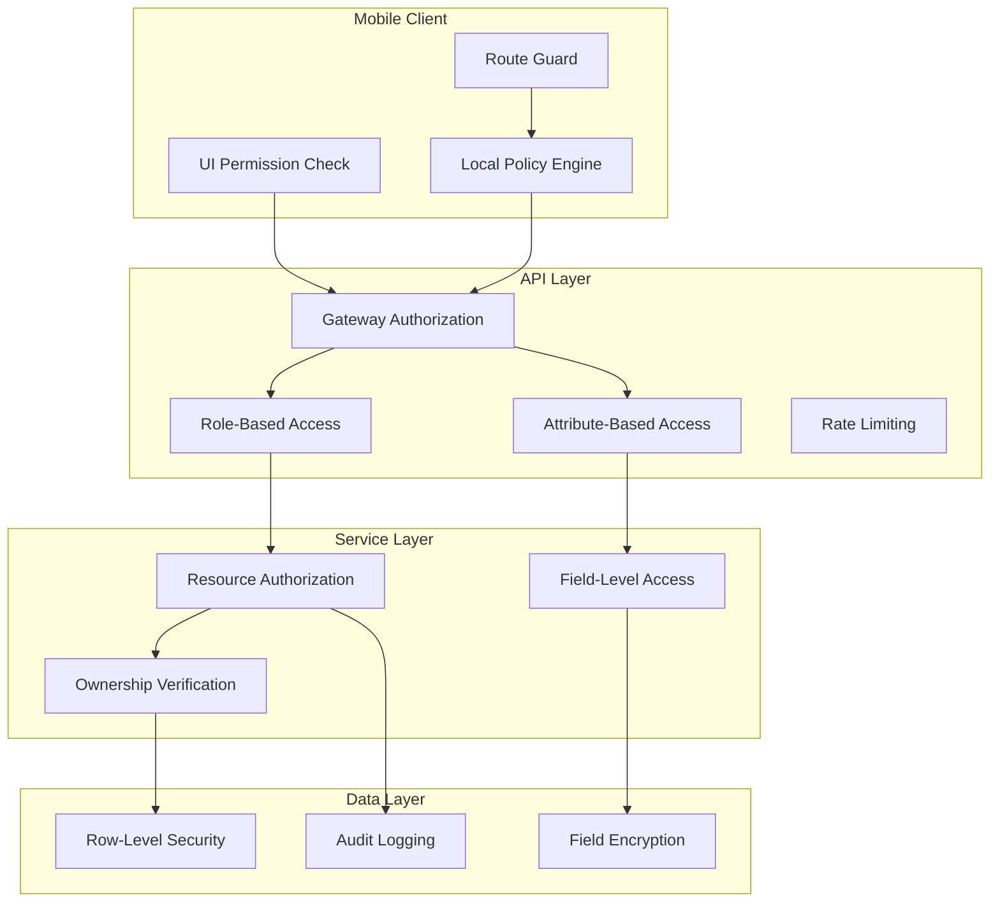

# Mobile Authorization & Access Control

## Authorization Architecture



## Role-Based Access Control (RBAC)

```yaml
roles:
  guest:
    description: Unauthenticated user
    permissions:
      - auth:login
      - auth:register
      - content:read:public

  user:
    description: Authenticated standard user
    inherits: guest
    permissions:
      - profile:read:own
      - profile:update:own
      - resource:read:own
      - resource:create:own
      - resource:update:own
      - resource:delete:own
      - notification:read:own
      - notification:preferences:own

  premium:
    description: Premium subscriber
    inherits: user
    permissions:
      - resource:export:own
      - resource:advanced_features
      - analytics:read:own
      - priority:support

  admin:
    description: Platform administrator
    inherits: premium
    permissions:
      - user:read:all
      - user:manage:all
      - resource:read:all
      - resource:moderate:all
      - content:manage:all
      - analytics:read:all
      - system:configure

  super_admin:
    description: System administrator
    inherits: admin
    permissions:
      - system:full_access
      - billing:manage
      - api_keys:manage
      - security:configure
```

## Permission Matrix

| Resource | Guest | User | Premium | Admin |
|----------|-------|------|---------|-------|
| Public Content | R | R | R | R |
| Own Profile | - | R/U | R/U | R/U/D |
| Any Profile | - | - | - | R |
| Own Resources | - | CRUD | CRUD | CRUD |
| Any Resource | - | - | - | R/Moderate |
| Analytics | - | Own | Own+ | All |
| System Settings | - | - | - | R/U |
| User Management | - | - | - | CRUD |
| Billing | - | - | - | R/U |

## Mobile-Specific Permission Patterns

### Platform Permissions (OS Level)

```yaml
ios_permissions:
  - key: NSCameraUsageDescription
    purpose: "Camera access for taking photos"
    required: false
    
  - key: NSPhotoLibraryUsageDescription
    purpose: "Photo library access for selecting images"
    required: false
    
  - key: NSLocationWhenInUseUsageDescription
    purpose: "Location access for nearby features"
    required: false
    
  - key: NSContactsUsageDescription
    purpose: "Contacts access for inviting friends"
    required: false
    
  - key: NSFaceIDUsageDescription
    purpose: "Face ID for quick and secure login"
    required: false
    
  - key: NSMicrophoneUsageDescription
    purpose: "Microphone for video recording"
    required: false

android_permissions:
  - name: android.permission.CAMERA
    purpose: Camera access for photos
    runtime: true
    
  - name: android.permission.READ_EXTERNAL_STORAGE
    purpose: Photo selection
    runtime: true
    deprecated: Use READ_MEDIA_IMAGES
    
  - name: android.permission.ACCESS_FINE_LOCATION
    purpose: Precise location
    runtime: true
    
  - name: android.permission.ACCESS_COARSE_LOCATION
    purpose: Approximate location
    runtime: true
    
  - name: android.permission.READ_CONTACTS
    purpose: Contact invitation
    runtime: true
    
  - name: android.permission.POST_NOTIFICATIONS
    purpose: Push notifications
    runtime: true
```

### Permission Request Strategy

```mermaid
graph TB
    START[Feature Requires Permission] --> CHECK{Already Granted?}
    
    CHECK -->|Yes| PROCEED[Proceed with Feature]
    CHECK -->|No| EXPLAIN[Show Explanation Screen]
    
    EXPLAIN --> REQUEST[Request Permission]
    REQUEST --> RESULT{User Response}
    
    RESULT -->|Granted| PROCEED
    RESULT -->|Denied| SETTINGS{Should Show Settings?}
    RESULT -->|Permanently Denied| OPEN_SETTINGS[Open App Settings]
    
    SETTINGS -->|Yes| SHOW_ONCE[Show "Don't Ask Again" Option]
    SETTINGS -->|No| FALLBACK[Show Fallback UI]
    
    SHOW_ONCE --> REQUEST
    OPEN_SETTINGS --> CHECK
    FALLBACK --> DEGRADED[Degraded Feature Mode]
```

### Runtime Permission Handler

```kotlin
class PermissionManager(private val activity: FragmentActivity) {
    
    sealed class PermissionResult {
        object Granted : PermissionResult()
        object Denied : PermissionResult()
        object PermanentlyDenied : PermissionResult()
        object RationaleNeeded : PermissionResult()
    }
    
    private val launcher = activity.registerForActivityResult(
        ActivityResultContracts.RequestMultiplePermissions()
    ) { permissions ->
        val allGranted = permissions.all { it.value }
        val permanentDenial = permissions.any { 
            !it.value && !activity.shouldShowRequestPermissionRationale(it.key)
        }
        
        when {
            allGranted -> callback(PermissionResult.Granted)
            permanentDenial -> callback(PermissionResult.PermanentlyDenied)
            else -> callback(PermissionResult.Denied)
        }
    }
    
    fun requestPermissions(
        permissions: List<String>,
        rationaleMessage: String? = null,
        callback: (PermissionResult) -> Unit
    ) {
        this.callback = callback
        
        if (permissions.all { isGranted(it) }) {
            callback(PermissionResult.Granted)
            return
        }
        
        val needsRationale = permissions.any {
            activity.shouldShowRequestPermissionRationale(it)
        }
        
        if (needsRationale && rationaleMessage != null) {
            showRationaleDialog(rationaleMessage) {
                launcher.launch(permissions.toTypedArray())
            }
        } else {
            launcher.launch(permissions.toTypedArray())
        }
    }
    
    private fun isGranted(permission: String): Boolean {
        return ContextCompat.checkSelfPermission(
            activity, permission
        ) == PackageManager.PERMISSION_GRANTED
    }
}
```

## Resource-Level Authorization

### Ownership Verification

```typescript
interface AuthorizationContext {
  userId: string;
  role: UserRole;
  permissions: Permission[];
  deviceId: string;
  sessionId: string;
}

interface Resource {
  id: string;
  ownerId: string;
  organizationId?: string;
  visibility: 'private' | 'organization' | 'public';
  createdAt: Date;
  updatedAt: Date;
}

function authorize(
  context: AuthorizationContext,
  resource: Resource,
  action: 'read' | 'create' | 'update' | 'delete'
): boolean {
  // Super admin bypasses all checks
  if (context.role === 'super_admin') return true;
  
  // Check base permission
  if (!hasPermission(context, action, resource)) return false;
  
  // Ownership checks
  switch (action) {
    case 'read':
      return canRead(context, resource);
    case 'update':
    case 'delete':
      return canModify(context, resource);
    case 'create':
      return canCreate(context);
    default:
      return false;
  }
}

function canRead(ctx: AuthorizationContext, resource: Resource): boolean {
  if (resource.ownerId === ctx.userId) return true;
  if (resource.visibility === 'public') return true;
  if (resource.visibility === 'organization' && ctx.role === 'admin') return true;
  return false;
}

function canModify(ctx: AuthorizationContext, resource: Resource): boolean {
  if (ctx.role === 'admin') return true;
  return resource.ownerId === ctx.userId;
}
```

## Device-Level Authorization

```yaml
device_policies:
  max_devices_per_user: 5
  trusted_device_expiry: 90 days
  
  device_verification:
    method: device_fingerprint
    components:
      - device_model
      - os_version
      - app_install_id
      - hardware_attestation
    
  risk_assessment:
    factors:
      - new_device: true
      - unusual_location: true
      - unusual_time: true
      - jailbreak_detected: true
    
    actions:
      low_risk: allow
      medium_risk: require_biometric
      high_risk: require_reauthentication
      critical: block_and_alert

  jailbreak_detection:
    ios:
      - file_exists: "/Applications/Cydia.app"
      - file_exists: "/Library/MobileSubstrate/MobileSubstrate.dylib"
      - can_write_to: "/private"
      - urlscheme_check: "cydia://"
    android:
      - check_installed: "com.topjohnwu.magisk"
      - check_installed: "eu.chainfire.supersu"
      - test_keys: true
      - selinux_check: false
```

## Rate Limiting

```yaml
rate_limits:
  authentication:
    login_attempts:
      window: 15 minutes
      max_attempts: 5
      lockout_duration: 30 minutes
      action: exponential_backoff
    
    password_reset:
      window: 1 hour
      max_attempts: 3
      action: temporary_block

  api:
    default:
      window: 60 seconds
      max_requests: 60
      
    authenticated:
      window: 60 seconds
      max_requests: 120
      
    premium:
      window: 60 seconds
      max_requests: 300

  resource_specific:
    file_upload:
      window: 1 hour
      max_uploads: 50
      max_size: 100MB per upload
    
    search:
      window: 60 seconds
      max_queries: 30
```

## Audit Logging

```yaml
audit_events:
  authentication:
    - event: login_success
      fields: [user_id, device_id, platform, ip_address]
    - event: login_failure
      fields: [email, reason, ip_address]
    - event: logout
      fields: [user_id, device_id]
    - event: password_changed
      fields: [user_id, ip_address]
    - event: mfa_enabled
      fields: [user_id, method]
  
  authorization:
    - event: permission_denied
      fields: [user_id, resource, action, reason]
    - event: role_changed
      fields: [admin_id, target_user_id, old_role, new_role]
    - event: account_locked
      fields: [user_id, reason, lockout_duration]
  
  data_access:
    - event: data_export
      fields: [user_id, data_type, record_count]
    - event: data_deletion
      fields: [user_id, data_type, record_count]
    - event: pii_accessed
      fields: [accessor_id, target_user_id, pii_fields]

retention:
  auth_events: 1 year
  authorization_events: 2 years
  data_access: 3 years
  compliance_required: 7 years
```

## Configuration

[CONFIGURE] Update for your project:
- Role definitions and hierarchy
- Permission sets per role
- Platform permissions required
- Device policies and limits
- Rate limiting thresholds
- Audit logging requirements
