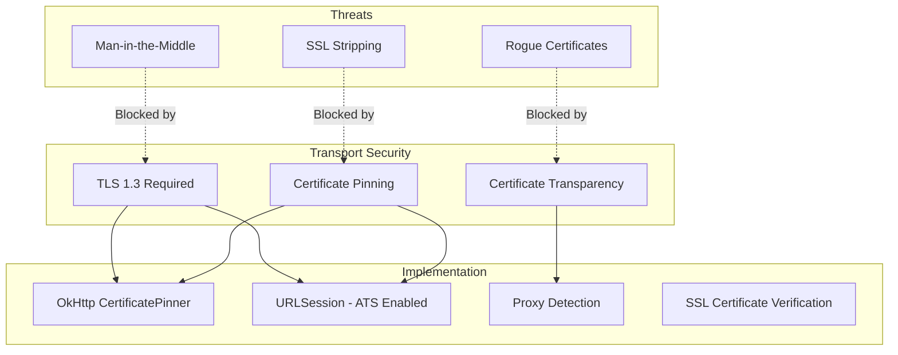

# Mobile Security Best Practices

## OWASP Mobile Top 10 (2024)

```mermaid
graph TB
    subgraph "OWASP Mobile Top 10"
        M1[M1: Improper Credential Usage]
        M2[M2: Inadequate Supply Chain Security]
        M3[M3: Insecure Authentication/Authorization]
        M4[M4: Insufficient Input/Output Validation]
        M5[M5: Insecure Communication]
        M6[M6: Inadequate Privacy Controls]
        M7[M7: Insufficient Binary Protections]
        M8[M8: Security Misconfiguration]
        M9[M9: Insecure Data Storage]
        M10[M10: Insufficient Cryptography]
    end

    subgraph "Mitigations"
        CRED_M[Secure Credential Management]
        SC_M[Dependency Scanning & SCA]
        AUTH_M[Proper Auth Implementation]
        VALID_M[Input Validation & Sanitization]
        TLS_M[TLS 1.3 + Certificate Pinning]
        PRIV_M[Privacy by Design]
        PROTECT_M[Anti-Tampering & Obfuscation]
        CONFIG_M[Secure Configuration]
        STORE_M[Encrypted Storage Only]
        CRYPTO_M[Modern Crypto Primitives]
    end

    M1 --> CRED_M
    M2 --> SC_M
    M3 --> AUTH_M
    M4 --> VALID_M
    M5 --> TLS_M
    M6 --> PRIV_M
    M7 --> PROTECT_M
    M8 --> CONFIG_M
    M9 --> STORE_M
    M10 --> CRYPTO_M
```



## Security Checklist

### M1: Credential Usage

```yaml
credential_security:
  never_do:
    - hardcode_api_keys_in_source
    - store_credentials_in_logs
    - transmit_credentials_in_url_params
    - share_credentials_across_apps
    - store_plaintext_passwords
    
  always_do:
    - use_secure_storage_keychain_keystore
    - implement_token_refresh_mechanism
    - use_oauth2_pkce_for_auth
    - rotate_api_keys_regularly
    - revoke_tokens_on_logout
    
  keychain_storage:
    ios:
      accessibility: kSecAttrAccessibleWhenUnlockedThisDeviceOnly
      synchronization: false
      access_control: biometric_or_passcode
    android:
      encrypted_shared_preferences: true
      key_store: android.security.keystore
      user_authentication: required_for_keys
```

### M2: Supply Chain Security

```yaml
supply_chain:
  dependency_management:
    - lock_all_dependency_versions
    - verify_package_integrity
    - use_private_package_registries
    - scan_dependencies_for_vulnerabilities
    - regular_dependency_updates
    
  ci_cd_security:
    - signed_commits_required
    - branch_protection_rules
    - secret_scanning_enabled
    - dependency_review_on_pr
    - sbom_generation
    
  third_party_sdks:
    audit_before_integration:
      - check_sdk_permissions
      - review_data_collection
      - verify_update_mechanism
      - assess_reputation
    ongoing:
      - monitor_for_vulnerabilities
      - update_promptly
      - review_permission_usage
```

### M5: Insecure Communication



#### Certificate Pinning

```kotlin
// Android - OkHttp
val certificatePinner = CertificatePinner.Builder()
    .add(
        "api.yourdomain.com",
        "sha256/AAAAAAAAAAAAAAAAAAAAAAAAAAAAAAAAAAAAAAAAAAA=" // Primary
    )
    .add(
        "api.yourdomain.com",
        "sha256/BBBBBBBBBBBBBBBBBBBBBBBBBBBBBBBBBBBBBBBBBBB=" // Backup
    )
    .build()

val client = OkHttpClient.Builder()
    .certificatePinner(certificatePinner)
    .build()
```

```swift
// iOS - URLSession with pinned certificates
class PinnedURLSessionDelegate: NSObject, URLSessionDelegate {
    func urlSession(
        _ session: URLSession,
        didReceive challenge: URLAuthenticationChallenge,
        completionHandler: @escaping (URLSession.AuthChallengeDisposition, URLCredential?) -> Void
    ) {
        guard let serverTrust = challenge.protectionSpace.serverTrust,
              let certificate = SecTrustGetCertificateAtIndex(serverTrust, 0) else {
            completionHandler(.cancelAuthenticationChallenge, nil)
            return
        }
        
        let serverCertData = SecCertificateCopyData(certificate) as Data
        let localCertData = NSData(contentsOfFile: Bundle.main.path(
            forResource: "api-cert", ofType: "cer"
        )!)! as Data
        
        if serverCertData == localCertData {
            completionHandler(.useCredential, URLCredential(trust: serverTrust))
        } else {
            completionHandler(.cancelAuthenticationChallenge, nil)
        }
    }
}
```

### M9: Insecure Data Storage

```yaml
data_storage_security:
  secure_storage:
    keychain: # iOS
      items:
        - access_token
        - refresh_token
        - biometric_key
        - encryption_keys
      config:
        accessibility: kSecAttrAccessibleWhenUnlockedThisDeviceOnly
        synchronizable: false
        
    keystore: # Android
      items:
        - encryption_keys
        - biometric_key
      config:
        user_authentication_required: true
        invalidated_by_biometric_enrollment: true
        
    encrypted_shared_prefs: # Android
      items:
        - user_preferences
        - feature_flags
      config:
        key_source: android_keystore
        
    mmkv: # Cross-platform (encrypted mode)
      items:
        - cache_data
        - temporary_state
      config:
        encryption: AES_128

  never_store:
    - plaintext_passwords
    - raw_api_keys_in_defaults
    - sensitive_data_in_logs
    - tokens_in_clipboard
    - personal_info_in_analytics
    - passwords_in_keyvalue_stores_unencrypted
```

### M10: Cryptography

```yaml
cryptography:
  approved_algorithms:
    symmetric:
      - AES-256-GCM # Recommended
      - AES-128-GCM # Acceptable
      - ChaCha20-Poly1305 # Alternative
    
    hashing:
      - SHA-256 # For general hashing
      - SHA-512 # For higher security needs
      - Argon2id # For password hashing (server-side)
      - bcrypt # For password hashing (server-side)
    
    asymmetric:
      - RSA-2048+ # Minimum
      - ECDSA-P256 # Recommended
      - Ed25519 # Modern alternative
    
    key_exchange:
      - X25519 # Recommended
      - ECDH-P256 # Acceptable

  prohibited:
    - MD5
    - SHA-1 (for security)
    - DES
    - 3DES
    - RC4
    - ECB_mode
    - hardcoded_iv_or_nonce
    
  key_management:
    generation: use_secure_random
    storage: platform_secure_storage
    rotation: every_90_days_or_on_compromise
    destruction: secure_deletion_with_overwrite
```

## Jailbreak/Root Detection

```yaml
detection_methods:
  ios:
    file_system_checks:
      - /Applications/Cydia.app
      - /Library/MobileSubstrate/MobileSubstrate.dylib
      - /bin/bash
      - /usr/sbin/sshd
      - /etc/apt
      - /private/var/lib/apt/
    
    url_scheme_checks:
      - cydia://
      - sileo://
      - zbra://
    
    sandbox_integrity:
      - test_write_to_system
      - check_fork_capability
      - verify_sandbox_restrictions
    
  android:
    root_check:
      - check_su_binary
      - check_installed_apps [magisk, supersu, kingoroot]
      - test_system_partition_write
      - check_selinux_status
      - check_busybox_installed
    
    emulator_detection:
      - check_build_fingerprint
      - verify_hardware_features
      - check_telephony_provider
      - detect_emulator_files

  response_strategy:
    default: warn_user_and_continue
    banking: block_access_and_alert
    configurable: per_feature_policy
```

## Network Security Configuration

### iOS (App Transport Security)

```xml
<!-- Info.plist ATS Configuration -->
<key>NSAppTransportSecurity</key>
<dict>
    <key>NSAllowsArbitraryLoads</key>
    <false/>
    <key>NSExceptionDomains</key>
    <dict>
        <key>api.yourdomain.com</key>
        <dict>
            <key>NSExceptionRequiresForwardSecrecy</key>
            <true/>
            <key>NSRequiresCertificateTransparency</key>
            <true/>
            <key>NSExceptionMinimumTLSVersion</key>
            <string>TLSv1.3</string>
        </dict>
    </dict>
</dict>
```

### Android (Network Security Config)

```xml
<!-- res/xml/network_security_config.xml -->
<network-security-config>
    <domain-config cleartextTrafficPermitted="false">
        <domain includeSubdomains="true">api.yourdomain.com</domain>
        <pin-set expiration="2025-01-01">
            <pin digest="SHA-256">
                base64EncodedPrimaryPin==
            </pin>
            <pin digest="SHA-256">
                base64EncodedBackupPin==
            </pin>
        </pin-set>
        <trust-anchors>
            <certificates src="system" />
        </trust-anchors>
    </domain-config>
    
    <debug-overrides>
        <trust-anchors>
            <certificates src="user" />
            <certificates src="system" />
        </trust-anchors>
    </debug-overrides>
</network-security-config>
```

## Security Testing Checklist

| Test | Method | Tool |
|------|--------|------|
| Static Analysis | SAST | MobSF, SonarQube |
| Dynamic Analysis | DAST | OWASP ZAP, Burp Suite |
| Dependency Scan | SCA | Snyk, Dependabot |
| Binary Analysis | Reverse Engineering | Ghidra, Hopper |
| Network Analysis | Traffic Interception | mitmproxy, Charles |
| Storage Analysis | File System Inspection | Device Explorer |
| Code Review | Manual + Automated | PR Reviews |

## Configuration

[CONFIGURE] Update for your project:
- Certificate pinning certificates
- API domains for network security
- Jailbreak/root detection response policy
- Data classification levels
- Encryption requirements per data type
- Security testing frequency
