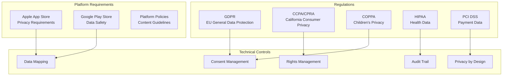
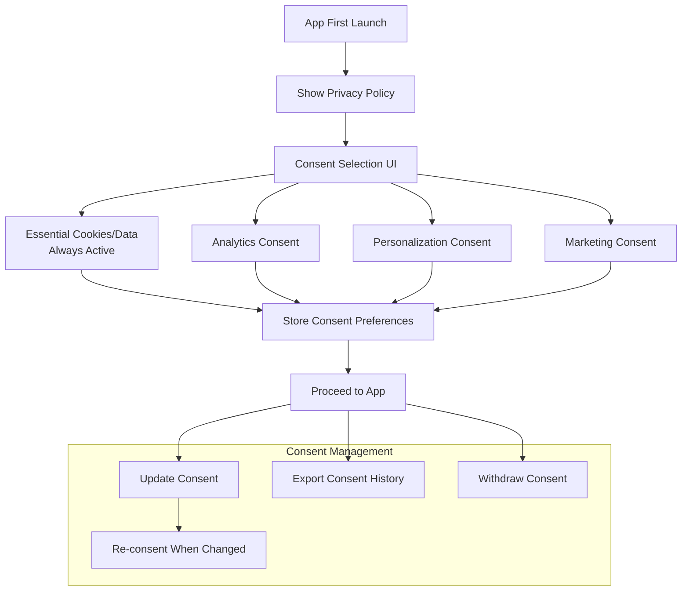
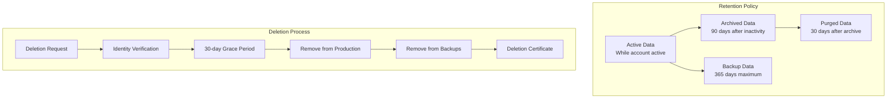

# Mobile Compliance Guide

## Compliance Framework Overview



## GDPR Compliance

### Data Processing Categories

```yaml
data_categories:
  personal_data:
    - name: Profile Information
      fields: [name, email, phone, avatar]
      legal_basis: consent
      retention: account_lifetime
      deletion: right_to_erasure
      
    - name: Device Information
      fields: [device_id, os_version, app_version, ip_address]
      legal_basis: legitimate_interest
      retention: 90_days
      deletion: automatic_purge
      
    - name: Usage Analytics
      fields: [screen_views, feature_usage, session_duration]
      legal_basis: consent
      retention: 2_years
      deletion: right_to_erasure
      
    - name: Location Data
      fields: [precise_location, coarse_location]
      legal_basis: explicit_consent
      retention: 30_days
      deletion: right_to_erasure

  special_categories:
    - name: Biometric Data
      fields: [face_id_template, fingerprint_reference]
      legal_basis: explicit_consent
      retention: until_revoked
      storage: device_only_not_server
      note: Never transmit raw biometric data
      
    - name: Health Data
      fields: [health_metrics, medical_info]
      legal_basis: explicit_consent
      retention: as_required_by_law
      encryption: required
      note: Requires HIPAA assessment if applicable

  children_data:
    - name: Child Account Data
      fields: [child_name, age, parent_email]
      legal_basis: parental_consent
      age_threshold: 13_years
      retention: until_18_or_deletion
      note: Requires verifiable parental consent under COPPA
```

### Consent Management



### Consent Implementation

```typescript
interface ConsentPreferences {
  essential: boolean; // Always true
  analytics: boolean;
  personalization: boolean;
  marketing: boolean;
  timestamp: string;
  version: string;
  method: 'explicit' | 'implied';
}

interface ConsentManager {
  // Initial consent
  requestConsent(): Promise<ConsentPreferences>;
  
  // View current preferences
  getPreferences(): ConsentPreferences;
  
  // Update specific preference
  updatePreference(key: keyof ConsentPreferences, value: boolean): Promise<void>;
  
  // Withdraw all non-essential consent
  withdrawAll(): Promise<void>;
  
  // Export consent history for GDPR compliance
  exportConsentHistory(): Promise<ConsentRecord[]>;
  
  // Check if re-consent needed (e.g., policy update)
  requiresReConsent(currentVersion: string): boolean;
}
```

## CCPA / CPRA Compliance

```yaml
ccpa_requirements:
  notice_at_collection:
    description: Inform users at data collection
    content:
      - categories_of_data_collected
      - purposes_for_collection
      - retention_periods
      - third_parties_sharing
    display: before_collection_or_in_privacy_policy
    
  right_to_know:
    description: Users can request data disclosure
    api: GET /api/v1/privacy/data-request
    response_time: 45_days
    content:
      - categories_of_personal_info
      - specific_pieces_of_info
      - sources_of_collection
      - business_purposes
      - third_parties_shared_with
      
  right_to_delete:
    description: Users can request data deletion
    api: POST /api/v1/privacy/delete-request
    response_time: 45_days
    verification: identity_verification_required
    exceptions:
      - complete_transaction
      - security_fraud_prevention
      - legal_obligation
      - internal_use_aligned_with_expectations
      
  right_to_opt_out:
    description: Opt-out of sale/sharing of personal info
    api: POST /api/v1/privacy/opt-out
    mechanism: "Do Not Sell My Personal Information" link
    applies_to: third_party_sharing_for_targeted_ads
    
  non_discrimination:
    description: Cannot discriminate against exercising privacy rights
    prohibited:
      - deny_service
      - charge_different_prices
      - provide_different_quality
      - suggest_different_prices
```

## Platform Privacy Requirements

### Apple App Store Privacy

```yaml
apple_privacy:
  app_privacy_details:
    required:
      - data_collection: describe all data collected
      - data_usage: explain each purpose
      - linked_to_identity: flag linked data
      - used_for_tracking: flag tracking data
      
  privacy_nutrition_labels:
    required_fields:
      - data_type
      - purposes
      - linked_to_you
      - used_for_tracking
      
  att_framework:
    description: App Tracking Transparency
    when_to_prompt: before_tracking
    idfa_usage: describe purpose in Info.plist
    alternatives: SKAdNetwork for attribution
    
  privacy_manifest:
    file: PrivacyInfo.xcprivacy
    required:
      - NSPrivacyTracking: boolean
      - NSPrivacyTrackingDomains: string[]
      - NSPrivacyCollectedDataTypes: array
      - NSPrivacyAccessedAPITypes: array
      
  required_reason_apis:
    - api: NSUserDefaults
      reason: "C617.1 - Access info from same app"
    - api: FileTimestamp
      reason: "DDA9.1 - File access"
    - api: SystemBootTime
      reason: "35F9.1 - Elapsed time"
```

### Google Play Data Safety

```yaml
google_play_data_safety:
  data_collection:
    required_declarations:
      - data_type: Personal info
        collected: yes
        shared: no
        purposes: [app_functionality]
        
      - data_type: Device identifiers
        collected: yes
        shared: yes
        purposes: [analytics, advertising]
        
      - data_type: Location
        collected: optional
        shared: no
        purposes: [app_functionality]
        required_permission: ACCESS_FINE_LOCATION
        
  privacy_policy:
    required: true
    url: must be accessible
    language: must_match_store_listing
    
  data_deletion:
    required: true
    method: "Settings > Account > Delete Data"
    url: must_provide_deletion_url
```

## Data Retention & Deletion



### Retention Schedule

```yaml
retention_schedule:
  user_data:
    profile: active_account + 30_days_grace
    content: active_account + 90_days
    analytics: 2_years_anonymous
    crash_reports: 1_year
    
  security_data:
    auth_logs: 2_years
    access_logs: 1_year
    audit_trails: 7_years
    security_incidents: 7_years
    
  business_data:
    transactions: 7_years
    invoices: 7_years
    communications: 3_years
    
  backups:
    full_backup: 365_days_max
    incremental: 90_days_max
    disaster_recovery: 30_days_max
    
  deletion_methods:
    soft_delete: immediate_flag
    hard_delete: 30_days_after_soft
    backup_deletion: 365_days_max
    cryptographic_erasure: immediate
```

## Privacy by Design

```yaml
principles:
  data_minimization:
    description: Collect only what's necessary
    practices:
      - request_permissions_only_when_needed
      - avoid_collecting_pii_for_analytics
      - use_anonymous_identifiers
      - allow_feature_usage_without_account
      
  purpose_limitation:
    description: Use data only for stated purpose
    practices:
      - separate_data_by_purpose
      - implement_purpose_specific_access_controls
      - audit_data_usage_regularly
      
  storage_limitation:
    description: Don't store longer than necessary
    practices:
      - implement_automatic_data_expiry
      -定期_review_retention_periods
      - enable_user_data_deletion
      
  integrity_and_confidentiality:
    description: Protect data appropriately
    practices:
      - encrypt_data_at_rest_and_transit
      - use_platform_secure_storage
      - implement_proper_key_management
      - regular_security_audits
      
  accountability:
    description: Be able to demonstrate compliance
    practices:
      - maintain_processing_records
      - conduct_impact_assessments
      - appoint_data_protection_officer_if_required
      - regular_compliance_reviews
```

## Children's Privacy (COPPA)

```yaml
coppa_compliance:
  age_gating:
    description: Determine if user is under 13
    method: age_entry_at_registration
    action_if_under_13:
      ios: require_parental_consent_via_family_sharing
      android: require_parental_consent
      
  data_collection_limits:
    for_children:
      - no_behavioral_advertising
      - no_location_tracking
      - minimal_data_collection
      - parental_access_to_data
      
  parental_controls:
    - view_child_data
    - delete_child_data
    - revoke_consent
    - limit_data_collection
    
  parental_consent_method:
    approved_methods:
      - credit_card_verification
      - signed_consent_form
      - video_conference
      - government_id_check
    not_approved:
      - email_consent
      - checkbox_alone
```

## Compliance Checklist

| Regulation | Applicable | Status |
|------------|-----------|--------|
| GDPR | [CONFIGURE] Yes/No | |
| CCPA/CPRA | [CONFIGURE] Yes/No | |
| COPPA | [CONFIGURE] Yes/No | |
| HIPAA | [CONFIGURE] Yes/No | |
| PCI DSS | [CONFIGURE] Yes/No | |
| LGPD (Brazil) | [CONFIGURE] Yes/No | |
| PIPEDA (Canada) | [CONFIGURE] Yes/No | |

## Configuration

[CONFIGURE] Update for your project:
- Applicable regulations based on target markets
- Data categories collected
- Retention periods per data type
- Third-party data sharing agreements
- Privacy policy URL
- Data deletion process
- Age verification requirements
